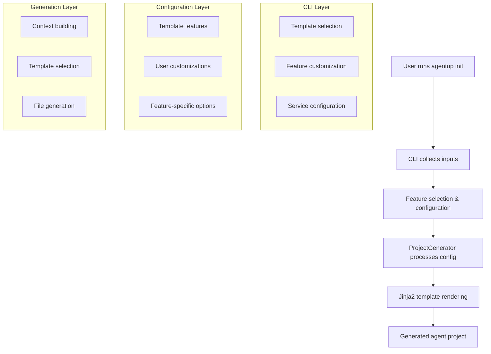

# AgentUp CLI Customization Guide

!!! warning
    Development is moving fast, and this document may not reflect the latest changes. Once updated, we will remove this warning.

This document explains how to customize the `agentup init` CLI command, including adding new options, modifying existing features,
and working with the Jinja2 template system.

## Overview

The `agentup init` command uses a multi-layered system:

1. **CLI Interface** - Handles user interaction and input collection
2. **Feature Configuration** - Maps user selections to configuration options
3. **Project Generator** - Processes configuration and renders templates
4. **Jinja2 Templates** - Generate final configuration files

## Architecture Flow



## File Structure

```
src/agent/
├── cli/commands/create_agent.py     # Main CLI command logic
├── templates/
│   ├── __init__.py                  # Template and feature definitions
│   └── config/                      # Jinja2 template files
│       ├── agent_config_minimal.yaml.j2
│       ├── agent_config_standard.yaml.j2
│       └── agent_config_full.yaml.j2
└── generator.py                     # ProjectGenerator class
```

## Customizing Templates and Features

### 1. Adding New Templates

**Step 1: Define the template in `templates/__init__.py`**

```python
def get_template_choices() -> list[questionary.Choice]:
    """Get available project templates."""
    return [
        questionary.Choice("Minimal - Barebone agent", value="minimal"),
        questionary.Choice("Standard - AI-powered agent", value="standard"),
        questionary.Choice("Full - Enterprise agent", value="full"),
        # Add your new template
        questionary.Choice("Custom - My custom template", value="custom"),
    ]

def get_template_features(template: str = None) -> dict[str, dict[str, Any]]:
    """Get features included in each template."""
    return {
        "minimal": {"features": [], "description": "Basic agent"},
        "standard": {"features": ["middleware", "ai_provider"], "description": "Standard agent"},
        "full": {"features": ["middleware", "state", "ai_provider", "auth"], "description": "Full agent"},
        # Add your new template
        "custom": {
            "features": ["middleware", "custom_feature"],
            "description": "Custom agent with special features"
        },
    }
```

**Step 2: Create the Jinja2 template file**

Create `src/agent/templates/config/agent_config_custom.yaml.j2`:

```yaml
# AgentUp Configuration - Custom Template
# Custom agent with special features

# Agent Information
agent:
  name: {{ project_name }}
  description: {{ description }}
  version: 0.1.0

# Your custom configuration sections

custom_feature:
  enabled: true
  setting: {{ custom_setting | default('default_value') }}

```

### 2. Adding New Features

**Step 1: Add feature to choices in `templates/__init__.py`**

```python
def get_feature_choices() -> list[questionary.Choice]:
    """Get available features for custom template."""
    return [
        questionary.Choice("Middleware System", value="middleware", checked=True),
        questionary.Choice("State Management", value="state"),
        questionary.Choice("AI Provider", value="ai_provider"),
        questionary.Choice("Authentication", value="auth", checked=True),
        # Add your new feature
        questionary.Choice("Custom Feature (my special functionality)", value="custom_feature"),
    ]
```

**Step 2: Add feature configuration logic in `cli/commands/create_agent.py`**

```python
def configure_features(features: list) -> dict[str, Any]:
    """Configure selected features with additional options."""
    config = {}

    # Existing feature configurations...
    
    # Add your new feature configuration
    if "custom_feature" in features:
        custom_option = questionary.select(
            "Select custom feature option:",
            choices=[
                questionary.Choice("Option A", value="option_a"),
                questionary.Choice("Option B", value="option_b"),
                questionary.Choice("Advanced Option", value="advanced"),
            ],
            style=custom_style,
        ).ask()
        
        config["custom_feature"] = custom_option

    return config
```

**Step 3: Update generator context in `generator.py`**

```python
def _render_template(self, template_path: str) -> str:
    # ... existing context building ...
    
    context = {
        "project_name": self.project_name,
        # ... existing context items ...
        "has_custom_feature": "custom_feature" in self.features,
    }

    # Add custom feature configuration
    custom_config = None
    if "feature_config" in self.config and "custom_feature" in self.config["feature_config"]:
        custom_config = self.config["feature_config"]["custom_feature"]
    
    context["custom_setting"] = custom_config
```

**Step 4: Update all relevant templates**

Add the feature to your template files:

```yaml
# In agent_config_*.yaml.j2 files

custom_feature:
  enabled: true
  option: {{ custom_setting }}

```

## Working with Jinja2 Templates

### Template Context Variables

The generator provides these standard context variables to all templates:

```python
context = {
    # Project basics
    "project_name": "my-agent",                    # User-provided name
    "project_name_snake": "my_agent",              # Snake_case version
    "project_name_title": "My Agent",              # Title Case version
    "description": "My agent description",         # User-provided description
    
    # Template and features
    "template_name": "standard",                   # Selected template
    "features": ["middleware", "state"],           # Selected features list
    "feature_config": {...},                       # Feature-specific configurations
    
    # Feature flags (boolean)
    "has_middleware": True,                        # middleware in features
    "has_state": True,                            # state in features
    "has_auth": False,                            # auth in features
    "has_mcp": True,                              # mcp in features
    
    # AI Provider configuration
    "ai_provider_config": {
        "provider": "openai",
        "model": "gpt-4o-mini"
    },
    
    # Backend selections (example from state management)
    "state_backend": "valkey",                     # Selected state backend
    
    # Generated secrets
    "generate_api_key()": "function",              # Generates random API key
    "generate_jwt_secret()": "function",           # Generates JWT secret
    "generate_client_secret()": "function",        # Generates client secret
}
```

### Template Patterns

**1. Feature Conditional Blocks**

```yaml

middleware:
  - name: timed
    params: {}

  - name: cached
    params:
      ttl: 300


```

**2. Backend Selection Pattern**

```yaml

state_management:
  enabled: true

  backend: valkey
  config:
    url: '${VALKEY_URL:valkey://localhost:6379}'

  backend: memory
  config: {}

  backend: file
  config:
    storage_dir: "./conversation_states"


```

**3. Provider Configuration Pattern**

```yaml

ai_provider:
  provider: {{ ai_provider_config.provider }}

  api_key: ${OPENAI_API_KEY}
  model: {{ ai_provider_config.model | default('gpt-4o-mini') }}

  api_key: ${ANTHROPIC_API_KEY}
  model: {{ ai_provider_config.model | default('claude-3-5-sonnet-20241022') }}


```

## Adding Complex Feature Options

### Example: Adding Database Backend Selection

**1. Update feature choices**

```python
# In templates/__init__.py
def get_feature_choices() -> list[questionary.Choice]:
    return [
        # ... existing choices ...
        questionary.Choice("Database Integration (PostgreSQL, SQLite, MongoDB)", value="database"),
    ]
```

**2. Add database configuration logic**

```python
# In cli/commands/create_agent.py
def configure_features(features: list) -> dict[str, Any]:
    config = {}
    
    if "database" in features:
        # First, select database type
        db_type = questionary.select(
            "Select database backend:",
            choices=[
                questionary.Choice("PostgreSQL (production)", value="postgresql"),
                questionary.Choice("SQLite (development)", value="sqlite"),
                questionary.Choice("MongoDB (document store)", value="mongodb"),
            ],
            style=custom_style,
        ).ask()
        
        # Then configure database-specific options
        db_config = {"type": db_type}
        
        if db_type == "postgresql":
            # PostgreSQL-specific configuration
            db_config.update({
                "host": "${POSTGRES_HOST:localhost}",
                "port": "${POSTGRES_PORT:5432}",
                "database": "${POSTGRES_DB:agentup}",
                "user": "${POSTGRES_USER:agentup}",
                "password": "${POSTGRES_PASSWORD}",
            })
        elif db_type == "sqlite":
            # SQLite-specific configuration
            db_config.update({
                "path": "./data/agent.db",
                "create_if_missing": True,
            })
        elif db_type == "mongodb":
            # MongoDB-specific configuration
            db_config.update({
                "connection_string": "${MONGODB_URL:mongodb://localhost:27017}",
                "database": "${MONGODB_DB:agentup}",
            })
        
        config["database"] = db_config
    
    return config
```

**3. Update generator context**

```python
# In generator.py
def _render_template(self, template_path: str) -> str:
    context = {
        # ... existing context ...
        "has_database": "database" in self.features,
    }
    
    # Add database configuration
    if "feature_config" in self.config and "database" in self.config["feature_config"]:
        context["database_config"] = self.config["feature_config"]["database"]
    
    return template.render(context)
```

**4. Update templates**

```yaml
# In agent_config_*.yaml.j2 files

database:
  enabled: true

  type: postgresql
  connection:
    host: {{ database_config.host }}
    port: {{ database_config.port }}
    database: {{ database_config.database }}
    user: {{ database_config.user }}
    password: {{ database_config.password }}

  type: sqlite
  connection:
    path: {{ database_config.path }}
    create_if_missing: {{ database_config.create_if_missing }}

  type: mongodb
  connection:
    connection_string: {{ database_config.connection_string }}
    database: {{ database_config.database }}


```

## Quick Mode and Default Handling

### Adding Defaults for Quick Mode

```python
# In cli/commands/create_agent.py
if quick:
    selected_template = template or "standard"
    project_config["template"] = selected_template
    # ... existing code ...
    
    # Set defaults for your new feature
    feature_config = {}
    if "database" in project_config["features"]:
        if selected_template == "minimal":
            feature_config["database"] = {"type": "sqlite", "path": "./data/agent.db"}
        elif selected_template == "full":
            feature_config["database"] = {"type": "postgresql", "host": "localhost"}
        else:  # standard
            feature_config["database"] = {"type": "sqlite", "path": "./data/agent.db"}
    
    project_config["feature_config"] = feature_config
```

## Testing Your Changes

### 1. Template Syntax Testing

```bash
make template-test  # Tests Jinja2 template syntax
```

### 2. Generator Testing

```python
# Create a test file in tests/test_core/
def test_custom_feature_generation():
    config = {
        'name': 'test-agent',
        'template': 'standard',
        'features': ['custom_feature'],
        'feature_config': {'custom_feature': 'option_a'}
    }
    
    generator = ProjectGenerator(Path("/tmp"), config)
    rendered = generator._render_template('config/agent_config_standard.yaml')
    
    assert 'custom_feature:' in rendered
    assert 'option: option_a' in rendered
```

### 3. CLI Testing

```python
# Test the CLI interaction
def test_configure_custom_feature():
    with patch('questionary.select') as mock_select:
        mock_select.return_value.ask.return_value = 'option_a'
        
        result = configure_features(['custom_feature'])
        
        assert result['custom_feature'] == 'option_a'
```

### 4. Manual Testing

```bash
# Test your changes manually
cd ~/dev/agentup-workspace/agents/
agentup init test-custom --template standard

# Follow the prompts and verify the generated configuration
cat test-custom/agentup.yml
```

## Best Practices

### 1. Naming Conventions

- **Features**: Use snake_case (`custom_feature`, `database_integration`)
- **Template variables**: Use snake_case (`has_custom_feature`, `database_config`)
- **Configuration keys**: Use snake_case in YAML (`custom_feature`, `state_backend`)

### 2. Backward Compatibility

- Always provide sensible defaults
- Use conditional blocks in templates
- Test with existing configurations

### 3. Error Handling

```python
def configure_features(features: list) -> dict[str, Any]:
    config = {}
    
    if "custom_feature" in features:
        try:
            custom_option = questionary.select(...).ask()
            if custom_option:  # User didn't cancel
                config["custom_feature"] = custom_option
        except KeyboardInterrupt:
            # Handle user cancellation gracefully
            pass
    
    return config
```

### 4. Template Organization

- Keep templates focused and readable
- Use comments to explain complex logic
- Group related configuration sections
- Use consistent indentation (2 spaces)

### 5. Documentation

- Update this guide when adding new features
- Add inline comments for complex configuration logic
- Include examples in template comments

## Common Patterns Reference

### Multi-Choice with Sub-Options

```python
# CLI configuration
main_choice = questionary.select("Choose main option:", choices=[...]).ask()

if main_choice == "advanced":
    sub_choice = questionary.select("Choose advanced option:", choices=[...]).ask()
    config["feature"] = {"type": main_choice, "sub_option": sub_choice}
```

### Environment Variable Patterns

```yaml
# In templates - use this pattern for environment variables
setting: '${ENV_VAR_NAME:default_value}'
url: '${DATABASE_URL:postgresql://localhost:5432/agentup}'
```

### Conditional Service Configuration

```yaml

services:
  my_service:
    type: custom
    config:

      url: '${PROD_SERVICE_URL}'
      timeout: 30

      url: 'http://localhost:3000'
      timeout: 10


```

## State Management Backend Example

This section shows the complete implementation of the state management backend selection feature as a reference.

### CLI Implementation

```python
# In cli/commands/create_agent.py
if "state" in features:
    state_backend_choice = questionary.select(
        "Select state management backend:",
        choices=[
            questionary.Choice("Valkey/Redis (production, distributed)", value="valkey"),
            questionary.Choice("Memory (development, non-persistent)", value="memory"),
            questionary.Choice("File (local development, persistent)", value="file"),
        ],
        style=custom_style,
    ).ask()

    config["state_backend"] = state_backend_choice
```

### Generator Context

```python
# In generator.py
# Add state backend configuration
state_backend = None
if "feature_config" in self.config and "state_backend" in self.config["feature_config"]:
    state_backend = self.config["feature_config"]["state_backend"]
elif "state" in self.features:
    # Default to appropriate backend based on template
    if self.template_name == "minimal":
        state_backend = "memory"
    elif self.template_name == "full":
        state_backend = "valkey"
    else:  # standard
        state_backend = "file"

context["state_backend"] = state_backend
```

### Template Implementation

```yaml
# In agent_config_*.yaml.j2 files

state_management:
  enabled: true

  backend: valkey
  ttl: 7200
  config:
    url: '${VALKEY_STATE_URL:valkey://localhost:6379}'
    key_prefix: "agentup:state:"

  backend: memory
  ttl: 3600
  config: {}

  backend: file
  ttl: 7200
  config:
    storage_dir: "./conversation_states"


```

This guide should help you customize and extend the `agentup init` CLI command. Remember to test your changes thoroughly and maintain backward compatibility with existing configurations.
