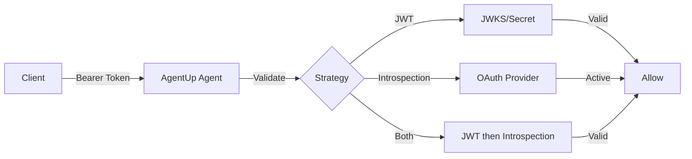

# OAuth2 Authentication with Unified Security Architecture

**Enterprise-grade authentication with comprehensive scope-based authorization and AgentUp Security Framework integration**

OAuth2 authentication in AgentUp integrates with the AgentUp Security Framework to provide enterprise-grade security with comprehensive
protection across all endpoint types,  middleware selection, and  scope-based authorization. This authentication method serves as
the foundation for enterprise deployments while maintaining optimal performance through context-aware security decisions.

## Overview

OAuth2 authentication in AgentUp integrates with the AgentUp Security Framework to provide enterprise-grade security with
comprehensive protection and  security decisions.

### Core OAuth2 Features

The OAuth2 authentication system provides JWT token validation with both symmetric and asymmetric key support, enabling flexible
cryptographic approaches for different organizational requirements. Token introspection capabilities offer real-time validation for
dynamic token scenarios, while JWKS integration provides automatic key rotation and management.

The system includes comprehensive scope-based authorization with hierarchical permission inheritance, enabling  access control patterns
that adapt to organizational requirements. Popular OAuth2 provider support includes seamless integration with Google, Auth0, Azure AD,
GitHub, and custom OAuth2 implementations.

### Unified Architecture Integration

OAuth2 authentication integrates  with the AgentUp Security Framework, providing consistent behavior across all endpoint types including
JSON-RPC, MCP, and push notification systems. The system ensures that OAuth2 validation and scope-based authorization work uniformly
across all components.

The authentication method supports context-aware middleware selection based on plugin classification and operational characteristics. 

This ensures that security measures are appropriate for each component while maintaining comprehensive OAuth2 protection.

### Enterprise-Ready Features

The OAuth2 system includes environment variable support for secure credential management, full A2A protocol compliance with proper
security scheme advertising, and performance optimization through  caching and validation strategies.

Multi-tenant capabilities enable different OAuth2 configurations for different organizational units, while comprehensive audit logging
provides visibility into authentication decisions and OAuth2 token usage patterns.

### How It Works



### Comprehensive Endpoint Protection

The AgentUp Security Framework ensures that OAuth2 authentication protects all AgentUp endpoints. OAuth2 validation now covers
JSON-RPC endpoints, previously unprotected MCP endpoints, and push notification systems with consistent security application.

Each endpoint type receives appropriate OAuth2 validation measures based on its operational characteristics. The system ensures that
OAuth2 token validation, scope checking, and authorization decisions are applied consistently across all endpoint types while
maintaining protocol compliance and operational efficiency.


## When to Use OAuth2

Choose OAuth2 authentication when you need:

| Scenario | OAuth2 Benefits |
|----------|-----------------|
| **Enterprise Integration** | Leverage existing OAuth2 infrastructure |
| **Third-Party Access** | Allow external applications to access your agent |
| **Fine-Grained Authorization** | Scope-based permissions (read, write, admin) |
| **Token Expiration** | Automatic token lifecycle management |
| **Audit Requirements** | Detailed user and scope tracking |
| **Multi-Tenant Systems** | Per-tenant authentication and authorization |

## Quick Setup

### Prerequisites

- An OAuth2 provider (or test setup)
- JWT token or introspection endpoint
- 10 minutes for setup

### Method 1: JWT Validation with Unified Security (Recommended)

For most enterprise use cases, JWT validation with the AgentUp Security Framework provides optimal performance and comprehensive protection:

```yaml
# OAuth2 JWT Authentication with Unified Security
security:
  enabled: true
  type: "oauth2"
  oauth2:
    validation_strategy: "jwt"
    jwks_url: "https://your-provider.com/.well-known/jwks.json"
    jwt_algorithm: "RS256"
    jwt_issuer: "https://your-provider.com"
    jwt_audience: "your-agent-id"
    scope_hierarchy:
      admin: ["*"]
      api:write: ["api:read"]
      api:read: []
      files:write: ["files:read"]
      files:read: []

# Context-aware middleware for OAuth2
middleware:
  - name: "timed"
    params: {}
  - name: "cached"
    params:
      ttl: 300  # 5 minutes
  - name: "rate_limited"
    params:
      requests_per_minute: 100

# Plugin classification with OAuth2 scope requirements
plugins:
  - plugin_id: "system_tools"
    plugin_type: "local"
    required_scopes: ["api:read"]
  - plugin_id: "external_api"
    plugin_type: "network"
    required_scopes: ["api:write"]
```

### Method 2: Token Introspection with Unified Security

For dynamic token validation or when you don't have access to JWT keys, introspection with AgentUp Security
provides real-time validation with comprehensive protection:

```yaml
# OAuth2 Token Introspection with Unified Security
security:
  enabled: true
  type: "oauth2"
  oauth2:
    validation_strategy: "introspection"
    client_id: "${OAUTH_CLIENT_ID}"
    client_secret: "${OAUTH_CLIENT_SECRET}"
    introspection_endpoint: "https://your-provider.com/oauth/introspect"
    scope_hierarchy:
      admin: ["*"]
      api:admin: ["api:write", "api:read"]
      api:write: ["api:read"]
      api:read: []
    # Introspection-specific caching for performance
    introspection_cache_ttl: 300  # Cache active tokens for 5 minutes

# Enhanced middleware for introspection
middleware:
  - name: "oauth2_introspection_cache"
    params:
      cache_ttl: 300
      max_cache_size: 1000
  - name: "rate_limited"
    params:
      requests_per_minute: 60  # Lower limit due to introspection overhead
  - name: "timed"
    params: {}

# Plugin configuration for introspection-based OAuth2
plugins:
  - plugin_id: "dynamic_permissions"
    plugin_type: "network"
    required_scopes: ["api:read"]
    oauth2_specific:
      introspection_required: true  # Always validate token freshness
      cache_override: false
```

### Testing Your Setup with Comprehensive Endpoint Coverage

The AgentUp Security Framework now protects all AgentUp endpoints with OAuth2 authentication.

Test all endpoint types to verify comprehensive protection:

1. **Start your agent**:
   ```bash
   agentup run --port 8000
   ```

2. **Get an access token** from your OAuth2 provider with appropriate scopes

3. **Test comprehensive endpoint protection**:
   ```bash
   # Test JSON-RPC endpoint
   curl -H "Authorization: Bearer YOUR_ACCESS_TOKEN" \
        -H "Content-Type: application/json" \
        -d '{"jsonrpc":"2.0","method":"capabilities","id":"test-1"}' \
        http://localhost:8000/

   # Test MCP endpoint (now protected with OAuth2)
   curl -H "Authorization: Bearer YOUR_ACCESS_TOKEN" \
        -H "Content-Type: application/json" \
        -d '{"jsonrpc":"2.0","method":"tools/list","id":"mcp-test-1"}' \
        http://localhost:8000/mcp

   # Test Agent Card endpoint (discovery with OAuth2 scope validation)
   curl -H "Authorization: Bearer YOUR_ACCESS_TOKEN" \
        http://localhost:8000/.well-known/agent.json

   # All endpoints should return 200 OK with proper OAuth2 token validation
   ```

4. **Verify scope-based authorization**:
   ```bash
   # Test with insufficient scopes (should return 403)
   curl -H "Authorization: Bearer LIMITED_SCOPE_TOKEN" \
        -H "Content-Type: application/json" \
        -d '{"jsonrpc":"2.0","method":"execute","id":"test-2","params":{"capability":"write_operation"}}' \
        http://localhost:8000/

   # Test with appropriate scopes (should return 200)
   curl -H "Authorization: Bearer FULL_SCOPE_TOKEN" \
        -H "Content-Type: application/json" \
        -d '{"jsonrpc":"2.0","method":"execute","id":"test-3","params":{"capability":"write_operation"}}' \
        http://localhost:8000/
   ```

## Configuration Options

### Complete Configuration Reference

```yaml
security:
  enabled: true
  type: "oauth2"
  oauth2:
    # Validation Strategy (required)
    validation_strategy: "jwt"  # Options: jwt, introspection, both

    # JWT Validation (for jwt/both strategies)
    jwt_secret: "your-secret-key"  # For symmetric algorithms (HS256)
    jwks_url: "https://provider.com/.well-known/jwks.json"  # For asymmetric (RS256)
    jwt_algorithm: "RS256"  # HS256, HS384, HS512, RS256, RS384, RS512, ES256, ES384, ES512
    jwt_issuer: "https://your-oauth-provider.com"  # Token issuer validation
    jwt_audience: "your-agent-id"  # Token audience validation

    # Token Introspection (for introspection/both strategies)
    client_id: "${OAUTH_CLIENT_ID}"
    client_secret: "${OAUTH_CLIENT_SECRET}"
    introspection_endpoint: "https://provider.com/oauth/introspect"

    # Authorization (optional)
    required_scopes: ["agent:read", "agent:write"]  # Must have all these scopes
    allowed_scopes: ["agent:read", "agent:write", "agent:admin"]  # Scope whitelist
```

### Environment Variables

For security, use environment variables for sensitive values:

```bash
# .env file
OAUTH_CLIENT_ID=your-client-id
OAUTH_CLIENT_SECRET=your-client-secret
JWT_SECRET=your-jwt-secret
```

```yaml
# agentup.yml
security:
  enabled: true
  type: "oauth2"
  oauth2:
    client_id: "${OAUTH_CLIENT_ID}"
    client_secret: "${OAUTH_CLIENT_SECRET}"
    jwt_secret: "${JWT_SECRET:default-secret}"
```

## Validation Strategies

### 1. JWT Validation (`validation_strategy: "jwt"`)

**Best for**: High-performance applications, offline validation

**How it works**:
1. Receives Bearer token in Authorization header
2. Verifies JWT signature using JWKS or shared secret
3. Validates issuer, audience, and expiration
4. Extracts user ID and scopes from claims

**Performance**: Fastest (no external calls)
**Security**: High (cryptographic verification)

```yaml
oauth2:
  validation_strategy: "jwt"
  jwks_url: "https://provider.com/.well-known/jwks.json"  # Recommended
  # OR
  jwt_secret: "shared-secret-key"  # For HS256 algorithms
```

### 2. Token Introspection (`validation_strategy: "introspection"`)

**Best for**: Real-time token status, revocation support

**How it works**:
1. Receives Bearer token in Authorization header
2. Calls provider's introspection endpoint
3. Validates token is active and not revoked
4. Extracts user information from response

**Performance**: Slower (external API call)
**Security**: Highest (real-time validation)

```yaml
oauth2:
  validation_strategy: "introspection"
  client_id: "your-client-id"
  client_secret: "your-client-secret"
  introspection_endpoint: "https://provider.com/oauth/introspect"
```

### 3. Hybrid (`validation_strategy: "both"`)

**Best for**: Balance of performance and security

**How it works**:
1. First tries JWT validation (fast)
2. Falls back to introspection if JWT fails
3. Provides best of both approaches

**Performance**: Fast with fallback
**Security**: High with real-time backup

```yaml
oauth2:
  validation_strategy: "both"
  jwks_url: "https://provider.com/.well-known/jwks.json"
  client_id: "your-client-id"
  client_secret: "your-client-secret"
  introspection_endpoint: "https://provider.com/oauth/introspect"
```

## Popular Providers

### Google OAuth2

```yaml
security:
  enabled: true
  type: "oauth2"
  oauth2:
    validation_strategy: "jwt"
    jwks_url: "https://www.googleapis.com/oauth2/v3/certs"
    jwt_algorithm: "RS256"
    jwt_issuer: "https://accounts.google.com"
    jwt_audience: "your-google-client-id.apps.googleusercontent.com"
    required_scopes: ["openid", "email"]
```

**Getting tokens**: Use Google's OAuth2 flow or service account keys.

### Auth0

```yaml
security:
  enabled: true
  type: "oauth2"
  oauth2:
    validation_strategy: "jwt"
    jwks_url: "https://YOUR_DOMAIN.auth0.com/.well-known/jwks.json"
    jwt_algorithm: "RS256"
    jwt_issuer: "https://YOUR_DOMAIN.auth0.com/"
    jwt_audience: "your-auth0-api-identifier"
    required_scopes: ["read:agents", "write:agents"]
```

**Setup**: Create an API in Auth0 dashboard and configure scopes.

### Microsoft Azure AD

```yaml
security:
  enabled: true
  type: "oauth2"
  oauth2:
    validation_strategy: "jwt"
    jwks_url: "https://login.microsoftonline.com/TENANT_ID/discovery/v2.0/keys"
    jwt_algorithm: "RS256"
    jwt_issuer: "https://login.microsoftonline.com/TENANT_ID/v2.0"
    jwt_audience: "your-azure-app-id"
    required_scopes: ["api://your-app-id/Agent.Read"]
```

**Setup**: Register your app in Azure AD and configure API permissions.

### GitHub Apps (Introspection)

```yaml
security:
  enabled: true
  type: "oauth2"
  oauth2:
    validation_strategy: "introspection"
    client_id: "${GITHUB_CLIENT_ID}"
    client_secret: "${GITHUB_CLIENT_SECRET}"
    introspection_endpoint: "https://api.github.com/applications/${GITHUB_CLIENT_ID}/token"
```

**Note**: GitHub uses a custom introspection format. Scopes are managed through app permissions.

## Security Considerations

### Best Practices

1. **Use HTTPS Only**: OAuth2 tokens must be transmitted over HTTPS in production
2. **Short Token Lifetimes**: Configure tokens to expire within 1-24 hours
3. **Scope Minimization**: Only request and accept minimum required scopes
4. **Secure Storage**: Never log or store access tokens
5. **Rate Limiting**: Implement rate limiting for token validation endpoints

### AgentUp Security Features

- **Constant-Time Comparison**: All token comparisons use `secrets.compare_digest()`
- **Generic Error Messages**: All auth failures return "Unauthorized" (no information leakage)
- **Audit Logging**: All authentication attempts are logged for monitoring
- **Input Validation**: Comprehensive validation of all OAuth2 configuration parameters

### Common Security Pitfalls

| Don't Do | Do Instead |
|-------------|---------------|
| Use HTTP in production | Always use HTTPS |
| Log access tokens | Log only token metadata (user ID, scopes) |
| Accept any scope | Define and validate required scopes |
| Use weak JWT secrets | Use strong, randomly generated secrets |
| Skip token expiration | Validate `exp` claim in JWT tokens |

## Troubleshooting

### Common Issues

#### Issue: "Unauthorized" with Valid Token

**Possible Causes**:
- JWT signature verification failed
- Token expired
- Incorrect issuer or audience
- Missing required scopes

**Debug Steps**:
1. Check agent logs for specific error details
2. Verify token with [jwt.io](https://jwt.io)
3. Confirm JWKS URL is accessible
4. Validate issuer and audience match configuration

#### Issue: "Invalid JWT key not found in JWKS"

**Solution**:
- Verify JWKS URL is correct and accessible
- Check that token `kid` (key ID) exists in JWKS
- Ensure token algorithm matches JWKS key algorithm

#### Issue: Token Introspection Failing

**Possible Causes**:
- Incorrect client credentials
- Wrong introspection endpoint
- Network connectivity issues

**Debug Steps**:
1. Test introspection endpoint manually:
   ```bash
   curl -u "client_id:client_secret" \
        -d "token=YOUR_TOKEN" \
        https://provider.com/oauth/introspect
   ```
2. Verify client credentials are correct
3. Check network connectivity and firewall rules

### Debug Configuration

Enable debug logging to troubleshoot OAuth2 issues:

```yaml
```


### Testing Tools

#### Generate Test JWT Tokens

```python
# test_jwt.py
import time
from authlib.jose import jwt

payload = {
    "sub": "test-user",
    "iss": "https://test-provider.com",
    "aud": "test-agent",
    "iat": int(time.time()),
    "exp": int(time.time()) + 3600,
    "scope": "agent:read agent:write"
}

token = jwt.encode({"alg": "HS256", "typ": "JWT"}, payload, "test-secret")
print(token)
```

#### Validate Configuration

```bash
# Test configuration validation
uv run python -c "
from src.agent.security import validate_security_config
config = {
    'enabled': True,
    'type': 'oauth2',
    'oauth2': {
        'validation_strategy': 'jwt',
        'jwt_secret': 'test-secret'
    }
}
try:
    validate_security_config(config)
    print('Configuration valid')
except Exception as e:
    print(f'Configuration error: {e}')
"
```

