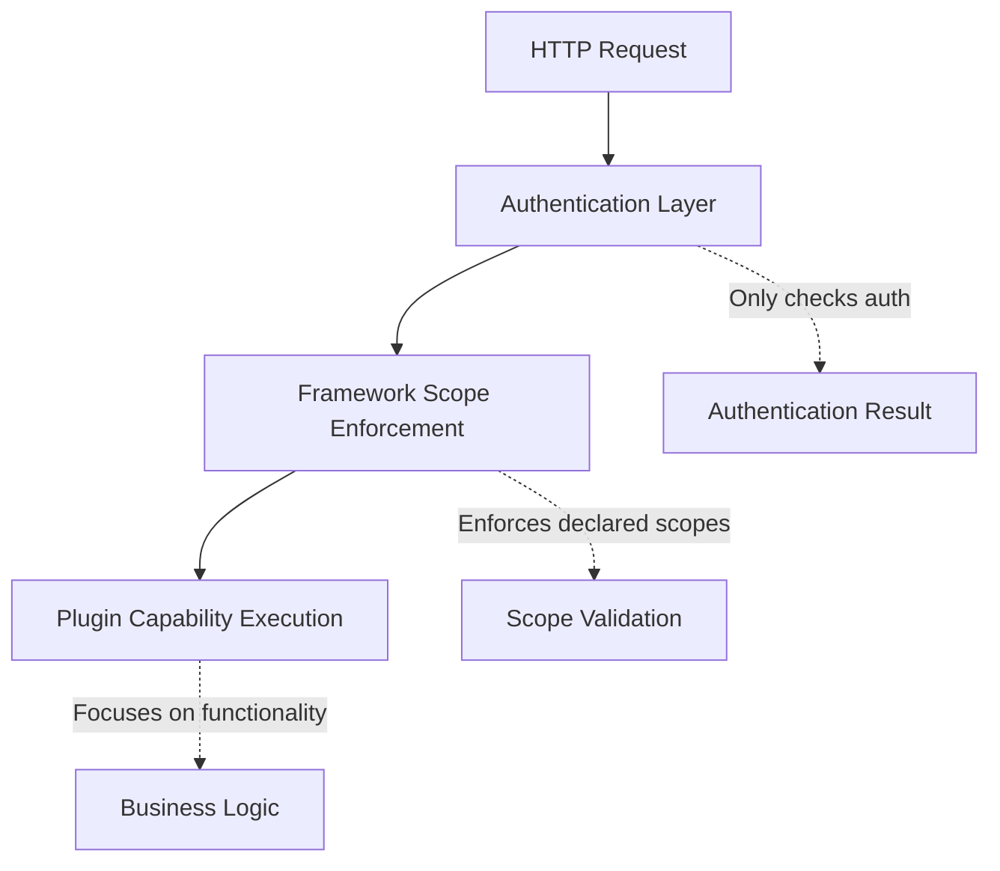

# Scope-Based Authorization

!!! warning
    Development is moving fast, and this document may not reflect the latest changes. Once updated, we will remove this warning.

**Fine-grained permission control with declarative plugin security**

AgentUp implements a comprehensive scope-based authorization system that provides fine-grained
access control through hierarchical permissions. The system follows a **declarative plugin** pattern
where plugins list their scope requirements and the framework automatically enforces them.

## Core Architecture

### Framework vs Plugin Responsibilities



**Framework Responsibilities:**
- Read scope requirements from plugin declarations
- Enforce scopes before capability execution
- Provide comprehensive audit logging
- Filter AI tools based on user permissions

**Plugin Responsibilities:**
- Declare required scopes in `CapabilityInfo`
- Implement business logic functionality
- Assume framework has validated permissions

## Scope Structure and Hierarchy

### Scope Naming Convention

Scopes follow a structured format that enables clear permissions and hierarchical inheritance:

```
<domain>:<action>[:<resource>]
```

**Examples:**
- `files:read` - Read access to files
- `files:write` - Write access to files
- `files:admin` - Administrative access to files
- `system:read` - Read system information
- `system:admin` - Administrative system access
- `admin` - Universal administrative access

This allows for relatively seamless integration with scoped based authentication systems like OAuth2, where scopes can be mapped to specific actions.

### Hierarchical Inheritance

The scope hierarchy automatically grants lower-level permissions when higher-level scopes are present:

```yaml
security:
  enabled: true
  scope_hierarchy:
    # Universal admin access
    admin: ["*"]

    # File system scopes
    files:admin: ["files:write", "files:read", "files:sensitive"]
    files:write: ["files:read"]

    # System scopes
    system:admin: ["system:write", "system:read"]
    system:write: ["system:read"]

    # API scopes
    api:admin: ["api:write", "api:read"]
    api:write: ["api:read"]

    # Custom domain scopes
    enterprise:admin: ["enterprise:write", "enterprise:read"]
    enterprise:write: ["enterprise:read"]
```

### Permission Domains

You can define scopes within specific domains to categorize permissions:

**Files Domain (`files:`)** - File system operations
- `files:read` - Read files and directories
- `files:write` - Create, modify files and directories
- `files:admin` - Delete files, access sensitive files

**System Domain (`system:`)** - System operations
- `system:read` - Read system information
- `system:write` - Modify system settings
- `system:admin` - Execute system commands

**Web Domain (`web:`)** - Web operations
- `web:search` - Perform web searches
- `web:browse` - Browse web content

**Image Domain (`image:`)** - Image processing
- `image:read` - Analyze existing images
- `image:write` - Transform or create images

### Wildcard Scopes

Wildcard scopes can be used for universal permissions, but should be used cautiously:

- `admin: ["*"]` - Grants all permissions across all domains
- `files:*` - Grants all file-related permissions

## Plugin Scope Declaration

### Plugin Scope Requirements

Plugins come with default scope requirements built into their code, but you can override these requirements in your agent configuration for fine-grained control.

#### Default Plugin Scopes

Common plugins have these default scope requirements:

**sys_tools plugin:**
- `file_read` requires `["files:read"]`
- `file_write` requires `["files:write"]`
- `delete_file` requires `["files:admin"]`
- `execute_command` requires `["system:admin"]`

**brave plugin:**
- `web_search` requires `["web:search"]`

**image_vision plugin:**
- `analyze_image` requires `["image:read"]`
- `transform_image` requires `["image:write"]`

#### Overriding Capability Scopes

You can override the default scope requirements for specific capabilities in your agent configuration:

```yaml
plugins:
  - plugin_id: sys_tools
    capabilities:
      - capability_id: file_read
        required_scopes: ["files:read", "audit:log"]  # Add additional scope
      - capability_id: delete_file
        required_scopes: ["files:admin", "approval:required"]  # Override default
      - capability_id: execute_command
        required_scopes: ["system:admin", "security:verified"]  # More restrictive

  - plugin_id: brave
    capabilities:
      - capability_id: web_search
        required_scopes: ["web:search", "external:api"]  # Add external API scope
```

## Configuration Examples

### Basic Agent Configuration

```yaml
name: "Secure Agent"
description: "Agent with scope-based security"
version: "1.0.0"

# Enable plugins (scopes declared in plugin code)
plugins:
  - plugin_id: sys_tools  # Provides file and system capabilities
  - plugin_id: brave      # Provides web search capability

# Authentication with scope hierarchy
security:
  enabled: true
  auth:
    api_key:
      header_name: "X-API-Key"
      keys:
        # Simple format - key with scopes list
        - key: "admin-key-123"
          scopes: ["admin"]  # Has all permissions via hierarchy
        - key: "read-key-456"
          scopes: ["files:read", "system:read"]
        - key: "write-key-789"
          scopes: ["files:write", "web:search"]

  # Scope hierarchy for permission inheritance
  scope_hierarchy:
    admin: ["*"]  # Universal access
    files:admin: ["files:write", "files:read"]
    files:write: ["files:read"]
    system:admin: ["system:write", "system:read"]
    system:write: ["system:read"]
    web:admin: ["web:search"]
```

### JWT Authentication with Scopes

For JWT authentication, scopes are embedded in the token itself, not configured in the agent:

```yaml
security:
  enabled: true
  auth:
    jwt:
      secret_key: "${JWT_SECRET}"
      algorithm: "HS256"
      issuer: "${JWT_ISSUER}"

  # Scope hierarchy applies to scopes found in tokens
  scope_hierarchy:
    admin: ["*"]
    developer: ["files:write", "system:read", "web:search"]
    analyst: ["files:read", "web:search"]
    files:write: ["files:read"]
```

**JWT Token with Scopes** (issued by your auth system):
```json
{
  "sub": "user123",
  "iss": "my-app",
  "aud": "agentup-agent",
  "scopes": ["developer"],          # Scopes come from the token
  "user_id": "user123",
  "department": "engineering"
}
```

**Important**: With JWT/OAuth2, you don't configure user scopes in the agent config. The scopes are provided by your authentication system in the token claims.

### MCP Integration with Scopes

AgentUp can enforce scopes for external MCP tools using the same framework:

```yaml
# Agent configuration with MCP scope enforcement
mcp:
  client:
    enabled: true
    servers:
      - name: "filesystem-server"
        type: "stdio"
        command: "uvx"
        args: ["mcp-server-filesystem", "/tmp"]
        tool_scopes:
          read_file: ["files:read"]       # MCP tool requires files:read
          write_file: ["files:write"]     # MCP tool requires files:write
          delete_file: ["files:admin"]    # MCP tool requires files:admin

      - name: "database-server"
        type: "http"
        url: "http://localhost:3001/mcp"
        tool_scopes:
          query_database: ["data:read"]   # MCP tool requires data:read
          update_database: ["data:write"] # MCP tool requires data:write
```

The framework automatically enforces the configured tool scopes for MCP tools just like regular plugin capabilities.

## AI Integration and Security

### Understanding Plugin Security vs LLM Fallback

AgentUp implements a **dual-layer approach** to AI capabilities that distinguishes between secured plugin tools and native LLM capabilities:

#### Plugin Tool Security (Primary Path)
- **Plugin functions** like `analyze_image`, `file_read`, etc. are fully secured by scopes
- Users must have appropriate scopes (`image:read`, `files:read`) to access plugin tools
- AI receives function schemas only for tools the user can access
- Enhanced functionality with plugin-specific features

#### LLM Native Fallback (Secondary Path)
- When plugin tools are denied, AI falls back to **native LLM capabilities**
- OpenAI's vision API, text processing, etc. continue to work
- No plugin functions are called - pure LLM processing
- Basic functionality without plugin enhancements

#### Example: Image Analysis Security

**User with `image:read` scope:**
```yaml
security:
  auth:
    api_key:
      keys:
        - key: "user-key"
          scopes: ["image:read"]
```
```
Request: "Analyze this image"
✅ AI gets analyze_image function schema
✅ AI calls plugin function with enhanced features
✅ Result: Advanced analysis with metadata, confidence scores
```

**User without `image:read` scope:**
```yaml
security:
  auth:
    api_key:
      keys:
        - key: "basic-key"
          scopes: ["files:read"]  # No image scope
```
```
Request: "Analyze this image"
❌ AI gets no image plugin functions (filtered by security)
✅ AI falls back to OpenAI's native vision capabilities
✅ Result: Basic image analysis without plugin features
```

#### Security Logs Show Both Scenarios

**Plugin tool denied (expected):**
```
WARNING: Security event: function_access_denied
- resource: analyze_image
- user_scopes: ["files:read"]
- required_scopes: ["image:read"]
```

**LLM fallback used (by design):**
```
INFO: AI tool filtering completed: 0 tools available for user
WARNING: No function schemas available for AI - this will prevent tool calling
INFO: Using direct LLM response (no tools available)
```

### Design Rationale

This dual-layer approach provides:

1. **Graceful User Experience**: Requests don't fail completely - users get basic LLM functionality
2. **Clear Security Boundaries**: Plugin tools are properly secured, native LLM remains available
3. **Audit Transparency**: Logs clearly distinguish plugin denials from LLM fallback usage
4. **Flexible Deployment**: Organizations can choose between enhanced plugin features vs basic LLM access

## AI Integration and Security

### Automatic Tool Filtering

The framework automatically filters which tools are available to AI based on the user's scopes. This means:

- **Users with `files:read`** - AI can only see and use file reading capabilities
- **Users with `files:write`** - AI can see file reading and writing capabilities
- **Users with `files:admin`** - AI can see all file capabilities including deletion
- **Users with `admin`** - AI can see all available capabilities

### Graceful Permission Handling

When AI attempts to use capabilities the user cannot access, the system handles this gracefully:

- The AI receives a permission error and can adapt its approach
- Users get clear feedback about what operations are not permitted
- The system logs all permission denials for security monitoring

## Security Monitoring and Compliance

### Automatic Audit Logging

AgentUp automatically logs all capability access attempts for security monitoring and compliance:

- **Successful Access**: Logs capability used, user ID, scopes, and execution time
- **Failed Access**: Logs permission denials with user context for security analysis
- **Scope Violations**: Tracks when users attempt to access capabilities beyond their permissions

### Security Event Types

The system logs these security events:

**Authentication Events:**
- User login/logout
- Token validation success/failure
- Scope expansion through hierarchy

**Authorization Events:**
- Capability access granted/denied
- Scope requirement checks
- Permission escalation attempts

**Audit Trail Format:**
```
2024-01-15 10:30:15 INFO AUDIT: Capability access granted
- capability_id: "file_read"
- user_id: "user123"
- user_scopes: ["files:write"]
- required_scopes: ["files:read"]
- access_granted: true
- execution_time_ms: 45
```

## User Management and Scope Assignment

### Creating Users with Different Permission Levels

Configure different users with appropriate scope levels based on their roles:

```yaml
security:
  enabled: true
  auth:
    api_key:
      header_name: "X-API-Key"
      keys:
        # System Administrator - Full access
        - key: "admin-key-abc123"
          user_id: "admin"
          scopes: ["admin"]  # Inherits all permissions

        # Developer - Development and file access
        - key: "dev-key-def456"
          user_id: "developer"
          scopes: ["files:write", "system:read", "web:search"]

        # Analyst - Read-only access
        - key: "analyst-key-ghi789"
          user_id: "analyst"
          scopes: ["files:read", "web:search"]

        # Service Account - Specific operations only
        - key: "service-key-jkl012"
          user_id: "backup-service"
          scopes: ["files:read", "files:write"]
```

### Role-Based Scope Assignment

Define common roles with predefined scope sets:

```yaml
security:
  enabled: true
  scope_hierarchy:
    # Role-based scopes
    admin: ["*"]
    manager: ["files:admin", "system:read", "web:search", "image:read"]
    developer: ["files:write", "system:read", "web:search"]
    analyst: ["files:read", "web:search", "image:read"]
    readonly: ["files:read"]

    # Domain hierarchies
    files:admin: ["files:write", "files:read"]
    files:write: ["files:read"]
    system:admin: ["system:write", "system:read"]
    system:write: ["system:read"]
```

## Troubleshooting and Best Practices

### Common Configuration Issues

**1. User can't access expected capabilities**
- ✅ **Check**: User's scopes include required permissions for the capability
- ✅ **Check**: Scope hierarchy is properly configured for inheritance
- ✅ **Check**: Plugin is enabled and capability is available

**2. Scope hierarchy not working**
- ✅ **Solution**: Verify `scope_hierarchy` is in the `security` section
- ✅ **Solution**: Check hierarchy syntax uses list format: `parent: ["child1", "child2"]`
- ❌ **Don't**: Use implicit inheritance without declaring hierarchy

**3. MCP tools bypassing security**
- ✅ **Solution**: Configure `tool_scopes` for each MCP tool in agent config
- ✅ **Solution**: Ensure MCP server tools are listed with required scopes
- ❌ **Don't**: Assume external MCP tools are automatically secured

**4. Authentication working but authorization failing**
- ✅ **Check**: User's token/key includes the correct scopes
- ✅ **Check**: Scope names match exactly (case-sensitive)
- ✅ **Check**: Required scopes are properly configured for capabilities

### Configuration Best Practices

**Scope Hierarchy Design:**
```yaml
# ✅ Good: Clear hierarchy with logical inheritance
security:
  scope_hierarchy:
    admin: ["*"]
    files:admin: ["files:write", "files:read"]
    files:write: ["files:read"]

# ❌ Bad: Flat permissions without hierarchy
security:
  scope_hierarchy:
    user1: ["files:read", "files:write", "system:read"]
    user2: ["files:read", "files:write", "system:read", "system:write"]
```

**User Management:**
```yaml
# ✅ Good: Role-based scope assignment
auth:
  api_key:
    keys:
      - key: "dev-key"
        scopes: ["developer"]  # Use role-based scope

# ❌ Bad: Individual permission lists
auth:
  api_key:
    keys:
      - key: "dev-key"
        scopes: ["files:read", "files:write", "system:read", "web:search"]
```

**Capability Scope Overrides:**
```yaml
# ✅ Good: Override when you need more restrictive access
plugins:
  - plugin_id: sys_tools
    capabilities:
      - capability_id: delete_file
        required_scopes: ["files:admin", "approval:required"]

# ❌ Bad: Making capabilities less secure than default
plugins:
  - plugin_id: sys_tools
    capabilities:
      - capability_id: execute_command
        required_scopes: ["files:read"]  # Too permissive!
```

### Testing and Validation

**Testing Scope Configuration:**
1. Create test users with different scope levels
2. Verify each user can only access appropriate capabilities
3. Test scope hierarchy inheritance works as expected
4. Check audit logs show proper authorization events

**Validation Commands:**

```bash
# Check agent configuration
agentup validate
```
