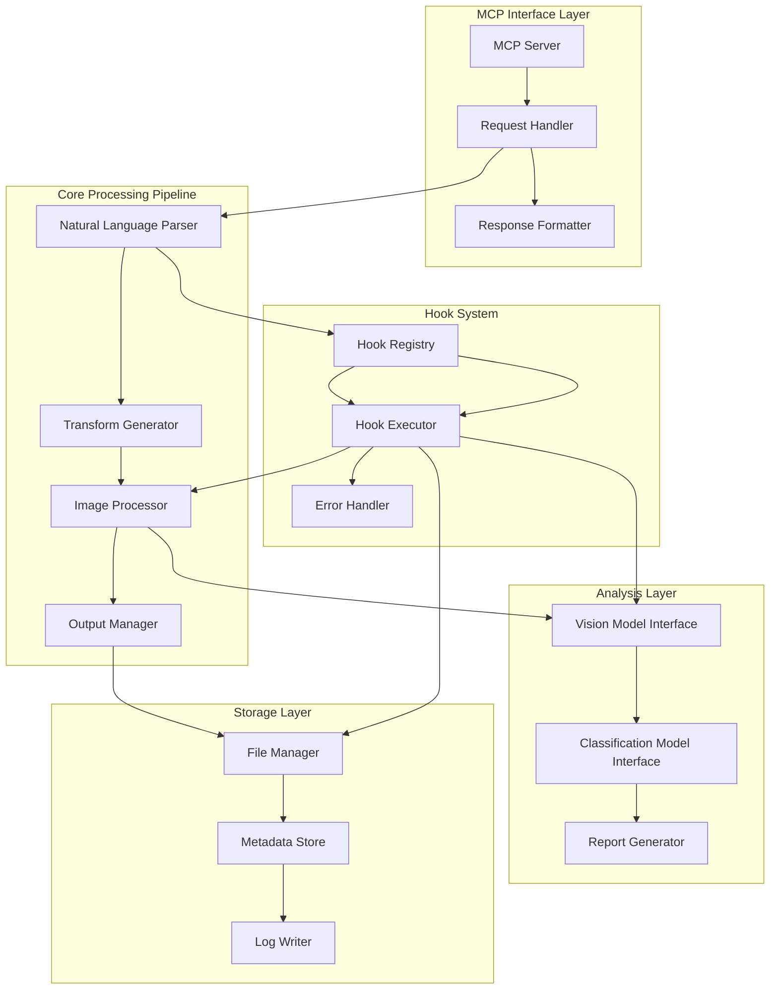

# Design Document

## MCP Server Declaration

**This server is an MCP-compliant image augmentation microservice.** It implements the Model Context Protocol via:

- Tool schema registration with formal input/output validation
- Structured request/response handling with proper error formatting
- Protocol-compliant tool discovery and execution
- JSON-serializable data throughout the processing pipeline

## Overview

The albumentations-mcp system is a production-ready MCP server that bridges natural language processing with computer vision. The system accepts human-readable augmentation requests, translates them into structured Albumentations transforms, and provides comprehensive analysis through vision models and classification consistency checks. The architecture emphasizes modularity, extensibility, and robust error handling through a comprehensive 8-stage hook system.

## Architecture

### High-Level Architecture



### Component Architecture

The system follows a layered architecture with clear separation of concerns:

1. **MCP Interface Layer**: Handles protocol compliance and message formatting
2. **Core Processing Pipeline**: Manages the main augmentation workflow
3. **Hook System**: Provides extensibility points throughout the pipeline
4. **Analysis Layer**: Performs post-processing verification and classification
5. **Storage Layer**: Manages file operations and metadata persistence

## Components and Interfaces

### MCP Server Component

**Purpose**: Provides MCP-compliant interface for external systems

**Key Classes**:

- `MCPServer`: Main server implementation with async support
- `RequestHandler`: Processes incoming MCP requests with validation
- `ResponseFormatter`: Formats responses according to MCP protocol
- `ToolRegistry`: Manages available MCP tools and their schemas

**Interfaces**:

```python
class MCPServerInterface:
    async def handle_request(self, request: MCPRequest) -> MCPResponse
    async def list_tools(self) -> List[Tool]
    async def call_tool(self, name: str, arguments: Dict) -> ToolResult
    async def health_check(self) -> HealthStatus
```

### Natural Language Parser

**Purpose**: Converts human-readable augmentation requests into structured parameters

**Key Classes**:

- `PromptParser`: Main parsing logic with LLM integration
- `TransformMapper`: Maps natural language to Albumentations transforms
- `ParameterExtractor`: Extracts and validates transform parameters
- `FallbackHandler`: Provides sensible defaults for ambiguous requests

**Interfaces**:

```python
class ParserInterface:
    async def parse_prompt(self, prompt: str) -> TransformSpec
    def validate_parameters(self, spec: TransformSpec) -> ValidationResult
    def get_fallback_parameters(self, transform_type: str) -> Dict
    async def explain_parsing(self, prompt: str, spec: TransformSpec) -> str
```

### Hook System

**Purpose**: Provides extensible pipeline customization points

**Implementation**: Python-based hook modules with automatic discovery

```python
# src/albumentations_mcp/hooks/vision_verify.py
from typing import Dict, Any

HOOK_STAGE = "post_transform_verify"  # Optional stage declaration

async def execute(context: Dict[str, Any]) -> Dict[str, Any]:
    """Vision verification hook - Python function"""
    original_image = context.get("original_image")
    augmented_image = context.get("augmented_image")
    prompt = context.get("prompt")

    # Your vision model logic here
    analysis = await analyze_transformation(original_image, augmented_image, prompt)

    return {
        "success": True,
        "vision_analysis": analysis
    }
```

**Hook Registry**: Automatic discovery and registration

```python
# src/albumentations_mcp/hooks/__init__.py
class HookRegistry:
    def _load_hooks(self):
        """Automatically load all hook modules"""
        hooks_dir = os.path.dirname(__file__)
        for filename in os.listdir(hooks_dir):
            if filename.endswith('.py') and filename != '__init__.py':
                module_name = filename[:-3]
                try:
                    module = importlib.import_module(f'.{module_name}', __package__)
                    if hasattr(module, 'execute'):
                        stage = getattr(module, 'HOOK_STAGE', 'post_transform')
                        self.register_hook(stage, module.execute)
                except ImportError:
                    pass
```

**Key Classes**:

- `HookRegistry`: Manages hook registration and discovery
- `HookExecutor`: Executes hooks at appropriate pipeline stages
- `HookContext`: Provides context data to hook functions
- `HookResult`: Standardized hook execution results

**Hook Stages**:

1. `pre_mcp`: Input sanitization and preprocessing
2. `post_mcp`: JSON spec logging and validation
3. `pre_transform`: Image and configuration validation
4. `post_transform`: Metadata attachment
5. `post_transform_verify`: Visual verification analysis
6. `post_transform_classify`: Classification consistency checking
7. `pre_save`: Filename modification and versioning
8. `post_save`: Follow-up actions and notifications

**Interfaces**:

```python
class HookInterface:
    async def execute(self, context: HookContext) -> HookResult
    def get_priority(self) -> int
    def is_critical(self) -> bool
    def get_dependencies(self) -> List[str]

class HookRegistry:
    def register_hook(self, stage: str, hook: HookInterface)
    async def execute_hooks(self, stage: str, context: HookContext) -> List[HookResult]
    def get_hook_chain(self, stage: str) -> List[HookInterface]
```

### Image Processing Engine

**Purpose**: Applies Albumentations transforms to images

**Key Classes**:

- `ImageProcessor`: Main processing orchestrator
- `TransformPipeline`: Manages transform sequence execution
- `QualityController`: Ensures image quality preservation
- `BatchProcessor`: Handles multiple images efficiently

**Interfaces**:

```python
class ProcessorInterface:
    async def process_image(self, image: np.ndarray, spec: TransformSpec) -> ProcessingResult
    def validate_image(self, image: np.ndarray) -> ValidationResult
    def create_pipeline(self, spec: TransformSpec) -> albumentations.Compose
    async def process_batch(self, images: List[np.ndarray], spec: TransformSpec) -> List[ProcessingResult]
```

### Analysis Components

**LLM Visual Verification Interface**:

- Saves original and augmented images to temporary files
- Generates verification reports that the existing LLM can review
- Leverages the same VLM (Kiro, Claude Desktop) already using the MCP tools
- Creates structured evaluation prompts for the LLM to assess transformation success
- Supports multiple model backends with fallbacks

**Classification Model Interface**:

- Supports MobileNet, CNN explainer, and custom models
- Performs consistency checking between original and augmented images
- Detects label drift and confidence changes
- Provides model-agnostic interface

**Interfaces**:

```python
class VisualVerificationManager:
    def save_images_for_review(self, original: Image, augmented: Image, session_id: str) -> Dict[str, str]
    def generate_verification_report(self, image_paths: Dict[str, str], prompt: str) -> str
    def cleanup_temp_files(self, file_paths: List[str]) -> None
    async def batch_analyze(self, comparisons: List[Tuple[Image, Image, str]]) -> List[AnalysisResult]

class ClassificationAnalyzer:
    async def classify_image(self, image: np.ndarray, model_type: str) -> ClassificationResult
    def compare_classifications(self, original: ClassificationResult, augmented: ClassificationResult) -> ConsistencyReport
    async def batch_classify(self, images: List[np.ndarray], model_type: str) -> List[ClassificationResult]
```

## Data Models

### Core Data Structures (Pydantic v2)

```python
from pydantic import BaseModel, Field, field_validator, ConfigDict
from typing import List, Dict, Any, Optional, Tuple, Literal
from datetime import datetime
from enum import Enum
from PIL import Image
import base64
import io

class ImageFormat(str, Enum):
    JPEG = "JPEG"
    PNG = "PNG"
    WEBP = "WEBP"
    TIFF = "TIFF"

class ImagePayload(BaseModel):
    """Serializable image representation for API/logging compatibility"""
    base64_data: str = Field(..., description="Base64-encoded image data")
    format: ImageFormat = Field(..., description="Image format")
    width: int = Field(..., gt=0, description="Image width in pixels")
    height: int = Field(..., gt=0, description="Image height in pixels")

    @classmethod
    def from_pil(cls, image: Image.Image) -> "ImagePayload":
        """Convert PIL Image to serializable payload"""
        buffer = io.BytesIO()
        format_str = image.format or "PNG"
        image.save(buffer, format=format_str)
        base64_data = base64.b64encode(buffer.getvalue()).decode()
        return cls(
            base64_data=base64_data,
            format=ImageFormat(format_str),
            width=image.width,
            height=image.height
        )

    def to_pil(self) -> Image.Image:
        """Convert payload back to PIL Image"""
        image_data = base64.b64decode(self.base64_data)
        return Image.open(io.BytesIO(image_data))

class TransformType(str, Enum):
    # Reflection-based validation will be added in implementation
    BLUR = "Blur"
    MOTION_BLUR = "MotionBlur"
    RANDOM_CONTRAST = "RandomContrast"
    RANDOM_BRIGHTNESS = "RandomBrightness"
    HUE_SATURATION_VALUE = "HueSaturationValue"
    ROTATE = "Rotate"
    HORIZONTAL_FLIP = "HorizontalFlip"
    VERTICAL_FLIP = "VerticalFlip"
    GAUSSIAN_NOISE = "GaussNoise"
    RANDOM_CROP = "RandomCrop"

class TransformConfig(BaseModel):
    model_config = ConfigDict(arbitrary_types_allowed=True, use_enum_values=True)

    name: TransformType = Field(..., description="Name of the Albumentations transform")
    parameters: Dict[str, Any] = Field(default_factory=dict, description="Transform parameters")
    probability: float = Field(default=1.0, ge=0.0, le=1.0, description="Probability of applying transform")

    @field_validator('parameters')
    @classmethod
    def validate_parameters(cls, v, info):
        # Add parameter validation based on transform type
        transform_name = info.data.get('name')
        if transform_name and transform_name in ['Blur', 'MotionBlur']:
            if 'blur_limit' in v and (v['blur_limit'] < 3 or v['blur_limit'] > 100):
                raise ValueError("blur_limit must be between 3 and 100")
        return v

class TransformSpec(BaseModel):
    model_config = ConfigDict(arbitrary_types_allowed=True)

    transforms: List[TransformConfig] = Field(..., min_length=1, description="List of transforms to apply")
    metadata: Dict[str, Any] = Field(default_factory=dict, description="Additional metadata")
    timestamp: datetime = Field(default_factory=datetime.now, description="Creation timestamp")
    prompt: str = Field(..., min_length=1, description="Original natural language prompt")
    session_id: str = Field(..., description="Unique session identifier")
    version: str = Field(default="1.0", description="Spec version for compatibility")

class ProcessingResult(BaseModel):
    model_config = ConfigDict(arbitrary_types_allowed=True)

    augmented_image: np.ndarray = Field(..., description="Processed image array")
    applied_transforms: List[TransformConfig] = Field(..., description="Successfully applied transforms")
    skipped_transforms: List[TransformConfig] = Field(default_factory=list, description="Transforms that were skipped")
    metadata: Dict[str, Any] = Field(default_factory=dict, description="Processing metadata")
    execution_time: float = Field(..., ge=0, description="Processing time in seconds")
    original_shape: Tuple[int, ...] = Field(..., description="Original image dimensions")
    output_shape: Tuple[int, ...] = Field(..., description="Output image dimensions")
    quality_metrics: Dict[str, float] = Field(default_factory=dict, description="Image quality metrics")

class AnalysisResult(BaseModel):
    confidence_score: float = Field(..., ge=1.0, le=5.0, description="Confidence score 1-5")
    explanation: str = Field(..., min_length=10, description="Detailed explanation of changes")
    visual_changes: List[str] = Field(default_factory=list, description="List of detected visual changes")
    timestamp: datetime = Field(default_factory=datetime.now, description="Analysis timestamp")
    model_used: str = Field(..., description="Vision model used for analysis")
    processing_time: float = Field(..., ge=0, description="Analysis time in seconds")
    success: bool = Field(default=True, description="Whether analysis completed successfully")

class ClassificationResult(BaseModel):
    predicted_class: str = Field(..., description="Top predicted class")
    confidence: float = Field(..., ge=0.0, le=1.0, description="Prediction confidence")
    top_k_predictions: List[Tuple[str, float]] = Field(default_factory=list, description="Top-k predictions with scores")
    model_name: str = Field(..., description="Classification model used")
    inference_time: float = Field(..., ge=0, description="Inference time in seconds")
    success: bool = Field(default=True, description="Whether classification completed successfully")

class RiskLevel(str, Enum):
    LOW = "low"
    MEDIUM = "medium"
    HIGH = "high"

class ConsistencyReport(BaseModel):
    label_changed: bool = Field(..., description="Whether the predicted label changed")
    confidence_delta: float = Field(..., description="Change in prediction confidence")
    original_result: ClassificationResult = Field(..., description="Original image classification")
    augmented_result: ClassificationResult = Field(..., description="Augmented image classification")
    consistency_score: float = Field(..., ge=0.0, le=1.0, description="Overall consistency score")
    risk_level: RiskLevel = Field(..., description="Risk assessment: low/medium/high")
    recommendations: List[str] = Field(default_factory=list, description="Recommendations based on analysis")
```

### Hook Context Data

```python
class HookStage(str, Enum):
    PRE_MCP = "pre_mcp"
    POST_MCP = "post_mcp"
    PRE_TRANSFORM = "pre_transform"
    POST_TRANSFORM = "post_transform"
    POST_TRANSFORM_VERIFY = "post_transform_verify"
    POST_TRANSFORM_CLASSIFY = "post_transform_classify"
    PRE_SAVE = "pre_save"
    POST_SAVE = "post_save"

class HookContext(BaseModel):
    model_config = ConfigDict(arbitrary_types_allowed=True)

    stage: HookStage = Field(..., description="Current hook stage")
    session_id: str = Field(..., description="Unique session identifier")
    data: Dict[str, Any] = Field(default_factory=dict, description="Stage-specific data")
    metadata: Dict[str, Any] = Field(default_factory=dict, description="Context metadata")
    config: Dict[str, Any] = Field(default_factory=dict, description="Configuration data")

    # Stage-specific data with proper typing
    original_image: Optional[np.ndarray] = Field(None, description="Original input image")
    augmented_image: Optional[np.ndarray] = Field(None, description="Processed image")
    transform_spec: Optional[TransformSpec] = Field(None, description="Transform specification")
    processing_result: Optional[ProcessingResult] = Field(None, description="Processing results")

    # Timing and performance data
    start_time: datetime = Field(default_factory=datetime.now, description="Context creation time")
    performance_metrics: Dict[str, float] = Field(default_factory=dict, description="Performance tracking")

class HookResult(BaseModel):
    success: bool = Field(..., description="Whether hook executed successfully")
    message: str = Field(default="", description="Result message or error description")
    data: Dict[str, Any] = Field(default_factory=dict, description="Hook output data")
    execution_time: float = Field(..., ge=0, description="Hook execution time")
    modified_context: bool = Field(default=False, description="Whether hook modified the context")
```

## Critical Design Improvements

### 1. Serializable Image Handling

**Problem**: `np.ndarray` is not JSON-serializable, breaking logs, APIs, and data transfer.

**Solution**: Use `ImagePayload` wrapper with Base64 encoding:

```python
class ImagePayload(BaseModel):
    base64_data: str = Field(..., description="Base64-encoded image data")
    format: ImageFormat = Field(..., description="Image format")
    width: int = Field(..., gt=0, description="Image width in pixels")
    height: int = Field(..., gt=0, description="Image height in pixels")

    @classmethod
    def from_pil(cls, image: Image.Image) -> "ImagePayload":
        buffer = io.BytesIO()
        format_str = image.format or "PNG"
        image.save(buffer, format=format_str)
        base64_data = base64.b64encode(buffer.getvalue()).decode()
        return cls(base64_data=base64_data, format=ImageFormat(format_str),
                  width=image.width, height=image.height)
```

### 2. Structured Logging with JSON

**Problem**: Manual logging is not production-ready or filterable.

**Solution**: Use `structlog` with JSON formatting:

```python
import structlog

logger = structlog.get_logger()

# Usage in hooks
logger.info("hook_executed",
           stage="post_transform",
           hook_name="metadata_logger",
           execution_time=0.045,
           session_id=context.session_id)
```

### 3. Decorator-Based Timing

**Problem**: Manual timing is error-prone and inconsistent.

**Solution**: Automatic timing decorators:

```python
def timed_stage(stage_name: str):
    def decorator(func):
        @functools.wraps(func)
        async def wrapper(*args, **kwargs):
            start = time.time()
            try:
                result = await func(*args, **kwargs)
                execution_time = time.time() - start
                logger.info("stage_completed", stage=stage_name,
                           execution_time=execution_time)
                return result
            except Exception as e:
                execution_time = time.time() - start
                logger.error("stage_failed", stage=stage_name,
                           execution_time=execution_time, error=str(e))
                raise
        return wrapper
    return decorator
```

### 4. Reflection-Based Transform Validation

**Problem**: Hardcoded transform strings are fragile and error-prone.

**Solution**: Dynamic validation using Albumentations reflection:

```python
import albumentations as A

class TransformValidator:
    @staticmethod
    def validate_transform(name: str) -> bool:
        try:
            transform_cls = getattr(A, name)
            return issubclass(transform_cls, A.BasicTransform)
        except AttributeError:
            return False

    @staticmethod
    def create_transform(name: str, params: Dict[str, Any]) -> A.BasicTransform:
        transform_cls = getattr(A, name)
        return transform_cls(**params)
```

### 5. Priority Queue Hook System

**Problem**: Manual hook ordering is fragile and conflict-prone.

**Solution**: Decorator-based registration with priority queues:

```python
from heapq import heappush, heappop
from typing import Dict, List, Tuple

class HookRegistry:
    def __init__(self):
        self._hooks: Dict[str, List[Tuple[int, HookInterface]]] = defaultdict(list)

    def register_hook(self, stage: str, priority: int = 50, critical: bool = False):
        def decorator(hook_class):
            hook_instance = hook_class()
            hook_instance.critical = critical
            heappush(self._hooks[stage], (priority, hook_instance))
            return hook_class
        return decorator

# Usage
@hook_registry.register_hook(stage="post_transform", priority=20, critical=True)
class MetadataLogger:
    async def execute(self, context: HookContext) -> HookResult:
        # Implementation
        pass
```

### 6. Reproducible Pipeline Configuration

**Problem**: No way to replay exact transformations for debugging.

**Solution**: Save/load complete transform specifications:

```python
class TransformSpec(BaseModel):
    # ... existing fields ...
    config_hash: str = Field(..., description="Hash for reproducibility verification")

    def save_config(self, filepath: str) -> None:
        """Save replayable configuration to file"""
        config_data = {
            "prompt": self.prompt,
            "transforms": [
                {"type": t.name, "params": t.parameters, "probability": t.probability}
                for t in self.transforms
            ],
            "metadata": self.metadata,
            "config_hash": self.config_hash
        }
        with open(filepath, 'w') as f:
            json.dump(config_data, f, indent=2)
```

### 7. Classification Drift Testing Framework

**Problem**: Drift detection is only logging, not regression testing.

**Solution**: Test harness with known-class images:

```python
class DriftTestHarness:
    def __init__(self, test_images_dir: str):
        self.test_images = self._load_test_images(test_images_dir)

    async def run_drift_tests(self, transform_spec: TransformSpec) -> DriftTestReport:
        """Run augmentations on known-class images and detect unexpected changes"""
        results = []
        for image_path, expected_class in self.test_images:
            original = Image.open(image_path)
            augmented = await self.apply_transforms(original, transform_spec)

            original_result = await self.classifier.classify(original)
            augmented_result = await self.classifier.classify(augmented)

            if original_result.predicted_class != augmented_result.predicted_class:
                results.append(DriftCase(
                    image_path=image_path,
                    expected_class=expected_class,
                    original_prediction=original_result,
                    augmented_prediction=augmented_result,
                    confidence_delta=abs(original_result.confidence - augmented_result.confidence)
                ))

        return DriftTestReport(drift_cases=results, total_tested=len(self.test_images))
```

### 8. Constrained Vision Model Evaluation

**Problem**: Unbounded LLM evaluation is unreliable and inconsistent.

**Solution**: Few-shot prompts with explicit format constraints:

```python
class VisionEvaluator:
    def __init__(self):
        self.prompt_template = """
        You are evaluating image transformations. Compare the original and augmented images.

        EXAMPLES:
        Original: [clear photo], Augmented: [blurry photo], Requested: "add motion blur"
        Rating: 4/5 - Motion blur clearly applied, natural-looking effect

        Original: [dark photo], Augmented: [bright photo], Requested: "increase brightness"
        Rating: 5/5 - Brightness significantly increased, good contrast maintained

        NOW EVALUATE:
        Original: [original image], Augmented: [augmented image]
        Requested transformation: "{prompt}"

        Rate how well the specific transformation was applied (1-5):
        Rating: [X]/5 - [specific explanation of what you observe]

        Format your response as:
        RATING: [1-5]
        EXPLANATION: [detailed explanation]
        CHANGES: [list of specific visual changes observed]
        """

    async def evaluate_transformation(self, original: ImagePayload,
                                    augmented: ImagePayload,
                                    prompt: str) -> AnalysisResult:
        formatted_prompt = self.prompt_template.format(prompt=prompt)
        response = await self.vision_model.analyze(formatted_prompt, [original, augmented])
        return self._parse_structured_response(response)
```

## Suggested Improvements

### 1. Enhanced Natural Language Processing

- **Multi-language Support**: Support prompts in multiple languages
- **Context Awareness**: Remember previous transformations in a session
- **Semantic Understanding**: Better parsing of complex, multi-step requests
- **Prompt Templates**: Pre-defined templates for common augmentation patterns

### 2. Advanced Hook System

- **Hook Dependencies**: Allow hooks to declare dependencies on other hooks
- **Conditional Execution**: Execute hooks based on conditions (image type, transform type, etc.)
- **Hook Composition**: Combine multiple hooks into composite operations
- **Performance Monitoring**: Built-in performance tracking for all hooks

### 3. Robust Error Handling & Recovery

- **Circuit Breaker Pattern**: Prevent cascading failures in external model calls
- **Retry Logic**: Configurable retry strategies for transient failures
- **Graceful Degradation**: Continue processing even when non-critical components fail
- **Error Aggregation**: Collect and report multiple errors in a single response

### 4. Performance Optimizations

- **Async Processing**: Full async/await support throughout the pipeline
- **Image Caching**: Cache processed images and intermediate results
- **Batch Processing**: Efficient handling of multiple images
- **Memory Management**: Proper cleanup of large image arrays

### 5. Enhanced Security

- **Input Sanitization**: Comprehensive validation of all inputs
- **Rate Limiting**: Prevent abuse with configurable rate limits
- **Audit Logging**: Complete audit trail of all operations
- **Secure Model Access**: Encrypted API keys and secure model communication

### 6. Developer Experience

- **Configuration Management**: YAML/TOML configuration files
- **Hot Reloading**: Reload hooks and configuration without restart
- **Debug Mode**: Detailed logging and intermediate result inspection
- **API Documentation**: Auto-generated OpenAPI/Swagger documentation

## Error Handling

### Error Categories

1. **MCP Protocol Errors**: Invalid requests, malformed messages
2. **Parsing Errors**: Unrecognizable natural language, invalid parameters
3. **Processing Errors**: Image format issues, transform failures
4. **Analysis Errors**: Model unavailability, API failures
5. **Storage Errors**: File system issues, permission problems
6. **Hook Errors**: Hook execution failures, dependency issues

### Error Handling Strategy

```python
class ErrorHandler:
    async def handle_mcp_error(self, error: MCPError) -> MCPErrorResponse
    async def handle_processing_error(self, error: ProcessingError) -> ProcessingResult
    async def handle_analysis_error(self, error: AnalysisError) -> Optional[AnalysisResult]
    async def handle_hook_error(self, error: HookError, context: HookContext) -> HookResult
    def log_error(self, error: Exception, context: Dict[str, Any])
    async def notify_error(self, error: Exception, severity: str)
```

### Fallback Mechanisms

- **Transform Failures**: Return original image with error metadata
- **Analysis Failures**: Continue processing without analysis results
- **Hook Failures**: Log error and continue unless hook is marked critical
- **Model Unavailability**: Graceful degradation with informative logging
- **Network Issues**: Retry with exponential backoff

## Testing Strategy

### Unit Testing

**Core Components**:

- Natural language parser with various prompt formats and edge cases
- Transform parameter validation and fallback logic with Pydantic models
- Hook system registration, execution, and dependency resolution
- Image processing pipeline with different formats and error conditions
- Error handling for all failure scenarios with proper exception types

**Test Coverage Targets**:

- Parser: 95% coverage with comprehensive edge cases
- Hook System: 90% coverage including error paths and dependencies
- Image Processing: 85% coverage with various image formats and sizes
- MCP Interface: 100% coverage for protocol compliance
- Pydantic Models: 100% coverage for validation logic

### Integration Testing

**End-to-End Workflows**:

- Complete augmentation pipeline from prompt to output files
- Hook system integration with real transforms and analysis
- MCP protocol compliance with various client implementations
- Analysis component integration with mock and real models
- Batch processing with multiple images and concurrent requests

**Performance Testing**:

- Image processing latency benchmarks across different sizes
- Memory usage profiling with large images and batch operations
- Concurrent request handling and resource utilization
- Hook execution overhead and optimization opportunities

### Mock Strategy

**External Dependencies**:

- Vision model APIs with configurable responses and failure modes
- Classification model inference with predictable outputs and timing
- File system operations with controlled failures and permissions
- MCP client interactions with various request types and edge cases
- Network operations with simulated latency and failures

## Implementation Phases

### Phase 1: Core Infrastructure (Week 1)

- MCP server setup with Pydantic models and async support
- Hook system foundation with dependency management
- Basic natural language parsing with fallback handling
- Simple image processing pipeline with error recovery

### Phase 2: Advanced Processing (Week 2)

- Comprehensive transform mapping with parameter validation
- Robust error handling with circuit breakers and retries
- File output management with versioning and cleanup
- Structured logging with performance metrics

### Phase 3: Analysis Integration (Week 3)

- Vision model integration with multiple backend support
- Classification model setup with batch processing
- Report generation with rich formatting and insights
- Performance optimization and caching strategies

### Phase 4: Developer Experience (Week 4)

- Pre-commit hook setup with comprehensive checks
- CLI tool implementation with batch processing support
- Comprehensive documentation with examples and tutorials
- Optional Gradio web interface with real-time preview

## Security Considerations

### Input Validation

- Comprehensive sanitization of natural language prompts
- Strict validation of image file formats, sizes, and metadata
- Parameter range validation with Pydantic constraints
- Rate limiting with configurable thresholds and windows

### File System Security

- Sandboxed output directory access with proper permissions
- Path validation to prevent directory traversal attacks
- Secure temporary file handling with automatic cleanup
- File size limits and disk space monitoring

### Model Security

- Encrypted storage and transmission of API keys
- Request signing and authentication for model APIs
- Timeout and resource limits for external calls
- Comprehensive audit logging for security events

### Network Security

- TLS encryption for all external communications
- Request validation and sanitization at network boundaries
- DDoS protection with rate limiting and request filtering
- Secure configuration management with environment variables

## Critical Design Fixes

### 1. Complete np.ndarray Elimination

**Problem**: Still using `np.ndarray` in Pydantic models despite `ImagePayload` introduction.

**Fix**: Replace all `np.ndarray` fields with `ImagePayload` or in-memory references:

```python
class ProcessingResult(BaseModel):
    augmented_image: ImagePayload = Field(..., description="Processed image payload")
    # Remove: augmented_image: np.ndarray

class HookContext(BaseModel):
    original_image: Optional[ImagePayload] = Field(None, description="Original input image")
    augmented_image: Optional[ImagePayload] = Field(None, description="Processed image")
    # Remove: original_image: Optional[np.ndarray]
```

### 2. I/O Abstraction Layer

**Problem**: No clean interface for storage operations.

**Fix**: Abstract storage interface for testability and flexibility:

```python
class StorageInterface(ABC):
    @abstractmethod
    async def save_image(self, image: ImagePayload, path: str) -> str
    @abstractmethod
    async def load_image(self, path: str) -> ImagePayload
    @abstractmethod
    async def save_json(self, data: Dict[str, Any], path: str) -> str
    @abstractmethod
    async def save_log(self, log_entry: Dict[str, Any], session_id: str) -> None

class LocalStorage(StorageInterface):
    # Local disk implementation
    pass

class S3Storage(StorageInterface):
    # S3 implementation for production
    pass
```

### 3. Session Management Abstraction

**Problem**: `session_id` passed manually everywhere, creating brittle coupling.

**Fix**: Centralized session management:

```python
class SessionManager:
    def __init__(self, storage: StorageInterface):
        self.storage = storage
        self.active_sessions: Dict[str, SessionContext] = {}

    def create_session(self) -> str:
        session_id = str(uuid.uuid4())
        self.active_sessions[session_id] = SessionContext(
            id=session_id,
            created_at=datetime.now(),
            output_dir=f"outputs/{session_id}"
        )
        return session_id

    def get_output_dir(self, session_id: str) -> str:
        return self.active_sessions[session_id].output_dir

    async def cleanup(self, session_id: str) -> None:
        # Clean up temporary files and memory
        pass
```

### 4. Model Registry Pattern

**Problem**: No plug-and-play model abstraction.

**Fix**: Registry pattern for model management:

```python
class ModelRegistry:
    def __init__(self):
        self._vision_models: Dict[str, VisionModelInterface] = {}
        self._classifiers: Dict[str, ClassifierInterface] = {}

    def register_vision_model(self, name: str, model: VisionModelInterface):
        self._vision_models[name] = model

    def get_vision_model(self, name: str) -> VisionModelInterface:
        if name not in self._vision_models:
            raise ValueError(f"Vision model '{name}' not registered")
        return self._vision_models[name]

    def get_classifier(self, name: str) -> ClassifierInterface:
        if name not in self._classifiers:
            raise ValueError(f"Classifier '{name}' not registered")
        return self._classifiers[name]

# Usage
model_registry = ModelRegistry()
model_registry.register_vision_model("claude", ClaudeVisionModel())
model_registry.register_vision_model("gpt4v", GPT4VisionModel())
```

### 5. Versioned Schema Migration

**Problem**: No schema version validation or migration.

**Fix**: Schema migration system:

```python
class SpecMigrator:
    SUPPORTED_VERSIONS = ["1.0", "1.1", "2.0"]

    @classmethod
    def migrate(cls, spec_data: Dict[str, Any]) -> TransformSpec:
        version = spec_data.get("version", "1.0")
        if version not in cls.SUPPORTED_VERSIONS:
            raise ValueError(f"Unsupported spec version: {version}")

        # Apply migrations
        if version == "1.0":
            spec_data = cls._migrate_1_0_to_1_1(spec_data)
        if version == "1.1":
            spec_data = cls._migrate_1_1_to_2_0(spec_data)

        return TransformSpec.model_validate(spec_data)
```

### 6. Report Generation System

**Problem**: No structured report generation for outputs.

**Fix**: Dedicated report generator:

```python
class ReportGenerator:
    def __init__(self, storage: StorageInterface, session_manager: SessionManager):
        self.storage = storage
        self.session_manager = session_manager

    async def generate_summary_report(self, session_id: str) -> str:
        """Generate comprehensive markdown report"""
        session_data = await self._collect_session_data(session_id)
        return self._render_markdown_report(session_data)

    async def generate_visual_comparison(self, original: ImagePayload,
                                       augmented: ImagePayload) -> str:
        """Generate side-by-side visual comparison"""
        pass
```

### 7. MCP Tool Metadata

**Problem**: No introspection for MCP tool discovery.

**Fix**: Tool metadata registration:

```python
class ToolMetadata(BaseModel):
    name: str = Field(..., description="Tool name")
    description: str = Field(..., description="Tool description")
    input_schema: Dict[str, Any] = Field(..., description="JSON schema for inputs")
    output_schema: Dict[str, Any] = Field(..., description="JSON schema for outputs")
    examples: List[str] = Field(default_factory=list, description="Example usage")

class MCPToolRegistry:
    def __init__(self):
        self._tools: Dict[str, ToolMetadata] = {}

    def register_tool(self, metadata: ToolMetadata):
        self._tools[metadata.name] = metadata

    def list_tools(self) -> List[ToolMetadata]:
        return list(self._tools.values())
```

### 8. Hook Failure Policies

**Problem**: Implicit error recovery strategy for hooks.

**Fix**: Explicit failure policies in hook decorators:

```python
@hook_registry.register_hook(
    stage="post_transform",
    priority=20,
    critical=True,
    retries=3,
    backoff=0.5,
    on_failure="abort"  # "skip", "warn", "abort"
)
class MetadataLogger:
    async def execute(self, context: HookContext) -> HookResult:
        pass
```

## Scope Definition: Core vs Bonus Features

### 🎯 CORE SCOPE (Production Ready)

**Target**: MCP tools invoked by Kiro or other MCP orchestrators

**Must-Have Features**:

1. MCP-compliant server with tool registration
2. Natural language → Albumentations transform parsing
3. Image processing with serializable I/O
4. 8-stage hook system with priority queues
5. Vision model verification (post_transform_verify)
6. Classification consistency checking (post_transform_classify)
7. Structured logging and metadata output
8. Error handling with graceful degradation

**Core Architecture**:

- `MCPServer` with `ToolRegistry` and `ToolMetadata`
- `SessionManager` for request lifecycle
- `ModelRegistry` for vision/classification models
- `StorageInterface` for file operations
- `HookRegistry` with failure policies
- `ReportGenerator` for structured outputs

### 🎁 BONUS SCOPE (Optional Extensions)

**Target**: Standalone usage and advanced features

**Nice-to-Have Features**:

1. Gradio web interface
2. CLI tool for batch processing
3. HTTP API with authentication
4. S3/cloud storage backends
5. Advanced drift testing framework
6. Performance monitoring dashboard
7. Docker deployment
8. Rate limiting and API keys

**Bonus Architecture**:

- `FastAPI` wrapper around MCP core
- `AuthMiddleware` for API security
- `BatchProcessor` for CLI operations
- `WebInterface` using Gradio
- `CloudStorage` implementations
- `MetricsCollector` for monitoring

## Updated Architecture Summary

The refined architecture prioritizes MCP compliance while maintaining extensibility:

### Key Changes Made:

1. **Serializable Images**: All image data uses `ImagePayload` with Base64 encoding for JSON compatibility
2. **Structured Logging**: `structlog` with JSON formatting for production-grade, filterable logs
3. **Automatic Timing**: Decorator-based timing eliminates manual timing errors and ensures consistency
4. **Reflection-Based Transforms**: Dynamic validation using Albumentations introspection prevents typos
5. **Priority Queue Hooks**: Decorator registration with automatic ordering prevents conflicts
6. **Reproducible Configs**: Save/load complete transform specifications for debugging
7. **Drift Testing**: Regression test framework for classification consistency validation
8. **Constrained Vision Eval**: Few-shot prompts with structured output format for reliability

### Updated Core Interfaces:

```python
# Image processing with serializable types
class ProcessorInterface:
    @timed_stage("image_processing")
    async def process_image(self, image: ImagePayload, spec: TransformSpec) -> ProcessingResult
    async def replay_from_config(self, config_path: str, image: ImagePayload) -> ProcessingResult

# Hook system with priority queues
@hook_registry.register_hook(stage="post_transform", priority=20, critical=True)
class MetadataLogger:
    async def execute(self, context: HookContext) -> HookResult:
        logger.info("metadata_logged", session_id=context.session_id,
                   transforms_applied=len(context.processing_result.applied_transforms))

# Transform validation with reflection
class TransformValidator:
    @staticmethod
    def validate_transform(name: str) -> bool:
        try:
            transform_cls = getattr(A, name)
            return issubclass(transform_cls, A.BasicTransform)
        except AttributeError:
            return False

# Drift testing framework
class DriftTestHarness:
    async def run_drift_tests(self, transform_spec: TransformSpec) -> DriftTestReport:
        """Test augmentations against known-class images for unexpected label changes"""
        drift_cases = []
        for test_image in self.test_images:
            # Apply transforms and check for classification drift
            pass

# Constrained vision evaluation
class VisionEvaluator:
    async def evaluate_transformation(self, original: ImagePayload,
                                    augmented: ImagePayload,
                                    prompt: str) -> AnalysisResult:
        """Use few-shot prompts with structured output format"""
        formatted_prompt = self.prompt_template.format(prompt=prompt)
        response = await self.vision_model.analyze(formatted_prompt, [original, augmented])
        return self._parse_structured_response(response)
```

### Production Benefits:

- **Reliability**: Automatic timing, validation, and comprehensive error handling
- **Debuggability**: Complete config save/load, structured logs, and drift testing
- **Maintainability**: Clean interfaces with proper separation of concerns
- **Scalability**: Hook system that handles complex workflows without conflicts
- **Compliance**: JSON-serializable data throughout for API/logging compatibility

This architecture provides a production-ready system with comprehensive features for professional image augmentation workflows.

## MCP Tool Specifications

### Core MCP Tool: `augment_image`

**Tool Description/Prompt**:

```
Applies image augmentations based on natural language descriptions. Takes an image and a text prompt describing desired transformations (like "add motion blur and increase contrast"), then returns the augmented image with detailed metadata about what was applied. Supports advanced analysis including visual verification and classification consistency checking.
```

**Input Schema**:

```json
{
  "type": "object",
  "properties": {
    "image": {
      "type": "string",
      "description": "Base64-encoded image data",
      "format": "base64"
    },
    "prompt": {
      "type": "string",
      "description": "Natural language description of desired augmentations",
      "minLength": 1,
      "examples": [
        "add motion blur and increase contrast",
        "rotate the image 15 degrees and add some noise",
        "make it brighter and flip horizontally"
      ]
    },
    "options": {
      "type": "object",
      "properties": {
        "enable_vision_verification": {
          "type": "boolean",
          "description": "Whether to run vision model verification of results",
          "default": true
        },
        "enable_classification_check": {
          "type": "boolean",
          "description": "Whether to check classification consistency",
          "default": true
        },
        "vision_model": {
          "type": "string",
          "description": "Vision model to use for verification",
          "enum": ["claude", "gpt4v", "kiro"],
          "default": "claude"
        },
        "classifier_model": {
          "type": "string",
          "description": "Classification model for consistency checking",
          "enum": ["mobilenet", "cnn_explainer"],
          "default": "mobilenet"
        },
        "output_format": {
          "type": "string",
          "description": "Output image format",
          "enum": ["PNG", "JPEG", "WEBP"],
          "default": "PNG"
        }
      },
      "additionalProperties": false
    }
  },
  "required": ["image", "prompt"],
  "additionalProperties": false
}
```

**Output Schema**:

```json
{
  "type": "object",
  "properties": {
    "augmented_image": {
      "type": "string",
      "description": "Base64-encoded augmented image",
      "format": "base64"
    },
    "applied_transforms": {
      "type": "array",
      "description": "List of transforms that were successfully applied",
      "items": {
        "type": "object",
        "properties": {
          "name": { "type": "string", "description": "Transform name" },
          "parameters": { "type": "object", "description": "Parameters used" },
          "probability": { "type": "number", "minimum": 0, "maximum": 1 }
        },
        "required": ["name", "parameters", "probability"]
      }
    },
    "skipped_transforms": {
      "type": "array",
      "description": "Transforms that were parsed but skipped due to errors",
      "items": {
        "type": "object",
        "properties": {
          "name": { "type": "string" },
          "reason": { "type": "string", "description": "Why it was skipped" }
        }
      }
    },
    "metadata": {
      "type": "object",
      "properties": {
        "session_id": {
          "type": "string",
          "description": "Unique session identifier"
        },
        "execution_time": {
          "type": "number",
          "description": "Processing time in seconds"
        },
        "original_dimensions": {
          "type": "object",
          "properties": {
            "width": { "type": "integer" },
            "height": { "type": "integer" }
          }
        },
        "output_dimensions": {
          "type": "object",
          "properties": {
            "width": { "type": "integer" },
            "height": { "type": "integer" }
          }
        },
        "timestamp": { "type": "string", "format": "date-time" }
      }
    },
    "vision_analysis": {
      "type": "object",
      "description": "Results from vision model verification (if enabled)",
      "properties": {
        "confidence_score": {
          "type": "number",
          "minimum": 1,
          "maximum": 5,
          "description": "Confidence score 1-5 for transformation success"
        },
        "explanation": {
          "type": "string",
          "description": "Detailed explanation of observed changes"
        },
        "visual_changes": {
          "type": "array",
          "items": { "type": "string" },
          "description": "List of specific visual changes detected"
        },
        "model_used": { "type": "string", "description": "Vision model used" }
      }
    },
    "classification_analysis": {
      "type": "object",
      "description": "Classification consistency results (if enabled)",
      "properties": {
        "label_changed": {
          "type": "boolean",
          "description": "Whether predicted label changed after augmentation"
        },
        "confidence_delta": {
          "type": "number",
          "description": "Change in prediction confidence"
        },
        "original_prediction": {
          "type": "object",
          "properties": {
            "class": { "type": "string" },
            "confidence": { "type": "number", "minimum": 0, "maximum": 1 }
          }
        },
        "augmented_prediction": {
          "type": "object",
          "properties": {
            "class": { "type": "string" },
            "confidence": { "type": "number", "minimum": 0, "maximum": 1 }
          }
        },
        "risk_level": {
          "type": "string",
          "enum": ["low", "medium", "high"],
          "description": "Risk assessment for classification drift"
        }
      }
    },
    "success": {
      "type": "boolean",
      "description": "Whether the augmentation completed successfully"
    },
    "errors": {
      "type": "array",
      "description": "Any errors encountered during processing",
      "items": {
        "type": "object",
        "properties": {
          "stage": {
            "type": "string",
            "description": "Processing stage where error occurred"
          },
          "message": { "type": "string", "description": "Error message" },
          "severity": {
            "type": "string",
            "enum": ["warning", "error", "critical"]
          }
        }
      }
    }
  },
  "required": ["augmented_image", "applied_transforms", "metadata", "success"],
  "additionalProperties": false
}
```

### Additional MCP Tools

**Tool: `list_available_transforms`**

```
Lists all available Albumentations transforms with their parameters and descriptions.
```

**Input Schema**: `{}`

**Output Schema**:

```json
{
  "type": "object",
  "properties": {
    "transforms": {
      "type": "array",
      "items": {
        "type": "object",
        "properties": {
          "name": { "type": "string" },
          "description": { "type": "string" },
          "parameters": { "type": "object" },
          "examples": { "type": "array", "items": { "type": "string" } }
        }
      }
    }
  }
}
```

**Tool: `validate_prompt`**

```
Validates a natural language prompt and shows what transforms would be applied without processing an image.
```

**Input Schema**:

```json
{
  "type": "object",
  "properties": {
    "prompt": { "type": "string", "minLength": 1 }
  },
  "required": ["prompt"]
}
```

**Output Schema**:

```json
{
  "type": "object",
  "properties": {
    "parsed_transforms": { "type": "array" },
    "validation_errors": { "type": "array" },
    "suggestions": { "type": "array", "items": { "type": "string" } }
  }
}
```

### Final Core Architecture (MCP-First):

```python
# MCP Server with tool registration
class MCPServer:
    def __init__(self, session_manager: SessionManager, model_registry: ModelRegistry):
        self.session_manager = session_manager
        self.model_registry = model_registry
        self.tool_registry = MCPToolRegistry()

    async def list_tools(self) -> List[ToolMetadata]:
        return self.tool_registry.list_tools()

    async def call_tool(self, name: str, arguments: Dict) -> ToolResult:
        session_id = self.session_manager.create_session()
        return await self._execute_augmentation_pipeline(session_id, arguments)

# Complete JSON serialization throughout
class ImageProcessor:
    @timed_stage("image_processing")
    async def process_image(self, image: ImagePayload, spec: TransformSpec) -> ProcessingResult:
        # All data structures are JSON-serializable
        pass

# Hook system with explicit failure policies
@hook_registry.register_hook(
    stage="post_transform_verify",
    priority=10,
    critical=False,
    retries=2,
    on_failure="warn"
)
class VisionVerificationHook:
    async def execute(self, context: HookContext) -> HookResult:
        vision_model = context.model_registry.get_vision_model("claude")
        result = await vision_model.analyze_transformation(
            context.original_image,
            context.augmented_image,
            context.transform_spec.prompt
        )
        return HookResult(success=True, data={"analysis": result})
```

### Architecture Benefits:

- **MCP-First Design**: Core functionality built for MCP orchestrators like Kiro
- **Complete Serialization**: All data structures work with JSON/MCP protocol
- **Session Management**: Proper lifecycle management for requests
- **Model Abstraction**: Pluggable vision and classification models
- **Failure Resilience**: Explicit policies for hook failures
- **Storage Flexibility**: Abstract interface supports local/cloud storage
- **Clear Scope**: Core production features vs optional extensions

This design fixes all critical gaps while prioritizing MCP integration as the primary use case.

### Complete MCP Server Implementation

```python
# Schema constants
AUGMENT_IMAGE_INPUT_SCHEMA = {
    "type": "object",
    "properties": {
        "image": {"type": "string", "description": "Base64-encoded image", "format": "base64"},
        "prompt": {"type": "string", "description": "Natural language augmentation description", "minLength": 1},
        "options": {
            "type": "object",
            "properties": {
                "enable_vision_verification": {"type": "boolean", "default": True},
                "enable_classification_check": {"type": "boolean", "default": True},
                "vision_model": {"type": "string", "enum": ["claude", "gpt4v", "kiro"], "default": "claude"},
                "classifier_model": {"type": "string", "enum": ["mobilenet", "cnn_explainer"], "default": "mobilenet"},
                "output_format": {"type": "string", "enum": ["PNG", "JPEG", "WEBP"], "default": "PNG"}
            }
        }
    },
    "required": ["image", "prompt"]
}

# MCP Server with complete tool registration
class AlbumentationsMCPServer:
    def __init__(self, session_manager: SessionManager, model_registry: ModelRegistry):
        self.session_manager = session_manager
        self.model_registry = model_registry
        self.hook_registry = HookRegistry()
        self.image_processor = ImageProcessor()
        self._register_tools()

    def _register_tools(self):
        """Register all MCP tools with proper schemas"""
        self.tools = {
            "augment_image": {
                "description": "Applies image augmentations based on natural language descriptions. Takes an image and a text prompt describing desired transformations (like 'add motion blur and increase contrast'), then returns the augmented image with detailed metadata about what was applied.",
                "inputSchema": AUGMENT_IMAGE_INPUT_SCHEMA,
                "handler": self._handle_augment_image
            },
            "list_available_transforms": {
                "description": "Lists all available Albumentations transforms with their parameters and descriptions.",
                "inputSchema": {"type": "object", "properties": {}, "additionalProperties": False},
                "handler": self._handle_list_transforms
            },
            "validate_prompt": {
                "description": "Validates a natural language prompt and shows what transforms would be applied without processing an image.",
                "inputSchema": {
                    "type": "object",
                    "properties": {"prompt": {"type": "string", "minLength": 1}},
                    "required": ["prompt"]
                },
                "handler": self._handle_validate_prompt
            }
        }

    async def list_tools(self) -> List[Dict[str, Any]]:
        """Return MCP-compliant tool list"""
        return [
            {
                "name": name,
                "description": tool["description"],
                "inputSchema": tool["inputSchema"]
            }
            for name, tool in self.tools.items()
        ]

    async def call_tool(self, name: str, arguments: Dict) -> Dict[str, Any]:
        """Execute MCP tool call with proper error handling"""
        if name not in self.tools:
            return {
                "isError": True,
                "content": [{"type": "text", "text": f"Unknown tool: {name}"}]
            }

        try:
            result = await self.tools[name]["handler"](arguments)
            return {
                "content": [{"type": "text", "text": json.dumps(result, indent=2)}]
            }
        except Exception as e:
            logger.error("tool_execution_failed", tool=name, error=str(e))
            return {
                "isError": True,
                "content": [{"type": "text", "text": f"Tool execution failed: {str(e)}"}]
            }

    async def _handle_augment_image(self, arguments: Dict) -> Dict[str, Any]:
        """Handle the main augmentation tool"""
        session_id = self.session_manager.create_session()

        try:
            # Parse and validate inputs
            image_b64 = arguments["image"]
            prompt = arguments["prompt"]
            options = arguments.get("options", {})

            # Convert base64 to ImagePayload
            image_payload = ImagePayload.from_base64(image_b64)

            # Parse prompt into TransformSpec
            parser = PromptParser()
            transform_spec = await parser.parse_prompt(prompt)
            transform_spec.session_id = session_id

            # Execute hook pipeline
            context = HookContext(
                stage=HookStage.PRE_MCP,
                session_id=session_id,
                original_image=image_payload,
                transform_spec=transform_spec,
                config=options
            )

            # Run through all hook stages
            await self._execute_hook_pipeline(context)

            # Return MCP-compliant response
            return {
                "augmented_image": context.augmented_image.to_base64(),
                "applied_transforms": [t.model_dump() for t in context.processing_result.applied_transforms],
                "skipped_transforms": [t.model_dump() for t in context.processing_result.skipped_transforms],
                "metadata": {
                    "session_id": session_id,
                    "execution_time": context.processing_result.execution_time,
                    "original_dimensions": {
                        "width": context.original_image.width,
                        "height": context.original_image.height
                    },
                    "output_dimensions": {
                        "width": context.augmented_image.width,
                        "height": context.augmented_image.height
                    },
                    "timestamp": datetime.now().isoformat()
                },
                "vision_analysis": context.vision_analysis.model_dump() if hasattr(context, 'vision_analysis') else None,
                "classification_analysis": context.classification_analysis.model_dump() if hasattr(context, 'classification_analysis') else None,
                "success": True,
                "errors": []
            }

        except Exception as e:
            logger.error("augmentation_failed", session_id=session_id, error=str(e))
            return {
                "augmented_image": image_b64,  # Return original on failure
                "applied_transforms": [],
                "skipped_transforms": [],
                "metadata": {"session_id": session_id, "timestamp": datetime.now().isoformat()},
                "success": False,
                "errors": [{"stage": "processing", "message": str(e), "severity": "error"}]
            }

    async def _execute_hook_pipeline(self, context: HookContext):
        """Execute the complete 8-stage hook pipeline"""
        stages = [
            HookStage.PRE_MCP,
            HookStage.POST_MCP,
            HookStage.PRE_TRANSFORM,
            HookStage.POST_TRANSFORM,
            HookStage.POST_TRANSFORM_VERIFY,
            HookStage.POST_TRANSFORM_CLASSIFY,
            HookStage.PRE_SAVE,
            HookStage.POST_SAVE
        ]

        for stage in stages:
            context.stage = stage
            await self.hook_registry.execute_hooks(stage, context)

    async def _handle_list_transforms(self, arguments: Dict) -> Dict[str, Any]:
        """List available Albumentations transforms"""
        validator = TransformValidator()
        transforms = validator.get_available_transforms()

        return {
            "transforms": [
                {
                    "name": t.name,
                    "description": t.description,
                    "parameters": t.parameters,
                    "examples": t.examples
                }
                for t in transforms
            ]
        }

    async def _handle_validate_prompt(self, arguments: Dict) -> Dict[str, Any]:
        """Validate prompt without processing image"""
        prompt = arguments["prompt"]
        parser = PromptParser()

        try:
            transform_spec = await parser.parse_prompt(prompt)
            return {
                "parsed_transforms": [t.model_dump() for t in transform_spec.transforms],
                "validation_errors": [],
                "suggestions": []
            }
        except Exception as e:
            return {
                "parsed_transforms": [],
                "validation_errors": [str(e)],
                "suggestions": ["Try using simpler language", "Check transform names are valid"]
            }

# Main MCP server entry point
async def main():
    """Main entry point for MCP server"""
    session_manager = SessionManager(LocalStorage())
    model_registry = ModelRegistry()

    # Register models
    model_registry.register_vision_model("claude", ClaudeVisionModel())
    model_registry.register_classifier("mobilenet", MobileNetClassifier())

    # Create and start MCP server
    server = AlbumentationsMCPServer(session_manager, model_registry)

    # MCP protocol handling would go here
    # This would typically use the MCP Python SDK
    pass

if __name__ == "__main__":
    asyncio.run(main())
```

## Prompt Templates

This module defines reusable prompt templates for parsing user augmentation requests and handling various scenarios.

### `prompts/augmentation_parser.txt`

```
You are an expert image augmentation assistant. Given a user request, generate a JSON list of Albumentations transforms.

USER REQUEST: "{{ user_prompt }}"

AVAILABLE TRANSFORMS:
- Blur: {"blur_limit": 3-100}
- MotionBlur: {"blur_limit": 3-100}
- RandomContrast: {"contrast_limit": 0.1-2.0}
- RandomBrightness: {"brightness_limit": 0.1-1.0}
- HueSaturationValue: {"hue_shift_limit": -180 to 180}
- Rotate: {"limit": -180 to 180}
- HorizontalFlip: {}
- VerticalFlip: {}
- GaussNoise: {"var_limit": 10-50}

RULES:
1. Parse natural language into specific transform names and parameters
2. Use reasonable defaults if parameters aren't specified
3. Return valid JSON array format
4. If request is unclear, choose the most likely interpretation

EXAMPLES:
Input: "add motion blur and increase contrast"
Output: [{"MotionBlur": {"blur_limit": 15}}, {"RandomContrast": {"contrast_limit": 1.3}}]

Input: "make it brighter and flip horizontally"
Output: [{"RandomBrightness": {"brightness_limit": 0.3}}, {"HorizontalFlip": {}}]

Generate JSON for the user request:
```

### `prompts/vision_verification.txt`

```
You are evaluating image transformations. Compare the original and augmented images.

EXAMPLES:
Original: [clear photo], Augmented: [blurry photo], Requested: "add motion blur"
Rating: 4/5 - Motion blur clearly applied, natural-looking effect

Original: [dark photo], Augmented: [bright photo], Requested: "increase brightness"
Rating: 5/5 - Brightness significantly increased, good contrast maintained

NOW EVALUATE:
Original: [original image], Augmented: [augmented image]
Requested transformation: "{{ user_prompt }}"

Rate how well the specific transformation was applied (1-5):

Format your response as:
RATING: [1-5]
EXPLANATION: [detailed explanation of what you observe]
CHANGES: [list of specific visual changes observed]
```

### `prompts/error_handler.txt`

```
The user request "{{ user_prompt }}" could not be processed clearly.

COMMON ISSUES:
- Unrecognized transform names
- Invalid parameter ranges
- Conflicting operations

SUGGESTIONS:
- Use simpler language: "blur the image" instead of "apply gaussian convolution"
- Be specific: "rotate 15 degrees" instead of "rotate a bit"
- Check available transforms with list_available_transforms tool

Would you like to try rephrasing your request?
```

## Tool Definitions Summary

### Core Tools

**`augment_image`**

- **Purpose**: Apply Albumentations transforms based on natural language
- **Input**: Base64 image + text prompt + options
- **Output**: Augmented image + metadata + analysis results
- **Use Case**: Primary augmentation workflow for MCP orchestrators

**`list_available_transforms`**

- **Purpose**: Discover available transforms and their parameters
- **Input**: None
- **Output**: Transform catalog with descriptions and examples
- **Use Case**: Help users understand available augmentation options

**`validate_prompt`**

- **Purpose**: Parse and validate prompts without processing images
- **Input**: Text prompt
- **Output**: Parsed transforms + validation errors + suggestions
- **Use Case**: Debug prompts and preview transform pipeline

## Vision Model Fallback Strategy

### Priority Order

1. **Primary Model**: User-specified model (claude, gpt4v, kiro)
2. **Secondary Fallback**: Default to Claude if primary fails
3. **Tertiary Fallback**: Skip vision verification if all models fail

### Retry Logic

```python
class VisionModelFallback:
    RETRY_ATTEMPTS = 2
    BACKOFF_SECONDS = 1.0

    async def analyze_with_fallback(self, original: ImagePayload,
                                  augmented: ImagePayload,
                                  prompt: str,
                                  preferred_model: str = "claude") -> Optional[AnalysisResult]:
        models_to_try = [preferred_model, "claude", "gpt4v"]

        for model_name in models_to_try:
            for attempt in range(self.RETRY_ATTEMPTS):
                try:
                    model = self.model_registry.get_vision_model(model_name)
                    return await model.analyze_transformation(original, augmented, prompt)
                except Exception as e:
                    logger.warning("vision_model_failed",
                                 model=model_name,
                                 attempt=attempt + 1,
                                 error=str(e))
                    await asyncio.sleep(self.BACKOFF_SECONDS * (attempt + 1))

        logger.error("all_vision_models_failed", prompt=prompt)
        return None
```

## Classification Consistency Thresholds

### Consistency Metrics

- **Label Preservation**: Original and augmented predictions match
- **Confidence Delta**: Change in prediction confidence
- **Risk Assessment**: Based on confidence thresholds

### Threshold Logic

```python
class ConsistencyChecker:
    HIGH_CONFIDENCE_THRESHOLD = 0.8
    LOW_CONFIDENCE_THRESHOLD = 0.3
    CRITICAL_DELTA_THRESHOLD = 0.5

    def assess_risk(self, original: ClassificationResult,
                   augmented: ClassificationResult) -> RiskLevel:
        # High risk: confident prediction becomes uncertain
        if (original.confidence > self.HIGH_CONFIDENCE_THRESHOLD and
            augmented.confidence < self.LOW_CONFIDENCE_THRESHOLD):
            return RiskLevel.HIGH

        # High risk: large confidence drop
        confidence_delta = abs(original.confidence - augmented.confidence)
        if confidence_delta > self.CRITICAL_DELTA_THRESHOLD:
            return RiskLevel.HIGH

        # Medium risk: label changed but both confident
        if (original.predicted_class != augmented.predicted_class and
            min(original.confidence, augmented.confidence) > 0.5):
            return RiskLevel.MEDIUM

        return RiskLevel.LOW
```

## Testing Strategy

### Unit Tests

- **`tests/test_parser.py`**: Natural language to transform parsing logic
- **`tests/test_hooks.py`**: Hook execution, priority ordering, and failure handling
- **`tests/test_models.py`**: Vision and classification model interfaces
- **`tests/test_serialization.py`**: ImagePayload and Pydantic model validation

### Integration Tests

- **`tests/test_mcp_integration.py`**: End-to-end MCP request → response flow
- **`tests/test_pipeline.py`**: Complete augmentation pipeline with all hooks
- **`tests/test_fallbacks.py`**: Error handling and model fallback scenarios

### Test Coverage

- **Parser**: 95% coverage with edge cases and malformed prompts
- **Hook System**: 90% coverage including failure modes and dependencies
- **MCP Interface**: 100% coverage for protocol compliance
- **Image Processing**: 85% coverage with various formats and error conditions

### CI Pipeline

```yaml
# .github/workflows/test.yml
- name: Run Tests
  run: |
    pytest tests/ --cov=src/albumentations_mcp/ --cov-report=xml
    coverage report --fail-under=90
```

## Usage Examples

### Example 1: Basic Augmentation

**User Prompt**: "Add Gaussian blur, horizontal flip, and reduce brightness"

**Parsed JSON**:

```json
[
  { "Blur": { "blur_limit": 15 } },
  { "HorizontalFlip": {} },
  { "RandomBrightness": { "brightness_limit": -0.2 } }
]
```

**MCP Call**:

```json
{
  "method": "tools/call",
  "params": {
    "name": "augment_image",
    "arguments": {
      "image": "data:image/png;base64,iVBORw0KGgoAAAANS...",
      "prompt": "Add Gaussian blur, horizontal flip, and reduce brightness"
    }
  }
}
```

**Output Files**:

- `outputs/{session_id}/result.png` - Augmented image
- `outputs/{session_id}/metadata.json` - Transform details
- `outputs/{session_id}/visual_verification.md` - Vision analysis
- `outputs/{session_id}/classification_report.json` - Consistency check

### Example 2: CLI Usage (Bonus)

```bash
python -m albumentations_mcp --image path/to/cat.jpg --prompt "blur and flip"
```

**Output**:

```
✅ Augmentation completed in 2.3s
📁 Results saved to: outputs/abc123/
🖼️  Augmented image: result.png
📊 Metadata: metadata.json
👁️  Vision analysis: visual_verification.md
🔍 Classification: classification_report.json
```

### Example 3: Prompt Validation

**MCP Call**:

```json
{
  "method": "tools/call",
  "params": {
    "name": "validate_prompt",
    "arguments": {
      "prompt": "make it super blurry and spinny"
    }
  }
}
```

**Response**:

```json
{
  "parsed_transforms": [
    { "Blur": { "blur_limit": 25 } },
    { "Rotate": { "limit": 15 } }
  ],
  "validation_errors": [],
  "suggestions": ["Consider specifying exact rotation angle"]
}
```
