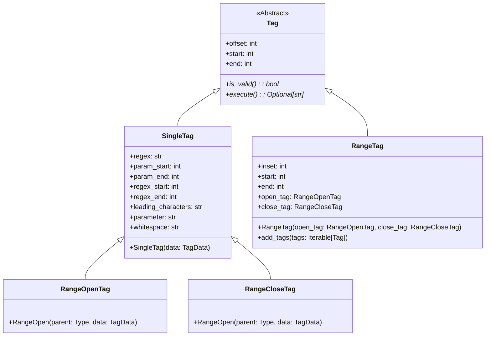

# CodeStripper

New version of the CodeStripper that was previously used, which can be found at [https://github.com/sebivenlo/codestripper](https://github.com/sebivenlo/codestripper).

The reason for the switch is to not be dependent on Ant as a build system and the possibility to easily add more tags.

## Available tags

| Command | Tag(s) | Description |
|-----|-------------|------------|
| Add | `cs:add:<text>` |  Add the *text* (without the tag in front) |
| Ignore | `cs:ignore` | Ignore the entire file, only valid on the first line |
| Remove line | `cs:remove` | Remove the line |
| Remove range | `cs:remove:start`/`cs:remove:end` | Remove all text in between tags |
| Replace | `cs:replace:<replacement>` | Replace the text in front by the *replacement*, keeps whitespace |
| Uncomment | `cs:uncomment:start`/`cs:uncomment:end` | Uncomment all lines in between tags |

### Legacy

To support the old CodeStripper, the legacy tag `Start Solution::replacewith::`/`End Solution::replacewith::` is still supported for now. This tag does both the `Remove` and `Replace` in one go.


## Command Line Properties

CodeStripper can be used as a Python Module and as a command line tool. The command line tool has the following interface.

| Flag | Long form | Description | Default value | Required |
|----------|------|-------------|---------------|----------|
| `<positional>` | None | files to include for code stripping (glob) | None | True |
| -e | --exclude | files to exclude for code stripping (glob) | None | False |
| -c | --comment | comment symbol(s) for the given language | // | False |
| -o | --output | the output directory to store the stripped files | out | False |
| -r | --recursive | do NOT use recursive globs for include/exclude | True | False |
| -v | --verbosity | increase output verbosity | None | False |
| -d | --dry | execute a dry run | False | False |
| -w | --working-directory | set the working directory for include/exclude | pwd | False |

## Examples

This section contains examples for all supported tags.

### Add

Input:
```java
public class Test {
    //cs:add:private final String test = "test";
}
```

Output:
```java
public class Test {
    private final String test = "test";
}
```

### Ignore

Input:
```java
//cs:ignore
public class Test {
    private final String test = "test";
}
```

Output: No output, file is ignored

### Remove line

Input:
```java
public class Test {
    private final String test = "test";//cs:remove
}
```

Output:
```java
public class Test {
}
```

### Remove range

Input:
```java
public class Test {
    //cs:remove:start
    private final String test = "test";
    private final int count = 0;
    //cs:remove:end
    private final boolean keep = true;
}
```

Output:
```java
public class Test {
    private final boolean keep = true;
}
```

### Replace

Input:
```java
public class Test {
    private final boolean keep = false;//cs:replace://TODO: add fields
}
```

Output:
```java
public class Test {
    //TODO: add fields
}
```

### Uncomment

Input:
```java
public class Test {
    //cs:uncomment:start
    //private final String example = "example";
    //private final boolean isTestCode = true;
    //cs:uncomment:end
}
```

Output:
```java
public class Test {
    private final String example = "example";
    private final boolean isTestCode = true;
}
```

## Adding a new tag

It is possible to add custom tags. There a two types of tags: `SingleTag` that works on one line only and `RangeTag` that works on a range of lines. Tags are defined as follows:


The idea is that every tag has the following methods:

- `is_valid`: whether the tag is valid
- `execute`: handle the text for this tag

`RangeTag` work in the following way:

- `RangeOpenTag`: Specifies the open regex and handles the opening line. Defines the type of parent it belongs to (so that the tokenizer can match open and close tag)
- `RangeCloseTag`: Specifies the close regex and handles the closing line. Defines the type of parent it belongs to (so that the tokenizer can match open and close tag)
- `RangeTag`: Handles lines in between the open and close tag. Has access to both the open and close tag that were matched by the tokenizer.

Create a custom tag:

1. Create a new file for your tag(s)
2. Depending on if you create a `SingleTag` or `RangeTag`
  - SingleTag:
```python
class TestTag(SingleTag):
    regex = r'<regex>' # Regex that should match the tag

    def __init__(self, data: TagData) -> None:
        super().__init__(data)

    def execute(self, content: str) -> Optional[str]:
        # Manipulate the line
        # None means the line is removed
    
    def is_valid(self) -> bool:
        # Return wether the tag is valid
```

  - RangeTag: Range needs a `RangeOpenTag`, `RangeCloseTag` and a `RangeTag`
```python
class TestOpenTag(RangeOpenTag):
    regex = r'<regex>' # Regex that should match the open tag

    def __init__(self, data: TagData) -> None:
        super().__init__(TestRangeTag, data)# Type of RangeTag is belong to

    def execute(self, content: str) -> Optional[str]:
        # Manipulate the line
        # None means the line is removed
    
    def is_valid(self) -> bool:
        # Return wether the tag is valid

class TestCloseTag(RangeCloseTag):
    # Same as RangeOpenTag

class TestRangeTag(RangeTag):
    regex = None # The matching is done based on open/close tag

    def __init__(self, open_tag: RangeOpenTag, close_tag: RangeCloseTag):
        super().__init__(open_tag, close_tag)

    def execute(self, content: str) -> Union[str, None]:
        # Manipulate lines between the tags
```
3. Add the new tag(s) to the `default_tags` in the `tokenizer`,

```python
default_tags: Set[Type[SingleTag]] = {
    IgnoreFileTag,
    RemoveOpenTag,
    ...,
    TestTag,
    TestOpenTag
}
```
> :warning: **Only the `SingleTag`(s) need to be added, not the `RangeTag`** 