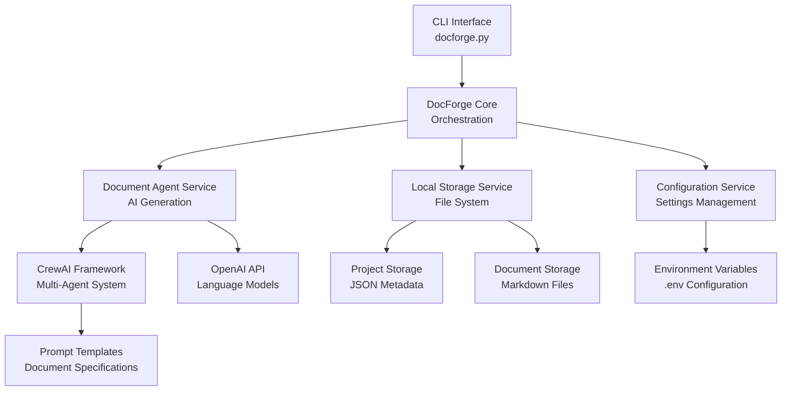
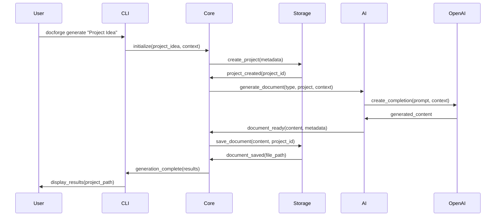
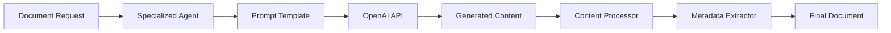
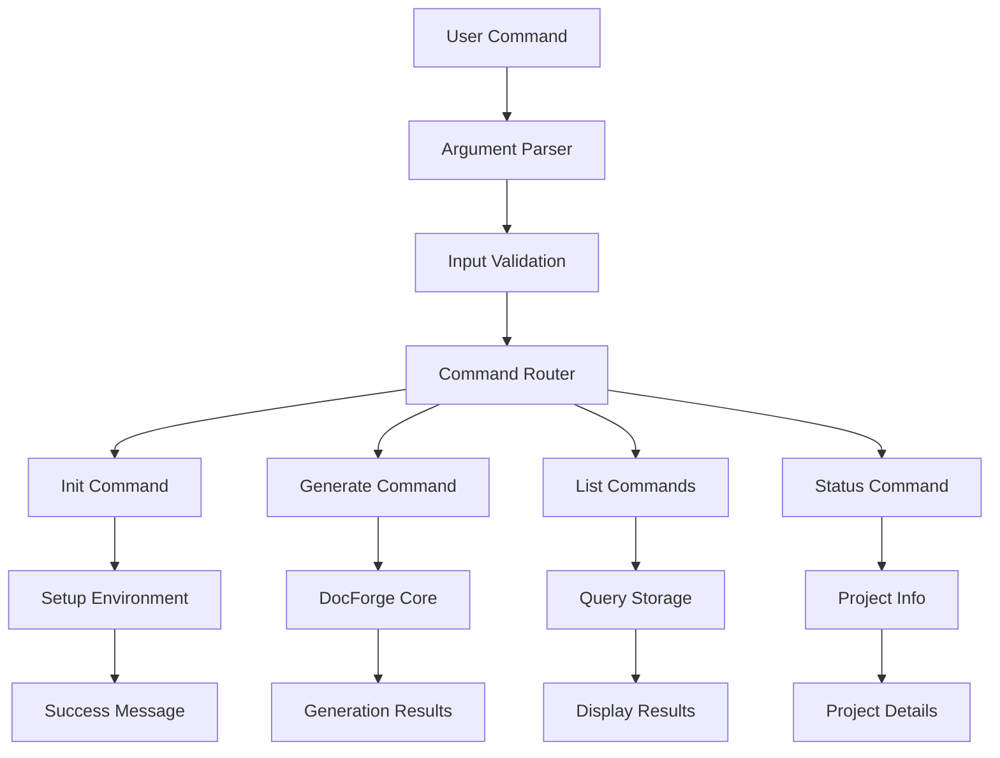

# 🏗️ DocForge Architecture Documentation

## 📋 Table of Contents
- [System Overview](#system-overview)
- [Architecture Principles](#architecture-principles)
- [System Components](#system-components)
- [Data Flow](#data-flow)
- [Core Modules](#core-modules)
- [AI Integration](#ai-integration)
- [Storage System](#storage-system)
- [CLI Interface](#cli-interface)
- [Configuration Management](#configuration-management)
- [Extensibility](#extensibility)

---

## 🎯 System Overview

DocForge is a self-contained, AI-powered documentation generation system built with a modular, extensible architecture. It transforms simple project ideas into comprehensive, professional documentation suites using specialized AI agents.

### **Core Design Philosophy**
- **Self-Contained**: No external databases or complex infrastructure
- **AI-First**: Leverages AI agents for specialized document generation
- **Modular**: Clean separation of concerns with extensible components
- **Developer-Friendly**: Simple setup and clear extension points
- **Production-Ready**: Professional quality suitable for enterprise use

---

## 🏛️ Architecture Principles

### **1. Separation of Concerns**
Each component has a single, well-defined responsibility:
- **CLI Layer**: User interaction and command processing
- **Service Layer**: Business logic and orchestration
- **Storage Layer**: Data persistence and file management
- **AI Layer**: Document generation and content creation

### **2. Dependency Inversion**
High-level modules don't depend on low-level modules:
- Core logic is independent of storage implementation
- AI services are abstracted behind interfaces
- Configuration is centralized and injectable

### **3. Open/Closed Principle**
System is open for extension, closed for modification:
- New document types via template addition
- New AI providers via service implementation
- New storage backends via interface implementation

### **4. Single Responsibility**
Each module has one reason to change:
- Document generation logic separate from storage
- CLI commands separate from business logic
- Configuration separate from runtime behavior

---

## 🔧 System Components



### **Component Hierarchy**

```
DocForge System
├── 🖥️  CLI Layer (docforge.py)
│   ├── Command Processing
│   ├── User Interface
│   └── Error Handling
│
├── 🧠 Core Layer (DocForgeCore)
│   ├── Project Management
│   ├── Document Orchestration
│   └── Workflow Control
│
├── 🛠️ Service Layer
│   ├── 🤖 AI Services
│   │   ├── DocumentAgentService
│   │   ├── OpenAIService
│   │   └── ConceptExpander
│   │
│   ├── 💾 Storage Services
│   │   ├── LocalStorageService
│   │   └── FileStorageService
│   │
│   └── ⚙️ Configuration Services
│       └── SimpleSettings
│
└── 📁 Data Layer
    ├── Project Metadata (JSON)
    ├── Document Content (Markdown)
    └── Generated Assets
```

---

## 🌊 Data Flow

### **Document Generation Flow**



### **Data Transformation Pipeline**

```
User Input
    ↓
[Project Idea + Context]
    ↓
[Project Metadata Creation]
    ↓
[Document Type Selection]
    ↓
[AI Prompt Generation]
    ↓
[OpenAI API Call]
    ↓
[Content Processing]
    ↓
[Markdown Generation]
    ↓
[File System Storage]
    ↓
[User Notification]
```

---

## 🧩 Core Modules

### **1. DocForgeCore (docforge.py)**
**Responsibility**: Main orchestration and workflow management

```python
class DocForgeCore:
    """Core DocForge functionality orchestrator"""
    
    def __init__(self, base_dir: Optional[Path] = None):
        self.base_dir = base_dir or Path.cwd()
        self.storage = LocalStorageService()
        self.doc_agent_service = DocumentAgentService()
    
    async def generate_documents(
        self, 
        idea: str,
        document_types: List[str] = None,
        context: str = None
    ) -> Dict[str, Any]:
        """Main document generation workflow"""
```

**Key Responsibilities**:
- Project lifecycle management
- Document generation orchestration
- Error handling and recovery
- Progress tracking and reporting

### **2. LocalStorageService**
**Responsibility**: File system-based data persistence

```python
class LocalStorageService:
    """Local file-system based storage service"""
    
    def __init__(self, base_dir: Optional[Path] = None):
        self.base_dir = base_dir or Path("storage")
        self.projects_dir = self.base_dir / "projects"
        self.documents_dir = self.base_dir / "documents"
```

**Key Features**:
- Project metadata management (JSON)
- Document content storage (Markdown)
- File organization and cleanup
- Storage statistics and health checks

### **3. DocumentAgentService**
**Responsibility**: AI-powered document generation

```python
class DocumentAgentService:
    """AI agent service for document generation"""
    
    def __init__(self, db=None):
        self.openai_service = OpenAIService()
        self.agents_config = self._load_agents_config()
    
    async def generate_document(
        self,
        document_type: DocumentType,
        project: Dict[str, Any],
        context: str = None
    ) -> Dict[str, Any]:
        """Generate document using specialized AI agents"""
```

**Agent Architecture**:
- Specialized agents per document type
- Template-based prompt generation
- Content quality validation
- Metadata extraction and enrichment

### **4. SimpleSettings (Configuration)**
**Responsibility**: Centralized configuration management

```python
class SimpleSettings:
    """Simplified settings for self-contained operation"""
    
    def __init__(self):
        self.openai_api_key = os.getenv("OPENAI_API_KEY", "")
        self.openai_model = os.getenv("OPENAI_MODEL", "gpt-4")
        self.storage_path = Path(os.getenv("STORAGE_PATH", "./storage"))
```

**Configuration Layers**:
- Environment variables (.env)
- Default values (fallbacks)
- Runtime overrides (CLI arguments)
- Validation and type checking

---

## 🤖 AI Integration

### **Multi-Agent Architecture**

DocForge uses CrewAI to implement a multi-agent system where each agent specializes in a specific document type:

```python
# Agent Configuration Example
DOCUMENT_AGENTS = {
    DocumentType.PROJECT_CHARTER: {
        "role": "Senior Project Manager",
        "goal": "Create comprehensive project charter",
        "prompt_file": "PROJECT CHARTER Prompt.md",
        "max_tokens": 3000
    },
    DocumentType.SRS: {
        "role": "Senior Business Analyst",
        "goal": "Generate detailed software requirements",
        "prompt_file": "SRS Document Prompt.md", 
        "max_tokens": 4000
    }
}
```

### **AI Service Integration**



### **Content Processing Pipeline**

1. **Input Normalization**: Clean and structure user input
2. **Context Enrichment**: Add relevant project context
3. **Prompt Generation**: Build specialized prompts per document type
4. **AI Generation**: Call OpenAI API with optimized parameters
5. **Content Validation**: Ensure quality and completeness
6. **Metadata Extraction**: Extract structured data from content
7. **Format Optimization**: Apply professional formatting

---

## 💾 Storage System

### **File System Organization**

```
DocForge Storage Structure:
├── storage/                     # Internal metadata storage
│   ├── projects/               # Project metadata (JSON)
│   │   ├── {project_id}.json  # Individual project data
│   │   └── ...
│   └── documents/              # Document metadata (JSON)
│       ├── {document_id}.json # Individual document metadata
│       └── ...
│
└── generated-docs/             # User-facing generated documents
    ├── {project-slug}/        # Individual project directory
    │   ├── README.md          # Project overview
    │   ├── 01_project_charter.md
    │   ├── 02_srs.md
    │   └── ...
    └── ...
```

### **Data Models**

#### **Project Metadata**
```json
{
  "id": "uuid4-string",
  "name": "Project Name",
  "slug": "project-name",
  "initial_idea": "User's project description",
  "expanded_concept": "AI-expanded project concept",
  "additional_context": "User-provided context",
  "status": "completed",
  "created_at": "2024-01-20T10:00:00Z",
  "updated_at": "2024-01-20T11:30:00Z",
  "documents_generated": ["doc-id-1", "doc-id-2"],
  "generation_config": {
    "ai_model": "gpt-4",
    "document_types": ["project_charter", "srs"],
    "custom_requirements": []
  }
}
```

#### **Document Metadata**
```json
{
  "id": "uuid4-string",
  "project_id": "parent-project-id",
  "document_type": "project_charter",
  "title": "Project Charter - AI Chatbot",
  "content": "# Full markdown content...",
  "status": "completed",
  "version": 1,
  "created_at": "2024-01-20T10:15:00Z",
  "updated_at": "2024-01-20T10:15:00Z",
  "tokens_used": 2500,
  "agent_used": "Senior Project Manager",
  "additional_context": "React frontend, Python backend"
}
```

---

## 🖥️ CLI Interface

### **Command Structure**

```python
# Main CLI Commands
commands = {
    "init": "Initialize DocForge in current directory",
    "generate": "Generate documentation from project idea", 
    "list-docs": "List available document types",
    "list-projects": "List all generated projects",
    "status": "Get project status and details"
}
```

### **Command Processing Flow**



### **Error Handling Strategy**

1. **Input Validation**: Catch invalid arguments early
2. **Configuration Errors**: Clear messages for setup issues
3. **API Errors**: Handle OpenAI rate limits and failures gracefully
4. **Storage Errors**: File system permission and space issues
5. **Recovery Mechanisms**: Partial success handling and resume capability

---

## ⚙️ Configuration Management

### **Configuration Hierarchy**

```python
# Configuration Priority (highest to lowest)
1. Command Line Arguments    # --context, --docs, etc.
2. Environment Variables     # OPENAI_API_KEY, OPENAI_MODEL
3. .env File                # Local configuration file
4. Default Values           # Built-in fallbacks
```

### **Environment Variables**

```bash
# Core Configuration
OPENAI_API_KEY=sk-...                    # Required
OPENAI_MODEL=gpt-4                       # Default: gpt-4

# Storage Configuration  
STORAGE_PATH=./storage                   # Internal storage
GENERATED_DOCS_PATH=./generated-docs     # Output directory

# Performance Configuration
CONCURRENT_GENERATIONS=1                 # Parallel processing
GENERATION_TIMEOUT=300                   # Request timeout (seconds)
MAX_FILE_SIZE=10485760                  # Max file size (10MB)

# Feature Flags
ENABLE_VALIDATION=true                   # Content validation
DEBUG=false                             # Debug logging
LOG_LEVEL=INFO                          # Logging verbosity

# Optional Integrations
NOTION_TOKEN=secret_...                 # Notion API token
NOTION_DATABASE_ID=abc123               # Notion database ID
```

### **Configuration Validation**

```python
def validate_config(self) -> Dict[str, Any]:
    """Comprehensive configuration validation"""
    result = {
        "valid": True,
        "errors": [],
        "warnings": []
    }
    
    # Required settings validation
    if not self.openai_api_key:
        result["valid"] = False
        result["errors"].append("OPENAI_API_KEY is required")
    
    # Directory permissions validation
    try:
        self.storage_path.mkdir(parents=True, exist_ok=True)
        self.generated_docs_path.mkdir(parents=True, exist_ok=True)
    except Exception as e:
        result["valid"] = False
        result["errors"].append(f"Cannot create directories: {e}")
    
    return result
```

---

## 🔌 Extensibility

### **Adding New Document Types**

1. **Define Document Type**
```python
# In backend/app/models.py
class DocumentType(str, Enum):
    # ... existing types
    API_DOCUMENTATION = "api_documentation"
```

2. **Create Prompt Template**
```markdown
# In prompts/API_Documentation_Prompt.md
You are an expert technical writer specializing in API documentation...

## Context
- Project: {project_name}
- Technology: {additional_context}
- Requirements: {custom_requirements}

## Generate comprehensive API documentation including...
```

3. **Configure Agent**
```python
# In backend/app/services/document_agents.py
DocumentType.API_DOCUMENTATION: {
    "role": "Senior Technical Writer",
    "goal": "Generate comprehensive API documentation",
    "prompt_file": "API_Documentation_Prompt.md",
    "max_tokens": 3500
}
```

### **Adding New AI Providers**

1. **Create Provider Service**
```python
class ClaudeService:
    """Anthropic Claude integration"""
    
    async def generate_content(
        self, 
        prompt: str, 
        context: Dict[str, Any]
    ) -> Dict[str, Any]:
        # Implementation for Claude API
        pass
```

2. **Update Configuration**
```python
# Add provider selection
AI_PROVIDER = os.getenv("AI_PROVIDER", "openai")  # openai, claude, etc.
```

3. **Integrate with Agent Service**
```python
def _get_ai_service(self) -> BaseAIService:
    """Factory method for AI service selection"""
    if settings.ai_provider == "claude":
        return ClaudeService()
    else:
        return OpenAIService()
```

### **Custom Storage Backends**

1. **Implement Storage Interface**
```python
class DatabaseStorageService(BaseStorageService):
    """Database-backed storage implementation"""
    
    async def create_project(self, **kwargs) -> Dict[str, Any]:
        # Database implementation
        pass
    
    async def get_project(self, project_id: str) -> Dict[str, Any]:
        # Database implementation
        pass
```

2. **Configuration Selection**
```python
STORAGE_BACKEND = os.getenv("STORAGE_BACKEND", "local")  # local, database, s3
```

---

## 📊 Performance Considerations

### **Optimization Strategies**

1. **Concurrent Processing**: Generate multiple documents in parallel
2. **Caching**: Cache AI responses for similar requests
3. **Streaming**: Stream large document generation for better UX
4. **Resource Management**: Monitor API rate limits and costs
5. **File System Optimization**: Efficient file organization and cleanup

### **Scalability Design**

- **Horizontal Scaling**: Multiple DocForge instances can run independently
- **Resource Isolation**: Each project is isolated in separate directories
- **API Rate Limiting**: Built-in handling of OpenAI rate limits
- **Memory Management**: Streaming processing for large documents

### **Monitoring and Observability**

```python
# Performance Metrics
- Document generation time per type
- Token usage per request  
- Success/failure rates
- Storage usage statistics
- API response times
```

---

## 🧪 Testing Architecture

### **Test Structure**
```
tests/
├── test_basic.py              # Basic functionality tests
├── unit/                      # Unit tests
│   ├── test_storage.py       # Storage service tests
│   ├── test_agents.py        # AI agent tests
│   └── test_config.py        # Configuration tests
├── integration/               # Integration tests
│   ├── test_cli.py           # CLI interface tests
│   └── test_workflow.py      # End-to-end workflow tests
└── fixtures/                  # Test data and mocks
    ├── sample_projects.json
    └── mock_responses.py
```

### **Test Categories**

1. **Unit Tests**: Individual component testing
2. **Integration Tests**: Multi-component interaction testing
3. **CLI Tests**: Command-line interface testing
4. **End-to-End Tests**: Full workflow validation
5. **Performance Tests**: Load and stress testing

---

## 🚀 Deployment Architecture

### **Self-Contained Deployment**
DocForge is designed for simple, self-contained deployment:

```bash
# Simple Installation
git clone https://github.com/docforge-community/docforge-opensource.git
cd docforge-opensource
pip install -r requirements.txt
python docforge.py init
```

### **Docker Deployment**
```dockerfile
FROM python:3.11-slim
WORKDIR /app
COPY . .
RUN pip install -r requirements.txt
CMD ["python", "docforge.py", "--help"]
```

### **Production Considerations**
- **Environment Isolation**: Use virtual environments
- **Secret Management**: Secure API key storage
- **Resource Monitoring**: Track token usage and costs
- **Backup Strategy**: Regular storage directory backups
- **Update Management**: Version pinning and update procedures

---

## 📈 Future Architecture Evolution

### **Planned Enhancements**

1. **Web Interface**: Optional browser-based UI
2. **Plugin System**: Third-party extension support  
3. **Advanced AI**: Multiple AI provider support
4. **Export Formats**: PDF, Word, HTML generation
5. **Collaboration**: Multi-user project support
6. **Template Marketplace**: Community template sharing

### **Architectural Roadmap**

**Phase 1** (Current): Self-contained CLI tool
**Phase 2**: Web interface and multi-provider AI
**Phase 3**: Plugin ecosystem and advanced export
**Phase 4**: Collaboration and marketplace features

---

This architecture documentation provides a comprehensive technical overview of DocForge's design, implementation, and extensibility. It serves as both a reference for contributors and a guide for understanding the system's technical foundations.
