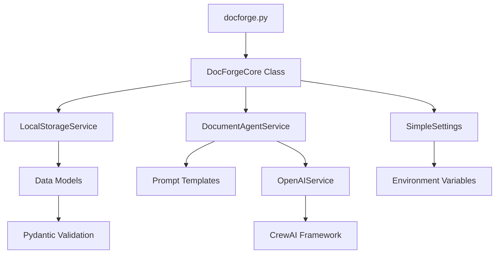

# 👨‍💻 DocForge Developer Guide

## 📋 Table of Contents
- [Development Setup](#development-setup)
- [Code Organization](#code-organization)
- [Core Components](#core-components)
- [Development Workflow](#development-workflow)
- [Adding New Features](#adding-new-features)
- [Testing Guidelines](#testing-guidelines)
- [Code Style Guide](#code-style-guide)
- [Debugging](#debugging)
- [Performance Optimization](#performance-optimization)
- [Contributing Guidelines](#contributing-guidelines)

---

## 🛠️ Development Setup

### **Prerequisites**
- Python 3.8+ (3.11+ recommended for best performance)
- Git for version control
- Code editor (VS Code, PyCharm, etc.)
- OpenAI API key for testing

### **Local Development Setup**

```bash
# 1. Clone the repository
git clone https://github.com/docforge-community/docforge-opensource.git
cd docforge-opensource

# 2. Create virtual environment
python -m venv docforge-dev
source docforge-dev/bin/activate  # On Windows: docforge-dev\Scripts\activate

# 3. Install dependencies
pip install -r requirements.txt

# 4. Install development dependencies
pip install -e ".[dev]"  # If available, or install manually:
pip install pytest pytest-asyncio black flake8 mypy

# 5. Set up environment
cp .env.template .env
# Edit .env with your OpenAI API key

# 6. Initialize DocForge
python docforge.py init

# 7. Run basic tests
python tests/test_basic.py
```

### **Development Dependencies**

```txt
# Core Dependencies (from requirements.txt)
crewai>=0.141.0,<1.0.0
openai>=1.0.0,<2.0.0
pydantic>=2.6.0,<3.0.0
python-dotenv>=1.0.0

# Development Dependencies
pytest>=7.0.0              # Testing framework
pytest-asyncio>=0.21.0     # Async testing support
black>=23.0.0              # Code formatting
flake8>=6.0.0              # Linting
mypy>=1.0.0                # Type checking
```

### **IDE Configuration**

#### **VS Code Settings (.vscode/settings.json)**
```json
{
    "python.defaultInterpreterPath": "./docforge-dev/bin/python",
    "python.formatting.provider": "black",
    "python.linting.enabled": true,
    "python.linting.flake8Enabled": true,
    "python.linting.mypyEnabled": true,
    "files.exclude": {
        "**/__pycache__": true,
        "**/.pytest_cache": true,
        "**/storage": true,
        "**/generated-docs": true
    }
}
```

---

## 📁 Code Organization

### **Project Structure Deep Dive**

```
docforge-opensource/
├── 🐍 docforge.py                 # Main CLI entry point
├── 📁 backend/                    # Core application logic
│   └── app/                       # Application modules
│       ├── __init__.py
│       ├── models.py              # Data models and enums
│       ├── schemas.py             # Pydantic validation schemas
│       ├── 📁 core/              # Core configuration and utilities
│       │   ├── __init__.py
│       │   ├── simple_config.py   # Configuration management
│       │   └── config.py          # Legacy config (for reference)
│       ├── 📁 services/          # Business logic services
│       │   ├── __init__.py
│       │   ├── local_storage_service.py    # File storage management
│       │   ├── document_agents.py          # AI document generation
│       │   ├── openai_service.py           # OpenAI API integration
│       │   ├── concept_expander.py         # Concept expansion logic
│       │   └── notion_service.py           # Optional Notion integration
│       └── 📁 templates/         # Document templates
│           └── document_templates.py
├── 📁 prompts/                   # AI prompt templates (14 files)
│   ├── PROJECT CHARTER Prompt.md
│   ├── SRS Document Prompt.md
│   ├── SYSTEM ARCHITECTURE HLD DOCUMENT Prompt.md
│   └── ... (11 more specialized prompts)
├── 📁 tests/                     # Test suite
│   ├── test_basic.py             # Basic functionality tests
│   └── ... (additional test files)
├── 📁 scripts/                   # Utility scripts
│   └── package_verification.py   # Package validation
├── 📁 docs/                      # Documentation
│   ├── ARCHITECTURE.md           # System architecture
│   ├── DEVELOPER_GUIDE.md        # This file
│   └── INSTALLATION.md           # Installation guide
└── 📁 examples/                  # Usage examples and demos
```

### **Module Dependencies**



---

## 🧩 Core Components

### **1. DocForgeCore (Main Orchestrator)**

```python
# Location: docforge.py
class DocForgeCore:
    """
    Central orchestrator for document generation workflow.
    Coordinates between storage, AI services, and user interface.
    """
    
    def __init__(self, base_dir: Optional[Path] = None):
        """Initialize core components with dependency injection"""
        self.base_dir = base_dir or Path.cwd()
        self.storage = LocalStorageService(base_dir=settings.storage_path)
        self.doc_agent_service = DocumentAgentService(db=None)
    
    async def generate_documents(self, idea: str, **kwargs) -> Dict[str, Any]:
        """
        Main document generation workflow:
        1. Validate configuration
        2. Create project metadata
        3. Generate documents sequentially
        4. Save results to file system
        5. Return generation summary
        """
```

**Key Methods**:
- `generate_documents()`: Main workflow orchestration
- `list_document_types()`: Available document type enumeration
- `get_project_status()`: Project status retrieval
- `list_projects()`: Project listing and summary

### **2. LocalStorageService (Data Persistence)**

```python
# Location: backend/app/services/local_storage_service.py
class LocalStorageService:
    """
    File system-based storage service.
    Manages project metadata and document storage using JSON and Markdown files.
    """
    
    def __init__(self, base_dir: Optional[Path] = None):
        """Initialize storage directories and ensure they exist"""
        self.base_dir = base_dir or Path("storage")
        self.projects_dir = self.base_dir / "projects"
        self.documents_dir = self.base_dir / "documents"
        self._ensure_directories()
    
    async def create_project(self, name: str, initial_idea: str, **kwargs) -> Dict[str, Any]:
        """
        Create new project:
        1. Generate unique project ID
        2. Create project metadata
        3. Save to JSON file
        4. Create output directory
        """
```

**Storage Pattern**:
- **Projects**: `storage/projects/{project_id}.json`
- **Documents**: `storage/documents/{document_id}.json` 
- **Generated Docs**: `generated-docs/{project_slug}/`

### **3. DocumentAgentService (AI Integration)**

```python
# Location: backend/app/services/document_agents.py  
class DocumentAgentService:
    """
    AI-powered document generation using specialized agents.
    Each document type has a dedicated agent with specific prompts.
    """
    
    def __init__(self, db=None):
        """Initialize AI services and agent configurations"""
        self.openai_service = OpenAIService()
        self.agents_config = self._load_agents_config()
    
    async def generate_document(
        self, 
        document_type: DocumentType, 
        project: Dict[str, Any],
        **kwargs
    ) -> Dict[str, Any]:
        """
        Generate document using specialized agent:
        1. Load agent configuration for document type
        2. Build context-aware prompt
        3. Call OpenAI API via CrewAI
        4. Process and validate response
        5. Return structured result
        """
```

**Agent Configuration Pattern**:
```python
DOCUMENT_AGENTS = {
    DocumentType.PROJECT_CHARTER: {
        "role": "Senior Project Manager with 15+ years experience",
        "goal": "Create comprehensive project charter document",
        "prompt_file": "PROJECT CHARTER Prompt.md",
        "max_tokens": 3000,
        "temperature": 0.7
    }
}
```

### **4. SimpleSettings (Configuration Management)**

```python
# Location: backend/app/core/simple_config.py
class SimpleSettings:
    """
    Centralized configuration management.
    Handles environment variables, validation, and default values.
    """
    
    def __init__(self):
        """Load configuration from multiple sources with priority order"""
        # Core AI Configuration
        self.openai_api_key = os.getenv("OPENAI_API_KEY", "")
        self.openai_model = os.getenv("OPENAI_MODEL", "gpt-4")
        
        # Storage Configuration
        self.storage_path = Path(os.getenv("STORAGE_PATH", "./storage"))
        self.generated_docs_path = Path(os.getenv("GENERATED_DOCS_PATH", "./generated-docs"))
        
        # Performance Settings
        self.concurrent_generations = int(os.getenv("CONCURRENT_GENERATIONS", "1"))
        self.generation_timeout = int(os.getenv("GENERATION_TIMEOUT", "300"))
    
    def validate_config(self) -> Dict[str, Any]:
        """Comprehensive configuration validation with detailed error reporting"""
```

---

## 🔄 Development Workflow

### **Standard Development Process**

```bash
# 1. Start development session
cd docforge-opensource
source docforge-dev/bin/activate  # Activate virtual environment

# 2. Pull latest changes
git pull origin main

# 3. Create feature branch
git checkout -b feature/your-feature-name

# 4. Make changes and test
python tests/test_basic.py
python docforge.py generate "Test project" --docs project_charter

# 5. Code quality checks
black .                    # Format code
flake8 .                  # Check linting
mypy docforge.py          # Type checking

# 6. Run comprehensive tests
python scripts/package_verification.py

# 7. Commit and push
git add .
git commit -m "feat: add your feature description"
git push origin feature/your-feature-name

# 8. Create pull request
```

### **Git Workflow**

```bash
# Main branches
main        # Production-ready code
develop     # Integration branch (if used)

# Feature branches
feature/add-claude-support
feature/pdf-export  
bugfix/storage-permission-issue
docs/update-architecture

# Release branches
release/2.1.0
```

### **Commit Message Convention**

```bash
# Format: <type>(<scope>): <description>

feat(agents): add support for Claude AI provider
fix(storage): handle permission errors gracefully  
docs(architecture): update component diagrams
test(cli): add comprehensive CLI command tests
refactor(config): simplify settings management
perf(generation): optimize concurrent document processing
```

---

## ➕ Adding New Features

### **Adding a New Document Type**

#### **Step 1: Define the Document Type**
```python
# In backend/app/models.py
class DocumentType(str, Enum):
    # ... existing types
    API_DOCUMENTATION = "api_documentation"
    USER_MANUAL = "user_manual"
    SECURITY_ASSESSMENT = "security_assessment"
```

#### **Step 2: Create Prompt Template**
```markdown
<!-- In prompts/API_Documentation_Prompt.md -->
# API Documentation Generator

You are an expert technical writer and API documentation specialist with 10+ years of experience creating comprehensive, developer-friendly API documentation.

## Project Context
- **Project Name**: {project_name}
- **Project Description**: {initial_idea}
- **Technology Stack**: {additional_context}
- **Custom Requirements**: {custom_requirements}

## Your Mission
Generate comprehensive API documentation that includes:

### 1. API Overview
- Purpose and scope of the API
- Authentication methods
- Base URL and versioning strategy
- Response formats (JSON, XML, etc.)

### 2. Endpoint Documentation
For each endpoint provide:
- HTTP method and URL pattern
- Request parameters (path, query, body)
- Request examples with curl and code samples
- Response schema and examples
- Error codes and error response examples
- Rate limiting information

### 3. Authentication & Security
- API key management
- OAuth 2.0 flows (if applicable)
- Security best practices
- CORS policy

### 4. SDK and Code Examples
- Code examples in multiple languages (JavaScript, Python, PHP, etc.)
- SDK installation instructions
- Quick start guide

### 5. Error Handling
- Standard error response format
- Complete list of error codes
- Troubleshooting guide

## Output Requirements
- Use clear, professional technical writing
- Include practical code examples
- Follow OpenAPI 3.0 specification format where applicable
- Ensure all examples are functional and testable
- Use markdown formatting with proper headers and code blocks

Generate comprehensive API documentation based on the project context above.
```

#### **Step 3: Configure Agent**
```python
# In backend/app/services/document_agents.py
DOCUMENT_AGENTS = {
    # ... existing agents
    DocumentType.API_DOCUMENTATION: {
        "role": "Senior API Documentation Specialist",
        "goal": "Create comprehensive, developer-friendly API documentation",
        "backstory": "Expert technical writer with extensive experience in REST API documentation, OpenAPI specifications, and developer experience optimization.",
        "prompt_file": "API_Documentation_Prompt.md",
        "max_tokens": 4000,
        "temperature": 0.3  # Lower temperature for more consistent technical content
    }
}
```

#### **Step 4: Test Implementation**
```bash
# Test the new document type
python docforge.py list-docs  # Should show new type

# Generate test document
python docforge.py generate "REST API for e-commerce platform" --docs api_documentation --context "Node.js, Express, PostgreSQL, JWT authentication"

# Verify output
ls generated-docs/rest-api-for-e-commerce-platform/
cat generated-docs/rest-api-for-e-commerce-platform/README.md
```

### **Adding a New AI Provider**

#### **Step 1: Create Provider Service**
```python
# In backend/app/services/claude_service.py
import anthropic
from typing import Dict, Any

class ClaudeService:
    """Anthropic Claude integration service"""
    
    def __init__(self):
        self.api_key = os.getenv("ANTHROPIC_API_KEY")
        self.client = anthropic.Anthropic(api_key=self.api_key)
    
    async def generate_content(
        self, 
        prompt: str, 
        context: Dict[str, Any],
        max_tokens: int = 3000
    ) -> Dict[str, Any]:
        """Generate content using Claude API"""
        try:
            message = self.client.messages.create(
                model="claude-3-sonnet-20240229",
                max_tokens=max_tokens,
                messages=[
                    {"role": "user", "content": prompt}
                ]
            )
            
            return {
                "success": True,
                "content": message.content[0].text,
                "tokens_used": message.usage.input_tokens + message.usage.output_tokens,
                "provider": "claude"
            }
        except Exception as e:
            return {
                "success": False,
                "error": str(e),
                "provider": "claude"
            }
```

#### **Step 2: Update Configuration**
```python
# In backend/app/core/simple_config.py
class SimpleSettings:
    def __init__(self):
        # ... existing settings
        self.ai_provider = os.getenv("AI_PROVIDER", "openai")  # openai, claude
        self.anthropic_api_key = os.getenv("ANTHROPIC_API_KEY", "")
```

#### **Step 3: Integrate with Agent Service**
```python
# In backend/app/services/document_agents.py
from .claude_service import ClaudeService

class DocumentAgentService:
    def __init__(self, db=None):
        self.ai_service = self._get_ai_service()
        self.agents_config = self._load_agents_config()
    
    def _get_ai_service(self):
        """Factory method for AI service selection"""
        if settings.ai_provider == "claude":
            return ClaudeService()
        else:
            return OpenAIService()
```

---

## 🧪 Testing Guidelines

### **Test Structure**

```python
# tests/test_storage.py
import pytest
import tempfile
from pathlib import Path
from backend.app.services.local_storage_service import LocalStorageService

class TestLocalStorageService:
    """Test suite for LocalStorageService"""
    
    @pytest.fixture
    def temp_storage(self):
        """Create temporary storage directory for testing"""
        with tempfile.TemporaryDirectory() as temp_dir:
            yield LocalStorageService(base_dir=Path(temp_dir))
    
    @pytest.mark.asyncio
    async def test_create_project(self, temp_storage):
        """Test project creation functionality"""
        result = await temp_storage.create_project(
            name="Test Project",
            initial_idea="A test project for unit testing"
        )
        
        assert result["success"] is True
        assert "project" in result
        assert result["project"]["name"] == "Test Project"
        
        # Verify file was created
        project_id = result["project"]["id"]
        project_file = temp_storage.projects_dir / f"{project_id}.json"
        assert project_file.exists()
```

### **Test Categories**

#### **1. Unit Tests**
- Individual component functionality
- Isolated from external dependencies
- Fast execution (<1 second each)

```python
def test_slugify_function():
    """Test string slugification"""
    core = DocForgeCore()
    assert core._slugify("My Project Name!") == "my-project-name"
    assert core._slugify("API   Documentation??") == "api-documentation"
```

#### **2. Integration Tests**
- Multi-component interactions
- End-to-end workflow testing
- May require API keys (mock in CI)

```python
@pytest.mark.asyncio
async def test_document_generation_workflow():
    """Test complete document generation workflow"""
    # This test requires OpenAI API key
    if not os.getenv("OPENAI_API_KEY"):
        pytest.skip("OpenAI API key required for integration test")
    
    core = DocForgeCore()
    result = await core.generate_documents(
        idea="Test project",
        document_types=["project_charter"]
    )
    
    assert result["success"] is True
    assert result["documents_generated"] == 1
```

#### **3. CLI Tests**
- Command-line interface testing
- Argument parsing and validation
- Output format verification

```python
def test_cli_help_command():
    """Test CLI help command"""
    result = subprocess.run(
        ["python", "docforge.py", "--help"],
        capture_output=True,
        text=True
    )
    
    assert result.returncode == 0
    assert "DocForge" in result.stdout
    assert "generate" in result.stdout
```

### **Running Tests**

```bash
# Run all tests
python -m pytest tests/

# Run specific test file
python -m pytest tests/test_storage.py

# Run with coverage
python -m pytest --cov=backend tests/

# Run tests with verbose output
python -m pytest -v tests/

# Run only fast tests (skip slow integration tests)
python -m pytest -m "not slow" tests/
```

---

## 🎨 Code Style Guide

### **Python Style Standards**

DocForge follows PEP 8 with some specific conventions:

#### **Code Formatting**
```python
# Use Black for automatic formatting
black .

# Line length: 88 characters (Black default)
# Use double quotes for strings
# 4 spaces for indentation
```

#### **Import Organization**
```python
# Standard library imports
import os
import sys
from pathlib import Path
from typing import Dict, List, Optional, Any

# Third-party imports
import openai
from pydantic import BaseModel

# Local application imports
from app.core.simple_config import settings
from app.services.local_storage_service import LocalStorageService
```

#### **Naming Conventions**
```python
# Classes: PascalCase
class DocumentAgentService:
    pass

# Functions and variables: snake_case
def generate_documents():
    project_name = "example"
    
# Constants: UPPER_SNAKE_CASE
MAX_RETRIES = 3
DEFAULT_MODEL = "gpt-4"

# Private methods: _leading_underscore
def _internal_helper():
    pass
```

#### **Type Hints**
```python
from typing import Dict, List, Optional, Any, Union

# Function signatures
async def create_project(
    name: str,
    initial_idea: str,
    context: Optional[str] = None
) -> Dict[str, Any]:
    """Create a new project with type hints"""
    pass

# Class attributes
class DocForgeCore:
    def __init__(self, base_dir: Optional[Path] = None):
        self.base_dir: Path = base_dir or Path.cwd()
        self.storage: LocalStorageService = LocalStorageService()
```

#### **Documentation Standards**
```python
class DocumentAgentService:
    """
    AI-powered document generation service.
    
    This service orchestrates AI agents to generate specialized documents
    based on project requirements and context.
    
    Attributes:
        openai_service: OpenAI API integration service
        agents_config: Configuration mapping for document type agents
        
    Example:
        >>> service = DocumentAgentService()
        >>> result = await service.generate_document(
        ...     DocumentType.PROJECT_CHARTER, 
        ...     project_data
        ... )
    """
    
    async def generate_document(
        self,
        document_type: DocumentType,
        project: Dict[str, Any],
        context: Optional[str] = None
    ) -> Dict[str, Any]:
        """
        Generate document using specialized AI agent.
        
        Args:
            document_type: Type of document to generate
            project: Project metadata and context
            context: Additional context for generation
            
        Returns:
            Dictionary containing:
                - success (bool): Generation success status
                - content (str): Generated document content
                - tokens_used (int): Number of tokens consumed
                - error (str, optional): Error message if failed
                
        Raises:
            ValueError: If document_type is not supported
            APIError: If AI service call fails
            
        Example:
            >>> result = await service.generate_document(
            ...     DocumentType.SRS,
            ...     {"name": "My Project", "idea": "E-commerce platform"},
            ...     "React frontend, Node.js backend"
            ... )
            >>> print(result["content"])
        """
```

### **Error Handling Patterns**

```python
# Use specific exception types
class DocForgeError(Exception):
    """Base exception for DocForge operations"""
    pass

class ConfigurationError(DocForgeError):
    """Configuration-related errors"""
    pass

class StorageError(DocForgeError):
    """Storage operation errors"""
    pass

# Consistent error response format
def handle_error(operation: str, error: Exception) -> Dict[str, Any]:
    """Standardized error response format"""
    return {
        "success": False,
        "error": str(error),
        "error_type": type(error).__name__,
        "operation": operation,
        "timestamp": datetime.now().isoformat()
    }
```

---

## 🐛 Debugging

### **Logging Configuration**

```python
# Enable debug logging
# In .env file:
DEBUG=true
LOG_LEVEL=DEBUG

# In code:
import logging

logger = logging.getLogger(__name__)

# Debug-level logging
logger.debug(f"Processing project: {project_name}")
logger.info(f"Generated document: {document_type}")
logger.warning(f"API rate limit approaching: {remaining_requests}")
logger.error(f"Document generation failed: {error}")
```

### **Common Debugging Scenarios**

#### **1. Document Generation Issues**
```python
# Debug AI generation
async def generate_document(self, document_type, project, context=None):
    logger.debug(f"Starting generation for: {document_type}")
    logger.debug(f"Project context: {project}")
    logger.debug(f"Additional context: {context}")
    
    try:
        prompt = self._build_prompt(document_type, project, context)
        logger.debug(f"Generated prompt length: {len(prompt)}")
        
        result = await self.ai_service.generate_content(prompt)
        logger.debug(f"AI response tokens: {result.get('tokens_used', 'unknown')}")
        
        return result
    except Exception as e:
        logger.error(f"Generation failed: {e}", exc_info=True)
        raise
```

#### **2. Storage Issues**
```python
# Debug file operations
async def create_project(self, name, initial_idea):
    try:
        project_data = {...}
        project_file = self.projects_dir / f"{project_id}.json"
        
        logger.debug(f"Saving project to: {project_file}")
        logger.debug(f"Project data: {project_data}")
        
        with open(project_file, 'w') as f:
            json.dump(project_data, f, indent=2)
            
        logger.debug(f"Project saved successfully: {project_id}")
        
    except PermissionError as e:
        logger.error(f"Permission denied writing to: {project_file}")
        raise StorageError(f"Cannot write project file: {e}")
```

#### **3. Configuration Issues**
```python
# Debug configuration loading
def validate_config(self):
    logger.debug("Starting configuration validation")
    
    if not self.openai_api_key:
        logger.error("OpenAI API key not found in environment")
        return {"valid": False, "error": "OPENAI_API_KEY required"}
    
    logger.debug(f"OpenAI API key present: {self.openai_api_key[:10]}...")
    logger.debug(f"Model configured: {self.openai_model}")
    logger.debug(f"Storage path: {self.storage_path}")
    
    return {"valid": True}
```

### **Development Tools**

#### **Interactive Debugging**
```python
# Use pdb for interactive debugging
import pdb

async def generate_documents(self, idea, **kwargs):
    pdb.set_trace()  # Set breakpoint
    
    # Debug interactively:
    # (Pdb) p idea
    # (Pdb) p kwargs  
    # (Pdb) n  # Next line
    # (Pdb) c  # Continue
```

#### **Test with Mock Data**
```python
# Create test data for development
TEST_PROJECT_DATA = {
    "id": "test-project-123",
    "name": "Test Project",
    "initial_idea": "A test project for debugging",
    "additional_context": "React frontend, Python backend"
}

# Mock AI responses for faster testing
class MockOpenAIService:
    async def generate_content(self, prompt, **kwargs):
        return {
            "success": True,
            "content": f"# Mock Document\n\nGenerated from prompt: {prompt[:100]}...",
            "tokens_used": 500
        }
```

---

## ⚡ Performance Optimization

### **Performance Monitoring**

```python
import time
from functools import wraps

def performance_monitor(func):
    """Decorator to monitor function performance"""
    @wraps(func)
    async def async_wrapper(*args, **kwargs):
        start_time = time.time()
        result = await func(*args, **kwargs)
        end_time = time.time()
        
        logger.info(f"{func.__name__} took {end_time - start_time:.2f}s")
        return result
    
    return async_wrapper

# Usage
@performance_monitor
async def generate_document(self, document_type, project):
    # Function implementation
    pass
```

### **Optimization Strategies**

#### **1. Concurrent Document Generation**
```python
import asyncio
from typing import List

async def generate_documents_concurrent(
    self,
    document_types: List[DocumentType],
    project: Dict[str, Any]
) -> List[Dict[str, Any]]:
    """Generate multiple documents concurrently"""
    
    # Create tasks for concurrent execution
    tasks = [
        self.generate_document(doc_type, project)
        for doc_type in document_types
    ]
    
    # Execute concurrently with limit
    semaphore = asyncio.Semaphore(settings.concurrent_generations)
    
    async def limited_generate(task):
        async with semaphore:
            return await task
    
    results = await asyncio.gather(*[
        limited_generate(task) for task in tasks
    ])
    
    return results
```

#### **2. Response Caching**
```python
from functools import lru_cache
import hashlib

class DocumentAgentService:
    def __init__(self):
        self._cache = {}
    
    def _generate_cache_key(self, document_type, project, context):
        """Generate cache key for request"""
        key_data = f"{document_type}:{project.get('initial_idea', '')}:{context or ''}"
        return hashlib.md5(key_data.encode()).hexdigest()
    
    async def generate_document(self, document_type, project, context=None):
        """Generate document with caching"""
        cache_key = self._generate_cache_key(document_type, project, context)
        
        if cache_key in self._cache:
            logger.debug(f"Cache hit for: {document_type}")
            return self._cache[cache_key]
        
        result = await self._generate_document_uncached(document_type, project, context)
        
        # Cache successful results
        if result.get("success"):
            self._cache[cache_key] = result
            
        return result
```

#### **3. Memory Optimization**
```python
# Stream large content instead of loading all in memory
async def save_large_document(self, content: str, file_path: Path):
    """Stream content to file for memory efficiency"""
    with open(file_path, 'w', encoding='utf-8') as f:
        # Write in chunks to avoid memory issues
        chunk_size = 8192
        for i in range(0, len(content), chunk_size):
            f.write(content[i:i + chunk_size])
```

---

## 🤝 Contributing Guidelines

### **Before Contributing**

1. **Check existing issues** and discussions
2. **Review architecture** and code organization
3. **Set up development environment** properly
4. **Run tests** to ensure everything works
5. **Read code style guide** and follow conventions

### **Contribution Process**

1. **Fork the repository** on GitHub
2. **Create feature branch** from main
3. **Implement changes** with tests
4. **Follow code style** standards
5. **Run quality checks** (black, flake8, mypy)
6. **Test thoroughly** including edge cases
7. **Update documentation** if needed
8. **Submit pull request** with clear description

### **Pull Request Guidelines**

#### **PR Title Format**
```
feat(scope): add new document type for API specs
fix(storage): resolve permission error on Windows  
docs(architecture): update component diagrams
test(cli): add comprehensive command testing
```

#### **PR Description Template**
```markdown
## Description
Brief description of changes made.

## Type of Change
- [ ] Bug fix (non-breaking change)
- [ ] New feature (non-breaking change)
- [ ] Breaking change (fix/feature that would cause existing functionality to change)
- [ ] Documentation update

## Testing
- [ ] Unit tests pass
- [ ] Integration tests pass
- [ ] Manual testing completed
- [ ] New tests added (if applicable)

## Documentation
- [ ] Code comments updated
- [ ] README updated (if applicable)
- [ ] Architecture docs updated (if applicable)

## Checklist
- [ ] Code follows style guidelines
- [ ] Self-review completed
- [ ] No console logs or debug code
- [ ] Performance impact considered
```

### **Code Review Criteria**

Reviewers will check for:
- **Functionality**: Does the code work as intended?
- **Code Quality**: Is the code clean, readable, and maintainable?
- **Testing**: Are there appropriate tests with good coverage?
- **Performance**: Are there any performance implications?
- **Security**: Are there any security concerns?
- **Documentation**: Is the code well-documented?
- **Breaking Changes**: Are any breaking changes properly communicated?

---

## 📚 Additional Resources

### **Useful Commands**

```bash
# Development shortcuts
alias dg="python docforge.py generate"
alias dl="python docforge.py list-docs"
alias dp="python docforge.py list-projects"
alias dt="python tests/test_basic.py"
alias dv="python scripts/package_verification.py"

# Quality checks
alias dformat="black . && echo 'Code formatted'"
alias dlint="flake8 . && echo 'Linting passed'"
alias dtype="mypy docforge.py backend/app && echo 'Type checking passed'"
alias dcheck="dformat && dlint && dtype && echo 'All checks passed'"
```

### **Useful Development Tools**

- **VS Code Extensions**: Python, Pylance, Black Formatter
- **Browser Tools**: Postman for API testing
- **Documentation**: Sphinx for advanced docs (future)
- **Profiling**: cProfile for performance analysis
- **Monitoring**: psutil for resource monitoring

### **Learning Resources**

- [CrewAI Documentation](https://docs.crewai.com/)
- [OpenAI API Reference](https://platform.openai.com/docs)
- [Pydantic Documentation](https://docs.pydantic.dev/)
- [AsyncIO Tutorial](https://docs.python.org/3/library/asyncio.html)
- [Python Type Hints](https://docs.python.org/3/library/typing.html)

---

This developer guide provides comprehensive information for contributing to and extending DocForge. For questions not covered here, please check the GitHub discussions or create an issue.
