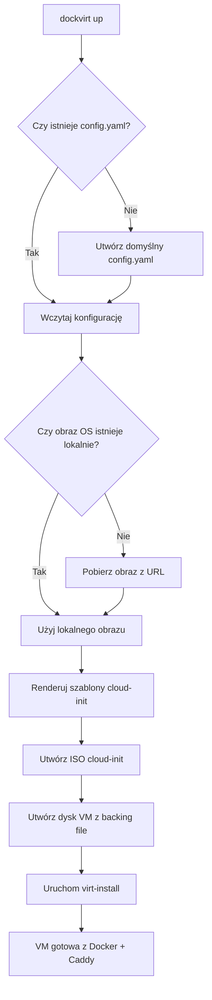

# dockvirt

[](https://badge.fury.io/py/dockvirt)
[](https://opensource.org/licenses/Apache-2.0)

**Twórz lekkie, izolowane środowiska deweloperskie za pomocą jednego polecenia.**

`dockvirt` to narzędzie CLI, które automatyzuje proces tworzenia maszyn wirtualnych (VM) z wykorzystaniem libvirt/KVM. Umożliwia błyskawiczne uruchamianie aplikacji w kontenerach Docker, z prekonfigurowanym reverse proxy (Caddy), w pełni izolowanym od Twojego systemu operacyjnego.

---

## 🤔 Dlaczego dockvirt?

Pomysł na `dockvirt` narodził się z codziennych problemów deweloperów pracujących na stacjach roboczych. Główne wyzwania, które rozwiązuje:

### 🚫 Problem: Konflikty portów na workstation
```bash
# Typowa sytuacja dewelopera
docker run -p 3000:3000 frontend-app    # Port 3000 zajęty
docker run -p 8080:8080 backend-app     # Port 8080 zajęty  
docker run -p 5432:5432 postgres        # Port 5432 zajęty
# Lokalne usługi na systemie też używają portów!
```

### ✅ Rozwiązanie: Pełna izolacja w VM
```bash
# Z dockvirt każda aplikacja ma własną VM
dockvirt up --name frontend --domain frontend.local --image frontend-app:latest --port 3000
dockvirt up --name backend --domain backend.local --image backend-app:latest --port 8080  
dockvirt up --name db --domain db.local --image postgres:latest --port 5432
# Każda VM ma własną przestrzeń portów - zero konfliktów!
```

### 🎯 Kluczowe zalety rozwiązania:

*   **Eliminuje konflikty portów**: Każda aplikacja działa w oddzielnej VM z własną przestrzenią sieciową
*   **Izoluje środowiska**: Różne wersje Node.js, Python, baz danych - bez konfliktów zależności
*   **Chroni system hosta**: Eksperymenty w VM nie wpływają na stabilność workstation
*   **Upraszcza networking**: Precyzyjne domeny zamiast zapamiętywania portów
*   **Umożliwia łatwe przełączanie**: Szybkie `up`/`down` różnych projektów
*   **Jest lekkie i szybkie**: Cloud-init + automatyczne obrazy = szybki start
*   **Daje pełną kontrolę**: Oparcie na libvirt = zaawansowane możliwości konfiguracji

## 🆚 Porównanie z innymi narzędziami

| Narzędzie         | Główne zalety                                       | Główne wady                                             |
| ----------------- | --------------------------------------------------- | ------------------------------------------------------- |
| **dockvirt**      | Pełna izolacja (VM), prostota, automatyzacja        | Wymaga KVM (tylko Linux)                                |
| **Docker Compose**| Szybkość, prostota, duża popularność                | Brak pełnej izolacji od systemu hosta                   |
| **Vagrant**       | Wsparcie dla wielu providerów, elastyczność         | Wolniejszy start, bardziej złożona konfiguracja         |
| **Multipass**     | Bardzo prosty w użyciu, dobra integracja z Ubuntu   | Ograniczona kontrola, silne powiązanie z Canonical      |

## 🚀 Główne funkcje

*   **Automatyzacja od A do Z**: Tworzenie, konfigurowanie i usuwanie VM za pomocą prostych poleceń.
*   **Uniwersalność**: Działa na popularnych dystrybucjach Linuksa (Ubuntu, Fedora i inne).
*   **Elastyczność**: Pełna kontrola nad konfiguracją VM (RAM, CPU, dysk).
*   **Prekonfigurowane środowisko**: Automatyczna instalacja Dockera i Caddy wewnątrz VM.
*   **Izolacja**: Każde środowisko działa w oddzielnej maszynie wirtualnej.

## 🔧 Wymagania

*   System operacyjny Linux z obsługą KVM.
*   Zainstalowane pakiety: `qemu-kvm`, `libvirt-daemon-system`, `virt-manager`, `cloud-image-utils`.
*   Obraz chmurowy (`.qcow2`) dla wybranej dystrybucji (np. Ubuntu 22.04, Fedora Cloud Base).

## 📦 Instalacja

### 🐧 Linux (natywnie)

1.  **Zainstaluj z PyPI** (rekomendowane):
    ```bash
    pip install dockvirt
    ```

2.  **Lub zainstaluj z repozytorium** (dla deweloperów):
    ```bash
    git clone https://github.com/dynapsys/dockvirt.git
    cd dockvirt
    make install
    ```

### 🪟 Windows (WSL2)

`dockvirt` doskonale działa na WSL2, rozwiązując problemy z konfliktami portów między Windows a aplikacjami deweloperskimi:

1.  **Zainstaluj WSL2 z Ubuntu**:
    ```powershell
    # W PowerShell jako Administrator
    wsl --install -d Ubuntu-22.04
    ```

2.  **W WSL2, zainstaluj zależności**:
    ```bash
    # Aktualizuj system
    sudo apt update && sudo apt upgrade -y
    
    # Zainstaluj KVM/QEMU i libvirt
    sudo apt install -y qemu-kvm libvirt-daemon-system libvirt-clients bridge-utils
    sudo apt install -y cloud-image-utils  # dla cloud-localds
    
    # Dodaj użytkownika do grup
    sudo usermod -a -G libvirt,kvm $USER
    newgrp libvirt
    
    # Zainstaluj dockvirt
    pip install dockvirt
    ```

3.  **Uruchom libvirt**:
    ```bash
    sudo systemctl enable --now libvirtd
    sudo systemctl start libvirtd
    ```

### 🐳 Wymagania systemowe

**Linux/WSL2:**
- KVM/QEMU (virtualization support)
- libvirt-daemon-system
- cloud-image-utils (`cloud-localds`)
- Docker (dla budowania obrazów aplikacji)

**Sprawdzenie wsparcia wirtualizacji:**
```bash
# Sprawdź czy KVM jest dostępne
lsmod | grep kvm
egrep -c '(vmx|svm)' /proc/cpuinfo  # Powinno być > 0
```

## 🏗️ Jak to działa?

### Przepływ procesu tworzenia VM



### Architektura systemu

```
┌─────────────────────────────────────────────────────────────────┐
│                          HOST SYSTEM                           │
├─────────────────────────────────────────────────────────────────┤
│  dockvirt CLI                                                   │
│  ├── config.py         (zarządzanie konfiguracją)              │
│  ├── image_manager.py  (pobieranie obrazów OS)                 │
│  ├── vm_manager.py     (tworzenie/usuwanie VM)                 │
│  └── cli.py           (interfejs użytkownika)                  │
├─────────────────────────────────────────────────────────────────┤
│  ~/.dockvirt/                                                   │
│  ├── config.yaml      (konfiguracja domyślna)                  │
│  ├── images/          (cache obrazów OS)                       │
│  └── vm_name/         (pliki cloud-init dla każdej VM)         │
├─────────────────────────────────────────────────────────────────┤
│  libvirt/KVM                                                    │
│  ├── virt-install     (tworzenie VM)                           │
│  ├── virsh            (zarządzanie VM)                         │
│  └── qemu-kvm         (wirtualizacja)                          │
└─────────────────────────────────────────────────────────────────┘
                               │
                               ▼
┌─────────────────────────────────────────────────────────────────┐
│                        VIRTUAL MACHINE                         │
├─────────────────────────────────────────────────────────────────┤
│  Ubuntu/Fedora OS + cloud-init                                 │
│  ├── Docker Engine    (automatycznie zainstalowany)           │
│  └── docker-compose   (uruchamia kontenery)                   │
│      ├── Caddy        (reverse proxy na porcie 80/443)        │
│      └── App Container (Twoja aplikacja)                      │
└─────────────────────────────────────────────────────────────────┘
```

## ⚙️ Konfiguracja

`dockvirt` automatycznie tworzy plik konfiguracyjny `~/.dockvirt/config.yaml` przy pierwszym uruchomieniu:

```yaml
default_os: ubuntu22.04
images:
  ubuntu22.04:
    url: https://cloud-images.ubuntu.com/jammy/current/jammy-server-cloudimg-amd64.img
    variant: ubuntu22.04
  fedora36:
    url: https://download.fedoraproject.org/pub/fedora/linux/releases/36/Cloud/x86_64/images/Fedora-Cloud-Base-36-1.5.x86_64.qcow2
    variant: fedora-cloud-base-36
```

## 🖥️ Użycie

### 🚀 Szybkie uruchomienie z plikiem .dockvirt

Najprostszy sposób to utworzenie pliku `.dockvirt` w katalogu projektu (jak `.env`):

```bash
# Utwórz plik .dockvirt
cat > .dockvirt << EOF
name=my-app
domain=my-app.local
image=nginx:latest
port=80
os=ubuntu22.04
EOF

# Teraz wystarczy:
dockvirt up
```

### 🔧 Lub używaj parametrów CLI

```bash
# Użyj domyślnego OS (ubuntu22.04)
dockvirt up \
  --name my-app \
  --domain my-app.local \
  --image nginx:latest \
  --port 80

# Lub wybierz konkretny OS
dockvirt up \
  --name fedora-app \
  --domain fedora-app.local \
  --image httpd:latest \
  --port 80 \
  --os fedora36
```

### 🌐 Dostęp do aplikacji

Po utworzeniu VM, `dockvirt` wyświetli jej adres IP. Dodaj go do pliku `/etc/hosts`:

```
<adres_ip> my-app.local
```

Plik `.dockvirt` ma priorytet nad parametrami domyślnymi, ale parametry CLI zastępują wszystko.

## 📚 Przykłady użycia

Przygotowaliśmy kilka praktycznych przykładów, które pokażą Ci możliwości nowego, uproszczonego API:

*   **[Przykład 1: Statyczna strona na Nginx](./examples/1-static-nginx-website)** - Podstawowe użycie z automatycznym pobieraniem obrazów
*   **[Przykład 2: Aplikacja webowa w Pythonie (Flask)](./examples/2-python-flask-app)** - Aplikacja z porównaniem Ubuntu vs Fedora
*   **[Przykład 3: Porównanie systemów operacyjnych](./examples/3-multi-os-comparison)** - Konfiguracja własnych obrazów i testowanie wydajności

Każdy przykład teraz korzysta z nowego, uproszczonego API - nie musisz już podawać ścieżek do obrazów ani wariantów OS!

## 🚨 Troubleshooting

### ❌ "cloud-localds: command not found"
```bash
# Zainstaluj brakujący pakiet
sudo apt install cloud-image-utils

# Lub na systemach RPM
sudo dnf install cloud-utils
```

### ❌ "Permission denied" przy dostępie do libvirt
```bash
# Dodaj użytkownika do grupy libvirt
sudo usermod -a -G libvirt $USER
newgrp libvirt

# Uruchom ponownie usługę
sudo systemctl restart libvirtd
```

### ❌ KVM nie jest dostępny
```bash
# Sprawdź czy wirtualizacja jest włączona w BIOS
egrep -c '(vmx|svm)' /proc/cpuinfo

# Na WSL2, upewnij się że Hyper-V jest włączony
# W PowerShell jako Administrator:
# Enable-WindowsOptionalFeature -Online -FeatureName Microsoft-Hyper-V -All
```

### ❌ Port conflicts na Windows + WSL2
```bash
# Sprawdź jakie porty używa Windows
netstat -an | findstr LISTENING

# W WSL2 wszystkie VM mają izolowane porty
dockvirt up --name app1 --domain app1.local --image nginx --port 80
dockvirt up --name app2 --domain app2.local --image apache --port 80
# Oba działają bez konfliktów!
```

## 🛠️ Development

Repozytorium zawiera `Makefile`, który ułatwia proces deweloperski. Zobacz plik [CONTRIBUTING.md](./CONTRIBUTING.md), aby dowiedzieć się, jak wnieść wkład w rozwój projektu.

## ✍️ Autor

**Tom Sapletta** - Doświadczony programista i entuzjasta otwartego oprogramowania. Pasjonat automatyzacji i tworzenia narzędzi ułatwiających pracę deweloperom.

## 📜 Licencja

Projekt jest udostępniany na licencji **Apache 2.0**. Szczegóły znajdują się w pliku [LICENSE](LICENSE).
