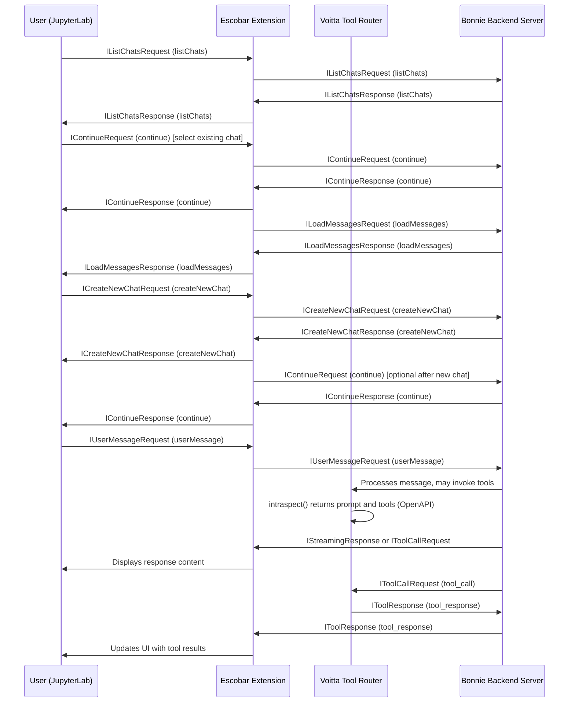

# Escobar

Escobar was a bad guy.

AI Chat Extension for JupyterLab with comprehensive chat management and WebSocket proxy functionality. It is intended to talk to Bonnie server, located locally at `../bonnie` and on GitHub at https://github.com/voitta-ai/bonnie.

The request and response objects are defined in `src/types/protocol.ts`.

The corresponding objects for Bonnie are defined in `../bonnie/lib/protocol_messages.py` (relative to this project).

## Overall ecosystem

When running locally, for more ecosystem details see ../README.md. On GitHub see https://github.com/voitta-ai/voitta-ws/blob/master/README.md.

## Installation

For development installation:

```bash
jupyter labextension develop --overwrite . && pip uninstall escobar -y && pip install -e . && jupyter server extension enable escobar
```

## Features

**Configuration:**

Set the target WebSocket server in your `.env` file:

```
WEBSOCKET_PROXY_TARGET=ws://your-target-server/ws
```

**Usage:**

- Connect to: `ws://localhost:8888/ws` (your JupyterLab server)
- Traffic is automatically proxied to your configured target server
- Supports both `ws://` and `wss://` protocols
- Forwards authentication headers (Authorization, Cookie)

## Protocol and Message Exchange

Escobar communicates with the Bonnie backend server using a well-defined protocol based on JSON messages exchanged over WebSocket. The protocol message interfaces are defined in `src/types/protocol.ts` and correspond to Python classes in Bonnie's `lib/protocol_messages.py`.

### Message Structure

Each message is either a **request** or a **response**, identified by the `message_type` field. Messages include a unique `call_id` for correlating requests and responses. Requests include context identifiers such as `username` and `chatID` to maintain session state.

Key message classes include:

- `IListChatsRequest` / `IListChatsResponse`: List available chats for a user.
- `ILoadMessagesRequest` / `ILoadMessagesResponse`: Load messages from a chat.
- `ICreateNewChatRequest` / `ICreateNewChatResponse`: Create a new chat session.
- `IContinueRequest` / `IContinueResponse`: Continue an existing chat session.
- `IUserMessageRequest`: Send a user message to the backend.
- `IUserStopRequest`: Request to stop the current LLM generation.
- `ISaveSettingsRequest` / `ISaveSettingsResponse`: Save user settings.
- `IRetrieveSettingsRequest` / `IRetrieveSettingsResponse`: Retrieve user settings.
- `IStreamingResponse`: Streaming response for LLM content.
- `IToolCallRequest` / `IToolResponse`: Tool call requests and responses for backend tool integrations.

### Message Flow

The frontend sends requests to Bonnie, which processes them and sends back responses asynchronously. Streaming responses allow partial LLM outputs to be sent incrementally. Tool call messages enable the backend to request external tool executions.

There are two main chat session flows:

1. **Starting a New Chat:**

   - The user sends an `ICreateNewChatRequest` to create a new chat session.
   - Bonnie responds with `ICreateNewChatResponse` containing the new `chatID`.
   - The frontend may optionally send an `IContinueRequest` to initialize or synchronize session state, but this is not strictly required immediately after creating a new chat.

2. **Continuing an Existing Chat:**
   - The user selects an existing chat from the list.
   - The frontend sends an `IContinueRequest` with the existing `chatID`.
   - Bonnie responds with `IContinueResponse` to confirm session continuation.
   - The frontend then sends `ILoadMessagesRequest` to load chat history.
   - Bonnie responds with `ILoadMessagesResponse` containing past messages.

### Introspection and Voitta Router

Escobar integrates with the **Voitta Tool Router**, implemented in `src/voitta/voittaServer.ts`. The router manages the AI prompt and available tools, exposing an introspection interface.

- **Introspection**: The router provides a method `intraspect()` that returns the current prompt and tools in OpenAPI schema format. This allows clients to dynamically discover available tools and their interfaces.
- **Voitta Router**: Converts internal tool definitions into OpenAPI specifications compatible with FastAPI, enabling structured API interaction and dynamic tool invocation.

### Sequence Diagram

The following sequence diagram illustrates the message exchange between the JupyterLab extension (Escobar), the Voitta router, and the Bonnie backend server, including introspection and tool call flows, with clear separation of new chat creation and existing chat continuation flows.



### Note on `IContinueRequest` after new chat

The `IContinueRequest` sent after a new chat creation is optional and may be used to initialize or synchronize session state. It is not strictly required immediately after creating a new chat, but can help ensure the frontend and backend are fully synchronized before further interactions.

This diagram centralizes the protocol and introspection explanation for the entire system. Bonnie's README.md will reference this diagram for protocol details.
