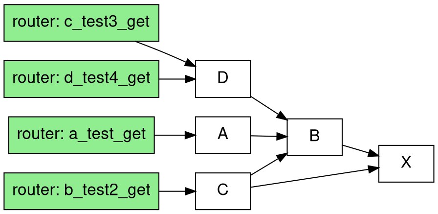

# fastapi-router-viz

Visualize FastAPI application's routing tree and dependencies

> This repo is still in early stage.

## Installation

```bash
pip install fastapi-router-viz
# or
uv add fastapi-router-viz
```

## Command Line Usage

Once installed, you can use the `router-viz` command to generate visualization graphs from your FastAPI applications:

```bash
# Basic usage - assumes your FastAPI app is named 'app' in app.py
router-viz app.py

# Specify custom app variable name
router-viz main.py --app my_app

# Custom output file
router-viz app.py -o my_visualization.dot

# Show help
router-viz --help

# Show version
router-viz --version
```

The tool will generate a DOT file that you can render using Graphviz:

```bash
# Install graphviz
brew install graphviz  # macOS
apt-get install graphviz  # Ubuntu/Debian

# Render the graph
dot -Tpng router_viz.dot -o router_viz.png

# Or view online at: https://dreampuf.github.io/GraphvizOnline/
```

## Programmatic Usage

```python
from fastapi_router_viz.graph import Analytics
from pydantic import BaseModel
from fastapi import FastAPI
from typing import Optional


def test_analysis():

    class X(BaseModel):
        id: int

    class B(BaseModel):
        id: int
        value: str
        x: X

    class A(BaseModel):
        id: int
        name: str
        b: B

    class C(BaseModel):
        id: int
        name: str
        b: B
        x: X

    class D(BaseModel):
        id: int
        name: str
        b: B

    app = FastAPI()

    @app.get("/test", response_model=Optional[A])
    def a():
        return None

    @app.get("/test2", response_model=Optional[C])
    def b():
        return None

    @app.get("/test3", response_model=Optional[D])
    def c():
        return None

    @app.get("/test4", response_model=Optional[D])
    def d():
        return None

    analytics = Analytics()
    analytics.analysis(app)
    print(analytics.generate_dot())


if __name__ == "__main__":
    test_analysis()
```

generate the dot description



then you'll see the internal dependencies


