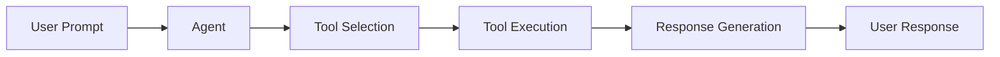
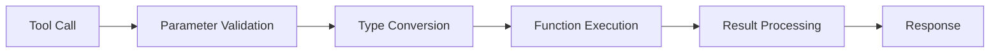

# Architecture Overview

This document provides a high-level overview of the Gemini Agent Framework's architecture and design principles.

## Core Components

### 1. Agent Class

The central component of the framework, responsible for:
- Managing tool registration and execution
- Handling API communication with Gemini
- Managing agent state and variables
- Processing prompts and responses

```python
class Agent:
    def __init__(self, api_key: str, tools: List[Callable] = None, model_name: str = "gemini-1.5-flash"):
        # Initialize agent with API key and tools
        pass

    def prompt(self, user_prompt: str, ...) -> Any:
        # Process user prompt and return response
        pass
```

### 2. Tool System

The tool system allows users to define custom functions that the agent can use:

```python
@Agent.description("Tool description")
@Agent.parameters({
    'param': {'type': type, 'description': 'Parameter description'}
})
def tool_function(param: type) -> return_type:
    # Tool implementation
    pass
```

#### Tool Registration

Tools are registered using decorators that:
1. Store tool metadata
2. Validate tool parameters
3. Map Python types to Gemini types
4. Handle tool execution

### 3. Variable Management

The framework includes a robust variable management system:

```python
def set_variable(self, name: str, value: Any, description: str = "", type_hint: type = None) -> str:
    # Store variable with metadata
    pass

def get_variable(self, name: str) -> Any:
    # Retrieve stored variable
    pass
```

#### Variable Storage

Variables are stored with:
- Value
- Description
- Type information
- Creation timestamp
- Metadata

## Data Flow

### 1. Prompt Processing



### 2. Tool Execution



## Type System

### 1. Python to Gemini Type Mapping

| Python Type | Gemini Type | Description |
|-------------|-------------|-------------|
| str         | STRING      | Text data   |
| int         | INTEGER     | Whole numbers |
| float       | NUMBER      | Decimal numbers |
| bool        | BOOLEAN     | True/False values |
| list        | ARRAY       | Ordered collections |
| dict        | OBJECT      | Key-value pairs |

### 2. Type Validation

The framework includes:
- Runtime type checking
- Automatic type conversion
- Error handling for type mismatches

## Error Handling

### 1. Error Types

The framework handles:
- API errors
- Tool execution errors
- Type conversion errors
- Variable management errors

### 2. Error Recovery

Features include:
- Graceful error handling
- Error reporting
- Recovery mechanisms
- User feedback

## Security

### 1. API Key Management

- Secure storage
- Environment variable support
- No hardcoding

### 2. Input Validation

- Parameter validation
- Type checking
- Sanitization

## Performance

### 1. Caching

- Tool result caching
- Variable caching
- Response caching

### 2. Optimization

- Batch processing
- Parallel execution
- Resource management

## Extensibility

### 1. Custom Tools

Users can create custom tools by:
1. Defining functions
2. Adding decorators
3. Specifying parameters
4. Implementing logic

### 2. Custom Types

Support for:
- Custom type definitions
- Type conversion
- Validation rules

## Future Considerations

### 1. Planned Features

- Async support
- Streaming responses
- Custom model support
- Enhanced caching

### 2. Architecture Improvements

- Modular design
- Plugin system
- Enhanced error handling
- Better type system

## Contributing

### 1. Code Structure

```
gemini_agent_framework/
├── src/
│   └── gemini_agent/
│       ├── __init__.py
│       └── agent.py
├── tests/
├── docs/
└── examples/
```

### 2. Development Guidelines

- Follow PEP 8
- Write tests
- Update documentation
- Use type hints 