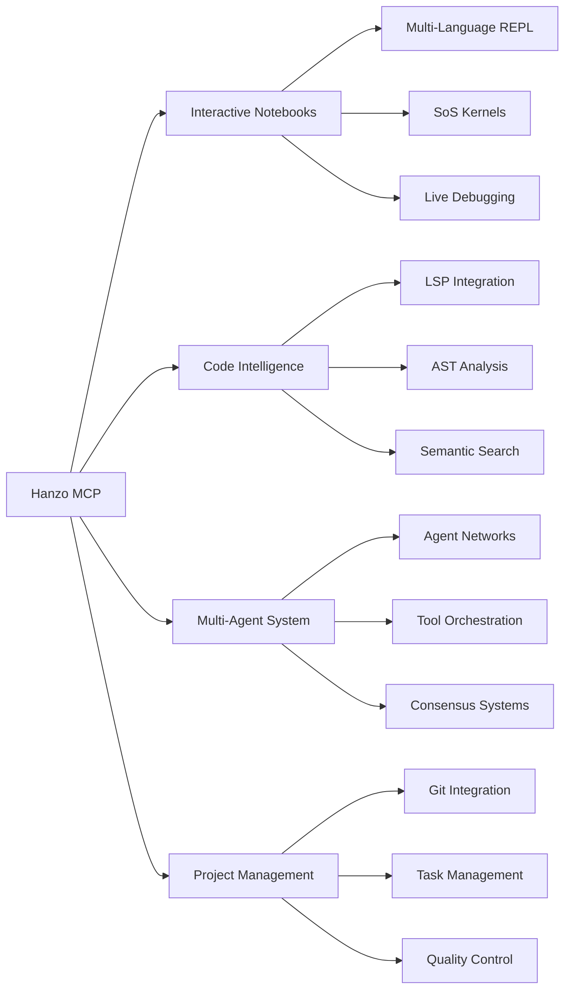

# Hanzo AI - The Zen of Model Context Protocol

[](https://mcp.hanzo.ai)
[](https://pypi.org/project/hanzo-mcp/)
[](https://github.com/hanzoai/mcp/releases/latest/download/hanzo-mcp.dxt)
[](https://github.com/hanzoai/mcp/blob/main/LICENSE)
[](https://discord.gg/hanzoai)

## 🥷 The Complete AI Development Ecosystem via MCP

**One unified interface to orchestrate your entire development workflow.**

Hanzo AI is more than an MCP server—it's a comprehensive ecosystem of interconnected development tools designed for the AI era. From interactive notebooks with multi-language support to advanced debugging, from intelligent code search to multi-agent workflows, everything works together seamlessly through the Model Context Protocol.

```bash
# Install and rule your development world
uvx hanzo-mcp

# Or use our one-click Desktop Extension
# Download from releases and double-click to install
```

> **Note on Installation**: If uvx is not installed, Hanzo will automatically install it for you in your home directory. No manual setup required!

## 🌐 The Hanzo Ecosystem

### Integrated Development Environment


### 🎯 Why Hanzo AI?

**The Problem with Fragmented Tools**
- Install 10 different tools that don't talk to each other
- Context switching between interfaces kills productivity
- No unified way to orchestrate complex workflows
- Missing the power of tool composition

**The Hanzo Solution**
- **Unified Ecosystem**: 70+ tools that work together seamlessly
- **Intelligent Orchestration**: Tools that understand context and collaborate
- **Interactive Development**: From REPL to debugging in one interface
- **Quality Built-in**: Automated review, testing, and best practices
- **Extensible Platform**: Add any MCP server or custom tool

## 🚀 Core Capabilities

### 📓 Interactive Development Environment

#### Multi-Language Notebooks with SoS
```python
# Work with multiple languages in one notebook
notebook(
    action="create",
    path="analysis.ipynb",
    kernels=["python3", "R", "javascript", "bash"]
)

# Write and execute code interactively
notebook(
    action="write",
    cell_type="code",
    content="""
    # Python cell
    data = load_dataset()
    processed = clean_data(data)
    """,
    kernel="python3"
)

# Step through execution line by line
notebook(
    action="step",
    cell_id="cell_123",
    lines=[1, 2, 3]  # Execute specific lines
)

# Read results and outputs
result = notebook(
    action="read",
    cell_id="cell_123",
    include_outputs=True
)

# Launch debugger for interactive debugging
debugger(
    notebook="analysis.ipynb",
    cell_id="cell_123",
    breakpoint=15
)
```

#### Interactive REPL Sessions
```python
# Start multi-language REPL
repl(
    languages=["python", "javascript", "go"],
    project_dir="/path/to/project",
    share_context=True  # Share variables between languages
)

# Execute code with full project context
repl.execute("""
import project_module
result = project_module.process()
""", language="python")
```

### 🧠 Advanced AI Tools

#### Multi-Agent Workflows
```python
# Delegate complex tasks to specialized agents
agent(
    prompts=["Find all API endpoints", "Document each endpoint", "Generate OpenAPI spec"],
    parallel=True  # Run agents concurrently
)

# Get consensus from multiple LLMs
consensus(
    prompt="Review this architecture decision",
    providers=["openai", "anthropic", "google"],
    threshold=0.8  # Require 80% agreement
)
```

#### Built-in Code Critic
```python
# Force high-quality standards with the critic tool
critic(
    analysis="Review authentication implementation for security issues"
)
# The critic will:
# - Find potential bugs and edge cases
# - Ensure proper error handling
# - Verify test coverage
# - Check security implications
# - Suggest improvements
# - Enforce best practices
```

### 📝 Project Intelligence

#### Automatic Rules Discovery
```python
# Reads your project preferences automatically
rules()  # Finds .cursorrules, .claude/code.md, etc.
# Understands your:
# - Coding standards
# - Project conventions  
# - AI assistant preferences
# - Team guidelines
```

#### Unified Todo Management
```python
# Single tool for all task management
todo("Add authentication to API")
todo --action update --id abc123 --status in_progress
todo --action list --filter pending
```

### 🔍 Intelligent Code Intelligence

#### Unified Search Engine
```python
# One search to rule them all - automatically runs in parallel:
# - Text search with ripgrep
# - AST analysis for code structure
# - Vector search for semantic meaning
# - Git history search (integrated into git tool)
# - Symbol search with LSP
# - Memory search for past discussions
search("authentication flow")
```

#### Language Server Protocol (LSP) Integration
```python
# Full LSP support with jupyter-lsp integration
lsp(
    action="initialize",
    language="python",
    project_dir="/path/to/project"
)

# Go to definition, find references, rename symbols
lsp.goto_definition("UserService.authenticate")
lsp.find_references("API_KEY")
lsp.rename_symbol("oldFunction", "newFunction")

# Get diagnostics and hover information
diagnostics = lsp.get_diagnostics("main.py")
info = lsp.hover("mysterious_function", line=42, col=15)
```

#### Git Integration (with built-in search)
```python
# All git operations in one tool
git("status")
git("diff", "--cached")
git("log", "--oneline", "-10")

# Git search is now part of the git tool
git("search", pattern="TODO", history=True)
git("blame", file="src/auth.py", line=42)
git("show", commit="abc123:src/main.py")
```

### 🎨 Palette System - Opinions Are Just Configurations
```python
# Don't like our defaults? Switch instantly
palette --action activate python      # Python development focused
palette --action activate javascript  # Node.js/React optimized
palette --action activate devops     # Infrastructure tools
palette --action activate academic   # Research & documentation

# Create your own workflow
palette_create(
    name="my-workflow",
    tools=["read", "write", "edit", "search", "critic", "agent"],
    env_vars={"EDITOR": "nvim", "SEARCH": "ripgrep"}
)
```

### 🔌 MCP Server Orchestration
```python
# Add any MCP server dynamically
mcp --action add --url "github.com/someone/their-mcp" --alias "their"

# Use their tools seamlessly
their_tool(action="whatever", params=...)

# Remove when done
mcp --action remove --alias "their"
```

## 🛠️ Comprehensive Tool Ecosystem

### 📝 Interactive Development
- **notebook** - Multi-language notebooks with SoS (read/write/step/debug)
- **repl** - Interactive multi-language REPL with shared context
- **debugger** - Full debugging support with breakpoints and stepping
- **lsp** - Language Server Protocol with jupyter-lsp integration

### 🔍 Code Intelligence
- **search** - Unified multi-modal search (text/AST/vector/git/memory)
- **symbols** - AST-aware navigation with tree-sitter
- **find** - Fast file/directory discovery
- **grep** - Pattern matching with ripgrep
- **ast** - Code structure analysis

### 📁 File Operations
- **read/write/edit/multi_edit** - Intelligent file operations
- **tree** - Visual directory structures
- **watch** - File monitoring with notifications
- **diff** - Visual comparisons

### 🤖 AI & Automation
- **agent** - Multi-agent task delegation
- **consensus** - Multi-LLM agreement and validation
- **think** - Structured reasoning workspace
- **critic** - Automated code review and quality
- **batch** - Parallel tool execution

### 🖥️ System & Process
- **bash** - Command execution with session management
- **npx/uvx** - Package runners with auto-install
- **process** - Background process management
- **git** - Complete git integration with search

### 📊 Data & Analytics
- **vector** - Semantic search and indexing
- **sql** - Database operations and queries
- **graph** - Graph database operations
- **stats** - Performance and usage analytics

### 🎯 Project Management
- **todo** - Unified task management
- **rules** - Project preferences discovery
- **palette** - Tool configuration presets
- **mcp** - Dynamic MCP server orchestration

## 🚀 Quick Start

### Installation Methods

#### 1. Via pip/uv (Recommended)
```bash
# Installs globally
uvx hanzo-mcp

# Don't have uv? No problem - we'll install it for you!
curl -LsSf https://pypi.org/simple/hanzo-mcp | python3
```

#### 2. Desktop Extension (One-Click)
1. Download `hanzo-mcp.dxt` from [latest release](https://github.com/hanzoai/mcp/releases/latest)
2. Double-click to install in Claude Desktop
3. Restart Claude Desktop

#### 3. Manual Configuration
```json
// Add to Claude Desktop config
{
  "mcpServers": {
    "hanzo": {
      "command": "uvx",
      "args": ["hanzo-mcp"],
      "env": {
        "HANZO_ALLOWED_PATHS": "/Users/you/projects"
      }
    }
  }
}
```

## 🔗 Ecosystem Integration

### Everything Works Together
```python
# Example: AI-assisted debugging workflow
# 1. Find the bug
search("null pointer exception")

# 2. Open in notebook for investigation
notebook(
    action="create",
    path="debug_session.ipynb",
    import_code="src/auth.py:42-58"
)

# 3. Set breakpoints and debug
debugger(
    notebook="debug_session.ipynb",
    breakpoints=[45, 52]
)

# 4. Get AI analysis
critic("Analyze this exception and suggest fixes")

# 5. Apply the fix
edit("src/auth.py", old="user.name", new="user?.name")

# 6. Verify with tests
bash("pytest tests/test_auth.py -v")
```

### Tool Composition Power
- **Search → Notebook → Debug** - Investigate issues interactively
- **Agent → Critic → Test** - Automated quality workflows
- **LSP → AST → Edit** - Intelligent refactoring
- **Git → Search → Todo** - Project management workflows

## 🏆 Why Developers Love Hanzo

### Smart Defaults
- **Auto-installs** missing dependencies and language servers
- **Discovers** project rules and preferences automatically
- **Parallel** operations by default for speed
- **Intelligent** fallbacks when tools aren't available

### Quality First
- **Built-in critic** for automated code review
- **Test enforcement** in all workflows
- **Security scanning** in operations
- **Best practices** enforced by default

### Truly Extensible
- **Palette system** for instant context switching
- **MCP orchestration** to add any server dynamically
- **Plugin architecture** for custom tools
- **Everything is an API** for maximum flexibility

## 📊 Performance

- **65-70 tools** available instantly
- **Parallel execution** reduces wait times by 80%
- **Smart caching** for repeated operations
- **Minimal dependencies** for fast startup

## 🤝 Contributing

We welcome contributions! The codebase is designed for extensibility:

1. **Add a Tool**: Drop a file in `hanzo_mcp/tools/`
2. **Create a Palette**: Define tool collections
3. **Share Workflows**: Contribute your configurations

See [CONTRIBUTING.md](CONTRIBUTING.md) for guidelines.

## 📚 Documentation

- **[Installation Guide](https://mcp.hanzo.ai/install)** - All installation methods
- **[Tool Reference](https://mcp.hanzo.ai/tools)** - Complete tool documentation
- **[Palette System](https://mcp.hanzo.ai/palettes)** - Customize your workflow
- **[MCP Orchestration](https://mcp.hanzo.ai/orchestration)** - Extend with any MCP
- **[Best Practices](https://mcp.hanzo.ai/best-practices)** - Pro tips

## 🌟 Testimonials

> "The critic tool alone is worth it. My code quality improved overnight." - *Sr. Engineer at Fortune 500*

> "Finally, search that actually works. It knows what I mean, not just what I type." - *AI Researcher*

> "I threw away 15 different tools and just use Hanzo now. The palette system means I can switch from Python to DevOps to writing in seconds." - *Tech Lead*

## 📈 Project Status

- **Version**: 0.7.x (Production Ready)
- **Tools**: 70+ interconnected tools
- **Ecosystems**: Interactive notebooks, debugging, LSP, multi-agent
- **Languages**: Python, JavaScript, Go, R, Julia, Bash, and more via SoS
- **Community**: Active and growing
- **Updates**: Continuous improvements

## 🛡️ Security

- **Sandboxed execution** for all operations
- **Permission system** for file access
- **Audit trails** for compliance
- **No telemetry** without consent

## 🎯 The Zen of Hanzo

1. **One Tool, One Purpose** - Each tool masters one thing
2. **Quality Over Quantity** - Better to do it right
3. **Parallel When Possible** - Time is precious
4. **Smart Defaults** - It should just work
5. **Extensible Always** - Your workflow, your way

---

*Built with ❤️ by developers, for developers. Because life's too short for bad tools.*

**[Get Started Now →](https://mcp.hanzo.ai)**
