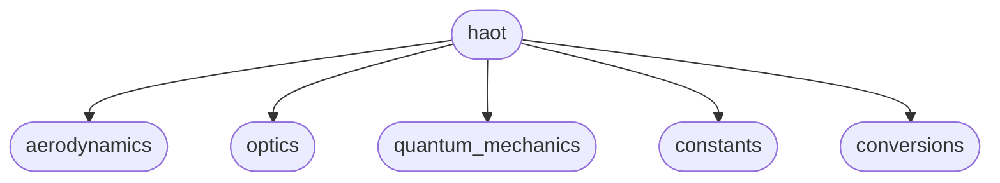

# HAOT
**Hypersonic Aerodynamics Optics Tools**

The modules are structured in the following manner:

```mermaid
graph TD
  id1([haot]) --> id2([aerodynamics]);
  id1([haot]) --> id3([optics]);
  id1([haot]) --> id4([quantum_mechanics]);
  id1([haot]) --> id5([constants]);
  id1([haot]) --> id6([conversions]);
```

Documentation can be found:
https://haot.readthedocs.io
