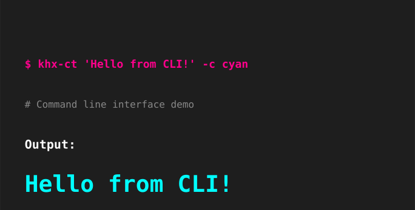

# Examples

Here are comprehensive examples showcasing all the features of khx_color_text.

## Comprehensive Usage Examples


## Real-World Use Cases


## Integration Examples


## Error Handling


## Style Combinations


First, install the package from PyPI:
```bash
pip install khx_color_text
```

## Basic Colors

### Message Types

**Success Messages:**


**Error Messages:**


**Warning Messages:**


**Info Messages:**


### Predefined Colors
```python
from khx_color_text import cprint

# Basic colors
cprint("Red text", "red")
cprint("Green text", "green")
cprint("Blue text", "blue")
cprint("Yellow text", "yellow")
cprint("Cyan text", "cyan")
cprint("Magenta text", "magenta")

# Bright colors
cprint("Bright red", "bright_red")
cprint("Bright green", "bright_green")
cprint("Bright blue", "bright_blue")

# Color aliases
cprint("Orange text", "orange")
cprint("Purple text", "purple")
cprint("Pink text", "pink")
cprint("Gray text", "gray")
```

**Bright Colors Example:**


## Custom Colors

### Hex Colors


```python
# Full hex format
cprint("Custom red", "#FF0000")
cprint("Custom green", "#00FF00")
cprint("Custom blue", "#0000FF")
cprint("Orange", "#FF6B35")
cprint("Purple", "#8A2BE2")

# Short hex format
cprint("Short red", "#f00")
cprint("Short green", "#0f0")
cprint("Short blue", "#00f")
```


### RGB Colors
```python
# RGB tuples
cprint("RGB Red", (255, 0, 0))
cprint("RGB Green", (0, 255, 0))
cprint("RGB Blue", (0, 0, 255))
cprint("Custom RGB", (255, 107, 53))
cprint("Dark gray", (64, 64, 64))
```


## Text Styling

### Single Styles
```python
cprint("Bold text", "red", style="bold")
cprint("Italic text", "green", style="italic")
cprint("Underlined text", "blue", style="underline")
cprint("Strikethrough text", "yellow", style="strikethrough")
cprint("Dim text", "cyan", style="dim")
cprint("Bright text", "magenta", style="bright")
```

### Multiple Styles
```python
cprint("Bold and underlined", "red", style=["bold", "underline"])
cprint("Italic and bright", "green", style=["italic", "bright"])
cprint("All styles combined", "blue", style=["bold", "italic", "underline"])
```

### Using TextStyle Enum
```python
from khx_color_text import TextStyle

cprint("Using TextStyle.BOLD", "red", style=TextStyle.BOLD)
cprint("Multiple TextStyle enums", "blue", style=[TextStyle.BOLD, TextStyle.ITALIC])
```


## Background Colors

### Predefined Backgrounds
```python
cprint("White text on red background", "white", bg_color="red")
cprint("Black text on yellow background", "black", bg_color="yellow")
cprint("White text on blue background", "white", bg_color="blue")
```

### Custom Backgrounds
```python
cprint("White text on hex background", "white", bg_color="#8A2BE2")
cprint("Yellow text on RGB background", "yellow", bg_color=(50, 50, 50))
```

## Complex Combinations

```python
# Color + background + style
cprint("Bold white on red", "white", bg_color="red", style="bold")

# Hex color + hex background + style
cprint("Italic hex with hex background", "#00FF00", bg_color="#FF0000", style="italic")

# RGB + RGB background + multiple styles
cprint("RGB text, RGB bg, multiple styles", (255, 255, 0), bg_color=(128, 0, 128), style=["bold", "underline"])

# Ultimate combination
cprint("Ultimate text", "#00FF00", bg_color=(50, 50, 50), style=[TextStyle.BOLD, TextStyle.ITALIC])
```

## Command Line Usage



### Basic Usage
```bash
# Basic colors
khx-ct "Hello World!" -c red
khx-ct "Success message" -c green

# Hex colors
khx-ct "Custom color" --hex "#FF6B35"
khx-ct "Purple text" --hex "#8A2BE2"

# RGB colors
khx-ct "RGB color" --rgb "255,107,53"
khx-ct "Custom RGB" --rgb "138,43,226"
```

### With Styling
```bash
# Single style
khx-ct "Bold text" -c blue -s bold
khx-ct "Italic text" -c green -s italic

# Multiple styles
khx-ct "Bold and underlined" -c red -s bold,underline
khx-ct "Fancy text" -c purple -s bold,italic,underline
```

### With Background
```bash
# Predefined background
khx-ct "Highlighted text" -c white --bg red
khx-ct "Warning style" -c black --bg yellow

# Custom background
khx-ct "Hex background" -c white --bg-hex "#8A2BE2"
khx-ct "RGB background" -c yellow --bg-rgb "50,50,50"
```

### CLI Examples and Help
```bash
# Show built-in examples
khx-ct --examples
khx-ct --advanced-examples
khx-ct --showcase

# List all available colors
khx-ct --list-colors

# Get help
khx-ct --help
```

## Testing Examples

You can run the built-in test examples:

```bash
# Basic functionality tests
python tests/test_basic_functionality.py

# Advanced features tests
python tests/test_advanced_features.py

# Color utility tests
python tests/test_color_utilities.py
```

Or run the example modules directly:

```bash
# Basic examples
python src/khx_color_text/examples/basic_examples.py

# Advanced examples
python src/khx_color_text/examples/advanced_examples.py

# Color showcase
python src/khx_color_text/examples/color_showcase.py
```

## Error Handling

The package provides helpful error messages for invalid inputs:

```python
# Invalid predefined color
cprint("This will fail", "invalid_color")
# ValueError: Unknown color: invalid_color

# Invalid hex color
cprint("Invalid hex", "#GGGGGG")
# ValueError: Invalid hex color format: #GGGGGG

# Invalid RGB values
cprint("Invalid RGB", (256, 0, 0))
# ValueError: Invalid RGB values: (256, 0, 0). Values must be 0-255.

# Invalid style
cprint("Invalid style", "red", style="invalid_style")
# ValueError: Unknown style 'invalid_style'. Available: bold, italic, underline, strikethrough, dim, bright
```