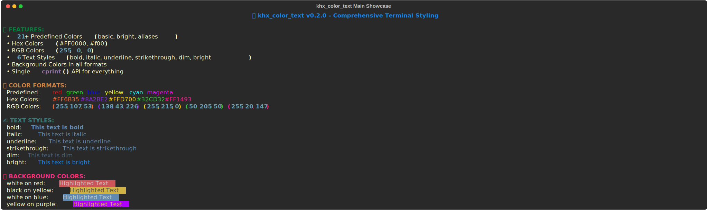
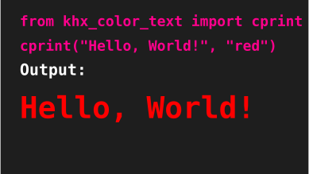
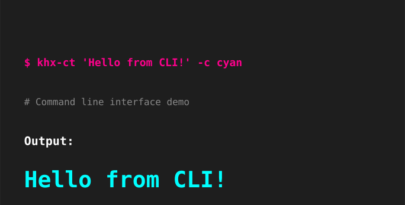

# khx_color_text

Welcome to **khx_color_text** - a comprehensive Python package for printing colored and styled text in the terminal with extensive customization options.

**🎉 Now live on PyPI!** 



## Quick Start

Install the package from PyPI:

```bash
pip install khx_color_text
```

[](https://pypi.org/project/khx-color-text/)

Use it in Python:



```python
from khx_color_text import cprint

# Basic colors
cprint("Hello World!", "red")

# Hex colors
cprint("Custom orange", "#FF6B35")

# RGB colors
cprint("Custom purple", (138, 43, 226))

# With styling
cprint("Bold red text", "red", style="bold")

# With background
cprint("Highlighted text", "white", bg_color="red")
```

Or from the command line:



```bash
khx-ct "Hello World!" -c red
khx-ct "Custom color" --hex "#FF6B35"
khx-ct "Bold text" -c blue -s bold
```

## Features

- **🎨 Multiple Color Formats**: Predefined colors, hex codes (#FF0000), and RGB tuples (255, 0, 0)
- **✨ Text Styling**: Bold, italic, underline, strikethrough, dim, and bright styles
- **🌈 Background Colors**: Support for background colors in all color formats
- **🔧 Single API**: One powerful `cprint()` function for all features
- **🖥️ Cross-platform**: Works on Windows, macOS, and Linux
- **📦 Zero Dependencies**: Uses only Python standard library and colorama
- **🎯 Type Safe**: Full type hints and mypy support
- **⚡ CLI Tool**: Feature-rich command-line interface

## Color Support

### Predefined Colors


**Basic Colors**: red, green, blue, yellow, cyan, magenta, white, black  
**Bright Colors**: bright_red, bright_green, bright_blue, bright_yellow, bright_cyan, bright_magenta, bright_white, bright_black  
**Aliases**: orange, purple, pink, gray, grey

### Custom Colors


- **Hex Format**: `#FF0000`, `#f00` (3 or 6 digit hex)
- **RGB Format**: `(255, 0, 0)` (values 0-255)

## Text Styling


Available styles: `bold`, `italic`, `underline`, `strikethrough`, `dim`, `bright`

## Next Steps

- [Installation Guide](installation.md) - Detailed installation instructions
- [Examples](examples.md) - See all features in action with visual previews
- [GitHub Repository](https://github.com/Khader-X/khx_color_text) - Source code and issues
- [PyPI Package](https://pypi.org/project/khx-color-text/) - Package details and statistics