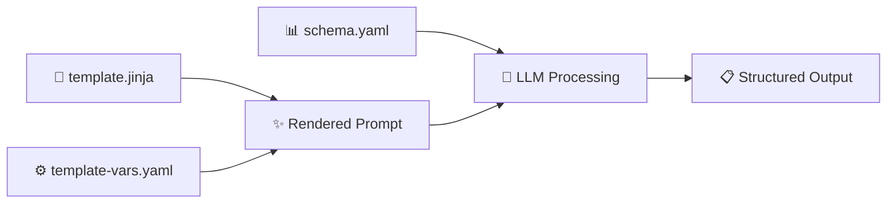

# Jinja2 Template Example with Microsoft Semantic Kernel Format

This example demonstrates using **Jinja2 templates** with Microsoft Semantic Kernel-compatible format for dynamic code review generation. Jinja2 is a modern templating language for Python that provides powerful features like loops, conditionals, and filters.

## 🌟 **Features Demonstrated**

- **✅ Jinja2 Template Support**: Uses Jinja2 syntax with `{{ variable }}` and `` blocks
- **📝 Microsoft Semantic Kernel Compatible**: Uses standard `<message role="...">` tags
- **🔧 Dynamic Content Generation**: Advanced template features like loops, conditionals, and filters
- **⚙️ YAML Configuration**: Clean, readable configuration files
- **📊 Structured Output**: Schema-enforced code review results
- **🔄 Template Rendering Process**: Dynamic content generation based on context

## 📁 **Files**

- **`template.jinja`** - Jinja2 template with Microsoft-compatible `<message>` tags
- **`template-vars.yaml`** - YAML file with template variables
- **`schema.yaml`** - YAML schema defining the expected output structure
- **`README.md`** - This comprehensive documentation

## 🔄 **How It Works**

### **1. Jinja2 Template Features**

The template demonstrates advanced Jinja2 features:

```jinja2
<message role="system">
You are an expert {{ expertise.domain }} engineer with {{ expertise.years_experience }} years of experience.
Your specialization includes {{ expertise.specializations | join(', ') }}.

Generate comprehensive code reviews that focus on:
- Code quality and maintainability
- {{ expertise.focus_areas | join(', ') }}
- Performance considerations
- Security best practices
- Testing recommendations
</message>
```

**🎯 Jinja2 Features Used:**
- `{{ variable }}` - Simple variable substitution
- `{{ list | join(', ') }}` - Filter to join arrays with commas
- `` - Loop through arrays
- `` - Conditional rendering
- `` - Loop control variables

### **2. Template Rendering Process**



### **3. Advanced Jinja2 Features**

#### **Array Processing with Filters**
```jinja2
{{ expertise.specializations | join(', ') }}
```
Converts `["Python development", "DevOps automation"]` to `"Python development, DevOps automation"`

#### **Conditional Rendering**
```jinja2

Priority Areas: {{ review_context.priority_areas | join(', ') }}

```
Only includes sections when data is available.

#### **Loop with Control Variables**
```jinja2
#{{ issue }}, 
```
Properly formats arrays with commas between items, avoiding trailing comma.

#### **Complex Object Navigation**
```jinja2

- `{{ file.path }}` ({{ file.change_type }})

```
Iterates through complex nested objects.

## 🚀 **Usage**

### **Primary Command**

```bash
llm-ci-runner \
    --template-file examples/05-templates/jinja2-example/template.jinja \
    --template-vars examples/05-templates/jinja2-example/template-vars.yaml \
    --schema-file examples/05-templates/jinja2-example/schema.yaml \
    --output-file code-review-result.yaml
```

### **Alternative with .j2 Extension**

```bash
llm-ci-runner \
    --template-file examples/05-templates/jinja2-example/template.j2 \
    --template-vars examples/05-templates/jinja2-example/template-vars.yaml \
    --schema-file examples/05-templates/jinja2-example/schema.yaml \
    --output-file code-review-result.yaml
```

## 📋 **Template Variables Structure**

The `template-vars.yaml` file provides dynamic data:

```yaml
expertise:
  domain: "Python and DevOps"
  years_experience: 8
  specializations:
    - "Python development"
    - "DevOps automation"
    - "Security best practices"
  focus_areas:
    - "Code quality and readability"
    - "Security vulnerabilities"
    - "Performance implications"

project:
  name: "api-gateway-service"
  repository: "github.com/company/api-gateway"
  files_changed:
    - path: "app/middleware/rate_limiter.py"
      change_type: "modified"
```

## 🎯 **Jinja2 vs Handlebars Comparison**

| Feature | Jinja2 | Handlebars |
|---------|--------|------------|
| **Syntax** | `{{ variable }}` | `{{ variable }}` |
| **Loops** | `` | `{{#each list}}` |
| **Conditionals** | `` | `{{#if condition}}` |
| **Filters** | `{{ list \| join(', ') }}` | `{{#each list}}{{this}}{{#unless @last}}, {{/unless}}{{/each}}` |
| **File Extensions** | `.jinja`, `.j2` | `.hbs` |
| **Advanced Features** | Filters, macros, inheritance | Helpers, partials |

## 🔧 **Jinja2 Template Features**

### **Variable Substitution**
```jinja2
{{ expertise.domain }}
{{ project.name }}
```

### **Array Processing**
```jinja2
{{ expertise.specializations | join(', ') }}
```

### **Conditional Rendering**
```jinja2

Priority Areas: {{ review_context.priority_areas | join(', ') }}

```

### **Loop with Control**
```jinja2

#{{ issue }}, 

```

### **Complex Object Iteration**
```jinja2

- `{{ file.path }}` ({{ file.change_type }})

```

## 🌟 **What This Demonstrates**

- **✅ Jinja2 template support** with advanced features like filters and loops
- **🔄 Dynamic content generation** using Jinja2's powerful templating capabilities
- **📝 YAML configuration** for better readability and maintainability
- **🎯 Microsoft Semantic Kernel compatibility** with standard `<message>` tags
- **✅ Schema enforcement** with structured output validation
- **🔧 Reusable templates** for consistent code reviews
- **🚀 CI/CD integration** with template-based workflows
- **📚 Best practices** for Jinja2 template development

## 🔗 **References**

- [Jinja2 Official Documentation](https://jinja.palletsprojects.com/)
- [Microsoft Semantic Kernel Jinja2 Templates](https://learn.microsoft.com/en-us/semantic-kernel/concepts/prompts/jinja2-prompt-templates?pivots=programming-language-python)
- [Jinja2 Template Designer Documentation](https://jinja.palletsprojects.com/en/3.1.x/templates/) 