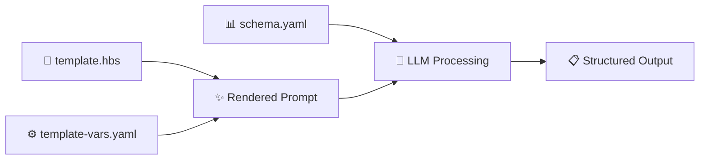

# PR Review with Microsoft Semantic Kernel Compatible Handlebars Templates & YAML

This example demonstrates the **template-based workflow** using **Microsoft Semantic Kernel-compatible** Handlebars templates with YAML configuration for dynamic prompt generation. This implementation follows [Microsoft's official Handlebars prompt template documentation](https://learn.microsoft.com/en-us/semantic-kernel/concepts/prompts/handlebars-prompt-templates?pivots=programming-language-python) and uses standard [Handlebars.js](https://handlebarsjs.com/) syntax.

## 🌟 **Features Demonstrated**

- **✅ Microsoft Semantic Kernel Compatible**: Uses standard `<message role="...">` tags
- **📝 YAML Support**: Use YAML files for cleaner, more readable configuration
- **🔧 Handlebars Templates**: Dynamic prompt generation with reusable templates following [Handlebars.js](https://handlebarsjs.com/) syntax
- **⚙️ Template Variables**: Externalized configuration for easy customization
- **📊 YAML Schema**: Define output schemas in YAML format
- **🔄 Template Rendering Process**: Dynamic content generation based on context

## 📁 **Files**

- **`template.hbs`** - Microsoft-compatible Handlebars template with `<message>` tags
- **`template-vars.yaml`** - YAML file with template variables
- **`schema.yaml`** - YAML schema defining the expected output structure
- **`README.md`** - This comprehensive documentation

## 🔄 **How It Works**

### **1. Microsoft Semantic Kernel Compatible Approach**

Following [Microsoft's Semantic Kernel documentation](https://learn.microsoft.com/en-us/semantic-kernel/concepts/prompts/handlebars-prompt-templates?pivots=programming-language-python), this example uses:
- **Handlebars template** (`template.hbs`) - Dynamic prompt structure with standard `<message>` tags
- **YAML variables** (`template-vars.yaml`) - Data to populate the template
- **YAML schema** (`schema.yaml`) - Output structure definition

### **2. Template Rendering Process**



### **3. Microsoft-Compatible Handlebars Template Features**

The template demonstrates Microsoft Semantic Kernel compatible features using standard `<message>` tags:

```handlebars
<message role="system">
You are an expert DevOps engineer specializing in {{expertise.domain}}. 
Generate comprehensive PR reviews that include:
- Summary of changes
- {{expertise.focus_areas}}
- Impact assessment ({{impact_levels}})
- Testing recommendations
- Deployment considerations
</message>

<message role="user">
Please review this pull request from {{repository.name}} (branch: {{repository.branch}}):

**Repository:** {{repository.name}}
**PR Number:** #{{repository.pr_number}}  
**Branch:** {{repository.branch}}
**Files Changed:** {{#each repository.files_changed}}{{this}}{{#unless @last}}, {{/unless}}{{/each}}

**Review Focus:**
{{#each review_context.focus_areas}}
- {{this}}
{{/each}}

{{#if review_context.related_issues}}
Related Issues: {{#each review_context.related_issues}}#{{this}}{{#unless @last}}, {{/unless}}{{/each}}
{{/if}}

Please provide a structured analysis following the defined schema.
</message>
```

**🎯 Microsoft-Compatible Features Used:**
- `<message role="system">` - System instruction message (Microsoft standard)
- `<message role="user">` - User input message (Microsoft standard)
- `{{variable}}` - Simple variable substitution
- `{{#each array}}` - Loop through arrays
- `{{#if condition}}` - Conditional rendering
- `{{#unless @last}}` - Helper for formatting lists

## 🚀 **Usage**

### **Primary Command**

```bash
llm-ci-runner \
  --template-file examples/05-templates/pr-review-template/template.hbs \
  --template-vars examples/05-templates/pr-review-template/template-vars.yaml \
  --schema-file examples/05-templates/pr-review-template/schema.yaml \
  --output-file pr-review-result.yaml
```

### **Alternative: JSON Schema**

You can also use JSON schema if preferred:
```bash
# Convert YAML schema to JSON first
cat examples/05-templates/pr-review-template/schema.yaml | yq eval -o json > schema.json

llm-ci-runner \
  --template-file examples/05-templates/pr-review-template/template.hbs \
  --template-vars examples/05-templates/pr-review-template/template-vars.yaml \
  --schema-file schema.json \
  --output-file pr-review-result.json
```

## 📊 **Template Variables (template-vars.yaml)**

```yaml
expertise:
  domain: "Cloud Infrastructure & Security"
  focus_areas: "security best practices, scalability considerations, CI/CD optimization"

impact_levels: "high, medium, low"

repository:
  name: "authentication-service"
  pr_number: 127
  branch: "feature/security-improvements"
  files_changed:
    - "src/auth/login.py"
    - "src/auth/session.py"
    - "tests/test_auth.py"

review_context:
  priority_areas: "security vulnerabilities, authentication logic, session management"
  focus_areas:
    - "SQL injection prevention"
    - "Input validation"
    - "Session security"
    - "Error handling"
  related_issues: [456, 789]
  deployment_env: "production"

code_diff: |
  --- a/src/auth/login.py
  +++ b/src/auth/login.py
  @@ -15,7 +15,7 @@ def authenticate_user(username, password):
  -    query = f"SELECT * FROM users WHERE username='{username}'"
  +    query = "SELECT * FROM users WHERE username=?"
  -    cursor.execute(query)
  +    cursor.execute(query, (username,))
```

## 🎯 **Schema Validation**

Uses comprehensive YAML schema for structured PR review output:

```yaml
$schema: "http://json-schema.org/draft-07/schema#"
type: object
properties:
  description:
    type: string
    description: "Comprehensive analysis of changes and impact"
  summary:
    type: string
    description: "Brief summary of changes (max 100 characters)"
    maxLength: 100
  change_type:
    type: string
    enum: ["feature", "bugfix", "security", "refactor", "performance", "documentation"]
  impact:
    type: string
    enum: ["low", "medium", "high", "critical"]
  security_findings:
    type: array
    items:
      type: object
      properties:
        type:
          type: string
          enum: ["vulnerability_fixed", "vulnerability_introduced", "security_improvement", "best_practice"]
        description: 
          type: string
        severity:
          type: string
          enum: ["info", "low", "medium", "high", "critical"]
      required: ["type", "description", "severity"]
  testing_notes:
    type: array
    items:
      type: string
  deployment_notes:
    type: array
    items:
      type: string
  breaking_changes:
    type: array
    items:
      type: string
  related_issues:
    type: array
    items:
      type: integer
required: ["description", "summary", "change_type", "impact", "security_findings", "testing_notes", "deployment_notes", "breaking_changes"]
```

## 📋 **Expected Output**

The command generates structured output following the YAML schema:

```yaml
success: true
response:
  description: |
    ### Security Analysis Summary
    
    This PR implements critical security improvements to the authentication service:
    
    **Key Changes:**
    - Fixed SQL injection vulnerability in user authentication
    - Added parameterized queries for secure database access
    - Improved session creation with proper validation
    
    **Security Impact:**
    - Eliminates high-severity SQL injection risk
    - Improves database query security practices
    - Enhances overall authentication security posture
    
  summary: "Enhanced authentication security with parameterized queries and validation"
  change_type: "security"
  impact: "medium"
  security_findings:
    - type: "vulnerability_fixed"
      description: "Replaced string concatenation with parameterized SQL queries"
      severity: "high"
    - type: "security_improvement"
      description: "Added comprehensive input validation for authentication parameters"
      severity: "medium"
  testing_notes:
    - "Test authentication with various input types"
    - "Verify SQL injection protection with malicious inputs"
    - "Ensure existing authentication flows continue to work"
  deployment_notes:
    - "No database schema changes required"
    - "Backward compatible with existing API clients"
    - "Monitor authentication logs post-deployment"
  breaking_changes: []
  related_issues: [456, 789]
```

## 💡 **Benefits of Microsoft-Compatible Template Approach**

### **🎯 Reusability**
- Templates can be reused across different PRs and projects
- Variables file can be easily modified for different contexts
- Schema defines consistent output structure
- **Microsoft Semantic Kernel compatibility** ensures standard format

### **🔧 Maintainability**
- Separate concerns: template structure vs. data vs. schema
- YAML is more readable than JSON for complex configurations
- Easy to version control and review changes
- Follows [Microsoft's documented patterns](https://learn.microsoft.com/en-us/semantic-kernel/concepts/prompts/handlebars-prompt-templates?pivots=programming-language-python)

### **🚀 Flexibility**
- Dynamic content generation based on context
- Conditional sections based on PR type or repository
- Easy customization for different teams or projects
- Compatible with Microsoft Semantic Kernel ecosystem

### **📋 Consistency**
- Enforced schema compliance across all outputs
- Standardized prompt structure using `<message>` tags
- Predictable output format for downstream automation
- Follows industry-standard Handlebars syntax

## 📊 **Comparison: Traditional vs Template Approach**

| Traditional JSON Input | Microsoft-Compatible Template YAML |
|----------------------|-------------------|
| Static prompt text | Dynamic template rendering |
| Hardcoded values | Variable substitution |
| JSON configuration | YAML configuration |
| Less reusable | Highly reusable |
| Manual prompt updates | Template-driven updates |
| Custom message format | Standard `<message>` tags |

## 🔧 **Advanced Template Features**

### **Microsoft Standard Message Format**

The template uses Microsoft Semantic Kernel standard message format:
```handlebars
<message role="system">
System instructions here
</message>

<message role="user">
User content here
</message>
```

This generates proper chat message structure that's compatible with Microsoft Semantic Kernel's parsing expectations.

### **Conditional Rendering**

```handlebars
{{#if review_context.related_issues}}
Related Issues: {{#each review_context.related_issues}}#{{this}}{{#unless @last}}, {{/unless}}{{/each}}
{{/if}}
```

Only includes sections when data is available.

### **Array Formatting**

```handlebars
Files: {{#each repository.files_changed}}{{this}}{{#unless @last}}, {{/unless}}{{/each}}
```

Properly formats arrays with commas between items.

### **Complex Object Navigation**

```handlebars
{{expertise.domain}}
{{repository.pr_number}}
{{review_context.deployment_env}}
```

Navigate nested YAML structures easily.

## 🔄 **Integration with CI/CD**

This Microsoft-compatible template approach is perfect for CI/CD pipelines:

```yaml
# GitHub Actions example
- name: Generate PR Review
  run: |
    llm-ci-runner \
      --template-file .github/templates/pr-review.hbs \
      --template-vars pr-context.yaml \
      --schema-file .github/schemas/pr-review.yaml \
      --output-file pr-analysis.yaml
      
- name: Comment PR with Review
  uses: actions/github-script@v6
  with:
    script: |
      const fs = require('fs');
      const review = JSON.parse(fs.readFileSync('pr-analysis.yaml', 'utf8'));
      github.rest.issues.createComment({
        issue_number: context.issue.number,
        owner: context.repo.owner,
        repo: context.repo.repo,
        body: review.response.description
      });
```

## 🌟 **What This Demonstrates**

- **✅ Microsoft Semantic Kernel compatibility** with standard `<message>` tags
- **🔄 Template-driven prompt generation** with [Handlebars.js](https://handlebarsjs.com/)
- **📝 YAML configuration** for better readability
- **🎯 Dynamic content rendering** based on context
- **✅ Schema enforcement** with YAML schemas
- **🔧 Reusable templates** for consistent outputs
- **🚀 CI/CD integration** with template-based workflows
- **📚 Best practices** following [Microsoft's documentation](https://learn.microsoft.com/en-us/semantic-kernel/concepts/prompts/handlebars-prompt-templates?pivots=programming-language-python)

## 🔗 **References**

- [Microsoft Semantic Kernel Handlebars Templates Documentation](https://learn.microsoft.com/en-us/semantic-kernel/concepts/prompts/handlebars-prompt-templates?pivots=programming-language-python)
- [Handlebars.js Official Documentation](https://handlebarsjs.com/)
- [YAML Schema Specification](http://json-schema.org/draft-07/schema#)

This template demonstrates how Microsoft Semantic Kernel-compatible Handlebars templates can provide comprehensive, context-aware PR reviews with guaranteed structured output validation while maintaining full compatibility with the Microsoft ecosystem. 