# Hybrid Optimizer - LogiLLM's Killer Feature

The HybridOptimizer is LogiLLM's **unique competitive advantage** - the ability to optimize both prompts and hyperparameters simultaneously. This is fundamentally impossible in DSPy because it lacks hyperparameter optimization infrastructure.

## Why This Matters

Most LLM optimization focuses only on prompts, but hyperparameters are equally important:

- A great prompt with `temperature=0.0` might be too rigid
- A great prompt with `temperature=1.5` might be too creative  
- The optimal temperature depends on the prompt style
- Few-shot examples work differently at different temperatures

**Traditional approach**: Optimize prompts OR hyperparameters separately
**LogiLLM approach**: Optimize them together for maximum synergy

### Safe Hyperparameter Handling

LogiLLM uses a protective `HyperparameterConfig` system that ensures all hyperparameter updates are safe:

```python
from logillm.core.config_utils import set_hyperparameter, get_hyperparameter

# Hyperparameters are automatically validated and clamped
set_hyperparameter(module, "temperature", 3.0)  # Automatically clamped to 2.0
set_hyperparameter(module, "top_p", -0.5)       # Automatically clamped to 0.0

# Type coercion is automatic
set_hyperparameter(module, "max_tokens", "200") # Converted to int(200)
```

This prevents runtime errors from invalid hyperparameter values during optimization.

## Optimization Workflow

```mermaid
graph LR
    A[📊 Training Data] --> B{Choose Strategy}
    B -->|Iterative| C[Alternating]
    B -->|Global Search| D[Joint]
    B -->|Efficiency| E[Sequential]
    
    C --> F[Prompts → Params → Repeat]
    D --> G[Simultaneous Optimization]
    E --> H[Params → Then Prompts]
    
    F --> I[Evaluate & Converge]
    G --> I
    H --> I
    
    I --> J{Performance OK?}
    J -->|No| K[Adjust Strategy/Config]
    J -->|Yes| L[💾 Save Optimized Model]
    
    K --> B
    L --> M[🚀 Production Deployment]
    
    style C fill:#fcc,stroke:#333,stroke-width:2px
    style D fill:#f96,stroke:#333,stroke-width:3px
    style L fill:#9f9,stroke:#333,stroke-width:2px
```



## The Three Strategies

### 1. Alternating Strategy (Default)
Alternates between optimizing prompts and hyperparameters:

```python
from logillm.optimizers import HybridOptimizer, accuracy_metric

optimizer = HybridOptimizer(
    metric=accuracy_metric,
    strategy="alternating",  # Default
    num_iterations=5
)

result = await optimizer.optimize(module, dataset)
```

**How it works:**
1. Start with baseline module
2. Optimize hyperparameters (temperature, top_p) with current prompts
3. Optimize prompts (instructions, demos) with optimal hyperparameters
4. Repeat until convergence

**Benefits:**
- Each optimization benefits from the other's improvements
- Natural convergence as improvements get smaller
- Good balance of exploration and exploitation

### 2. Joint Strategy (Most Powerful)
Optimizes everything simultaneously in a unified search space:

```python
optimizer = HybridOptimizer(
    metric=accuracy_metric,
    strategy="joint",
    n_trials=50  # More trials needed for joint optimization
)
```

**How it works:**
1. Create unified search space combining prompts and hyperparameters
2. Use Bayesian optimization to explore the joint space
3. Each trial tests a complete configuration
4. Find the global optimum across all dimensions

**Benefits:**
- Can find optimal combinations that sequential methods miss
- Discovers non-linear interactions between prompts and hyperparameters
- Theoretically optimal (given enough trials)

**Drawbacks:**
- More computationally expensive
- Requires more trials to converge
- Higher dimensional search space

### 3. Sequential Strategy (Most Efficient)
Optimizes one type first, then the other:

```python
optimizer = HybridOptimizer(
    metric=accuracy_metric,
    strategy="sequential"  # Default: hyperparams first, then prompts
)
```

**How it works:**
1. First, optimize hyperparameters with original prompts
2. Then, optimize prompts using the optimal hyperparameters
3. Two-step process, no iteration

**Benefits:**
- Fastest approach - only two optimization steps
- Good when you suspect one type is more important
- Clear separation of concerns

**When to use:**
- Limited compute budget
- When hyperparameters are more important than prompts (or vice versa)
- As a baseline to compare against more sophisticated strategies

## Format Optimization Integration

The HybridOptimizer can also optimize prompt **formats** (JSON vs XML vs Markdown):

```python
optimizer = HybridOptimizer(
    metric=accuracy_metric,
    strategy="alternating",
    optimize_format=True  # Test different formats
)

result = await optimizer.optimize(module, dataset)
print(f"Best format: {result.metadata['best_format']}")  # e.g., "json"
```

This creates a **three-way optimization**:
1. **Hyperparameters**: temperature, top_p, max_tokens
2. **Prompts**: instructions, demonstrations
3. **Format**: JSON, XML, Markdown, hybrid formats

## Real Example

```python
from logillm import Predict
from logillm.optimizers import HybridOptimizer
import asyncio

# Create a question-answering module
qa_module = Predict("question: str -> reasoning: str, answer: str")

# Training data
dataset = [
    {
        "inputs": {"question": "What is 2 + 2?"},
        "outputs": {"reasoning": "Adding 2 and 2", "answer": "4"}
    },
    {
        "inputs": {"question": "What is the capital of France?"},  
        "outputs": {"reasoning": "France's capital city", "answer": "Paris"}
    },
    # ... more examples
]

# Define success metric
def accuracy_metric(predicted, expected):
    return float(predicted.get("answer", "").strip().lower() == 
                expected.get("answer", "").strip().lower())

# Create hybrid optimizer with verbose logging
optimizer = HybridOptimizer(
    metric=accuracy_metric,
    strategy="alternating",
    optimize_format=True,
    num_iterations=3,
    verbose=True  # Enable real-time progress monitoring
)

# Run optimization
async def optimize_qa():
    result = await optimizer.optimize(
        module=qa_module,
        dataset=dataset,
        validation_set=dataset[:10]  # Use first 10 for validation
    )
    
    print(f"Improvement: {result.improvement:.2%}")
    print(f"Best score: {result.best_score:.2%}")
    print(f"Optimization time: {result.optimization_time:.1f}s")
    
    # Check what was optimized
    metadata = result.metadata
    print(f"Strategy: {metadata['strategy']}")
    print(f"Iterations: {metadata['num_iterations']}")
    print(f"Score trajectory: {metadata['score_trajectory']}")
    
    return result.optimized_module

# Run the optimization
optimized_qa = asyncio.run(optimize_qa())

# Use the optimized module
prediction = await optimized_qa(question="What is 3 + 5?")
print(f"Answer: {prediction.outputs['answer']}")
```

## Monitoring Optimization Progress

The HybridOptimizer provides real-time progress monitoring with **zero dependencies** (using only Python standard library):

```python
# Enable verbose mode to see step-by-step progress
optimizer = HybridOptimizer(
    metric=accuracy_metric,
    verbose=True  # Shows real-time optimization progress
)

# During optimization, you'll see output like:
# [   0.0s] Step   0/7 | Starting alternating optimization...
# [   0.1s] Step   0/7 | Baseline score: 0.3320
# [   0.2s] Step   1/7 | Iteration 1: Optimizing hyperparameters...
# [   2.1s] Step   1/7 | Hyperparameter score: 0.7800
# [   2.2s] Step   2/7 | Iteration 1: Optimizing prompts...
# [   5.8s] Step   2/7 | 🎯 NEW BEST! Score: 0.8500
# [   5.9s] Step   3/7 | Iteration 2: Optimizing hyperparameters...
# [   7.4s] Step   3/7 | Hyperparameter score: 0.8600
# [   7.5s] Step   4/7 | Iteration 2: Optimizing prompts...
# [  10.2s] Step   4/7 | 🎯 NEW BEST! Score: 0.8900
```

**Verbose output details:**
- **Timing**: Elapsed seconds since optimization started
- **Steps**: Current step and total expected steps
- **Actions**: Clear descriptions of what's being optimized
- **Scores**: Performance metrics after each optimization phase
- **Best indicators**: Highlights when new best configurations are found

This logging uses **only Python's standard library** (no rich, tqdm, or other dependencies), maintaining LogiLLM's zero-dependency philosophy while providing essential visibility into the optimization process.

## Configuration Options

The HybridOptimizer supports extensive configuration:

```python
from logillm.optimizers import HybridOptimizerConfig

config = HybridOptimizerConfig(
    num_iterations=5,           # Number of alternating rounds
    n_trials=30,               # Trials per component (for joint strategy)
    n_warmup_joint=10,         # Warmup trials for Bayesian optimization
    convergence_threshold=0.01, # Stop if improvement < 1%
    enable_logging=True,       # Log optimization progress
    log_level="INFO",          # Logging level
    
    # Demo selection parameters
    max_demo_subset=True,      # Limit demos used for joint optimization
    demo_subset_size=50,       # Max demos for bootstrap in joint mode
    
    # Joint optimization search space
    num_demos_range=(0, 10),   # Range for number of demonstrations
    instruction_styles=[       # Styles to try for instructions
        "concise", "detailed", "step_by_step", "formal"
    ]
)

optimizer = HybridOptimizer(
    metric=accuracy_metric,
    strategy="alternating",
    config=config
)
```

## Advanced Usage: Custom Component Optimizers

You can provide your own optimizers for each component:

```python
from logillm.optimizers import (
    SIMBA, COPRO, FormatOptimizer, HyperparameterOptimizer
)

# Custom prompt optimizer (SIMBA for sophisticated prompt evolution)
prompt_optimizer = SIMBA(
    metric=accuracy_metric,
    max_steps=10,
    num_candidates=8
)

# Custom hyperparameter optimizer
hyper_optimizer = HyperparameterOptimizer(
    metric=accuracy_metric,
    strategy="bayesian",
    n_trials=25
)

# Custom format optimizer
format_optimizer = FormatOptimizer(
    metric=accuracy_metric,
    formats_to_test=["markdown", "json", "xml"]
)

# Hybrid optimizer with custom components
optimizer = HybridOptimizer(
    metric=accuracy_metric,
    prompt_optimizer=prompt_optimizer,
    hyperparameter_optimizer=hyper_optimizer,
    format_optimizer=format_optimizer,
    strategy="alternating",
    optimize_format=True
)
```

## Performance Characteristics

Based on empirical testing:

| Strategy | Speed | Performance | Use Case |
|----------|-------|-------------|----------|
| Sequential | Fastest | Good baseline | Limited compute, quick wins |
| Alternating | Medium | Very good | Default choice, balances all factors |
| Joint | Slowest | Best possible | Maximum performance, sufficient compute |

**Typical improvements:**
- **Sequential**: 15-25% over no optimization
- **Alternating**: 20-35% over no optimization  
- **Joint**: 25-40% over no optimization

## DSPy Comparison

| Feature | DSPy | LogiLLM HybridOptimizer |
|---------|------|-------------------------|
| Prompt optimization | ✅ | ✅ |
| Hyperparameter optimization | ❌ | ✅ |
| Joint optimization | ❌ | ✅ |  
| Format optimization | ❌ | ✅ |
| Zero dependencies | ❌ | ✅ |
| Multiple strategies | ❌ | ✅ |

DSPy users must:
1. Use fixed hyperparameters
2. Optimize prompts only
3. Install Optuna for any hyperparameter work
4. Run separate optimization processes
5. Manually combine results

LogiLLM users get everything in one optimizer with zero external dependencies.

## 💾 Saving Optimized Results

**Critical**: After hybrid optimization (which can take significant time and API calls), always save your optimized module:

```python
# Run hybrid optimization
result = await optimizer.optimize(module=classifier, dataset=training_data)
optimized_module = result.optimized_module

# Save all optimized state: prompts + hyperparameters + examples
optimized_module.save("models/hybrid_optimized_classifier.json")

print(f"Saved module with {result.improvement:.1%} improvement!")
print("Saved state includes:")
print("  ✅ Best hyperparameters (temperature, top_p, etc.)")
print("  ✅ Optimized prompts and instructions") 
print("  ✅ Few-shot examples from bootstrap")
print("  ✅ Best output format (JSON/XML/Markdown)")
```

**Production Loading:**
```python
# Later, in production: instant loading with all optimizations
production_classifier = Predict.load("models/hybrid_optimized_classifier.json")

# Uses optimized hyperparameters AND optimized prompts immediately
result = await production_classifier(input="test data")
```

**Why This Matters for Hybrid Optimization:**
- Hybrid optimization is the **most expensive** optimization (time + API calls)
- Re-running hybrid optimization wastes all the synergistic improvements
- Saved modules preserve the **complete optimized state**
- Loading is instant - no re-optimization needed

👉 **See [Persistence Guide](../core-concepts/persistence.md)** for complete production patterns.

## Next Steps

- [SIMBA Optimizer](simba.md) - Sophisticated hyperparameter optimization
- [Bootstrap Few-Shot](bootstrap-fewshot.md) - Teacher-student demonstrations
- [Format Optimizer](format-optimizer.md) - Automatic format discovery
- [Search Strategies](strategies.md) - Bayesian and other algorithms