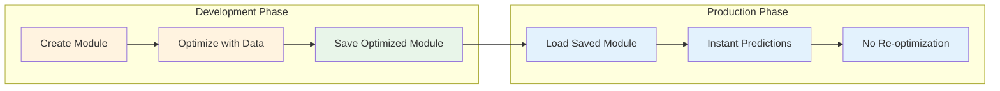

# Module Persistence

LogiLLM provides first-class persistence for optimized modules, allowing you to save trained models once and load them instantly in production. This eliminates the need to re-optimize modules every time your application starts.

## 🎯 Why Persistence Matters

**The Problem:** Traditional prompt engineering requires manual tuning every time. While optimization frameworks like DSPy do support saving/loading, LogiLLM provides a more streamlined, production-ready persistence experience.

**LogiLLM's Solution:** Train once, save forever. Optimized modules preserve their complete state including prompts, examples, hyperparameters, and provider configurations.



## 🚀 Quick Start

### Basic Save and Load

```python
from logillm.core.predict import Predict
from logillm.providers import create_provider, register_provider

# Set up provider
provider = create_provider("openai", model="gpt-4.1")
register_provider(provider, set_default=True)

# Create and configure a module
classifier = Predict("email: str -> category: str")
classifier.config["temperature"] = 0.3

# Test it works
result = await classifier(email="Please refund my order")
print(result.category)  # e.g., "refund_request"

# Save the module (preserves all state)
classifier.save("models/email_classifier.json")

# Later, in production - load instantly
loaded_classifier = Predict.load("models/email_classifier.json") 
result = await loaded_classifier(email="Cancel my subscription")
print(result.category)  # Uses same optimized configuration
```

### Save After Optimization

The real power comes from saving optimized modules:

```python
from logillm.core.optimizers import AccuracyMetric
from logillm.optimizers import BootstrapFewShot

# Prepare training data
training_data = [
    {"inputs": {"email": "Please cancel my account"}, "outputs": {"category": "cancellation"}},
    {"inputs": {"email": "Where is my order?"}, "outputs": {"category": "order_status"}},
    {"inputs": {"email": "This product is amazing!"}, "outputs": {"category": "feedback"}},
    # ... more examples
]

# Optimize the module (this takes time and API calls)
metric = AccuracyMetric(key="category")
optimizer = BootstrapFewShot(metric=metric, max_examples=5)
result = await optimizer.optimize(
    module=classifier,
    dataset=training_data
)

print(f"Optimization improved accuracy by {result.improvement:.1%}")

# Save the optimized module
optimized_classifier = result.optimized_module
optimized_classifier.save("models/optimized_email_classifier.json")

# In production: Load the optimized module (no re-training!)
production_classifier = Predict.load("models/optimized_email_classifier.json")
result = await production_classifier(email="I love this service!")
print(result.category)  # Uses optimized prompts and examples
```

## 📦 What Gets Saved

LogiLLM persistence saves **everything** needed to recreate the module:

### Core Module State
```python
{
    "logillm_version": "0.1.0",              # Version compatibility
    "save_timestamp": "2024-01-01T12:00:00", # When saved
    "module_type": "Predict",                # Module class
    "module_class": "logillm.core.predict.Predict", # Full class path
    "state": "optimized"                     # Module state
}
```

### Signature Information
```python
{
    "signature": {
        "type": "BaseSignature", 
        "input_fields": {
            "email": {"field_type": "input", "python_type": "str", ...}
        },
        "output_fields": {
            "category": {"field_type": "output", "python_type": "str", ...}
        },
        "instructions": "Classify customer emails by category"
    }
}
```

### Configuration and Hyperparameters
```python
{
    "config": {
        "temperature": 0.3,
        "max_tokens": 150,
        "top_p": 0.95,
        "debug": false
    }
}
```

### Few-Shot Examples (from optimization)
```python
{
    "demo_manager": {
        "demos": [
            {
                "inputs": {"email": "Cancel my account"},
                "outputs": {"category": "cancellation"},
                "score": 0.95
            }
            // ... more optimized examples
        ],
        "max_demos": 5,
        "selection_strategy": "best"
    }
}
```

### Provider Configuration (without secrets)
```python
{
    "provider_config": {
        "name": "openai",
        "model": "gpt-4.1",
        "config": {
            "temperature": 0.3,
            "max_tokens": 150
            // Note: API keys are never saved
        },
        "provider_class": "logillm.providers.openai.OpenAIProvider"
    }
}
```

### Metadata and Custom Data
```python
{
    "metadata": {
        "training_dataset_size": 100,
        "optimization_time": "45.2s", 
        "performance_metrics": {"accuracy": 0.87},
        "custom_tags": ["production", "email_classifier"]
    }
}
```

## 🔧 Advanced Usage

### Saving with Options

```python
# Save without provider configuration
module.save("models/module.json", include_provider=False)

# Different serialization formats (JSON only supported currently)
module.save("models/module.json", format=SerializationFormat.JSON)

# Check what would be saved
save_data = ModuleSaver._build_save_data(module, include_provider=True)
print(json.dumps(save_data, indent=2))
```

### Loading with Options

```python
# Load with automatic provider setup
module = Predict.load("models/module.json", setup_provider=True)

# Load with strict version checking
module = Predict.load("models/module.json", strict_version=True)

# Load and handle version warnings
import warnings
with warnings.catch_warnings(record=True) as w:
    module = Predict.load("models/module.json")
    if w:
        print(f"Version warning: {w[0].message}")
```

### Custom Serialization

For advanced use cases, use the underlying classes directly:

```python
from logillm.core.persistence import ModuleSaver, ModuleLoader

# Custom save logic
ModuleSaver.save_module(
    module=my_module,
    path="custom/path/module.json", 
    include_provider=True,
    format=SerializationFormat.JSON
)

# Custom load logic  
loaded_module = ModuleLoader.load_module(
    path="custom/path/module.json",
    setup_provider=False,
    strict_version=False
)
```

## 🏭 Production Patterns

### Development Workflow

```python
# dev_train.py - Run once during development
async def train_model():
    # Load training data
    training_data = load_training_data("data/emails.json")
    
    # Create and optimize module
    classifier = Predict("email: str -> category: str, confidence: float")
    optimizer = HybridOptimizer(
        metric=AccuracyMetric(key="category"),
        strategy="alternating",
        verbose=True
    )
    
    result = await optimizer.optimize(
        module=classifier,
        dataset=training_data,
        param_space={
            "temperature": (0.0, 1.0),
            "top_p": (0.8, 1.0)
        }
    )
    
    # Save optimized model
    optimized_classifier = result.optimized_module
    optimized_classifier.save("models/email_classifier_v1.json")
    
    print(f"Model saved with {result.best_score:.1%} accuracy")
    print(f"Best config: {result.metadata.get('best_config', {})}")

if __name__ == "__main__":
    asyncio.run(train_model())
```

### Production Application

```python
# app.py - Production application
from logillm.core.predict import Predict

# Load pre-trained model (fast, no API calls)
classifier = Predict.load("models/email_classifier_v1.json")

async def classify_email(email_content: str):
    """Classify email using pre-trained model."""
    result = await classifier(email=email_content)
    return {
        "category": result.outputs.get("category"),
        "confidence": result.outputs.get("confidence", 0.0)
    }

# FastAPI example
from fastapi import FastAPI
app = FastAPI()

@app.post("/classify")
async def classify_endpoint(request: dict):
    return await classify_email(request["email"])
```

### Model Versioning

```python
import os
from pathlib import Path

class ModelManager:
    def __init__(self, models_dir: str = "models"):
        self.models_dir = Path(models_dir)
        
    def save_model(self, module, name: str, version: str):
        """Save model with version."""
        path = self.models_dir / f"{name}_v{version}.json"
        module.save(str(path))
        
        # Create symlink to latest
        latest_path = self.models_dir / f"{name}_latest.json"
        if latest_path.exists():
            latest_path.unlink()
        latest_path.symlink_to(path.name)
        
    def load_latest(self, name: str):
        """Load latest version of model."""
        latest_path = self.models_dir / f"{name}_latest.json"
        return Predict.load(str(latest_path))
        
    def load_version(self, name: str, version: str):
        """Load specific version of model.""" 
        path = self.models_dir / f"{name}_v{version}.json"
        return Predict.load(str(path))

# Usage
manager = ModelManager()
manager.save_model(optimized_classifier, "email_classifier", "1.0")
classifier = manager.load_latest("email_classifier")
```

### Deployment with Docker

```dockerfile
# Dockerfile
FROM python:3.11-slim

WORKDIR /app

# Install dependencies
COPY requirements.txt .
RUN pip install -r requirements.txt

# Copy application code
COPY app.py .

# Copy pre-trained models (built during CI/CD)
COPY models/ models/

# Run application
CMD ["python", "app.py"]
```

### CI/CD Integration

```yaml
# .github/workflows/train-models.yml
name: Train and Deploy Models

on:
  push:
    paths: ['data/training/**']
    
jobs:
  train:
    runs-on: ubuntu-latest
    steps:
      - uses: actions/checkout@v3
      
      - name: Train Models
        env:
          OPENAI_API_KEY: ${{ secrets.OPENAI_API_KEY }}
        run: |
          python train_models.py
          
      - name: Upload Models
        uses: actions/upload-artifact@v3
        with:
          name: trained-models
          path: models/
          
  deploy:
    needs: train
    runs-on: ubuntu-latest  
    steps:
      - name: Download Models
        uses: actions/download-artifact@v3
        with:
          name: trained-models
          path: models/
          
      - name: Deploy to Production
        run: |
          docker build -t app:latest .
          docker push registry/app:latest
```

## 🔍 Version Compatibility

LogiLLM handles version compatibility gracefully:

### Version Warnings
```python
# Loading older model version shows warning
import warnings
with warnings.catch_warnings(record=True) as w:
    classifier = Predict.load("old_model.json")
    if w:
        print(f"Warning: {w[0].message}")
        # "Loading module saved with LogiLLM 0.0.9, current version is 0.1.0"
```

### Strict Version Checking
```python
from logillm.core.persistence import PersistenceError

try:
    # Enforce exact version match
    classifier = Predict.load("model.json", strict_version=True)
except PersistenceError as e:
    print(f"Version mismatch: {e}")
    # Handle incompatible version
```

### Migration Strategies
```python
def migrate_model_if_needed(model_path: str):
    """Load model with migration if needed."""
    try:
        return Predict.load(model_path, strict_version=True)
    except PersistenceError as e:
        if "Version mismatch" in str(e):
            # Load with warnings, then re-save in current format
            with warnings.catch_warnings():
                warnings.simplefilter("ignore")
                old_model = Predict.load(model_path)
                
            # Re-save in current version format
            backup_path = model_path.replace(".json", "_backup.json")
            os.rename(model_path, backup_path)
            old_model.save(model_path)
            
            return old_model
        raise
```

## 🚨 Troubleshooting

### Common Issues

**File Not Found**
```python
from logillm.core.persistence import PersistenceError

try:
    classifier = Predict.load("missing_model.json")
except PersistenceError as e:
    print(f"Model file not found: {e}")
    # Use default model or retrain
```

**Corrupted Save File**
```python
import json

try:
    classifier = Predict.load("model.json") 
except json.JSONDecodeError:
    print("Model file corrupted, retraining...")
    # Trigger retraining workflow
```

**Provider Mismatch**
```python
# Model was trained with OpenAI but current provider is Anthropic
classifier = Predict.load("model.json")
# LogiLLM warns: "Module optimized with openai (gpt-4.1), current provider is anthropic (claude-3)"

# Options:
# 1. Switch to original provider
provider = create_provider("openai", model="gpt-4.1") 
register_provider(provider, set_default=True)

# 2. Re-optimize with current provider  
optimizer = BootstrapFewShot(metric=AccuracyMetric(key="category"))
result = await optimizer.optimize(module=classifier, dataset=training_data)
result.optimized_module.save("model_anthropic.json")
```

**Permission Errors**
```python
import os
from pathlib import Path

def safe_save(module, path: str):
    """Save model with proper error handling."""
    try:
        module.save(path)
    except PermissionError:
        # Try alternative path
        alt_path = Path.home() / "models" / Path(path).name
        alt_path.parent.mkdir(parents=True, exist_ok=True)
        module.save(str(alt_path))
        print(f"Saved to alternative path: {alt_path}")
```

### Debugging Persistence

Enable debug logging to see what's happening:
```python
import logging
logging.basicConfig(level=logging.DEBUG)

# Now save/load operations show detailed logs
classifier.save("debug_model.json") 
# DEBUG: Serializing signature with 2 input fields, 1 output field
# DEBUG: Preserving demo_manager with 5 examples  
# DEBUG: Saving provider config (openai, gpt-4.1)
# DEBUG: Module Predict saved to debug_model.json
```

Inspect saved files:
```python
import json

# Look at saved model structure
with open("model.json") as f:
    data = json.load(f)
    
print(f"Module: {data['module_type']}")
print(f"Config: {data['config']}")
print(f"Examples: {len(data.get('demo_manager', {}).get('demos', []))}")
if 'provider_config' in data:
    provider = data['provider_config']
    print(f"Provider: {provider['name']} ({provider['model']})")
```

## 📚 API Reference

### Module Methods (Monkey-Patched)

All LogiLLM modules automatically get these methods:

#### `module.save(path: str, **kwargs) -> None`
Save module to disk.

**Parameters:**
- `path`: File path (`.json` extension recommended)
- `include_provider`: Save provider config (default: `True`)
- `format`: Serialization format (default: `SerializationFormat.JSON`)

#### `Module.load(path: str, **kwargs) -> Module` (classmethod)
Load module from disk.

**Parameters:**
- `path`: File path to load from
- `setup_provider`: Auto-configure saved provider (default: `False`)
- `strict_version`: Enforce exact version match (default: `False`)

**Returns:** Reconstructed module instance

### Core Classes

#### `ModuleSaver`
Low-level module serialization.

```python
from logillm.core.persistence import ModuleSaver

ModuleSaver.save_module(
    module=my_module,
    path="model.json", 
    include_provider=True,
    format=SerializationFormat.JSON
)
```

#### `ModuleLoader`  
Low-level module deserialization.

```python
from logillm.core.persistence import ModuleLoader

module = ModuleLoader.load_module(
    path="model.json",
    setup_provider=False, 
    strict_version=False
)
```

#### `PersistenceError`
Exception for persistence-related errors.

```python
from logillm.core.persistence import PersistenceError

try:
    module = Predict.load("model.json")
except PersistenceError as e:
    print(f"Persistence failed: {e}")
```

## 🔗 Integration with Other Features

### With Optimization
```python
# Train and save optimized models
from logillm.optimizers import HybridOptimizer

optimizer = HybridOptimizer(metric=AccuracyMetric(key="result"))
result = await optimizer.optimize(module=base_module, dataset=data)
result.optimized_module.save("optimized_model.json")

# Load preserves optimization state
loaded_module = Predict.load("optimized_model.json")
# Has same few-shot examples and hyperparameters as optimized version
```

### With Callbacks
```python
# Save modules with callback state preserved  
from logillm.core.callbacks import CallbackManager

module = Predict("input -> output")
module.add_callback(my_callback)
module.save("model_with_callbacks.json")

# Note: Callback instances aren't saved, just the configuration
loaded_module = Predict.load("model_with_callbacks.json")
loaded_module.add_callback(my_callback)  # Re-attach callbacks
```

### With Custom Modules
```python
from logillm.core.modules import Module

class CustomModule(Module):
    def __init__(self, custom_param: str):
        super().__init__()
        self.custom_param = custom_param
    
    # Note: Currently only Predict modules supported
    # Custom module persistence coming in future versions
```

## 🔮 Future Enhancements

Planned persistence improvements:

- **Multi-format support**: YAML, Pickle, Protocol Buffers
- **Compression**: Gzip, Brotli for smaller files  
- **Encryption**: Secure model files with passwords
- **Remote storage**: S3, GCS, Azure Blob integration
- **Model registry**: Centralized model management
- **Custom modules**: Save/load any module type
- **Incremental updates**: Update parts of saved models
- **Model metadata**: Enhanced tracking and lineage

## 📖 Related Documentation

- [**Optimization**](../optimization/README.md) - Train modules worth saving
- [**Modules**](modules.md) - Understanding module types and lifecycle
- [**Providers**](providers.md) - Provider configuration and management
- [**Best Practices**](../best-practices/README.md) - Production deployment patterns

---

**Ready to save your optimized models?** Try the [persistence example](../../examples/persistence.py) to see the full workflow in action.