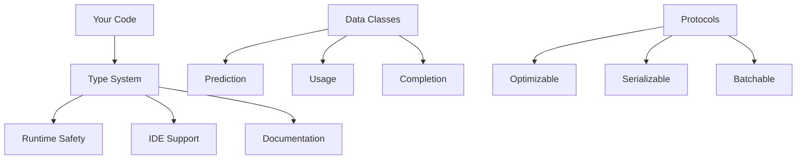

# LogiLLM Types and Protocols

*The type system that makes LogiLLM reliable and maintainable*

## ELI5: What are Types and Protocols?

Think of types as the "shape" of data, and protocols as "contracts" for behavior:

- **Types** tell you what kind of data you're working with (text, numbers, lists)
- **Protocols** tell you what methods an object must have (like "anything that can be called")
- **Data Classes** are structured containers for related information

For example:
- A `Prediction` type always has outputs, usage info, and success status
- A `Provider` protocol must be able to complete text and generate embeddings  
- A `TokenUsage` class tracks input/output/cached tokens consistently

This helps catch bugs early and makes code easier to understand!

## Architecture Overview

LogiLLM uses modern Python typing to create a robust, self-documenting system:



**Benefits**:
- **Catch errors early** with static type checking
- **Better IDE support** with autocomplete and hints
- **Self-documenting code** that's easy to understand
- **Runtime safety** with validation at key boundaries

## Core Data Types

### FieldValue - Universal Data Container

The most basic type for any field value:

```python
from logillm.types import FieldValue

# FieldValue can be any of these:
text_value: FieldValue = "Hello world"
number_value: FieldValue = 42
float_value: FieldValue = 3.14
bool_value: FieldValue = True
list_value: FieldValue = ["item1", "item2"]
dict_value: FieldValue = {"key": "value"}
none_value: FieldValue = None
```

**Usage**: Input/output fields in signatures, dynamic data structures

### Configuration and Metadata

Simple but powerful containers for settings and extra information:

```python
from logillm.types import Configuration, Metadata

# Configuration for modules and providers
config: Configuration = {
    "temperature": 0.7,
    "max_tokens": 100,
    "model": "gpt-4.1"
}

# Metadata for additional context
metadata: Metadata = {
    "source": "user_input",
    "timestamp": "2024-01-15T10:30:00Z",
    "version": "1.2.0"
}
```

**Usage**: Module configuration, provider settings, trace information

## Enums - Controlled Choices

### FieldType - Input/Output Classification

```python
from logillm.types import FieldType

class MySignature:
    # Input field - data going into the module
    question: str = InputField(field_type=FieldType.INPUT)
    
    # Output field - data coming from the module  
    answer: str = OutputField(field_type=FieldType.OUTPUT)
    
    # Context field - additional information
    context: str = ContextField(field_type=FieldType.CONTEXT)
    
    # Intermediate field - used during processing
    reasoning: str = IntermediateField(field_type=FieldType.INTERMEDIATE)
```

### ModuleState - Lifecycle Tracking

```python
from logillm.types import ModuleState

module = Predict("question -> answer")
print(module.state)  # ModuleState.INITIALIZED

compiled_module = module.compile()
print(compiled_module.state)  # ModuleState.COMPILED

optimized_module = optimizer.optimize(module, data)
print(optimized_module.state)  # ModuleState.OPTIMIZED
```

**Available States**:
- `INITIALIZED`: Just created
- `CONFIGURED`: Settings applied
- `COMPILED`: Ready for optimization
- `OPTIMIZED`: Performance tuned
- `CACHED`: Results cached for reuse

### AdapterFormat - Output Formats

```python
from logillm.types import AdapterFormat

# Choose how you want LLM outputs formatted
formats = [
    AdapterFormat.CHAT,        # Conversational
    AdapterFormat.JSON,        # Structured data
    AdapterFormat.XML,         # Markup format
    AdapterFormat.MARKDOWN,    # Rich text
    AdapterFormat.FUNCTION,    # Function calls
    AdapterFormat.COMPLETION,  # Plain text
    AdapterFormat.STRUCTURED   # Provider-specific
]
```

### ExecutionMode - How Modules Run

```python
from logillm.types import ExecutionMode

# Different execution patterns
modes = [
    ExecutionMode.SYNC,      # Synchronous
    ExecutionMode.ASYNC,     # Asynchronous  
    ExecutionMode.STREAMING, # Real-time tokens
    ExecutionMode.BATCH,     # Multiple items
    ExecutionMode.PARALLEL   # Concurrent processing
]
```

### CacheLevel - Performance Optimization

```python
from logillm.types import CacheLevel

provider = OpenAIProvider(
    model="gpt-4.1",
    cache_level=CacheLevel.MEMORY  # Cache in memory
)

# Available levels:
# CacheLevel.NONE         - No caching
# CacheLevel.MEMORY       - In-memory cache
# CacheLevel.DISK         - Persistent disk cache  
# CacheLevel.DISTRIBUTED  - Redis/shared cache
# CacheLevel.HYBRID       - Memory + disk
```

## Data Classes - Structured Information

### TokenUsage - Track Resource Consumption

```python
from logillm.types import TokenUsage

usage = TokenUsage(
    input_tokens=150,
    output_tokens=75,
    cached_tokens=20,
    reasoning_tokens=100  # For o1 models
)

print(f"Total tokens: {usage.total_tokens}")  # 325
print(f"Cache saved: {usage.cached_tokens} tokens")

# Combine usage from multiple calls
total_usage = usage + other_usage
```

**Features**:
- **Automatic totals**: `total_tokens` property
- **Arithmetic**: Add usage objects together
- **Reasoning support**: Special tokens for o1 models
- **Cache tracking**: Monitor cache effectiveness

### Usage - Complete Resource Tracking

```python
from logillm.types import Usage, TokenUsage
from datetime import datetime

usage = Usage(
    tokens=TokenUsage(input_tokens=100, output_tokens=50),
    cost=0.0025,           # Dollar cost
    latency=1.2,           # Response time in seconds
    provider="openai",     # Which service
    model="gpt-4.1",       # Which model
    timestamp=datetime.now()
)

print(f"Cost per token: {usage.cost / usage.tokens.total_tokens:.6f}")
```

**Use cases**:
- Cost tracking and budgeting
- Performance monitoring
- Provider comparison
- Usage analytics

### Completion - LLM Response Container

```python
from logillm.types import Completion, Usage

completion = Completion(
    text="Paris is the capital of France.",
    usage=Usage(tokens=TokenUsage(input_tokens=10, output_tokens=8)),
    metadata={"model": "gpt-4.1", "temperature": 0.7},
    finish_reason="stop",
    model="gpt-4.1",
    provider="openai"
)

# Check if completion finished normally
if completion.is_complete:
    print("LLM finished its response properly")
```

**Key properties**:
- `text`: The actual response content
- `usage`: Resource consumption details  
- `metadata`: Additional provider information
- `is_complete`: Whether response finished normally

### Prediction - Module Execution Result

```python
from logillm.types import Prediction, Usage

prediction = Prediction(
    outputs={"answer": "Paris", "confidence": 0.95},
    usage=Usage(tokens=TokenUsage(input_tokens=15, output_tokens=5)),
    metadata={"module": "Predict", "adapter": "chat"},
    success=True,
    error=None,
    prompt=None  # Contains prompt details when debug mode is enabled
)

# Access outputs using dot notation
print(prediction.answer)      # "Paris"  
print(prediction.confidence)  # 0.95

# Or dictionary notation
print(prediction.outputs["answer"])  # "Paris"

# Debug mode: Access the actual prompt sent to LLM
if prediction.prompt:
    print(prediction.prompt["messages"])  # The messages sent
    print(prediction.prompt["adapter"])   # Format adapter used
    print(prediction.prompt["demos_count"])  # Number of demos included

# Check execution status
if prediction.success:
    print("Module executed successfully")
else:
    print(f"Error: {prediction.error}")
```

**Special features**:
- **Dot notation**: Access outputs like attributes
- **Success tracking**: Know if execution worked
- **Usage accumulation**: Track resource consumption
- **Metadata storage**: Keep execution context

### TraceStep - Execution Monitoring

```python
from logillm.types import TraceStep, Usage, TokenUsage
from datetime import datetime

step = TraceStep(
    module_name="Predict",
    inputs={"question": "What is the capital of France?"},
    outputs={"answer": "Paris"},
    usage=Usage(tokens=TokenUsage(input_tokens=8, output_tokens=2)),
    success=True,
    timestamp=datetime.now(),
    duration=0.8,  # seconds
    metadata={"temperature": 0.7}
)
```

### ExecutionTrace - Complete Execution History

```python
from logillm.types import ExecutionTrace, TraceStep

trace = ExecutionTrace()

# Add steps as execution progresses
step1 = TraceStep(module_name="Input", inputs={}, outputs={}, usage=Usage(), success=True)
step2 = TraceStep(module_name="Process", inputs={}, outputs={}, usage=Usage(), success=True)

trace.add_step(step1)
trace.add_step(step2)

print(f"Total duration: {trace.duration} seconds")
print(f"Total usage: {trace.total_usage.tokens.total_tokens} tokens")
print(f"Success: {trace.success}")
```

**Use cases**:
- Debugging module execution
- Performance optimization
- Cost analysis
- Audit trails

### Example - Training Data

```python
from logillm.types import Example

example = Example(
    inputs={"question": "What is 2+2?"},
    outputs={"answer": "4"},
    score=1.0,  # Perfect score
    metadata={"difficulty": "easy", "category": "math"}
)

# Use in training datasets
training_data = [
    Example(inputs={"q": "Easy question"}, outputs={"a": "Easy answer"}, score=1.0),
    Example(inputs={"q": "Hard question"}, outputs={"a": "Hard answer"}, score=0.8),
]
```

### OptimizationResult - Improvement Tracking

```python
from logillm.types import OptimizationResult

result = OptimizationResult(
    optimized_module=improved_module,
    improvement=0.15,        # 15% improvement
    iterations=25,
    best_score=0.92,
    optimization_time=120.5, # seconds
    metadata={"algorithm": "SIMBA", "strategy": "hybrid"}
)

print(f"Achieved {result.improvement:.1%} improvement")
print(f"Best score: {result.best_score}")
print(f"Time taken: {result.optimization_time:.1f} seconds")
```

## Runtime Protocols - Duck Typing Contracts

Protocols define what objects can do, not what they are:

### Hashable - Can Be Used as Keys

```python
from logillm.types import Hashable

def store_in_cache(key: Hashable, value: Any) -> None:
    """Store value with hashable key"""
    cache[key] = value

# Any hashable object works
store_in_cache("string_key", data)
store_in_cache(123, data)  
store_in_cache(("tuple", "key"), data)
```

### Comparable - Can Be Ordered

```python
from logillm.types import Comparable

def find_best(items: list[Comparable]) -> Comparable:
    """Find the best item (highest value)"""
    return max(items)

# Works with any comparable objects
scores = [0.8, 0.9, 0.7]
best_score = find_best(scores)
```

## Runtime Protocols in LogiLLM

### ExecutableComponent - Can Run

```python
from logillm.protocols import ExecutableComponent

async def run_component(component: ExecutableComponent, **inputs):
    """Run any executable component"""
    prediction = await component.forward(**inputs)
    return prediction

# Works with any module
await run_component(predict_module, question="test")
await run_component(chain_of_thought_module, problem="solve this")
await run_component(retry_module, input="data")
```

### Optimizable - Can Be Improved

```python
from logillm.protocols import Optimizable

def optimize_component(component: Optimizable, traces: list) -> Any:
    """Optimize any optimizable component"""
    return component.optimize(traces)

# Works with modules, parameters, etc.
better_module = optimize_component(module, execution_traces)
```

### Batchable - Can Process Multiple Items

```python
from logillm.protocols import Batchable

async def process_batch(processor: Batchable, items: list):
    """Process multiple items efficiently"""
    return await processor.batch_process(items)

# Works with any batchable component
results = await process_batch(qa_module, questions)
```

### Serializable - Can Be Saved/Loaded

```python
from logillm.protocols import Serializable

def save_component(component: Serializable, path: str):
    """Save any serializable component"""
    data = component.to_dict()
    with open(path, 'w') as f:
        json.dump(data, f)

def load_component(ComponentClass, path: str):
    """Load component from saved data"""
    with open(path, 'r') as f:
        data = json.load(f)
    return ComponentClass.from_dict(data)
```

## Type Safety in Practice

### Static Type Checking

Use `mypy` or your IDE for type checking:

```python
# This will catch type errors before runtime
def process_prediction(pred: Prediction) -> str:
    return pred.outputs["answer"]  # Safe - we know outputs exists

def bad_function(pred: Prediction) -> str:
    return pred.result  # Error - Prediction has no 'result' attribute
```

### Runtime Validation

Key boundaries validate types at runtime:

```python
from logillm.types import Usage, TokenUsage

# This validates input types
usage = Usage(
    tokens=TokenUsage(input_tokens=10, output_tokens=5),
    cost=0.01,
    provider="openai"
)

# This would raise TypeError
# usage = Usage(tokens="invalid")  # tokens must be TokenUsage
```

### Generic Types

Use type variables for flexible, reusable code:

```python
from logillm.types import T
from typing import Generic, TypeVar

class Container(Generic[T]):
    def __init__(self, item: T):
        self.item = item
    
    def get(self) -> T:
        return self.item

# Type-safe containers
text_container = Container("hello")       # Container[str]
number_container = Container(42)          # Container[int]  
prediction_container = Container(prediction)  # Container[Prediction]
```

## Best Practices

### 1. Use Type Hints Everywhere

```python
# Good - clear types
async def process_question(
    question: str, 
    model: str = "gpt-4.1",
    temperature: float = 0.7
) -> Prediction:
    """Process question and return prediction."""
    ...

# Avoid - missing types
async def process_question(question, model="gpt-4.1", temperature=0.7):
    """Process question and return prediction."""
    ...
```

### 2. Validate at Boundaries

```python
def create_usage(input_tokens: int, output_tokens: int) -> Usage:
    """Create usage with validation."""
    if input_tokens < 0:
        raise ValueError("input_tokens must be non-negative")
    if output_tokens < 0:
        raise ValueError("output_tokens must be non-negative")
    
    return Usage(
        tokens=TokenUsage(
            input_tokens=input_tokens,
            output_tokens=output_tokens
        )
    )
```

### 3. Use Dataclasses for Structure

```python
from dataclasses import dataclass
from logillm.types import Metadata

@dataclass(frozen=True)  # Immutable
class RequestInfo:
    user_id: str
    timestamp: float
    metadata: Metadata
    
    def to_dict(self) -> dict:
        return {
            "user_id": self.user_id,
            "timestamp": self.timestamp,
            "metadata": self.metadata
        }
```

### 4. Leverage Protocols for Flexibility

```python
from typing import Protocol

class Processor(Protocol):
    async def process(self, data: str) -> str:
        """Process data and return result."""
        ...

# Any object with a process method works
async def run_processor(processor: Processor, data: str) -> str:
    return await processor.process(data)

# Works with different implementations
await run_processor(llm_processor, "text")
await run_processor(rule_processor, "text")
```

### 5. Handle Optional Values Safely

```python
from typing import Optional

def safe_access(prediction: Prediction) -> Optional[str]:
    """Safely access prediction output."""
    if not prediction.success:
        return None
    
    answer = prediction.outputs.get("answer")
    return answer if isinstance(answer, str) else None

# Usage
answer = safe_access(prediction)
if answer is not None:
    print(f"Got answer: {answer}")
else:
    print("No valid answer available")
```

### 6. Create Custom Types for Domain Logic

```python
from typing import NewType

# Create semantic types
QuestionId = NewType('QuestionId', str)
AnswerId = NewType('AnswerId', str)
Score = NewType('Score', float)

def evaluate_answer(
    question_id: QuestionId,
    answer_id: AnswerId
) -> Score:
    """Evaluate answer quality."""
    # Implementation...
    return Score(0.85)

# Type-safe usage
q_id = QuestionId("q_123")
a_id = AnswerId("a_456")
score = evaluate_answer(q_id, a_id)
```

## Advanced Type Patterns

### Union Types for Flexibility

```python
from typing import Union

# Accept multiple input types
InputData = Union[str, dict, list]

def process_input(data: InputData) -> Prediction:
    if isinstance(data, str):
        return process_text(data)
    elif isinstance(data, dict):
        return process_structured(data)
    elif isinstance(data, list):
        return process_batch(data)
```

### Literal Types for Exact Values

```python
from typing import Literal

ModelName = Literal["gpt-4.1", "gpt-4.1-mini", "claude-3"]
AdapterType = Literal["chat", "json", "xml", "markdown"]

def create_module(
    signature: str,
    model: ModelName,
    adapter: AdapterType
) -> Predict:
    """Create module with validated parameters."""
    ...
```

### TypedDict for Structured Dictionaries

```python
from typing import TypedDict

class PredictionDict(TypedDict):
    outputs: dict[str, Any]
    success: bool
    error: Optional[str]
    usage: dict[str, Any]

def serialize_prediction(pred: Prediction) -> PredictionDict:
    """Convert prediction to typed dictionary."""
    return {
        "outputs": pred.outputs,
        "success": pred.success,
        "error": pred.error,
        "usage": pred.usage.to_dict() if hasattr(pred.usage, 'to_dict') else {}
    }
```

The type system makes LogiLLM reliable, maintainable, and easy to use. By leveraging modern Python typing, you get excellent tooling support, catch errors early, and write self-documenting code that's a pleasure to work with!