# Core Concepts

Understanding LogiLLM's core concepts is essential for building effective LLM applications. This section covers the fundamental building blocks that make LogiLLM powerful and flexible.

## 🏗️ Architecture Overview

LogiLLM is built on six core concepts that work together:

```mermaid
graph TB
    subgraph "Core Concepts"
        A[Signatures<br/>Input/Output Contracts]
        B[Modules<br/>Execution Strategies]
        C[Providers<br/>LLM Integration]
        D[Adapters<br/>Format Conversion]
        E[Types<br/>Data Structures]
        F[Persistence<br/>Save/Load State]
    end
    
    subgraph "Data Flow"
        G[User Input] --> A
        A --> B
        B --> C
        C --> H[LLM Service]
        H --> D
        D --> I[Structured Output]
        B --> F
        F --> B
    end
    
    A --> B
    B --> C
    C --> D
    D --> E
    E --> A
```



**Simple Text Flow:**
```
User Input → Signature → Module → Provider → LLM → Adapter → Output
```

## 📋 Concept Guide

### 1. [Philosophy](philosophy.md) 
**Start here** - Understanding LogiLLM's design principles and goals.

- Programming vs. prompting paradigm
- Zero-dependency philosophy  
- Clean architecture principles
- DSPy inspiration with modern improvements

### 2. [Signatures](signatures.md)
**Define what you want** - Input/output contracts for LLM interactions.

```python
# String format (quick)
qa = Predict("question -> answer")

# Class format (structured)
class Analysis(Signature):
    text: str = InputField(desc="Text to analyze")
    sentiment: str = OutputField(desc="positive/negative/neutral")
    confidence: float = OutputField(desc="Confidence 0-1")
```

**Key Features:**
- String and class-based definitions
- Type hints and validation
- Pydantic integration (optional)
- Dynamic signature creation

### 3. [Modules](modules.md)
**Execute your logic** - Strategies for getting results from LLMs.

```python
# Basic prediction
predictor = Predict(signature)

# Chain of thought reasoning  
reasoner = ChainOfThought(signature)

# Error recovery
robust = Retry(predictor, max_attempts=3)

# Iterative improvement
refiner = Refine(initial_module, refine_module)
```

**Available Modules:**
- `Predict` - Basic LLM calls
- `ChainOfThought` - Structured reasoning
- `Retry` - Error recovery
- `Refine` - Iterative improvement
- `ReAct` - Reasoning + acting
- `Tool` - Function calling
- Custom modules

### 4. [Providers](providers.md)
**Connect to LLMs** - Abstraction layer for different LLM services.

```python
# Auto-detect from environment
qa = Predict("question -> answer")

# Explicit provider
openai_qa = Predict("question -> answer", provider="openai")
claude_qa = Predict("question -> answer", provider="anthropic")
```

**Supported Providers:**
- OpenAI (GPT-4, GPT-3.5-turbo)
- Anthropic (Claude-3)
- Google (Gemini)
- Mock (testing)
- Custom providers

### 5. [Adapters](adapters.md)
**Format conversion** - Translate between structured data and LLM prompts.

```python
# JSON for structured data
extractor = Predict(signature, adapter=JSONAdapter())

# Chat for conversations
chatbot = Predict(signature, adapter=ChatAdapter())

# XML for complex structures
analyzer = Predict(signature, adapter=XMLAdapter())
```

**Available Adapters:**
- `ChatAdapter` - Conversational format
- `JSONAdapter` - Structured data
- `XMLAdapter` - Markup format
- `MarkdownAdapter` - Human-readable
- `TextAdapter` - Simple text
- Custom adapters

### 6. [Types and Protocols](types-and-protocols.md)
**Type safety** - Rich type system for reliable applications.

```python
# Core data types
prediction: Prediction
usage: Usage
completion: Completion
trace: ExecutionTrace

# Enums and constants
FieldType.INPUT | FieldType.OUTPUT
ModuleState.INITIALIZED | ModuleState.OPTIMIZED
OptimizationStrategy.HYBRID

# Protocols
class MyModule(Module, Optimizable, Serializable):
    # Implement required methods
    pass
```

## 🚀 Quick Start Path

### Beginner Path (5 minutes)
1. Read [Philosophy](philosophy.md) - understand the "why"
2. Try [Signatures](signatures.md) string format
3. Use basic [Modules](modules.md) like `Predict`

### Intermediate Path (15 minutes)
1. Learn structured [Signatures](signatures.md) with classes
2. Explore different [Modules](modules.md) (`ChainOfThought`, `Retry`)
3. Understand [Providers](providers.md) configuration

### Advanced Path (30 minutes)
1. Master [Adapters](adapters.md) for different formats
2. Deep dive into [Types and Protocols](types-and-protocols.md)
3. Build custom modules and adapters

## 🔄 How Concepts Work Together

### Simple Example - Question Answering
```python
from logillm import Predict

# Signature: Define what you want
qa = Predict("question -> answer")

# Module: Predict uses default provider and adapter
result = qa(question="What is machine learning?")

# Result: Structured output with metadata
print(result.answer)  # The actual answer
print(result.usage)   # Token usage and cost
```

### Complex Example - Multi-Step Analysis
```python
from logillm import ChainOfThought, Retry
from logillm.core.adapters import JSONAdapter
from logillm.providers import OpenAIProvider

# Custom signature
class DataAnalysis(Signature):
    """Analyze data and provide insights."""
    dataset: str = InputField(desc="Raw data to analyze")
    analysis: str = OutputField(desc="Step-by-step analysis")
    insights: list[str] = OutputField(desc="Key insights found")
    confidence: float = OutputField(desc="Analysis confidence")

# Provider: Specific LLM configuration
provider = OpenAIProvider(model="gpt-4-turbo", temperature=0.3)

# Adapter: Structured output format
adapter = JSONAdapter()

# Module: Chain of thought with error recovery
analyzer = Retry(
    module=ChainOfThought(DataAnalysis, adapter=adapter),
    max_attempts=3,
    provider=provider
)

# Execute: All concepts working together
result = analyzer(dataset="Sales data: [1000, 1200, 800, 1500, 900]")
```

## 🎯 Design Patterns

### The Standard Pattern
Most LogiLLM applications follow this pattern:

1. **Define Signature** - What inputs/outputs do you need?
2. **Choose Module** - What execution strategy?
3. **Configure Provider** - Which LLM and settings?
4. **Select Adapter** - What output format?
5. **Execute and Handle Results**

### Error Handling Pattern
```python
from logillm.exceptions import ModuleError, ProviderError

try:
    result = module(input="test")
    if result.success:
        return result.outputs
    else:
        return handle_failure(result.error)
except ModuleError as e:
    return retry_with_fallback(e)
except ProviderError as e:
    return switch_provider(e)
```

### Optimization Pattern
```python
from logillm.optimizers import HybridOptimizer

# Create base module
module = ChainOfThought("problem -> reasoning, solution")

# Define evaluation metric
def accuracy_metric(prediction, reference):
    return prediction.solution == reference.solution

# Optimize with training data
optimizer = HybridOptimizer(metric=accuracy_metric)
optimized = optimizer.optimize(
    module=module,
    dataset=examples,
    validation_data=validation
)

# Use optimized version
result = optimized(problem="Complex reasoning task")
```

## 🔍 Common Patterns by Use Case

### Data Extraction
```python
# Signature: Structured output fields
# Module: Predict or ChainOfThought
# Adapter: JSONAdapter for clean structure
# Provider: GPT-4 for accuracy

extractor = Predict(
    ExtractionSignature,
    adapter=JSONAdapter(),
    provider="openai"
)
```

### Content Generation
```python  
# Signature: Creative output fields
# Module: Predict with higher temperature
# Adapter: MarkdownAdapter for formatting
# Provider: Claude for creativity

writer = Predict(
    ContentSignature,
    adapter=MarkdownAdapter(),
    provider="anthropic"
)
```

### Question Answering
```python
# Signature: Context + question -> answer
# Module: ChainOfThought for reasoning
# Adapter: ChatAdapter for natural flow
# Provider: GPT-4 for comprehension

qa = ChainOfThought(
    QASignature,
    adapter=ChatAdapter(),
    provider="openai"
)
```

### Complex Analysis
```python
# Signature: Multi-step output fields
# Module: Chain with Refine for quality
# Adapter: XMLAdapter for structure
# Provider: GPT-4 for complex reasoning

analyzer = Refine(
    initial_module=ChainOfThought(signature),
    refine_module=Predict(refinement_signature),
    adapter=XMLAdapter()
)
```

## 🏆 LogiLLM vs DSPy Concepts

| Concept | DSPy | LogiLLM |
|---------|------|---------|
| **Signatures** | Basic support | ✅ Enhanced with types |
| **Modules** | Core modules | ✅ More modules + custom |
| **Providers** | LiteLLM dependency | ✅ Native, zero-dep |
| **Adapters** | Manual prompts | ✅ Automatic format conversion |
| **Types** | Minimal typing | ✅ Rich type system |
| **Async Support** | ❌ Sync only | ✅ Async-first |
| **Error Handling** | Basic | ✅ Comprehensive |
| **Optimization** | Limited | ✅ Hybrid algorithms |

## 📚 Next Steps

### Learn More
- [**Getting Started**](../getting-started/README.md) - Hands-on tutorials
- [**Optimization**](../optimization/README.md) - Improve performance automatically  
- [**Advanced Features**](../advanced/README.md) - Custom components and patterns
- [**API Reference**](../api-reference/README.md) - Complete API documentation

### Build Something
- [**Examples**](../tutorials/README.md) - Real applications
- [**Best Practices**](../best-practices/README.md) - Production patterns
- [**Troubleshooting**](../troubleshooting/README.md) - Common issues

### Get Help
- [**FAQ**](../faq.md) - Frequently asked questions
- [**Community**](../community.md) - Discord, GitHub discussions
- [**Contributing**](../contributing.md) - Help improve LogiLLM

---

Understanding these core concepts will make you productive with LogiLLM quickly. Start with the basics and gradually explore more advanced features as you build real applications.