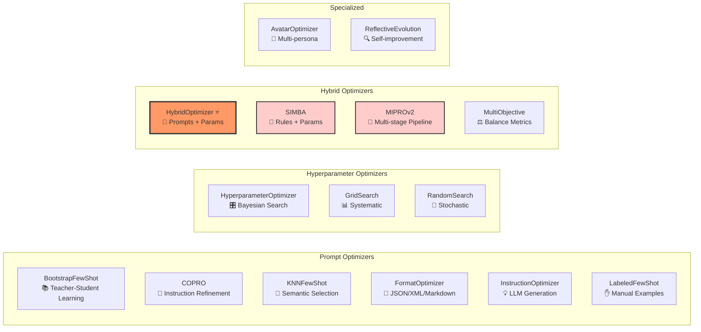
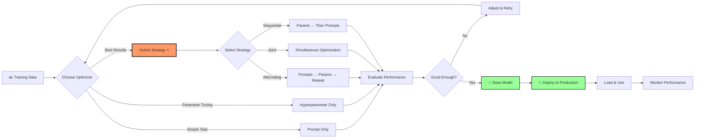

# LogiLLM

**Program language models with structured inputs and outputs, built for production.**

LogiLLM lets you define what you want from an LLM using Python signatures, then handles prompt engineering, output parsing, and optimization automatically.

## Quick Example

```python
from logillm.core.predict import Predict
from logillm.providers import create_provider, register_provider

# Setup (one time)
provider = create_provider("openai")
register_provider(provider, set_default=True)

# Define what you want
analyzer = Predict("text -> sentiment: str")

# Use it
result = await analyzer(text="I love this new feature!")
print(result.sentiment)  # "positive"
```

Instead of crafting prompts and parsing responses, you specify the input/output structure. LogiLLM handles the rest.

## What You Can Build

**📧 Smart Email Processing** - Classify, extract entities, determine urgency  
**📝 Document Generation** - Create structured reports from data  
**🤖 Reasoning Agents** - Multi-step analysis with external tool integration  
**🎮 Interactive Systems** - Games, chatbots, personalized experiences  
**💾 Persistent AI** - Systems that remember and learn from interactions

## Key Features

- **🎯 Structured I/O** - Type-safe inputs and outputs with automatic validation
- **⚡ Zero Dependencies** - Core library uses only Python standard library
- **🚀 Production Ready** - Full async support, comprehensive error handling, observability
- **🔧 Auto-Optimization** - Improve performance by optimizing prompts AND hyperparameters
- **💾 Built-in Persistence** - Save and load optimized models instantly
- **📊 JSONL Logging** - Track optimization runs with complete reproducibility
- **🔍 Complete Debug Logging** - Capture full request/response data from LLM APIs

## Installation

```bash
# Core library 
pip install logillm

# With LLM providers
pip install logillm[openai]     # For GPT models
pip install logillm[anthropic]  # For Claude models
```

## Learning Path

### 📚 Complete Documentation
- **[Getting Started Guide](docs/tutorials/getting-started.md)** - Personalized tutorial recommendations
- **[Tutorial Matrix](docs/tutorials/tutorial-matrix.md)** - Difficulty levels and time estimates  
- **[Tutorial Examples](examples/tutorials/)** - Complete working code for all tutorials

**→ [Full Tutorial Index](docs/tutorials/README.md)** - 6 complete tutorials from beginner to advanced

## Working Examples

### Basic Classification
```python
# Classify text into categories
classifier = Predict("text -> category: str")
result = await classifier(text="I need help with my billing account")
print(result.category)  # "Billing"
```

### Multi-Output Prediction
```python
# Get multiple outputs in one call
analyzer = Predict("text -> sentiment: str, confidence: float")
result = await analyzer(text="This product is amazing!")
print(result.sentiment)   # "positive"  
print(result.confidence)  # 0.97
```

### Complex Type Support (New!)
```python
# Work with lists, dictionaries, and optional types
extractor = Predict("document: str -> entities: dict[str, list[str]], summary: Optional[str]")
result = await extractor(document="Apple Inc. announced iPhone 15 in Cupertino.")
print(result.entities)  # {"companies": ["Apple Inc."], "products": ["iPhone 15"], "locations": ["Cupertino"]}

# Use Union types with pipe syntax
processor = Predict("data: str | bytes -> processed: bool, format: str")
```

### Multimodal Capabilities (New!)
```python
from logillm.core.signatures.types import Image, Audio, Tool

# Vision analysis
vision = Predict("image: Image -> description: str, objects: list[str], confidence: float")
result = await vision(image=Image.from_path("photo.jpg"))
print(result.objects)  # ["person", "laptop", "coffee"]

# Audio processing
transcriber = Predict("audio: Audio -> transcript: str, language: str")
result = await transcriber(audio=Audio.from_url("https://example.com/speech.mp3"))

# Tool/Function calling
tool_agent = Predict("query: str -> tool_calls: list[Tool], explanation: str")
```

### Structured Signatures with Field Validation (Enhanced!)
```python
from logillm.core.signatures import Signature, InputField, OutputField

class TextAnalysis(Signature):
    # Required and optional fields with defaults
    text: str = InputField(description="Text to analyze")
    max_length: int = InputField(default=100, description="Maximum response length")
    
    # Output fields with type hints
    category: str = OutputField(description="Category like support, sales, billing")
    priority: int = OutputField(description="Priority 1-5 where 5 is most urgent")
    entities: list[str] = OutputField(description="Named entities found")

analyzer = Predict(signature=TextAnalysis)
result = await analyzer(text="My account is locked and I cannot access my files")
# Automatically validates inputs and outputs against field specifications
print(result.category)  # "Account Access"
print(result.priority)  # 1
```

## Production Features

### Multiple Providers
```python
# Set up multiple LLM providers  
openai_provider = create_provider("openai", model="gpt-4.1")
register_provider(openai_provider, "fast")

# Use the registered provider (becomes default)
result = await Predict("text -> summary: str")(text="Long document to summarize...")
print(result.summary)  # "This document discusses..."
```

### Optimization (requires training data)
```python
# Optimize performance on your data
from logillm.optimizers import HybridOptimizer
from logillm.core.optimizers import AccuracyMetric

# Your labeled training examples
training_data = [
    {"inputs": {"text": "Great service!"}, "outputs": {"sentiment": "positive"}},
    {"inputs": {"text": "Poor quality"}, "outputs": {"sentiment": "negative"}},
    # ... more examples
]

# Optimize both prompts and hyperparameters  
classifier = Predict("text -> sentiment: str")
optimizer = HybridOptimizer(metric=AccuracyMetric(key="sentiment"))
result = await optimizer.optimize(module=classifier, dataset=training_data)

# Save optimized model
result.optimized_module.save("sentiment_model.json")

# Load in production
classifier = Predict.load("sentiment_model.json")
```

### Optimizer Comparison

LogiLLM provides a comprehensive suite of optimizers, each designed for different optimization scenarios:

| Optimizer | Type | What it Optimizes | Best For | Key Features |
|-----------|------|-------------------|----------|--------------|
| **HybridOptimizer** ⭐ | Hybrid | Prompts + Hyperparameters | Production systems | LogiLLM's killer feature - simultaneous optimization |
| **SIMBA** | Hybrid | Hyperparameters + Demos | Complex tasks | Introspective rule generation with mini-batches |
| **MIPROv2** | Prompt | Instructions + Demos | Multi-stage optimization | Bayesian optimization with multi-objective support |
| **COPRO** | Prompt | Instructions | Instruction refinement | Breadth-first search with temperature control |
| **BootstrapFewShot** | Prompt | Few-shot examples | Learning from data | Teacher-student demonstration generation |
| **KNNFewShot** | Prompt | Example selection | Dynamic examples | Semantic similarity-based selection |
| **FormatOptimizer** | Prompt | Output format | Format discovery | Tests JSON vs XML vs Markdown |
| **InstructionOptimizer** | Prompt | Task instructions | Instruction clarity | LLM-based instruction generation |
| **LabeledFewShot** | Prompt | Hand-crafted examples | Baseline comparison | Traditional few-shot approach |
| **HyperparameterOptimizer** | Hyperparameter | Temperature, top_p, etc. | Parameter tuning | Bayesian, Grid, Random search |
| **AvatarOptimizer** | Ensemble | Multiple personas | Complex reasoning | Multi-perspective ensemble |
| **ReflectiveEvolution** | Prompt | Execution traces | Self-improvement | LLM reflection on past runs |
| **MultiObjective** | Hybrid | Multiple metrics | Trade-off optimization | Balance accuracy, cost, latency |

### Optimizer Taxonomy



### Optimization Workflow



### Choosing the Right Optimizer

**For most use cases:** Start with `HybridOptimizer` - it optimizes both prompts and hyperparameters:
```python
optimizer = HybridOptimizer(
    metric=your_metric,
    strategy="alternating"  # or "joint", "sequential"
)
```

**For specific scenarios:**
- **Limited training data?** → Use `LabeledFewShot` with hand-crafted examples
- **Need dynamic examples?** → Use `KNNFewShot` for semantic similarity selection
- **Complex multi-step tasks?** → Use `MIPROv2` for sophisticated pipeline optimization
- **Want to understand why it works?** → Use `SIMBA` for introspective rule generation
- **Multiple competing objectives?** → Use `MultiObjective` to balance trade-offs

### JSONL Logging for Optimization Tracking
```python
# Track and analyze optimization runs
from logillm.core.jsonl_logger import OptimizationLogger

logger = OptimizationLogger(filepath="optimization.jsonl")
result = await logger.log_optimization(
    optimizer=optimizer,
    module=classifier,
    dataset=training_data,
    validation_set=validation_data
)

# Analyze the log
import json
with open("optimization.jsonl") as f:
    events = [json.loads(line) for line in f]
    
# See score progression, hyperparameters, prompts, and more
for event in events:
    if event['event_type'] == 'evaluation_end':
        print(f"Score: {event['score']:.2%}")
```

**[→ Full JSONL Logging Documentation](docs/features/jsonl-logging.md)**

## Why LogiLLM?

**Coming from prompt engineering?** Stop writing brittle string templates. Define structured inputs/outputs and let LogiLLM handle prompt construction.

**Coming from dspy?** Get better performance through hybrid optimization (prompts + hyperparameters), zero-dependency deployment, and more modern Python standards.

**Building production systems?** Native async support, comprehensive error handling, automatic retries, and observability built-in.

## What's Different from DSPy?

- **Hybrid Optimization** - Optimize both prompts AND hyperparameters simultaneously  
- **Zero Dependencies** - Core framework uses only Python standard library
- **Production First** - Built for scaling, monitoring, and maintenance from day one
- **Type Safety** - Full Pydantic integration with IDE support
- **Modern Python** - Async/await throughout, Python 3.9+ features

## Getting Help

- **📚 [Start with Tutorials](docs/tutorials/README.md)** - 6 hands-on tutorials, 15-40 minutes each
- **🤔 [Getting Started Guide](docs/tutorials/getting-started.md)** - Personalized recommendations  
- **⚡ [Quick Examples](examples/tutorials/)** - Working code for common patterns
- **🐛 Issues** - Report bugs or request features on GitHub

---

**Ready to build?** Start with the **[LLM Text Generation tutorial](docs/tutorials/llms-txt-generation.md)** (15 minutes) or browse **[all tutorials](docs/tutorials/README.md)** to find your perfect starting point.
