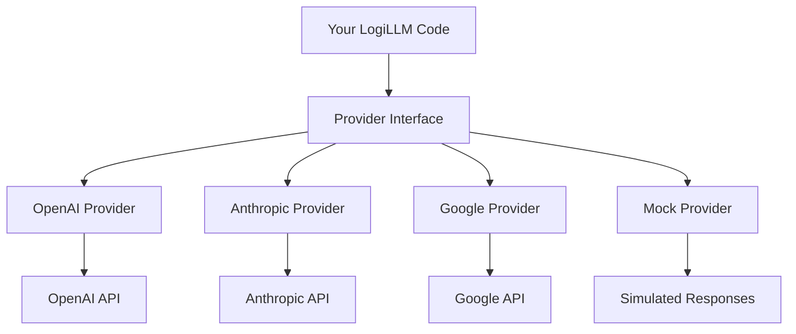

# LogiLLM Provider System

*Connecting to different LLM services*

## ELI5: What are Providers?

Think of providers as translators between LogiLLM and different AI services:

- **OpenAI Provider** talks to GPT-4, GPT-3.5, and other OpenAI models
- **Anthropic Provider** talks to Claude models  
- **Google Provider** talks to Gemini models
- **Mock Provider** simulates AI responses for testing

Each provider handles the specific details of how to talk to its service, so your LogiLLM code works the same regardless of which AI you're using!

## Architecture Overview

The provider system follows a clean abstraction pattern:



This means you can switch providers without changing your application code:

```python
from logillm import Predict
from logillm.providers import OpenAIProvider, AnthropicProvider

# Same code works with different providers
qa_with_openai = Predict("question -> answer", provider=OpenAIProvider("gpt-4.1"))
qa_with_claude = Predict("question -> answer", provider=AnthropicProvider("claude-3"))

# Identical usage
result1 = await qa_with_openai(question="What is Python?")
result2 = await qa_with_claude(question="What is Python?")
```

## Base Provider Class

All providers inherit from the base `Provider` class, which provides:

### Core Interface

```python
from logillm.providers import Provider

class Provider:
    async def complete(self, messages: list[dict], **kwargs) -> Completion:
        """Generate text completion from messages"""
        
    async def embed(self, texts: list[str], **kwargs) -> list[list[float]]:
        """Generate embeddings for texts"""
        
    def complete_sync(self, messages: list[dict], **kwargs) -> Completion:
        """Synchronous wrapper for complete()"""
        
    async def complete_with_retry(self, messages: list[dict], **kwargs) -> Completion:
        """Complete with automatic retry on failure"""
```

### Standard Features

**Parameter Management**: All providers support standardized parameters:

```python
provider = OpenAIProvider("gpt-4.1")

# Get available parameters
specs = provider.get_param_specs()
print(specs.keys())  # temperature, max_tokens, top_p, etc.

# Validate parameters  
valid, errors = provider.validate_params({
    "temperature": 0.8,
    "max_tokens": 100,
    "invalid_param": "bad"
})
```

**Automatic Retry**: Built-in retry with exponential backoff:

```python
# Automatically retries on rate limits, timeouts, and transient errors
completion = await provider.complete_with_retry(messages, max_retries=3)
```

**Caching**: Optional response caching for performance:

```python
from logillm.types import CacheLevel

provider = OpenAIProvider("gpt-4.1", cache_level=CacheLevel.MEMORY)
```

**Metrics Tracking**: Monitor usage and performance:

```python
provider.reset_metrics()
await provider.complete(messages)

metrics = provider.get_metrics()
print(f"Total calls: {metrics['total_calls']}")
print(f"Total tokens: {metrics['total_tokens']}")
```

## OpenAI Provider

The OpenAI provider supports all OpenAI models including GPT-4, GPT-3.5, and o1 reasoning models.

### Basic Usage

```python
from logillm.providers import OpenAIProvider
import os

# Initialize with API key (or use OPENAI_API_KEY env var)
provider = OpenAIProvider(
    model="gpt-4.1",  # Default model
    api_key=os.environ.get("OPENAI_API_KEY")
)

# Simple completion
messages = [{"role": "user", "content": "Hello, world!"}]
completion = await provider.complete(messages)
print(completion.text)
```

### Advanced Features

**Model-Specific Optimization**: The provider automatically adjusts for different model types:

```python
# For o1 reasoning models, automatically uses correct parameters
o1_provider = OpenAIProvider("o1-preview")
# Automatically removes unsupported params like temperature
completion = await o1_provider.complete(messages, temperature=0.7)  # temperature ignored

# For vision models, enables image support
vision_provider = OpenAIProvider("gpt-4o") 
print(vision_provider.supports_vision())  # True
```

**Structured Output**: Native support for structured responses:

```python
from pydantic import BaseModel

class Answer(BaseModel):
    answer: str
    confidence: float
    reasoning: list[str]

# Get structured response
structured = await provider.create_structured_completion(
    messages=[{"role": "user", "content": "What is 2+2?"}],
    response_format=Answer
)
print(f"Answer: {structured.answer}")
print(f"Confidence: {structured.confidence}")
```

**Function Calling**: Built-in support for tool use:

```python
tools = [
    {
        "type": "function",
        "function": {
            "name": "calculate",
            "description": "Perform calculations",
            "parameters": {
                "type": "object",
                "properties": {
                    "expression": {"type": "string", "description": "Math expression"}
                },
                "required": ["expression"]
            }
        }
    }
]

completion = await provider.complete(
    messages=[{"role": "user", "content": "What is 15 * 23?"}],
    tools=tools,
    tool_choice="auto"
)

if completion.metadata.get("tool_calls"):
    print("Model wants to use calculator tool")
```

**Streaming Support**: Real-time response streaming:

```python
print(provider.supports_streaming())  # True

async for chunk in provider.stream(messages):
    print(chunk, end="", flush=True)
```

**Embeddings**: Text embeddings with appropriate models:

```python
texts = ["Hello world", "Goodbye world"]
embeddings = await provider.embed(texts, model="text-embedding-3-small")
print(f"Got {len(embeddings)} embeddings of dimension {len(embeddings[0])}")
```

### Parameter Handling

The OpenAI provider validates and cleans parameters:

```python
# Supports all standard OpenAI parameters
completion = await provider.complete(
    messages=messages,
    temperature=0.8,
    max_tokens=150,
    top_p=0.9,
    frequency_penalty=0.5,
    presence_penalty=0.5,
    stop=["END"],
    seed=42
)
```

### Error Handling

Comprehensive error handling with provider-specific exceptions:

```python
from logillm.providers.base import RateLimitError, TimeoutError, ProviderError

try:
    completion = await provider.complete(messages)
except RateLimitError:
    print("Hit rate limit, will retry automatically")
except TimeoutError:
    print("Request timed out")
except ProviderError as e:
    print(f"Provider error: {e}")
```

## Anthropic Provider

Support for Claude models from Anthropic.

### Basic Usage

```python
from logillm.providers import AnthropicProvider

provider = AnthropicProvider(
    model="claude-3-opus-20240229",
    api_key=os.environ.get("ANTHROPIC_API_KEY")
)

completion = await provider.complete(messages)
```

### Claude-Specific Features

**System Messages**: Proper handling of system prompts:

```python
messages = [
    {"role": "system", "content": "You are a helpful assistant."},
    {"role": "user", "content": "Hello!"}
]
completion = await provider.complete(messages)
```

**Long Context**: Support for Claude's large context windows:

```python
# Claude 3 supports up to 200K tokens
long_messages = [{"role": "user", "content": "..." * 50000}]  # Very long input
completion = await provider.complete(long_messages, max_tokens=4000)
```

## Google Provider

Support for Gemini models from Google.

### Basic Usage

```python
from logillm.providers import GoogleProvider

provider = GoogleProvider(
    model="gemini-pro",
    api_key=os.environ.get("GOOGLE_API_KEY")
)

completion = await provider.complete(messages)
```

### Gemini-Specific Features

**Multimodal Support**: Text and image inputs:

```python
# Vision capabilities with Gemini Pro Vision
if provider.supports_vision():
    multimodal_messages = [
        {
            "role": "user", 
            "content": [
                {"type": "text", "text": "What do you see?"},
                {"type": "image_url", "image_url": {"url": "data:image/jpeg;base64,..."}}
            ]
        }
    ]
    completion = await provider.complete(multimodal_messages)
```

## Mock Provider

For testing and development without API costs.

### Basic Usage

```python
from logillm.providers import MockProvider

provider = MockProvider()

# Returns simulated responses
completion = await provider.complete(messages)
print(completion.text)  # "This is a simulated response."
```

### Configuration

**Custom Responses**: Set specific responses for testing:

```python
provider = MockProvider(
    responses={
        "hello": "Hello! How can I help you?",
        "goodbye": "Goodbye! Have a great day!"
    },
    default_response="I'm a mock AI assistant."
)

# Returns custom response for "hello"
completion = await provider.complete([{"role": "user", "content": "hello"}])
```

**Simulated Failures**: Test error handling:

```python
provider = MockProvider(
    failure_rate=0.2,  # 20% of requests fail
    simulate_rate_limits=True
)

# May raise RateLimitError for testing
try:
    completion = await provider.complete(messages)
except RateLimitError:
    print("Simulated rate limit hit")
```

**Token Usage Simulation**: Realistic usage tracking:

```python
provider = MockProvider(simulate_usage=True)
completion = await provider.complete(messages)
print(f"Simulated tokens: {completion.usage.tokens.total_tokens}")
```

## Provider Registry

Manage multiple providers with the registry system:

### Basic Registry Usage

```python
from logillm.providers import get_provider, register_provider, create_provider

# Register providers
openai_provider = create_provider("openai", model="gpt-4.1")
claude_provider = create_provider("anthropic", model="claude-3")

register_provider(openai_provider, name="gpt4")
register_provider(claude_provider, name="claude", set_default=True)

# Use registered providers
default_provider = get_provider()  # Returns claude (set as default)
gpt4_provider = get_provider("gpt4")
```

### Factory Functions

**Convenient Provider Creation**:

```python
# Create providers with minimal configuration
openai = create_provider("openai", model="gpt-4.1")
anthropic = create_provider("anthropic", model="claude-3")
google = create_provider("google", model="gemini-pro")
mock = create_provider("mock")

# Providers are automatically configured with environment variables
```

### Multi-Provider Applications

**Provider Comparison**: Test multiple providers easily:

```python
providers = [
    create_provider("openai", model="gpt-4.1"),
    create_provider("anthropic", model="claude-3"),
    create_provider("google", model="gemini-pro")
]

question = "Explain quantum computing"
results = []

for provider in providers:
    completion = await provider.complete([
        {"role": "user", "content": question}
    ])
    results.append({
        "provider": provider.name,
        "model": provider.model,
        "response": completion.text,
        "tokens": completion.usage.tokens.total_tokens
    })

# Compare responses and costs
for result in results:
    print(f"{result['provider']} ({result['model']}): {result['tokens']} tokens")
```

## Advanced Features

### Parameter Specifications

Each provider defines supported parameters:

```python
# Get parameter specs for validation and UI generation
specs = provider.get_param_specs()

for name, spec in specs.items():
    print(f"{name}: {spec.param_type.value}")
    if spec.range:
        print(f"  Range: {spec.range[0]} - {spec.range[1]}")
    print(f"  Default: {spec.default}")
    print(f"  Description: {spec.description}")
```

### Parameter Presets

Use predefined parameter combinations:

```python
from logillm.types import ParamPreset

# Apply presets for different use cases
creative_config = provider.get_param_presets()[ParamPreset.CREATIVE]
factual_config = provider.get_param_presets()[ParamPreset.FACTUAL]

# Use in completions
completion = await provider.complete(messages, **creative_config)
```

### Health Monitoring

Built-in health checks and monitoring:

```python
# Check provider health
healthy = await provider.health_check()
print(f"Provider healthy: {healthy}")

# Get current status
status = provider.get_health_status()
print(f"Current status: {status}")

# Monitor metrics over time
provider.reset_metrics()
# ... use provider ...
metrics = provider.get_metrics()
print(f"Calls: {metrics.get('total_calls', 0)}")
print(f"Tokens: {metrics.get('total_tokens', 0)}")
print(f"Errors: {metrics.get('error_count', 0)}")
```

### Custom Providers

Create your own provider for custom services:

```python
from logillm.providers.base import Provider
from logillm.types import Completion, Usage

class CustomProvider(Provider):
    def __init__(self, api_endpoint: str, **kwargs):
        super().__init__(name="custom", **kwargs)
        self.api_endpoint = api_endpoint
    
    async def complete(self, messages: list[dict], **kwargs) -> Completion:
        # Your custom implementation
        response_text = await self._call_custom_api(messages, **kwargs)
        
        return Completion(
            text=response_text,
            usage=Usage(tokens=TokenUsage(input_tokens=10, output_tokens=20)),
            provider=self.name,
            model=self.model
        )
    
    async def embed(self, texts: list[str], **kwargs) -> list[list[float]]:
        # Your custom embedding implementation
        return [[0.1] * 768 for _ in texts]  # Dummy embeddings
    
    async def _call_custom_api(self, messages: list[dict], **kwargs) -> str:
        # Implement your API call logic
        return "Custom API response"

# Use your custom provider
custom = CustomProvider(api_endpoint="https://my-api.com/v1")
register_provider(custom, name="custom")
```

## Performance Optimization

### Connection Pooling

Providers automatically manage connection pooling:

```python
# Providers reuse connections for efficiency
provider = OpenAIProvider("gpt-4.1")

# Multiple requests use the same connection pool
tasks = [
    provider.complete([{"role": "user", "content": f"Question {i}"}])
    for i in range(10)
]
results = await asyncio.gather(*tasks)
```

### Batching

Some providers support request batching:

```python
# Batch multiple requests for efficiency
requests = [
    [{"role": "user", "content": "What is AI?"}],
    [{"role": "user", "content": "What is ML?"}],
    [{"role": "user", "content": "What is DL?"}]
]

# Process in parallel
results = await asyncio.gather(*[
    provider.complete(messages) for messages in requests
])
```

### Caching Strategies

Configure caching for your use case:

```python
from logillm.types import CacheLevel

# Memory caching for development
dev_provider = OpenAIProvider("gpt-3.5-turbo", cache_level=CacheLevel.MEMORY)

# Disk caching for production
prod_provider = OpenAIProvider("gpt-4.1", cache_level=CacheLevel.DISK)

# No caching for real-time applications
realtime_provider = OpenAIProvider("gpt-4.1", cache_level=CacheLevel.NONE)
```

## Best Practices

### 1. Use Environment Variables

Store API keys securely:

```bash
# Set environment variables
export OPENAI_API_KEY="sk-..."
export ANTHROPIC_API_KEY="sk-ant-..."
export GOOGLE_API_KEY="AI..."
```

```python
# Providers automatically read from environment
openai = create_provider("openai", model="gpt-4.1")  # Uses OPENAI_API_KEY
claude = create_provider("anthropic", model="claude-3")  # Uses ANTHROPIC_API_KEY
```

### 2. Handle Errors Gracefully

Always handle provider errors:

```python
from logillm.providers.base import ProviderError, RateLimitError

try:
    completion = await provider.complete(messages)
except RateLimitError:
    # Wait and retry
    await asyncio.sleep(60)
    completion = await provider.complete(messages)
except ProviderError as e:
    # Log error and use fallback
    logger.error(f"Provider error: {e}")
    completion = await fallback_provider.complete(messages)
```

### 3. Monitor Usage

Track costs and usage:

```python
provider.reset_metrics()

# Use the provider
for question in questions:
    await provider.complete([{"role": "user", "content": question}])

# Check usage
metrics = provider.get_metrics()
print(f"Total tokens used: {metrics.get('total_tokens', 0)}")
print(f"Estimated cost: ${metrics.get('total_tokens', 0) * 0.00002}")  # Rough estimate
```

### 4. Use Appropriate Models

Choose models based on your needs:

```python
# For simple tasks, use efficient models
simple_provider = OpenAIProvider("gpt-3.5-turbo")

# For complex reasoning, use powerful models
complex_provider = OpenAIProvider("gpt-4.1")

# For structured output, use models that support it
structured_provider = OpenAIProvider("gpt-4.1")  # Supports response_format
```

### 5. Test with Mock Provider

Use mock provider for testing:

```python
# Development and testing
if os.environ.get("TESTING"):
    provider = MockProvider(responses={
        "test question": "test answer"
    })
else:
    provider = OpenAIProvider("gpt-4.1")

# Your code works the same way
completion = await provider.complete(messages)
```

## Provider Comparison

| Feature | OpenAI | Anthropic | Google | Mock |
|---------|--------|-----------|--------|------|
| **Models** | GPT-4, GPT-3.5, o1 | Claude 3 | Gemini | Simulated |
| **Streaming** | ✅ Yes | ✅ Yes | ✅ Yes | ✅ Yes |
| **Function Calling** | ✅ Yes | ⚠️ Limited | ⚠️ Limited | ✅ Yes |
| **Structured Output** | ✅ Yes | ❌ No | ❌ No | ✅ Yes |
| **Vision Support** | ✅ Yes (GPT-4V) | ✅ Yes | ✅ Yes | ✅ Yes |
| **Context Length** | 128K+ | 200K+ | 1M+ | Unlimited |
| **Cost** | $$$ | $$$ | $ | Free |

The provider system gives you flexibility to use different AI services while keeping your code consistent and maintainable. Choose the provider that best fits your needs, or use multiple providers for different tasks!