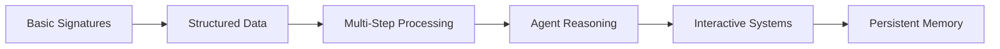

# LogiLLM Tutorial Difficulty Matrix

This comprehensive matrix helps you understand the complexity, prerequisites, and learning outcomes of each tutorial at a glance.

## 📊 Complete Tutorial Overview

| Tutorial | Difficulty | Time | Prerequisites | Key Concepts | Real-World Skills |
|----------|------------|------|---------------|---------------|-------------------|
| **[LLM Text Generation](./llms-txt-generation.md)** | 🟢 Beginner | 10-15 min | None | Signatures, Predict, Providers | Documentation automation |
| **[Email Extraction](./email-extraction.md)** | 🟢 Beginner | 15-20 min | Basic Python | Pydantic, Validation | Data processing pipelines |
| **[Code Generation](./code-generation.md)** | 🟡 Intermediate | 20-25 min | Python, APIs | Web scraping, Multi-step | Developer tooling |
| **[Yahoo Finance ReAct](./yahoo-finance-react.md)** | 🟡 Intermediate | 25-30 min | Python, APIs | ReAct, Tool integration | Financial analysis |
| **[AI Text Game](./ai-text-game.md)** | 🟠 Intermediate-Advanced | 20-25 min | Python, OOP | State management, Interactive | Game development |
| **[Memory-Enhanced ReAct](./memory-enhanced-react.md)** | 🔴 Advanced | 30-40 min | All previous concepts | Persistence, Memory | AI assistants |

## 🎯 Difficulty Breakdown

### 🟢 Beginner Tutorials
**Perfect for:** First-time LogiLLM users, AI newcomers, proof-of-concept builders

#### [LLM Text Generation](./llms-txt-generation.md)
- **Complexity:** Very Low
- **New Concepts:** 3 (Signatures, Predict, Providers)
- **Code Complexity:** Simple functions and classes
- **External Dependencies:** GitHub API (optional)
- **Error Handling:** Basic
- **Production Ready:** With minor additions

#### [Email Extraction](./email-extraction.md)  
- **Complexity:** Low
- **New Concepts:** 4 (Pydantic models, Field validation, Classification, Structured output)
- **Code Complexity:** Data classes and basic processing
- **External Dependencies:** None (demo data included)
- **Error Handling:** Input validation
- **Production Ready:** Yes, with proper email integration

### 🟡 Intermediate Tutorials
**Perfect for:** Developers ready for multi-step systems, API integration, real-world complexity

#### [Code Generation](./code-generation.md)
- **Complexity:** Medium
- **New Concepts:** 5 (Web scraping, Iterative refinement, External APIs, Multi-step workflows, Error recovery)
- **Code Complexity:** Multiple interacting modules
- **External Dependencies:** requests, BeautifulSoup, lxml
- **Error Handling:** Network timeouts, parsing failures
- **Production Ready:** Requires rate limiting and caching

#### [Yahoo Finance ReAct](./yahoo-finance-react.md)
- **Complexity:** Medium-High  
- **New Concepts:** 6 (ReAct pattern, Tool integration, Agent planning, Financial APIs, Decision making, Real-time data)
- **Code Complexity:** Agent architecture with tools
- **External Dependencies:** yfinance
- **Error Handling:** API failures, data validation
- **Production Ready:** Requires market data subscriptions

### 🟠 Intermediate-Advanced Tutorials
**Perfect for:** Interactive system builders, game developers, advanced state management

#### [AI Text Game](./ai-text-game.md)
- **Complexity:** Medium-High
- **New Concepts:** 6 (Interactive systems, Game state, Dynamic narratives, User input handling, Save/load, Event loops)  
- **Code Complexity:** Stateful system with user interaction
- **External Dependencies:** None
- **Error Handling:** User input validation, state consistency
- **Production Ready:** Requires UI/UX improvements

### 🔴 Advanced Tutorials  
**Perfect for:** AI system architects, production AI builders, memory system designers

#### [Memory-Enhanced ReAct Agent](./memory-enhanced-react.md)
- **Complexity:** High
- **New Concepts:** 8 (Persistent memory, User profiles, Memory search, Conversation context, Multi-user systems, Memory analytics, ReAct + Memory, Advanced persistence)
- **Code Complexity:** Multi-module system with persistence
- **External Dependencies:** Pydantic (for complex data models)
- **Error Handling:** Memory corruption, user isolation, data consistency
- **Production Ready:** Yes, designed for production use

## 🛤️ Learning Path Analysis

### Technical Skill Progression

### Concept Dependencies
| Tutorial | Builds On | Introduces | Enables |
|----------|-----------|------------|---------|
| **LLM Text Generation** | None | Core LogiLLM patterns | All other tutorials |
| **Email Extraction** | Signatures, Predict | Pydantic integration | Structured data patterns |
| **Code Generation** | Structured output | Multi-step processing | Complex workflows |
| **Yahoo Finance ReAct** | Multi-step workflows | Agent reasoning | Intelligent systems |
| **AI Text Game** | Agent reasoning | Interactive patterns | User-driven applications |
| **Memory-Enhanced ReAct** | Interactive systems | Persistence patterns | Production AI systems |

## 📈 Time Investment vs. Learning Outcomes

### Quick Wins (Under 20 minutes)
- **[LLM Text Generation](./llms-txt-generation.md)**: Immediate useful output
- **[Email Extraction](./email-extraction.md)**: Production-ready patterns

### Skill Building (20-30 minutes)
- **[Code Generation](./code-generation.md)**: Complex workflow management
- **[Yahoo Finance ReAct](./yahoo-finance-react.md)**: Agent architecture
- **[AI Text Game](./ai-text-game.md)**: Interactive systems

### Mastery (30+ minutes)
- **[Memory-Enhanced ReAct Agent](./memory-enhanced-react.md)**: Complete AI system

## 🎓 Prerequisites Deep Dive

### Technical Prerequisites
| Tutorial | Python Level | AI Experience | API Knowledge | Database Skills |
|----------|---------------|---------------|----------------|-----------------|
| LLM Text Generation | Basic | None | Optional | None |
| Email Extraction | Basic | None | None | None |
| Code Generation | Intermediate | Helpful | Required | None |
| Yahoo Finance ReAct | Intermediate | Helpful | Required | None |
| AI Text Game | Intermediate | None | None | None |
| Memory-Enhanced ReAct | Advanced | Recommended | None | Helpful |

### Conceptual Prerequisites
| Tutorial | LogiLLM Concepts | External Concepts | Domain Knowledge |
|----------|------------------|-------------------|------------------|
| LLM Text Generation | None | Git/GitHub | Software documentation |
| Email Extraction | Signatures | Data validation | Email formats |
| Code Generation | Structured data | Web scraping | Software libraries |
| Yahoo Finance ReAct | Multi-step processing | Financial markets | Stock analysis |
| AI Text Game | Agent patterns | Game design | Interactive fiction |
| Memory-Enhanced ReAct | All previous | Database concepts | Conversational AI |

## 💡 Tutorial Selection Guide

### By Learning Style
**Visual Learners:** Start with [AI Text Game](./ai-text-game.md) - clear state changes and immediate feedback  
**Analytical Learners:** Start with [Email Extraction](./email-extraction.md) - structured, logical progression  
**Hands-On Learners:** Start with [LLM Text Generation](./llms-txt-generation.md) - immediate, useful results  
**Theory-First Learners:** Read all tutorial overviews, then start with [Yahoo Finance ReAct](./yahoo-finance-react.md)

### By Time Available  
**15 minutes:** [LLM Text Generation](./llms-txt-generation.md)  
**45 minutes:** First three tutorials  
**2 hours:** All beginner and intermediate tutorials  
**3 hours:** Complete series with experimentation time

### By Career Goals
**AI Researchers:** Complete all tutorials in order  
**Product Managers:** [LLM Text Generation](./llms-txt-generation.md) + [Email Extraction](./email-extraction.md) + [Memory-Enhanced ReAct Agent](./memory-enhanced-react.md)  
**Backend Developers:** [Email Extraction](./email-extraction.md) + [Code Generation](./code-generation.md) + [Yahoo Finance ReAct](./yahoo-finance-react.md)  
**Full-Stack Developers:** [AI Text Game](./ai-text-game.md) + [Memory-Enhanced ReAct Agent](./memory-enhanced-react.md)  
**Data Scientists:** [Yahoo Finance ReAct](./yahoo-finance-react.md) + [Memory-Enhanced ReAct Agent](./memory-enhanced-react.md)

## 🎯 Skill Validation Checkpoints

### After Beginner Tutorials
Can you build a system that:
- [ ] Takes user input and generates structured responses?
- [ ] Validates and processes data reliably?  
- [ ] Integrates with external APIs?
- [ ] Handles errors gracefully?

### After Intermediate Tutorials  
Can you build a system that:
- [ ] Reasons through multi-step problems?
- [ ] Uses external tools and data sources?
- [ ] Maintains state across interactions?
- [ ] Adapts behavior based on context?

### After Advanced Tutorials
Can you build a system that:
- [ ] Remembers information across sessions?
- [ ] Personalizes responses for different users?
- [ ] Scales to handle multiple concurrent users?
- [ ] Provides production-ready reliability?

## 🚀 Next Steps After Tutorials

### Immediate Applications
- Deploy tutorials to cloud platforms (Heroku, Railway, Fly.io)
- Integrate with existing applications
- Build custom variations for your use cases

### Advanced Development
- Multi-agent systems using tutorial patterns
- Custom LogiLLM provider development  
- Performance optimization and scaling
- Advanced persistence with databases

### Community Contribution
- Share your custom tutorials
- Contribute to LogiLLM documentation
- Build example applications
- Help other developers learn

---

**Ready to dive in?** Use this matrix to choose your perfect starting point, then head to the **[Tutorial Index](./README.md)** or jump straight into **[Getting Started](./getting-started.md)** for personalized recommendations!