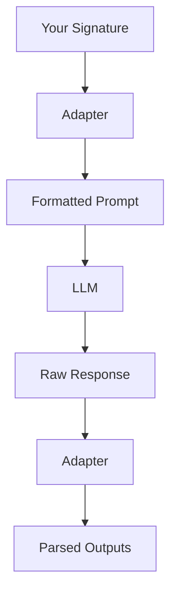

# LogiLLM Adapter System

*Converting between signatures and LLM formats*

## ELI5: What are Adapters?

Think of adapters like translators that help LogiLLM talk to different AI models:

- **ChatAdapter** speaks in conversations (like ChatGPT)
- **JSONAdapter** speaks in structured data (like API responses)
- **MarkdownAdapter** speaks in formatted text (like documentation)
- **XMLAdapter** speaks in structured markup (like web pages)

Each adapter knows how to:
1. **Format** your inputs into prompts the AI understands
2. **Parse** the AI's responses back into structured outputs

It's like having different translators for different languages - your LogiLLM code stays the same, but the adapters handle the communication details!

## Architecture Overview

The adapter system creates a clean separation between your application logic and the specific format requirements of different LLMs:



**Input Flow (Formatting)**:
1. Your signature defines what inputs and outputs you expect
2. Adapter converts inputs + signature into an LLM-specific prompt
3. LLM receives the properly formatted prompt

**Output Flow (Parsing)**:
1. LLM returns raw text response
2. Adapter parses the response into structured outputs
3. You get back clean, typed data

## Base Adapter Interface

All adapters inherit from `BaseAdapter` and implement two key methods:

```python
from logillm.adapters import BaseAdapter

class BaseAdapter:
    def format_prompt(
        self, 
        signature, 
        inputs: dict[str, Any], 
        demos: list[dict] | None = None
    ) -> str:
        """Convert signature + inputs into LLM prompt"""
        
    def parse_response(self, signature, response: str) -> dict[str, Any]:
        """Parse LLM response into structured outputs"""
```

### Key Features

**Zero Dependencies**: All adapters use only Python standard library:
- No external parsing libraries
- No proprietary formats
- Maximum compatibility and reliability

**Error Recovery**: Smart parsing with fallback strategies:
- Multiple parsing attempts with different techniques
- Graceful degradation when parsing fails
- Detailed error messages for debugging

**Type Awareness**: Understands field types for better conversion:
- Numeric fields get appropriate parsing
- List fields handle array formats
- Boolean fields understand various representations

## Chat Adapter

The `ChatAdapter` is the most commonly used adapter, designed for conversational interfaces.

### How It Works

**Formatting**: Creates conversational prompts with clear structure:

```python
from logillm import Predict
from logillm.adapters import ChatAdapter

qa = Predict("question -> answer", adapter=ChatAdapter())

# Internally formats as:
# [system]: Task: Answer the question
# 
# Input fields:
# - question: The question to answer
# 
# Output fields (provide these in your response):
# - answer: The answer to provide
# 
# [user]: Input:
# question: What is the capital of France?
```

**Parsing**: Intelligently extracts structured outputs from conversational responses:

```python
# Can handle various response formats:

# 1. Key-value format
# "answer: Paris is the capital of France"

# 2. Natural language with extraction  
# "The capital of France is Paris"

# 3. Structured text
# "Based on geography, the answer is Paris"
```

### Advanced Features

**Type-Aware Parsing**: Handles different field types intelligently:

```python
from logillm.signatures import InputField, OutputField

class MathSignature:
    problem: str = InputField(desc="Math problem to solve")
    reasoning: str = OutputField(desc="Step-by-step solution")
    answer: float = OutputField(desc="Final numeric answer")
    confidence: float = OutputField(desc="Confidence level 0-1")

math = Predict(MathSignature, adapter=ChatAdapter())
result = await math(problem="What is 15% of 240?")

# Adapter automatically:
# - Extracts numeric values for 'answer' and 'confidence'
# - Handles text for 'reasoning'
# - Converts confidence words ("high" -> 0.85, "low" -> 0.15)
```

**Chain of Thought Support**: Special handling for reasoning patterns:

```python
from logillm import ChainOfThought

cot = ChainOfThought("problem -> answer", adapter=ChatAdapter())

# Automatically splits responses into reasoning and final answer
# Even if the model doesn't use explicit labels
```

**Demo Integration**: Seamlessly includes few-shot examples:

```python
qa.add_demo({
    "inputs": {"question": "What is 2+2?"},
    "outputs": {"answer": "4"}
})

# Formats demos as conversation examples:
# [user]: Input:
# question: What is 2+2?
# [assistant]: Output:  
# answer: 4
```

### Best Practices

**Use for**: General-purpose applications, Q&A systems, conversational AI, chain-of-thought reasoning

**Field Naming**: Use clear, descriptive field names:
```python
# Good
class TaskSignature:
    task_description: str = InputField()
    completion_steps: list[str] = OutputField()
    final_result: str = OutputField()

# Avoid
class TaskSignature:
    input: str = InputField()
    output: str = OutputField()
```

## JSON Adapter

The `JSONAdapter` produces structured JSON output, perfect for APIs and data processing.

### How It Works

**Formatting**: Requests explicit JSON structure:

```python
from logillm.adapters import JSONAdapter

data_processor = Predict(
    "text -> sentiment, confidence, keywords",
    adapter=JSONAdapter()
)

# Formats prompt as:
# Task: Process the text
#
# You will receive inputs and must provide outputs in JSON format.
#
# Input fields:
# - text: The text to process
#
# Output fields to provide in JSON:
# - sentiment (string): The sentiment
# - confidence (float): The confidence level  
# - keywords (list): Key words found
#
# Now process this input:
# {"text": "I love this product!"}
#
# Provide your output as valid JSON:
```

**Parsing**: Robust JSON extraction and repair:

```python
# Handles various JSON formats:

# 1. Clean JSON
# {"sentiment": "positive", "confidence": 0.9, "keywords": ["love", "product"]}

# 2. JSON in code blocks  
# ```json
# {"sentiment": "positive", "confidence": 0.9}
# ```

# 3. Malformed JSON with auto-repair
# {sentiment: "positive", confidence: 0.9,}  # Missing quotes, trailing comma
```

### Advanced Features

**JSON Repair**: Automatically fixes common JSON issues:
- Missing quotes around keys
- Trailing commas
- Single quotes instead of double quotes
- Incomplete objects

**Structured Output Integration**: Works with provider-specific structured output:

```python
from pydantic import BaseModel

class AnalysisResult(BaseModel):
    sentiment: str
    confidence: float
    keywords: list[str]

# With providers that support structured output
processor = Predict(
    AnalysisResult,
    adapter=JSONAdapter(use_structured_output=True)
)
```

**Nested Structure Support**: Handles complex nested data:

```python
class ComplexSignature:
    data: dict = InputField()
    analysis: dict[str, Any] = OutputField()
    metrics: list[dict[str, float]] = OutputField()

# Adapter handles arbitrarily nested JSON structures
```

### Best Practices

**Use for**: APIs, data pipelines, structured analysis, integration with other systems

**Schema Design**: Keep JSON schemas clear and well-typed:
```python
# Good - clear types and structure
class ProductAnalysis:
    product_name: str = OutputField()
    rating: float = OutputField(desc="Rating from 1.0 to 5.0")
    features: list[str] = OutputField(desc="List of key features")
    
# Avoid - vague or untyped
class ProductAnalysis:
    info: Any = OutputField()
    data: dict = OutputField()
```

## Markdown Adapter  

The `MarkdownAdapter` produces well-formatted markdown output, great for documentation and reports.

### How It Works

**Formatting**: Requests markdown structure with clear sections:

```python
from logillm.adapters import MarkdownAdapter

report_generator = Predict(
    "topic -> title, summary, details, conclusions",
    adapter=MarkdownAdapter()
)

# Prompts for markdown format:
# Create a markdown report with these sections:
#
# # Title
# ## Summary  
# ## Details
# ## Conclusions
#
# Topic: Machine Learning in Healthcare
```

**Parsing**: Extracts content from markdown sections:

```python
# Handles structured markdown:
# # Machine Learning in Healthcare
# 
# ## Summary
# ML is revolutionizing healthcare through predictive analytics...
#
# ## Details
# Key applications include:
# - Diagnostic imaging
# - Drug discovery
# 
# ## Conclusions
# The future looks promising but requires careful regulation...

# Parsed as:
# {
#   "title": "Machine Learning in Healthcare",
#   "summary": "ML is revolutionizing healthcare...",
#   "details": "Key applications include:\n- Diagnostic imaging\n- Drug discovery",
#   "conclusions": "The future looks promising..."
# }
```

### Best Practices

**Use for**: Reports, documentation, content creation, blog posts, technical writing

**Section Structure**: Use clear hierarchical sections:
```python
class ReportSignature:
    executive_summary: str = OutputField()
    methodology: str = OutputField()
    results: str = OutputField()
    recommendations: str = OutputField()
```

## XML Adapter

The `XMLAdapter` produces structured XML output, useful for formal documents and data exchange.

### How It Works

**Formatting**: Requests XML structure with proper tags:

```python
from logillm.adapters import XMLAdapter

document_creator = Predict(
    "content -> title, author, body, metadata",
    adapter=XMLAdapter()
)

# Requests XML format:
# Create XML output with these elements:
# <document>
#   <title>Document title</title>
#   <author>Author name</author>
#   <body>Main content</body>
#   <metadata>Additional info</metadata>
# </document>
```

**Parsing**: Extracts content from XML elements:

```python
# Handles XML responses:
# <document>
#   <title>AI Research Paper</title>
#   <author>Dr. Smith</author>
#   <body>This paper explores...</body>
#   <metadata>Published 2024</metadata>
# </document>

# Parsed as:
# {
#   "title": "AI Research Paper",
#   "author": "Dr. Smith", 
#   "body": "This paper explores...",
#   "metadata": "Published 2024"
# }
```

### Best Practices

**Use for**: Formal documents, data interchange, configuration files, structured content

## Text Adapter

The `TextAdapter` is the simplest adapter for plain text input/output.

### How It Works

**Formatting**: Creates simple text prompts:

```python
from logillm.adapters import TextAdapter

summarizer = Predict(
    "article -> summary",
    adapter=TextAdapter()
)

# Simple prompt:
# Task: Create a summary
# Article: [article text]
# Summary:
```

**Parsing**: Returns the response as-is or extracts specific patterns:

```python
# For single output fields, returns entire response
# For multiple fields, attempts to split by patterns
```

### Best Practices

**Use for**: Simple text processing, single input/output tasks, legacy systems

## Creating Custom Adapters

You can create custom adapters for specialized formats:

```python
from logillm.adapters import BaseAdapter
from logillm.types import AdapterFormat

class CustomAdapter(BaseAdapter):
    def __init__(self):
        self.format_type = AdapterFormat.CHAT  # Or create custom format
    
    def format_prompt(self, signature, inputs, demos=None) -> str:
        """Your custom formatting logic"""
        prompt = f"CUSTOM FORMAT\n"
        prompt += f"Task: {signature.instructions}\n"
        
        for key, value in inputs.items():
            prompt += f"{key.upper()}: {value}\n"
        
        prompt += "RESPOND IN CUSTOM FORMAT:\n"
        return prompt
    
    def parse_response(self, signature, response: str) -> dict[str, Any]:
        """Your custom parsing logic"""
        parsed = {}
        lines = response.split('\n')
        
        for line in lines:
            if ':' in line:
                key, value = line.split(':', 1)
                parsed[key.strip().lower()] = value.strip()
        
        return parsed

# Use your custom adapter
custom_module = Predict("task -> result", adapter=CustomAdapter())
```

## Adapter Chaining

Combine multiple adapters for complex workflows:

```python
from logillm.adapters import AdapterChain

# Chain adapters for multi-step processing
chain = AdapterChain([
    ChatAdapter(),      # Initial conversational processing
    JSONAdapter(),      # Convert to structured data
    MarkdownAdapter()   # Final formatting
])

complex_processor = Predict("input -> output", adapter=chain)
```

## Performance and Optimization

### Adapter Selection Guide

| Use Case | Recommended Adapter | Reason |
|----------|-------------------|---------|
| **Q&A Systems** | ChatAdapter | Natural conversation flow |
| **APIs** | JSONAdapter | Structured data exchange |
| **Reports** | MarkdownAdapter | Rich formatting |
| **Documents** | XMLAdapter | Formal structure |
| **Simple Text** | TextAdapter | Minimal overhead |
| **Multiple Outputs** | JSONAdapter | Clear field separation |
| **Chain of Thought** | ChatAdapter | Reasoning support |

### Optimization Tips

**Prompt Efficiency**: Different adapters create different prompt lengths:
- TextAdapter: Most compact
- ChatAdapter: Balanced
- JSONAdapter: More verbose (schema descriptions)
- XMLAdapter: Most verbose (tag structure)

**Parsing Speed**: 
- TextAdapter: Fastest (minimal parsing)
- ChatAdapter: Fast (pattern matching)
- JSONAdapter: Medium (JSON parsing + repair)
- XMLAdapter: Slower (XML parsing)

**Memory Usage**:
- All adapters use minimal memory
- JSON repair may use slightly more for complex objects
- Demo formatting scales with number of examples

## Error Handling

All adapters provide comprehensive error handling:

```python
from logillm.adapters import ParseError, AdapterError

try:
    result = await qa(question="Test question")
except ParseError as e:
    print(f"Failed to parse {e.adapter_name}: {e.reason}")
    print(f"Raw text: {e.text[:100]}...")
    
    # Try with different adapter
    fallback = Predict("question -> answer", adapter=TextAdapter())
    result = await fallback(question="Test question")
    
except AdapterError as e:
    print(f"Adapter error: {e}")
```

**Error Recovery Strategies**:

1. **Automatic Fallback**: Chain adapters from most to least structured
2. **Parser Selection**: Try multiple parsing strategies within adapter
3. **Graceful Degradation**: Return partial results when possible
4. **User Feedback**: Provide clear error messages for debugging

## Best Practices Summary

### 1. Choose the Right Adapter

Match adapter to use case:
```python
# Conversational AI
qa = Predict("question -> answer", adapter=ChatAdapter())

# API endpoints  
api = Predict("request -> response", adapter=JSONAdapter())

# Content generation
writer = Predict("topic -> article", adapter=MarkdownAdapter())
```

### 2. Design Clear Signatures

Use descriptive field names and types:
```python
class AnalysisSignature:
    text_input: str = InputField(desc="Text to analyze")
    sentiment_score: float = OutputField(desc="Sentiment from -1.0 to 1.0")
    key_themes: list[str] = OutputField(desc="Main themes identified")
    confidence_level: float = OutputField(desc="Confidence from 0.0 to 1.0")
```

### 3. Handle Errors Gracefully

Always plan for parsing failures:
```python
adapters = [JSONAdapter(), ChatAdapter(), TextAdapter()]

for adapter in adapters:
    try:
        module = Predict(signature, adapter=adapter)
        result = await module(**inputs)
        break
    except ParseError:
        continue
else:
    raise Exception("All adapters failed")
```

### 4. Test with Real Data

Validate adapters with actual LLM responses:
```python
# Test various response formats
test_responses = [
    '{"answer": "Paris"}',           # Perfect JSON
    'answer: Paris',                 # Key-value
    'The answer is Paris',           # Natural language
    '```json\n{"answer":"Paris"}\n```'  # Code block
]

for response in test_responses:
    parsed = adapter.parse_response(signature, response)
    assert "answer" in parsed
```

### 5. Monitor Performance

Track adapter performance in production:
```python
import time

start_time = time.time()
result = await module(**inputs)
parse_time = time.time() - start_time

# Log slow parsing for optimization
if parse_time > 0.1:
    logger.warning(f"Slow parsing: {parse_time:.3f}s with {adapter.__class__.__name__}")
```

The adapter system gives you the flexibility to work with any LLM format while maintaining clean, consistent application code. Choose the right adapter for your use case, design clear signatures, and handle errors gracefully for the best results!