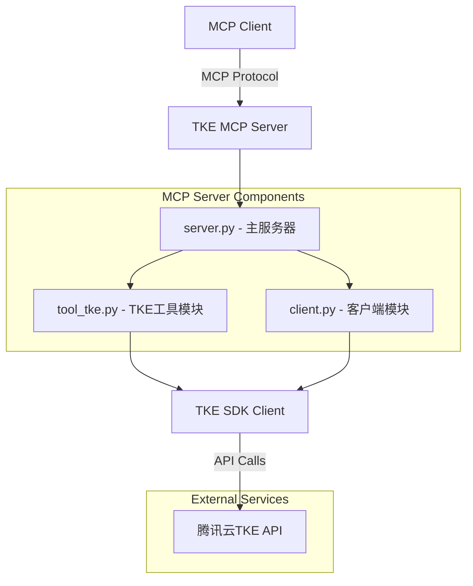

# TKE MCP服务器设计文档

## 1. 概述

TKE MCP服务器是一个基于Model Context Protocol (MCP) 的腾讯云容器服务（TKE）管理工具，提供TKE集群的创建和删除功能。该服务器严格遵循现有 `mcp_server_cvm` 的架构模式，确保代码一致性和可维护性。

### 1.1 设计目标
- **架构一致性**: 与现有CVM MCP服务器保持相同的代码结构和设计模式
- **功能完整性**: 提供完整的TKE集群创建和删除功能
- **可扩展性**: 为未来可能的TKE功能扩展预留空间
- **标准化**: 遵循MCP协议规范和腾讯云API标准

### 1.2 核心功能
- **CreateCluster**: 创建TKE集群，支持完整的集群配置参数
- **DeleteCluster**: 删除指定的TKE集群

## 2. 架构设计

### 2.1 整体架构



### 2.2 目录结构

基于现有CVM项目结构，TKE MCP服务器的目录结构如下：

```
src/
└── mcp_server_tke/
    ├── __init__.py          # 模块初始化
    ├── server.py            # MCP服务器主文件
    ├── client.py            # 腾讯云客户端封装
    └── tool_tke.py          # TKE操作工具模块
```

### 2.3 组件分层

| 层级 | 组件 | 职责 |
|------|------|------|
| **协议层** | server.py | MCP协议处理、工具注册、请求路由 |
| **业务层** | tool_tke.py | TKE业务逻辑、参数处理、响应封装 |
| **客户端层** | client.py | 腾讯云SDK客户端管理、认证处理 |
| **SDK层** | 腾讯云TKE SDK | 底层API调用、网络通信 |

## 3. 组件和接口设计

### 3.1 MCP服务器组件 (server.py)

基于CVM服务器的设计模式，TKE服务器将实现以下核心功能：

#### 3.1.1 服务器初始化
```python
server = Server("tke")  # TKE服务器标识
```

#### 3.1.2 工具列表定义
```python
@server.list_tools()
async def handle_list_tools() -> list[types.Tool]:
    return [
        types.Tool(
            name="CreateCluster",
            description="创建TKE集群",
            inputSchema={
                "type": "object",
                "properties": {
                    "ClusterBasicSettings.ClusterName": {
                        "type": "string",
                        "description": "集群名称，可选参数"
                    },
                    "ClusterBasicSettings.ClusterLevel": {
                        "type": "string", 
                        "description": "集群规格(L5、L50、L200、L1000、L5000)，默认L50",
                        "enum": ["L5", "L50", "L200", "L1000", "L5000"],
                        "default": "L50"
                    },
                    "Region": {
                        "type": "string",
                        "description": "地域(ap-guangzhou、ap-beijing、ap-shanghai)",
                        "enum": ["ap-guangzhou", "ap-beijing", "ap-shanghai"]
                    },
                    # ... 其他参数定义
                },
                "required": ["Region", "ClusterBasicSettings.ClusterOs", 
                           "ClusterBasicSettings.VpcId", "ClusterCIDRSettings.EniSubnetIds",
                           "ClusterCIDRSettings.ServiceCIDR"]
            }
        ),
        types.Tool(
            name="DeleteCluster", 
            description="删除TKE集群",
            inputSchema={
                "type": "object",
                "properties": {
                    "ClusterId": {
                        "type": "string",
                        "description": "集群ID，必须输入"
                    }
                },
                "required": ["ClusterId"]
            }
        )
    ]
```

#### 3.1.3 工具调用处理
```python
@server.call_tool()
async def handle_call_tool(
    name: str, arguments: dict[str, Any] | None
) -> list[types.TextContent | types.ImageContent | types.EmbeddedResource]:
    """处理工具调用请求"""
    try:
        if name == "CreateCluster":
            result = tool_tke.create_cluster(arguments)
        elif name == "DeleteCluster":
            result = tool_tke.delete_cluster(arguments)
        else:
            raise ValueError(f"未知的工具: {name}")
            
        return [types.TextContent(type="text", text=str(result))]
    except Exception as e:
        return [types.TextContent(type="text", text=f"错误: {str(e)}")]
```

### 3.2 客户端组件 (client.py)

基于CVM客户端的设计，提供TKE SDK客户端的封装：

#### 3.2.1 客户端工厂函数
```python
def get_tke_client(region: str) -> tke_client.TkeClient:
    """
    创建并返回TKE客户端
    
    Args:
        region: 地域信息
    
    Returns:
        TkeClient: TKE客户端实例
    """
    cred = credential.Credential(secret_id, secret_key)
    if not region:
        region = default_region or "ap-guangzhou"
        
    http_profile = HttpProfile()
    http_profile.endpoint = "tke.tencentcloudapi.com"
    
    client_profile = ClientProfile()
    client_profile.httpProfile = http_profile
    client_profile.request_client = "MCP-Server"
    
    return tke_client.TkeClient(cred, region, client_profile)
```

#### 3.2.2 环境变量管理
```python
# 从环境变量中读取认证信息
secret_id = os.getenv("TENCENTCLOUD_SECRET_ID")
secret_key = os.getenv("TENCENTCLOUD_SECRET_KEY") 
```

### 3.3 TKE工具组件 (tool_tke.py)

基于CVM工具模块的设计模式，实现TKE的核心业务逻辑：

#### 3.3.1 创建集群功能
```python
def create_cluster(params: dict) -> str:
    """创建TKE集群
    
    Args:
        params: 集群创建参数，包含：
            - ClusterBasicSettings.ClusterName: 集群名称(可选)
            - ClusterBasicSettings.ClusterLevel: 集群规格(可选,默认L50)
            - Region: 地域(必填)
            - ClusterBasicSettings.ClusterOs: 操作系统镜像ID(必填)
            - ClusterBasicSettings.VpcId: 私有网络ID(必填)
            - ClusterCIDRSettings.EniSubnetIds: 子网ID集合(必填)
            - ClusterCIDRSettings.ServiceCIDR: Service CIDR(必填)
    
    Returns:
        str: API响应结果的JSON字符串，格式：
        {
            "Response": {
                "ClusterId": "cls-7ph3twqe",
                "RequestId": "eac6b301-a322-493a-8e36-83b295459397"
            }
        }
    
    Raises:
        Exception: 当API调用失败时抛出异常
    """
```

#### 3.3.2 删除集群功能
```python
def delete_cluster(params: dict) -> str:
    """删除TKE集群
    
    Args:
        params: 删除参数，包含：
            - ClusterId: 集群ID(必填)
    
    Returns:
        str: API响应结果的JSON字符串，格式：
        {
            "Response": {
                "RequestId": "eac6b301-a322-493a-8e36-83b295459397"
            }
        }
    
    Raises:
        Exception: 当API调用失败时抛出异常
    """
```

## 4. 数据模型设计

### 4.1 输入数据模型

#### 4.1.1 CreateCluster请求参数
```json
{
    "ClusterBasicSettings.ClusterName": "my-tke-cluster",
    "ClusterBasicSettings.ClusterLevel": "L50",
    "Region": "ap-guangzhou", 
    "ClusterBasicSettings.ClusterOs": "tlinux3.1x86_64",
    "ClusterBasicSettings.VpcId": "vpc-12345678",
    "ClusterCIDRSettings.EniSubnetIds": ["subnet-12345678", "subnet-87654321"],
    "ClusterCIDRSettings.ServiceCIDR": "10.1.0.0/16"
}
```

#### 4.1.2 DeleteCluster请求参数
```json
{
    "ClusterId": "cls-7ph3twqe"
}
```

### 4.2 输出数据模型

#### 4.2.1 CreateCluster响应格式
```json
{
    "Response": {
        "ClusterId": "cls-7ph3twqe",
        "RequestId": "eac6b301-a322-493a-8e36-83b295459397"
    }
}
```

#### 4.2.2 DeleteCluster响应格式
```json
{
    "Response": {
        "RequestId": "eac6b301-a322-493a-8e36-83b295459397"
    }
}
```

### 4.3 参数验证规则

| 参数名 | 类型 | 必填 | 验证规则 |
|--------|------|------|----------|
| Region | string | 是 | 枚举值：ap-guangzhou, ap-beijing, ap-shanghai |
| ClusterBasicSettings.ClusterLevel | string | 否 | 枚举值：L5, L50, L200, L1000, L5000，默认L50 |
| ClusterBasicSettings.ClusterOs | string | 是 | 非空字符串 |
| ClusterBasicSettings.VpcId | string | 是 | 格式：vpc-xxxxxxxx |
| ClusterCIDRSettings.EniSubnetIds | array | 是 | 非空数组，元素格式：subnet-xxxxxxxx |
| ClusterCIDRSettings.ServiceCIDR | string | 是 | 有效的CIDR格式 |
| ClusterId | string | 是 | 格式：cls-xxxxxxxx |

## 5. 错误处理设计

### 5.1 错误处理策略

基于CVM服务器的错误处理模式，采用以下策略：

1. **参数验证错误**: 在工具层进行参数验证，返回清晰的错误信息
2. **API调用错误**: 捕获腾讯云SDK异常，返回标准化错误响应
3. **系统错误**: 记录详细日志，返回用户友好的错误信息

### 5.2 错误响应格式

#### 5.2.1 参数验证错误
```json
{
    "Error": {
        "Code": "InvalidParameter",
        "Message": "参数Region必须是以下值之一: ap-guangzhou, ap-beijing, ap-shanghai"
    }
}
```

#### 5.2.2 API调用错误
```json
{
    "Error": {
        "Code": "ResourceNotFound.ClusterNotFound",
        "Message": "集群不存在",
        "RequestId": "eac6b301-a322-493a-8e36-83b295459397"
    }
}
```

### 5.3 日志记录

采用与CVM服务器相同的日志记录模式：

```python
from asyncio.log import logger
from tencentcloud.common.exception.tencent_cloud_sdk_exception import TencentCloudSDKException

try:
    # API调用逻辑
    pass
except TencentCloudSDKException as e:
    logger.error(f"TKE API调用失败: {str(e)}")
    raise e
except Exception as e:
    logger.error(f"创建集群失败: {str(e)}")
    raise e
```

## 6. 测试策略

### 6.1 单元测试

#### 6.1.1 工具函数测试
- 测试 `create_cluster` 函数的参数处理和响应格式
- 测试 `delete_cluster` 函数的参数验证和API调用
- 模拟不同的错误场景和异常处理

#### 6.1.2 客户端测试
- 测试客户端创建和配置
- 测试环境变量读取和默认值处理

### 6.2 集成测试

#### 6.2.1 MCP协议测试
- 测试工具列表获取
- 测试工具调用请求和响应
- 测试MCP协议兼容性

#### 6.2.2 API集成测试
- 测试与腾讯云TKE API的集成
- 测试不同地域的API调用
- 测试网络异常和重试机制

### 6.3 端到端测试

#### 6.3.1 完整流程测试
- 创建集群 -> 验证集群状态 -> 删除集群
- 测试不同参数组合的集群创建
- 测试错误场景的处理

#### 6.3.2 性能测试
- 测试并发请求处理
- 测试大批量操作的性能
- 测试内存和CPU使用情况
