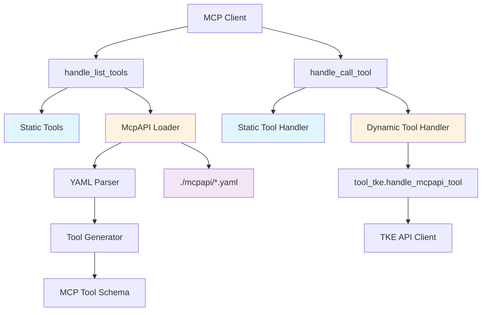

# McpAPI到MCP工具转换功能设计文档

## 概述

本设计文档描述了如何为TKE MCP服务器实现动态McpAPI到MCP工具转换功能。该功能将在保持现有静态工具不变的前提下，自动扫描`./mcpapi/`目录下的YAML文件，并将其转换为MCP工具定义，从而实现动态工具扩展能力。

### 设计目标
- 保持现有代码架构和工具完全不变
- 实现McpAPI YAML文件到MCP工具的自动转换
- 提供统一的动态工具调用处理机制
- 确保系统的稳定性和容错性

## 架构设计

### 整体架构图



### 核心组件

1. **McpAPI Loader (mcpapi_loader.py)** - 负责扫描和加载YAML文件
2. **Dynamic Tool Handler (dynamic_tool_handler.py)** - 负责将McpAPI定义转换为MCP工具schema和处理动态工具调用
3. **Enhanced Server** - 增强的服务器入口点，集成动态工具功能

## 组件和接口设计

### 1. McpAPI Loader 组件

#### 位置: `src/mcp_server_tke/mcpapi_loader.py`

```python
class McpAPILoader:
    """McpAPI文件加载器"""
    
    def __init__(self, mcpapi_dir: str = "./mcpapi/"):
        """初始化加载器"""
        
    def load_mcpapi_files(self) -> Dict[str, Dict]:
        """加载所有McpAPI文件"""
        
    def _parse_yaml_file(self, file_path: str) -> Dict:
        """解析单个YAML文件"""
```

**设计决策**:
- 用户保证格式正确，只需要正确解析YAML文件
- 使用标准库解析或简单的字符串处理
- 返回解析后的字典数据

### 2. Dynamic Tool Handler 组件

#### 位置: `src/mcp_server_tke/dynamic_tool_handler.py`

```python
class DynamicToolHandler:
    """动态工具处理器"""
    
    def __init__(self, mcpapi_data: Dict[str, Dict]):
        """初始化处理器"""
        
    def generate_mcp_tools(self) -> List[types.Tool]:
        """生成MCP工具列表"""
        
    def handle_tool_call(self, tool_name: str, params: Dict[str, Any]) -> str:
        """处理动态工具调用"""
        
    def _convert_to_mcp_tool(self, tool_spec: Dict) -> types.Tool:
        """将工具规范转换为MCP工具"""
        
    def _build_input_schema(self, args: List[Dict]) -> Dict:
        """构建输入schema"""
```

**设计决策**:
- 集成工具生成和调用处理到同一个模块
- 简化接口，减少组件间的复杂交互
- 复用现有的TKE客户端和错误处理机制

### 4. Enhanced Server 集成

#### 位置: `src/mcp_server_tke/server.py` (修改现有文件)

修改策略：
- 在模块级别添加全局变量存储动态工具处理器
- 修改`handle_list_tools()`函数以包含动态工具
- 修改`handle_call_tool()`函数以处理动态工具调用

## 数据模型

### McpAPI文件格式（基于ModifyClusterAttribute.yaml）

```yaml
server:
  name: mcpapi-server
tools:
  - name: ToolName
    description: 工具描述
    args:
      - name: ParameterName
        description: 参数描述
        type: string|integer|boolean|object
        required: true|false
        default: 默认值
        properties:  # 仅当type为object时
          SubParam:
            type: string
            description: 子参数描述
    requestTemplate:
      url: /ApiEndpoint
      method: POST
      headers:
        - key: Content-Type
          value: application/json
    outputSchema:
      type: object
      properties:
        ResponseField:
          type: string
          description: 响应字段描述
```

### MCP工具转换映射

| McpAPI字段 | MCP工具字段 | 转换规则 |
|------------|-------------|----------|
| `tools[].name` | `Tool.name` | 直接映射 |
| `tools[].description` | `Tool.description` | 直接映射 |
| `tools[].args` | `Tool.inputSchema.properties` | 类型转换和结构重组 |
| `args[].required: true` | `Tool.inputSchema.required[]` | 收集所有必填参数 |
| `args[].type` | `properties[].type` | 类型映射转换 |

### 类型映射表

| McpAPI类型 | JSON Schema类型 | 转换规则 |
|------------|----------------|----------|
| `string` | `string` | 直接映射 |
| `integer` | `integer` | 直接映射 |
| `boolean` | `boolean` | 直接映射 |
| `object` | `object` | 递归处理properties |
| `array` | `array` | 处理items类型 |

## 错误处理策略

### 错误分类和处理

1. **文件系统错误**
   - 目录不存在：返回空工具列表
   - 文件读取错误：记录警告，跳过该文件

2. **工具调用错误**  
   - 参数验证失败：返回错误消息
   - API调用失败：使用现有错误处理机制

### 日志策略

```python
# 使用现有的日志系统
logger = logging.getLogger(__name__)

# 日志级别分配
# INFO: 正常操作（文件加载成功、工具生成完成）
# WARNING: 可恢复错误（文件解析失败、格式不正确）
# ERROR: 严重错误（API调用失败、参数验证失败）
```

## 核心算法设计

### 1. YAML解析算法

由于用户保证格式正确，实现简单直接的解析：

```python
def parse_yaml_file(file_path: str) -> Dict:
    """解析YAML文件"""
    # 使用简单的字符串处理或yaml库
    # 直接返回解析结果，无需复杂验证
```

### 2. Schema生成算法

```python
def generate_json_schema(mcpapi_args: List[Dict]) -> Dict:
    """生成JSON Schema"""
    # 遍历参数列表
    # 构建properties对象  
    # 收集required字段
    # 处理嵌套对象
```

## 测试策略

### 测试结构

```
tests/
├── test_tool_tke.py          # 现有测试文件，将被增强
├── fixtures/                 # 测试数据
│   ├── valid_mcpapi.yaml   # 有效的McpAPI文件
│   ├── invalid_mcpapi.yaml # 无效的McpAPI文件
│   └── complex_mcpapi.yaml # 复杂的McpAPI文件
└── mock_data/               # 模拟数据
    └── api_responses.json   # 模拟API响应
```

### 测试用例设计

1. **McpAPI加载测试**
   - 测试正常文件加载
   - 测试目录不存在的情况
   - 测试文件权限错误
   - 测试格式错误的文件

2. **工具生成测试**
   - 测试基本工具生成
   - 测试复杂参数类型处理
   - 测试必填参数收集
   - 测试名称冲突处理

3. **集成测试**
   - 测试工具列表返回
   - 测试动态工具调用
   - 测试错误处理流程
   - 测试日志记录

4. **向后兼容性测试**
   - 验证静态工具不受影响
   - 验证现有API行为不变
   - 验证无McpAPI文件时的正常运行

### 模拟策略

- 使用`unittest.mock`模拟文件系统操作
- 模拟TKE API响应
- 创建测试专用的McpAPI文件

## 实现计划

### 阶段1：基础组件开发
1. 实现`McpAPILoader`类
2. 实现`DynamicToolHandler`类

### 阶段2：服务器集成
1. 修改`handle_list_tools()`函数
2. 修改`handle_call_tool()`函数

### 阶段3：测试验证
1. 编写基本测试用例
2. 进行集成测试

## 风险评估和缓解策略

### 技术风险

1. **向后兼容性**
   - 风险：修改可能影响现有功能
   - 缓解：最小化修改，保持现有逻辑不变

2. **文件系统依赖**
   - 风险：文件权限或路径问题  
   - 缓解：优雅降级，返回空工具列表

## 性能考虑

1. **启动时间**：文件加载在服务启动时进行，不影响运行时性能
2. **内存使用**：动态工具定义缓存在内存中，占用量可控
3. **工具调用性能**：动态工具调用与静态工具性能相当

## 安全考虑

1. **文件路径安全**：限制只能访问指定的mcpapi目录
2. **输入验证**：严格验证McpAPI文件格式和参数
3. **错误信息安全**：避免在错误消息中暴露敏感信息

## 可维护性设计

1. **模块化设计**：各组件职责单一，易于测试和维护
2. **配置驱动**：通过配置控制功能开启和行为
3. **文档完善**：提供详细的代码注释和使用文档
4. **向前兼容**：为未来的扩展留出接口

这个简化的设计方案专注于核心功能实现，避免了过度设计，确保了与现有系统的简洁集成。
