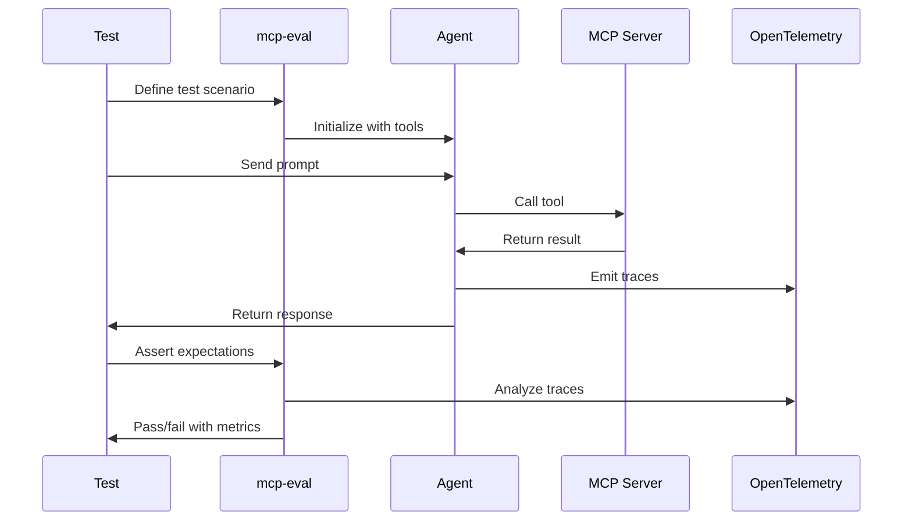

# mcp-eval

[](https://mcp-eval.ai)
[](https://pypi.org/project/mcpevals/)
[](https://github.com/lastmile-ai/mcp-eval/blob/main/LICENSE)

mcp-eval is an evaluation framework for testing Model Context Protocol (MCP) servers and the agents that use them. Unlike traditional testing approaches that mock interactions or test components in isolation, mcp-eval exercises your complete system in the environment it actually runs in: an LLM/agent calling real MCP tools.

## Why mcp-eval exists

### The challenge

As AI agents become more sophisticated and MCP servers proliferate, teams face critical questions:

* **For MCP server developers**: "Will my server handle real agent requests correctly? What about edge cases?"
* **For agent developers**: "Is my agent using tools effectively? Does it recover from errors?"
* **For both**: "How do we measure quality, performance, and reliability before production?"

### The solution

mcp-eval addresses these challenges by providing:

1. **Real environment testing** - No mocks, actual agent-to-server communication
2. **Full observability** - OpenTelemetry traces capture detailed agent execution to run evals over
3. **Rich assertion library** - From tool checks to sophisticated path analysis
4. **Multiple test styles** - Choose what fits your workflow -- pytest, datasets or @task decorators
5. **Language agnostic** - Test MCP servers written in any language

## How it works



> **[Model Context Protocol](https://modelcontextprotocol.io/docs/getting-started/intro)** standardizes how applications provide context to large language models (LLMs). Think of MCP like a USB-C port for AI applications.
> 
> **`mcp-eval`** ensures your MCP servers, and agents built with them, work reliably in production.

> **Test any MCP server:** It doesn't matter what language your MCP server is written in - Python, TypeScript, Go, Rust, Java, or any other. As long as it implements the MCP protocol, `mcp-eval` can test it!


## Installation

We recommend using [uv](https://docs.astral.sh/uv/) to install `mcp-eval` as a global tool:

```bash
# Install mcp-eval globally (for CLI)
uv tool install mcpevals

# Add mcp-eval dependency to your project
uv add mcpevals

# Initialize your project (interactive setup)
mcp-eval init

# Add your MCP server to test
mcp-eval server add

# Auto-generate tests with an LLM
mcp-eval generate

# Run tests
mcp-eval run tests/
```

Alternatively with pip:

```bash
# Install mcp-eval
pip install mcpevals

# Initialize your project
mcp-eval init

# Add your MCP server
mcp-eval server add

# Run tests
mcp-eval run tests/
```


**Requirements:**
- Python 3.10+
- Any MCP server to test

---

**📚 Ready to dive deeper? Follow our complete [Getting Started Guide](https://mcp-eval.ai/quickstart) →**

---


## What mcp-eval Does for You

- **Test MCP Servers**: Ensure your MCP servers respond correctly to agent requests and handle edge cases gracefully
- **Evaluate Agents**: Measure how effectively agents use tools, follow instructions, and recover from errors  
- **Track Performance**: Monitor latency, token usage, cost, and success rates with OpenTelemetry-backed metrics
- **Assert Quality**: Use structural checks, LLM judges, and path efficiency validators to ensure high quality

## Why Teams Choose mcp-eval

- **Production-ready**: Built on OpenTelemetry for enterprise-grade observability
- **Multiple test styles**: Choose between decorators, pytest, or dataset-driven testing
- **Rich assertions**: Content checks, tool verification, performance gates, and LLM judges
- **CI/CD friendly**: GitHub Actions support, JSON/HTML reports, and regression detection
- **Language agnostic**: Test MCP servers written in any language
- **Built on [mcp-agent](https://mcp-agent.com)**: Leverage sophisticated agent patterns from Anthropic's [Building Effective Agents](https://www.anthropic.com/research/building-effective-agents)

## Quick Example

```python
from mcp_eval import task, Expect

@task("Verify fetch server works correctly")
async def test_fetch(agent, session):
    # Ask the agent to fetch a webpage
    response = await agent.generate_str("Fetch https://example.com and summarize it")
    
    # Assert the right tool was called
    await session.assert_that(Expect.tools.was_called("fetch"))
    
    # Verify the content is correct
    await session.assert_that(
        Expect.content.contains("Example Domain"), 
        response=response
    )
    
    # Check performance
    await session.assert_that(Expect.performance.response_time_under(5000))
```

Run with:
```bash
mcp-eval run test_fetch.py -v
```

## Core Features

### Test Organization

MCP-Eval supports multiple testing patterns:

**Decorator-based tests**: Simple async functions with `@task` decorator
```python
@task("Test name")
async def test_something(agent, session):
    # agent: TestAgent instance connected to MCP servers
    # session: TestSession for assertions and metrics
    pass
```

**Pytest integration**: Use familiar pytest patterns
```python
@pytest.mark.asyncio
async def test_with_pytest(mcp_agent):
    response = await mcp_agent.generate_str("...")
    assert "expected" in response
```

**Dataset testing**: Systematic evaluation across multiple cases
```python
from mcp_eval import Dataset, Case

dataset = Dataset(
    name="Calculator Tests",
    cases=[
        Case(inputs="2+2", expected="4", evaluators=[...]),
        Case(inputs="10*5", expected="50", evaluators=[...])
    ]
)
```

### Assertion System

All assertions use the `Expect` API with specialized namespaces:

**Content assertions**: Verify response text
```python
Expect.content.contains("text")           # Substring check
Expect.content.regex(r"\d+ items?")       # Regex pattern
```

**Tool assertions**: Verify MCP tool usage
```python
Expect.tools.was_called("tool_name")      # Tool was invoked
Expect.tools.count("dangerous", 0)        # Tool was not invoked  
Expect.tools.sequence(["read", "write"])  # Exact sequence
Expect.tools.success_rate(min_rate=0.95)  # Success threshold
Expect.tools.output_matches(               # Check tool output
    tool_name="fetch",
    expected_output="data",
    match_type="contains"
)
```

**Performance assertions**: Verify efficiency metrics
```python
Expect.performance.response_time_under(5000)      # Max latency (ms)
Expect.performance.max_iterations(3)              # Max LLM calls
```

**LLM judge assertions**: Quality evaluation using LLMs
```python
Expect.judge.llm(
    rubric="Evaluate for accuracy and clarity",
    min_score=0.8,
    model="claude-3-opus-20240229"  # Optional: specific judge model
)

Expect.judge.multi_criteria([
    EvaluationCriterion(name="accuracy", weight=3.0, min_score=0.9),
    EvaluationCriterion(name="clarity", weight=1.0, min_score=0.7)
])
```

**Path assertions**: Verify execution sequences
```python
Expect.path.efficiency(
    expected_tool_sequence=["validate", "process", "save"],
    tool_usage_limits={"validate": 1, "process": 1},
    allow_extra_steps=0,
    penalize_backtracking=True
)
```

### Metrics Collection

Every test automatically collects:

- **Performance metrics**: Response time, token usage, cost per interaction
- **Tool metrics**: Call counts, success rates, error patterns, latencies
- **Conversation metrics**: Number of turns, total duration, cumulative costs
- **Trace data**: Complete OTEL spans for debugging and analysis

### Test Lifecycle

```python
from mcp_eval import setup, teardown, task

@setup
def prepare():
    """Run before all tests"""
    initialize_test_data()

@teardown  
def cleanup():
    """Run after all tests"""
    cleanup_test_data()

@task("Test with lifecycle")
async def test_something(agent, session):
    # Test implementation
    pass
```

## Complete Example

Testing an MCP server that provides web fetching and filesystem operations:

```python
# test_document_processor.py
from mcp_eval import task, setup, teardown, Expect
from mcp_eval.session import TestSession
from pathlib import Path

@setup
def prepare_test_environment():
    """Create test directory and files."""
    test_dir = Path("test_output")
    test_dir.mkdir(exist_ok=True)
    return test_dir

@task("Test document processing workflow")
async def test_document_workflow(agent: TestAgent, session: TestSession):
    """Test fetching a document, processing it, and saving results."""
    
    # Step 1: Fetch document
    fetch_response = await agent.generate_str(
        "Fetch the content from https://example.com/api/document.json"
    )
    
    # Verify fetch was successful
    await session.assert_that(
        Expect.tools.was_called("fetch"),
        name="fetch_called"
    )
    
    # Step 2: Process and save
    save_response = await agent.generate_str(
        "Parse the JSON and save a summary to test_output/summary.md"
    )
    
    # Verify complete workflow
    await session.assert_that(
        Expect.tools.sequence(["fetch", "write_file"]),
        name="correct_sequence"
    )
    
    # Check output quality
    await session.assert_that(
        Expect.judge.llm(
            rubric="""The summary should:
            1. Extract key information from the JSON
            2. Be formatted as valid Markdown
            3. Be concise (under 200 words)""",
            min_score=0.8
        ),
        response=save_response,
        name="summary_quality"
    )
    
    # Verify performance
    await session.assert_that(
        Expect.performance.response_time_under(10000),
        name="completed_quickly"
    )
    
    # Check golden path (no redundant operations)
    await session.assert_that(
        Expect.path.efficiency(
            expected_tool_sequence=["fetch", "write_file"],
            tool_usage_limits={"fetch": 1, "write_file": 1},
            penalize_backtracking=True
        ),
        name="efficient_path"
    )

@teardown
def cleanup():
    """Remove test artifacts."""
    import shutil
    shutil.rmtree("test_output", ignore_errors=True)
```

Run with detailed output:

```bash
mcp-eval run test_document_processor.py -v --html report.html
```

## Configuration

### Configuration Files

`mcpeval.yaml` structure:

```yaml
# Provider configuration
provider: anthropic  # or openai, google
model: claude-3-5-sonnet-20241022

# Execution settings
execution:
  timeout_seconds: 300
  max_concurrency: 5
  max_retries: 3

# Reporting
reporting:
  output_dir: test-reports
  formats: [json, html, markdown]
  include_traces: true

# MCP servers
mcp:
  servers:
    my_server:
      command: "uvx"
      args: ["mcp-server-fetch"]
      env:
        LOG_LEVEL: "info"

# Test agents
agents:
  default:
    model: claude-3-5-sonnet-20241022
    provider: anthropic
    server_names: ["my_server"]
    instruction: "You are a helpful test agent."

# Judge settings
judge:
  provider: anthropic
  model: claude-3-5-sonnet-20241022
  min_score: 0.7
```

### Environment Variables

```bash
# API Keys
export ANTHROPIC_API_KEY="sk-ant-..."
export OPENAI_API_KEY="sk-..."

# Override config
export MCPEVAL_PROVIDER="openai"
export MCPEVAL_MODEL="gpt-4-turbo-preview"
export MCPEVAL_TIMEOUT_SECONDS="600"
```

### Programmatic Configuration

```python
from mcp_eval.config import use_agent, update_config
from mcp_agent.agents.agent_spec import AgentSpec

# Use specific agent
use_agent(AgentSpec(
    name="test_agent",
    instruction="Be extremely thorough in testing.",
    server_names=["server1", "server2"]
))

# Update settings
update_config({
    "execution": {"timeout_seconds": 600},
    "reporting": {"output_dir": "custom-reports"}
})
```

## CI/CD Integration

### GitHub Actions

MCP-Eval includes pre-built GitHub Actions:

```yaml
name: MCP Server Tests
on:
  pull_request:
  push:
    branches: [main]

jobs:
  test:
    runs-on: ubuntu-latest
    steps:
      - uses: actions/checkout@v4
      
      - name: Run MCP-Eval tests
        uses: ./.github/actions/mcp-eval/run
        with:
          python-version: '3.11'
          tests: tests/
          run-args: '-v --max-concurrency 4'
          pr-comment: 'true'           # Add results to PR
          upload-artifacts: 'true'      # Save reports
          set-summary: 'true'           # GitHub job summary
        env:
          ANTHROPIC_API_KEY: ${{ secrets.ANTHROPIC_API_KEY }}

  publish:
    needs: test
    if: github.event_name == 'push'
    runs-on: ubuntu-latest
    steps:
      - name: Deploy to GitHub Pages
        uses: peaceiris/actions-gh-pages@v3
        with:
          github_token: ${{ secrets.GITHUB_TOKEN }}
          publish_dir: ./test-reports
```

### GitLab CI

```yaml
test:mcp:
  image: python:3.11
  script:
    - pip install mcp-eval
    - mcp-eval run tests/ --json results.json
  artifacts:
    reports:
      junit: results.json
    paths:
      - test-reports/
```

## CLI Reference

MCP-Eval provides comprehensive CLI commands:

```bash
# Initialize configuration
mcp-eval init

# Run tests
mcp-eval run tests/                    # Run all tests in directory
mcp-eval run test_file.py -v          # Run with verbose output
mcp-eval run tests/ --max-concurrency 4
mcp-eval run tests/ --html report.html --json metrics.json

# Generate tests
mcp-eval generate --n-examples 10     # Generate test cases

# Server management
mcp-eval server list                  # List configured servers
mcp-eval server add --from-mcp-json   # Import from mcp.json

# Utilities
mcp-eval doctor --full                 # Diagnose configuration issues
mcp-eval validate                     # Validate config files
```

## Advanced Features

### Test Generation

Automatically generate test cases for your MCP server:

```bash
mcp-eval generate \
  --style pytest \
  --n-examples 10 \
  --provider anthropic \
  --model claude-3-5-sonnet-20241022
```

This analyzes your server's tools and generates comprehensive test coverage.

### Scenario Testing

Compose multiple focused assertions in one coherent workflow:

```python
from mcp_eval import task, Expect

@task("Fetch and summarize")
async def test_fetch_and_summarize(agent, session):
    response = await agent.generate_str(
        "Fetch https://example.com and summarize in one sentence"
    )

    await session.assert_that(
        Expect.tools.was_called("fetch"),
        name="fetch_called"
    )
    await session.assert_that(
        Expect.content.contains("Example Domain"),
        response=response,
        name="has_expected_text"
    )
    await session.assert_that(
        Expect.performance.max_iterations(3),
        name="efficient"
    )
```

### Custom Evaluators

Create domain-specific evaluators:

```python
from mcp_eval.evaluators import BaseEvaluator

class SecurityEvaluator(BaseEvaluator):
    """Check for security best practices."""
    
    async def evaluate(self, response, context):
        # Check for exposed secrets
        if "api_key" in response.lower():
            return False, "Potential API key exposure"
        
        # Check for SQL injection patterns
        if "DROP TABLE" in response.upper():
            return False, "Potential SQL injection"
        
        return True, "Security checks passed"

# Use in tests
await session.assert_that(
    SecurityEvaluator(),
    response=response
)
```

### Performance Analysis

Use `session.get_metrics()` and CLI reports (`--json/--markdown/--html`) to analyze latency, token usage, and tool behavior.

## Documentation

- [Full Documentation](https://mcp-eval.ai)
- [Quickstart Guide](https://mcp-eval.ai/quickstart) 
- [API Reference](https://mcp-eval.ai/api-catalog)
- [Common Workflows](https://mcp-eval.ai/common-workflows)
- [Best Practices](https://mcp-eval.ai/best-practices)
- [Troubleshooting](https://mcp-eval.ai/troubleshooting)

## Examples

Complete working examples are available in [`examples/`](./examples):

- `mcp_server_fetch/` - Testing the fetch MCP server
- `calculator_server/` - Testing a calculator with multiple operations  
- `multi_server/` - Testing agents using multiple MCP servers
- `dataset_testing/` - Systematic testing with datasets
- `llm_judges/` - Quality evaluation using LLM judges
- `performance/` - Performance and load testing
- `security/` - Security testing patterns

## Architecture

MCP-Eval is built on key architectural principles:

1. **OTEL as Single Source of Truth**: All metrics and assertions are derived from OpenTelemetry traces
2. **Agent-Server Separation**: Clean separation between test agents and MCP servers
3. **Composable Assertions**: All assertions follow a consistent API pattern
4. **Async-First**: Built on asyncio for concurrent test execution
5. **Provider Agnostic**: Works with any LLM provider (Anthropic, OpenAI, Google, etc.)

## Contributing

Contributions are welcome. See [CONTRIBUTING.md](./CONTRIBUTING.md) for:
- Development setup
- Code style guidelines  
- Testing requirements
- Pull request process

## Support

- **Issues**: [GitHub Issues](https://github.com/lastmile-ai/mcp-eval/issues)
- **Discussions**: [GitHub Discussions](https://github.com/lastmile-ai/mcp-eval/discussions)
- **Documentation**: [mcp-eval.ai](https://mcp-eval.ai)

## License

Apache 2.0 - see [LICENSE](./LICENSE) for details.
