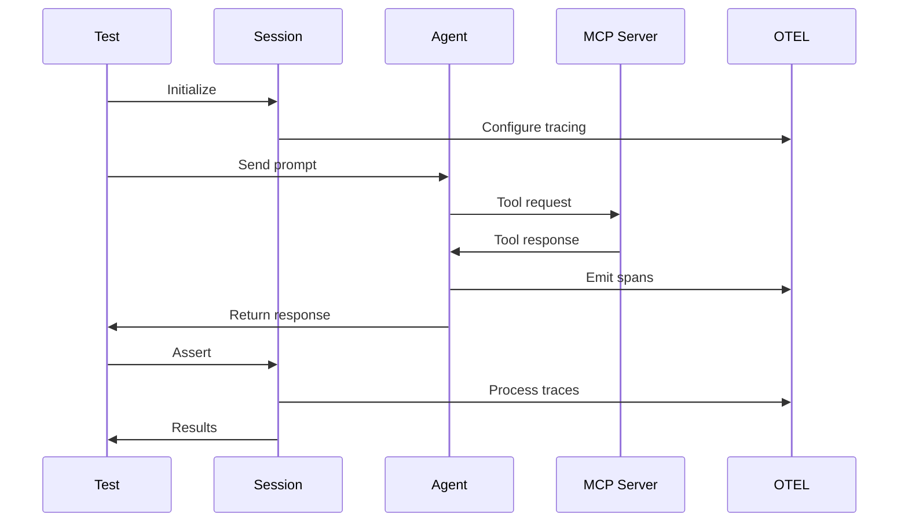

> Master these core concepts to write effective tests with mcp-eval. Each concept builds on the previous ones to create a complete testing framework.

## Overview

mcp-eval orchestrates interactions between three key components:

1. **Agents** - AI models that can use tools
2. **MCP Servers** - Tool providers implementing the Model Context Protocol
3. **Test Sessions** - Orchestrators that manage execution and collect metrics

<Note>
  Think of it like a stage play: The **agent** is the actor, **MCP servers** provide the props and scenery, and the **test session** is the director capturing everything for review.
</Note>

## TestSession (single source of truth)

`TestSession` is the orchestrator that manages the entire test lifecycle. It configures OpenTelemetry tracing, runs the agent, collects spans, computes metrics, and saves artifacts.

### Key responsibilities

- **Trace management**: Configures and captures OTEL traces
- **Metrics extraction**: Converts traces into actionable metrics (tool calls, latency, token usage, costs)
- **Assertion coordination**: Manages immediate and deferred assertion evaluation
- **Report generation**: Creates JSON, HTML, and Markdown reports

### Metrics derived from traces

From the OTEL traces, TestSession extracts:
- Tool invocation details (names, arguments, outputs, timing)
- Iteration counts and conversation turns
- Token usage and estimated costs
- Performance breakdowns (LLM time vs tool time)
- Error patterns and recovery sequences

Source: [TestSession](https://github.com/lastmile-ai/mcp-eval/blob/main/src/mcp_eval/session.py)

## TestAgent

`TestAgent` is a wrapper around the runtime agent that provides testing-specific functionality and connects assertions to the session.

### Key features

- **Simplified API**: `generate_str()` for string responses
- **Direct assertion access**: `agent.assert_that()` shortcut
- **Session integration**: Automatically connected to TestSession's metrics

Example usage:
```python
async with test_session("my-test") as session:
    agent = session.agent
    response = await agent.generate_str("Do something")
    await agent.assert_that(Expect.content.contains("done"), response=response)
```

Source: [TestAgent](https://github.com/lastmile-ai/mcp-eval/blob/main/src/mcp_eval/session.py)

## Unified assertion API

mcp-eval uses a single, discoverable API pattern for all assertions:

```python
await session.assert_that(Expect.category.check(...), response=?, when=?)
```

### Immediate vs deferred assertions

<Warning>
  Understanding assertion timing is crucial for debugging test failures.
</Warning>

**Immediate assertions** (run when called with a response):
- Content checks (`contains`, `regex`)
- LLM judges (quality evaluation)

**Deferred assertions** (run at session end, need complete metrics):
- Tool usage (`was_called`, `count`, `sequence`)
- Performance (`response_time_under`, `max_iterations`)
- Path efficiency analysis

Catalog source: [Expect catalog](https://github.com/lastmile-ai/mcp-eval/blob/main/src/mcp_eval/catalog.py)

## Test styles

mcp-eval supports three testing approaches to fit different workflows:

### Decorator style

Simple and expressive for quick tests:
```python
@task("Verify fetch works")
async def test_fetch(agent, session):
    response = await agent.generate_str("Fetch https://example.com")
    await session.assert_that(Expect.content.contains("Example"))
```

Features: `@task`, `@setup`, `@teardown`, `@parametrize`

### Pytest integration

Familiar for teams already using pytest:
```python
@pytest.mark.asyncio
async def test_with_pytest(mcp_agent):
    response = await mcp_agent.generate_str("Fetch data")
    assert "success" in response
```

Features: fixtures (`mcp_session`, `mcp_agent`), markers (`@pytest.mark.mcp_agent`)

### Dataset style

Systematic evaluation with test matrices:
```python
dataset = Dataset(
    name="Comprehensive suite",
    cases=[
        Case("test_1", inputs="Do X", evaluators=[...]),
        Case("test_2", inputs="Do Y", evaluators=[...])
    ]
)
```

Sources:
- [Decorator core](https://github.com/lastmile-ai/mcp-eval/blob/main/src/mcp_eval/core.py)
- [Pytest plugin](https://github.com/lastmile-ai/mcp-eval/blob/main/src/mcp_eval/pytest_plugin.py)
- [Dataset API](https://github.com/lastmile-ai/mcp-eval/blob/main/src/mcp_eval/datasets.py)

## LLM judges

LLM-based evaluation for subjective quality assessment:

### Single criterion
```python
judge = Expect.judge.llm(
    rubric="Response should be helpful and accurate",
    min_score=0.8
)
```

### Multi-criteria evaluation
```python
criteria = [
    EvaluationCriterion("accuracy", "Factually correct", weight=2.0),
    EvaluationCriterion("clarity", "Easy to understand", weight=1.5)
]
judge = Expect.judge.multi_criteria(criteria)
```

Configuration via `MCPEvalSettings` for judge model/provider defaults.

Sources:
- [LLMJudge](https://github.com/lastmile-ai/mcp-eval/blob/main/src/mcp_eval/evaluators/llm_judge.py)
- [MultiCriteriaJudge](https://github.com/lastmile-ai/mcp-eval/blob/main/src/mcp_eval/evaluators/multi_criteria_judge.py)

## Architecture flow



## Next steps

With these concepts understood:

<CardGroup cols={2}>
  <Card title="Write Your First Test" icon="code" href="./quickstart">
    Start with a simple example
  </Card>
  
  <Card title="Explore Assertions" icon="check" href="./assertions">
    Learn the full assertion API
  </Card>
</CardGroup>


