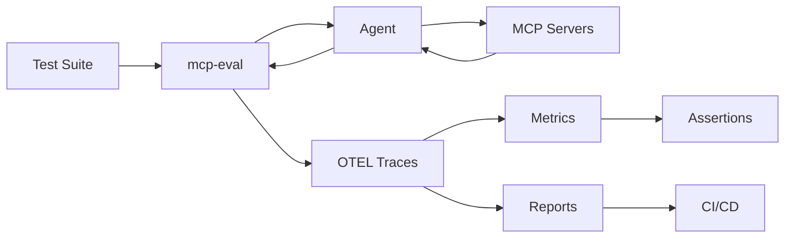

> mcp-eval is your "flight simulator" for tool-using LLMs. Connect agents to real MCP servers, run realistic scenarios, and get production-grade insights into behavior and performance.

## What is mcp-eval?

mcp-eval is a developer-first evaluation framework designed specifically for testing Model Context Protocol (MCP) servers and the agents that use them. Unlike traditional testing approaches that mock interactions or test components in isolation, mcp-eval exercises your complete system in the environment it actually runs in: an LLM/agent calling real MCP tools.

<Note>
  **Think of it this way**: If unit tests are like testing car parts on a bench, mcp-eval is like taking the whole car to a test track. You see how everything works together under realistic conditions.
</Note>

## Why mcp-eval exists

### The challenge

As AI agents become more sophisticated and MCP servers proliferate, teams face critical questions:

* **For MCP server developers**: "Will my server handle real agent requests correctly? What about edge cases?"
* **For agent developers**: "Is my agent using tools effectively? Does it recover from errors?"
* **For both**: "How do we measure quality, performance, and reliability before production?"

### The solution

mcp-eval addresses these challenges by providing:

1. **Real environment testing** - No mocks, actual agent-to-server communication
2. **Full observability** - OpenTelemetry traces capture detailed agent execution to run evals over
3. **Rich assertion library** - From tool checks to sophisticated path analysis
4. **Multiple test styles** - Choose what fits your workflow -- `pytest`, datasets or `@task` decorators.
5. **Language agnostic** - Test MCP servers written in any language

## Core capabilities

<CardGroup cols={2}>
  <Card title="🧪 Comprehensive Assertions" icon="check-circle">
    **Content validation**: Pattern matching, regex, contains/not-contains
    
    **Tool verification**: Was called, call counts, arguments, outputs
    
    **Performance gates**: Response time, iteration limits, token usage
    
    **Quality judges**: LLM-based evaluation with custom rubrics
    
    **Path analysis**: Efficiency, backtracking, optimal sequences
  </Card>
  
  <Card title="📊 OpenTelemetry Metrics" icon="chart-line">
    **Automatic capture**: Every tool call, LLM interaction, timing
    
    **Span tree analysis**: Visualize execution flow and bottlenecks
    
    **Cost tracking**: Token usage and estimated costs per test
    
    **Performance breakdown**: LLM time vs tool time vs overhead
    
    **Error recovery**: Track retry patterns and failure handling
  </Card>
  
  <Card title="🎨 Flexible Test Authoring" icon="code">
    **Decorator style**: Simple `@task` decorators for quick tests
    
    **Pytest integration**: Use familiar pytest fixtures and markers (run with `uv run pytest`)
    
    **Dataset driven**: Systematic evaluation with test matrices
    
    **AI generation**: Let Claude/GPT generate test scenarios
    
    **Parameterization**: Test variations with minimal code
  </Card>
  
  <Card title="🚀 Developer Experience" icon="terminal">
    **Quick start**: `mcp-eval init` sets up everything
    
    **Smart CLI**: Discover servers, generate tests, validate config
    
    **Rich reports**: Console, JSON, Markdown, interactive HTML
    
    **CI/CD ready**: GitHub Actions, exit codes, artifact uploads
    
    **Helpful diagnostics**: `doctor` and `validate` commands
  </Card>
</CardGroup>

## How mcp-eval works

### Architecture overview



### Execution flow

<Steps>
  <Step title="Configure your environment">
    Define which MCP servers are available and configure your agent with appropriate tools and instructions.
  </Step>
  
  <Step title="Write test scenarios">
    Create tests that give your agent realistic tasks requiring tool use.
  </Step>
  
  <Step title="Execute tests">
    mcp-eval orchestrates the agent, captures all interactions via OpenTelemetry, and records comprehensive traces.
  </Step>
  
  <Step title="Process traces into metrics">
    OTEL traces are parsed to extract tool calls, timings, token usage, error patterns, and execution paths.
  </Step>
  
  <Step title="Apply assertions">
    Your assertions run against the response content and extracted metrics to verify behavior.
  </Step>
  
  <Step title="Generate reports">
    Results are compiled into multiple formats for different audiences and use cases.
  </Step>
</Steps>

## A complete example

Here's a real-world test that showcases mcp-eval's capabilities:

```python
from mcp_eval import task, setup, Expect
from mcp_eval.evaluators import EvaluationCriterion

@setup
def configure():
    # Define the agent and servers it can use
    mcp_eval.use_agent(
        AgentSpec(
            name="weather_assistant",
            instruction="You help users with weather information.",
            server_names=["weather_api", "location_service"],
            model="claude-3-5-haiku-20241022"
        )
    )

@task("Get weather for user's location")
async def test_weather_flow(agent, session):
    # Execute the task
    response = await agent.generate_str(
        "What's the weather like in San Francisco tomorrow?"
    )
    
    # Verify tool usage - immediate checks
    await session.assert_that(
        Expect.tools.was_called("get_location"),
        name="location_service_called"
    )
    await session.assert_that(
        Expect.tools.was_called("get_weather_forecast"),
        name="weather_api_called"
    )
    
    # Check content quality
    await session.assert_that(
        Expect.content.contains("San Francisco"),
        response=response,
        name="mentions_city"
    )
    await session.assert_that(
        Expect.content.regex(r"\d+\s*°[CF]"),  # Temperature pattern
        response=response,
        name="includes_temperature"
    )
    
    # Verify execution efficiency
    await session.assert_that(
        Expect.tools.sequence(
            ["get_location", "get_weather_forecast"],
            allow_other_calls=False
        ),
        name="optimal_tool_sequence"
    )
    
    # Apply quality judge
    await session.assert_that(
        Expect.judge.multi_criteria([
            EvaluationCriterion(
                name="accuracy",
                description="Weather info is plausible and specific",
                weight=2.0,
                min_score=0.8
            ),
            EvaluationCriterion(
                name="helpfulness",
                description="Response is clear and actionable",
                weight=1.5,
                min_score=0.7
            )
        ]),
        response=response,
        name="quality_assessment"
    )
    
    # Performance requirements
    await session.assert_that(
        Expect.performance.response_time_under(10000),  # 10 seconds
        name="response_time_check"
    )
```

## Key features in depth

### 🎯 Unified assertion API

All assertions use a single, discoverable API pattern:

```python
await session.assert_that(Expect.category.specific_check(...))
```

This provides IDE autocomplete and makes the API easy to explore.

### 📡 OpenTelemetry integration

Every interaction generates detailed traces:

* Tool invocations with arguments and results
* LLM calls with token counts
* Timing breakdowns for each operation
* Error and retry patterns
* Nested span relationships

These traces become your single source of truth for debugging and analysis.

### 🤖 Multiple test styles

Choose the approach that fits your team:

<Tabs>
  <Tab title="Decorator Style">
    ```python
    @task("Simple and expressive")
    async def test_something(agent, session):
        response = await agent.generate_str("Do something")
        await session.assert_that(Expect.content.contains("done"))
    ```
  </Tab>
  
  <Tab title="Pytest Style">
    ```python
    @pytest.mark.asyncio
    async def test_with_pytest(mcp_agent):
        response = await mcp_agent.generate_str("Do something")
        assert "done" in response
    ```
  </Tab>
  
  <Tab title="Dataset Style">
    ```python
    dataset = Dataset(
        name="Comprehensive suite",
        cases=[
            Case("test_1", inputs="Do X", evaluators=[...]),
            Case("test_2", inputs="Do Y", evaluators=[...])
        ]
    )
    ```
  </Tab>
</Tabs>

### 📈 Production-ready reporting

Generate reports in multiple formats:

* **Console**: Real-time progress and summaries
* **JSON**: Machine-readable for CI/CD pipelines  
* **Markdown**: PR comments and documentation
* **HTML**: Interactive exploration with filtering

All reports include links to detailed OTEL traces for debugging.

## When to use mcp-eval

### Perfect for

✅ **MCP server development** - Ensure your server handles agent requests correctly

✅ **Agent development** - Verify your agent uses tools effectively

✅ **Integration testing** - Test agent + server combinations before deployment

✅ **Regression testing** - Catch breaking changes in CI/CD

✅ **Performance optimization** - Identify bottlenecks and inefficiencies

✅ **Quality gating** - Enforce standards before merging code

### Not designed for

❌ **Unit testing** - Use standard testing frameworks for isolated functions

❌ **Load testing** - Consider specialized tools for high-volume testing

❌ **Security testing** - Use dedicated security scanning tools

## Next steps

Ready to start testing? Here's your path:

<CardGroup cols={2}>
  <Card title="Quickstart Guide" icon="rocket" href="./quickstart">
    Get your first test running in 5 minutes
  </Card>
  
  <Card title="Common Workflows" icon="graduation-cap" href="./common-workflows">
    Learn testing patterns and best practices
  </Card>
  
  <Card title="Example Tests" icon="code" href="./examples">
    Browse real-world test implementations
  </Card>
  
  <Card title="API Reference" icon="book" href="./api-catalog">
    Explore the complete assertion catalog
  </Card>
</CardGroup>

## Technical foundations

mcp-eval is built on solid technical foundations:

* **Async-first Python** for performance and concurrency
* **OpenTelemetry** for vendor-neutral observability
* **Pydantic** for configuration and validation
* **Rich CLI** powered by Click and Rich libraries
* **Extensible architecture** for custom evaluators and reporters

For implementation details, see our [GitHub repository](https://github.com/lastmile-ai/mcp-eval).


