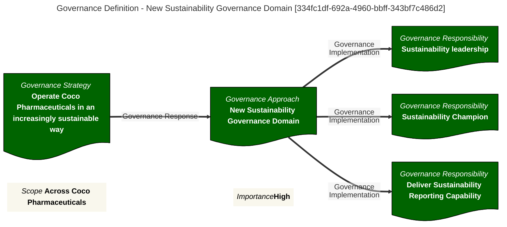

# `Governance Definition Context` with Qualified Name: `GovernanceApproach::New Sustainability Governance Domain`

# Provenance

* Results from processing file Derive-Dr-Gov-Defs.md on 2025-07-17 20:14
