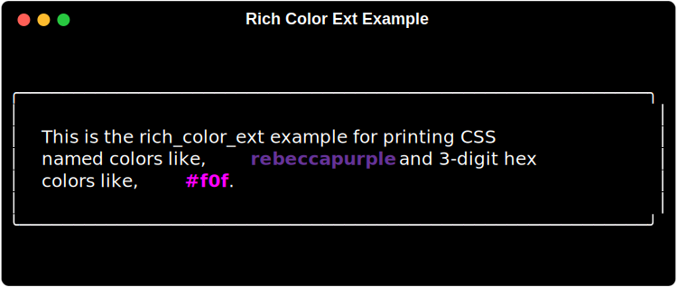

# rich-color-ext

`rich-color-ext` extends the great [rich](http://GitHub.com/textualize/rich) library to be able to parse 3-digit hex colors (ie. <span style="color:#09f">`#09F`</span>) and CSS color names (ie. <span style="rebeccapurple">`rebeccapurple`</span>).

## Installation

### uv (recommended)

```shell
uv add rich-color-ext
```

### pip

```shell
pip install rich-color-ext
```

## Usage

To make use of `rich-color-ext` all you need to do is import it.

```python
import rich_color_ext
from rich.console import Console

console = Console()
console.print(
    Panel(
        "This is the rich_color_ext example for printing CSS named colors like, \
[bold rebeccapurple]rebeccapurple[/bold rebeccapurple], 3-digit hex \
colors like, [bold #f0f]#f0f[/bold #f0f], and rich.color_triplet.ColorTriplet &\
rich.color.Color instances.",
        padding=(1,2),
    )
)
```



Made by Max Ludden


