# Robutler V2 Design Document - Chapter 1: Overview

## Executive Summary

Robutler v2 is a complete architectural redesign featuring a **modular skill system** focused on **maintainability**, **testability**, and **modularity**. This document outlines the transformation from the current monolithic v1 architecture to a clean, well-structured v2 system where memory, intents, MCP, and custom functionality are all implemented as modular skills. Agents can work with any combination of skills - from a single LLM skill to a full suite of capabilities.

### Key Design Principles

1. **Single Responsibility Principle**: Each module/class has one clear purpose
2. **Dependency Injection**: Loose coupling through interfaces and dependency injection
3. **Test-First Design**: Every component designed with testing in mind
4. **Modular Architecture**: Clear separation of concerns with well-defined boundaries
5. **Interface Segregation**: Small, focused interfaces over large monolithic ones

> **🔥 Smart Model Parameter:** BaseAgent supports a `model` parameter with explicit skill/model format:
> - **Format**: `{llm_skill_name}/{model_name}` (e.g., `model="openai/gpt-4o"`, `model="litellm/claude-3-sonnet"`)
> - **Auto-Skill Creation**: Creates appropriate LLM skill with specified model automatically
> - **LLM Skill Instance**: Direct skill instance also supported (e.g., `model=OpenAISkill(...)`)
> - **Examples**: `"openai/gpt-4o"`, `"anthropic/claude-3-sonnet"`, `"litellm/openai/gpt-4o"`, `"xai/grok-beta"`

---

## Current V1 Analysis

### Identified Issues

| Issue | Current Impact | V2 Solution |
|-------|---------------|-------------|
| **Monolithic Files** | `base.py` (1634 lines) - hard to navigate | Split into focused modules |
| **Mixed Concerns** | ServerBase handles HTTP, state, pricing, auth | Separate concerns into distinct services |
| **Complex RequestState** | Single class with 20+ responsibilities | Extract focused context managers |
| **Tight Coupling** | Direct dependencies on external APIs | Dependency injection with interfaces |
| **Hard to Test** | Complex setup, external dependencies | Mock-friendly architecture |
| **Limited Test Coverage** | Mostly integration tests | Unit tests for all components |

### Current Features (to preserve)

✅ **Core Features**:
- OpenAI-compatible endpoints
- Request lifecycle management
- Credit tracking and pricing
- Payment token system
- Agent registration and routing
- Streaming/non-streaming responses
- Intent-based agent discovery
- Dynamic agent resolution
- Usage analytics

---

## V2 Architecture Overview

### High-Level Architecture

```mermaid
graph TB
    %% User Layer
    User[👤 User] --> Server[🖥️ Robutler V2.0 Server]
    Owner[👑 Owner] --> Server
    
    %% Server Layer
    Server --> Auth[🔐 Auth Middleware<br/>Extract user context<br/>Set permissions]
    Auth --> Router[📍 FastAPI Router]
    
    %% Router splits to different endpoints
    Router --> RootAPI[🏠 / <br/>Root/Info endpoint]
    Router --> HealthAPI[💚 /health<br/>Health checks & status]
    Router --> AgentsListAPI[📋 /agents<br/>Agent discovery & listing]
    Router --> AgentAPI[🤖 /agents/id/*<br/>Individual agent endpoints]
    
    %% Agent Processing
    AgentAPI --> Agent[🧠 BaseAgent<br/>Core processing]
    Agent --> Tools[🔧 Tool System<br/>Scope-based access]
    Agent --> Skills[🎯 Skill System<br/>Categorized architecture]
    Agent --> LLM[🧬 LLM Provider<br/>via Skills]
    
    %% Tool System
    Tools --> PublicTools["🌍 Public Tools<br/>scope='all'"]
    Tools --> OwnerTools["👑 Owner Tools<br/>scope='owner'"]
    Tools --> AdminTools["🛡️ Admin Tools<br/>scope='admin'"]
    
    %% Skill System with Scopes
    Skills --> PublicSkills["🌍 Public Skills<br/>scope='all'"]
    Skills --> OwnerSkills["👑 Owner Skills<br/>scope='owner'"]
    Skills --> AdminSkills["🛡️ Admin Skills<br/>scope='admin'"]
    
    %% Core Skills (Essential - Auto-added)
    Skills --> CoreSkills[🏗️ Core Skills<br/>Essential functionality]
    CoreSkills --> ShortTermMem[⚡ Short-term Memory<br/>Message filtering & context]
    CoreSkills --> LongTermMem[🗄️ Long-term Memory<br/>LangGraph + PostgreSQL]
    CoreSkills --> VectorMem[🔍 Vector Memory<br/>Milvus semantic search]
    CoreSkills --> GuardrailsSkill[🛡️ Guardrails Skill<br/>Content safety & filtering]
    CoreSkills --> MCPSkill[📡 MCP Skill<br/>Model Context Protocol]
    CoreSkills --> LLMSkills[🧬 LLM Skills<br/>Provider integrations]
    
    %% LLM Skills (Core for model handoffs)
    LLMSkills --> LiteLLMSkill[🔄 LiteLLM Skill<br/>Cross-provider routing]
    LLMSkills --> OpenAISkill[🧠 OpenAI Skill<br/>Direct OpenAI access]
    LLMSkills --> AnthropicSkill[🧮 Anthropic Skill<br/>Claude models]
    LLMSkills --> XAISkill[🚀 XAI Skill<br/>Grok models]
    
    %% Robutler Platform Skills
    Skills --> RobutlerSkills[🌐 Robutler Skills<br/>Platform integration]
    RobutlerSkills --> NLISkill[💬 NLI Skill<br/>Agent-to-agent communication]
    RobutlerSkills --> DiscoverySkill[🔍 Discovery Skill<br/>Agent discovery via Portal]
    RobutlerSkills --> AuthSkillRobutler[🔐 Auth Skill<br/>JWT & permission management]
    RobutlerSkills --> PaymentSkill[💰 Payment Skill<br/>Token validation & charging]
    RobutlerSkills --> MessagesSkill[💬 Messages Skill<br/>Message management]
    RobutlerSkills --> StorageSkill[📊 Storage Skill<br/>Portal storage API]
    
    %% Extra Skills (Optional)
    Skills --> ExtraSkills[🔧 Extra Skills<br/>Domain-specific functionality]
    ExtraSkills --> GoogleSkill[🔍 Google Skill<br/>Search, Translate, etc.]
    ExtraSkills --> DatabaseSkill[🗄️ Database Skill<br/>SQL queries & operations]
    ExtraSkills --> FilesystemSkill[📁 Filesystem Skill<br/>File operations]
    ExtraSkills --> CrewAISkill[👥 CrewAI Skill<br/>Multi-agent orchestration]
    ExtraSkills --> N8NSkill[🔄 N8N Skill<br/>Workflow automation]
    ExtraSkills --> ZapierSkill[⚡ Zapier Skill<br/>Automation platform]
    
    %% Handoff System (not a skill)
    Agent --> HandoffSystem[🤝 Handoff System<br/>Agent collaboration & ACP]
    
    %% Workflow System
    Agent --> WorkflowSystem[🔄 Workflow System<br/>Skill orchestration]
    WorkflowSystem --> WorkflowEngine[⚙️ Workflow Engine<br/>Execution & dependencies]
    
    %% External Services
    LLM --> LiteLLM[🔄 LiteLLM Proxy<br/>localhost:2225]
    LiteLLM --> OpenAI[🧠 OpenAI API<br/>GPT-4o/4o-mini]
    LiteLLM --> Azure[☁️ Azure OpenAI<br/>Alternative provider]
    
    %% Data Storage
    ShortTermMem --> PortalMsg[(📨 Portal Messages API<br/>Message storage)]
    LongTermMem --> PostgresDB[(🗃️ PostgreSQL<br/>Persistent facts)]
    VectorMem --> MilvusDB[(🔍 Milvus<br/>Vector embeddings)]
    
    %% Agent Context
    Agent --> AgentContext[🎮 Agent Context<br/>skills + llm + auth]
    
    %% Styling
    classDef userClass fill:#e1f5fe,stroke:#01579b,stroke-width:2px
    classDef serverClass fill:#f3e5f5,stroke:#4a148c,stroke-width:2px
    classDef toolClass fill:#e8f5e8,stroke:#1b5e20,stroke-width:2px
    classDef memoryClass fill:#fff3e0,stroke:#e65100,stroke-width:2px
    classDef dbClass fill:#fce4ec,stroke:#880e4f,stroke-width:2px
    classDef llmClass fill:#e0f2f1,stroke:#004d40,stroke-width:2px
    classDef apiClass fill:#f1f8e9,stroke:#33691e,stroke-width:2px
    
    class User,Owner userClass
    class Server,Auth,Router serverClass
    class RootAPI,HealthAPI,AgentsListAPI,AgentAPI apiClass
    class Tools,PublicTools,OwnerTools,AdminTools toolClass
    class Skills,CoreSkills,RobutlerSkills,ExtraSkills,LLMSkills,PublicSkills,OwnerSkills,AdminSkills,ShortTermMem,LongTermMem,VectorMem,GuardrailsSkill,MCPSkill,NLISkill,DiscoverySkill,AuthSkillRobutler,PaymentSkill,MessagesSkill,StorageSkill,LiteLLMSkill,OpenAISkill,AnthropicSkill,XAISkill,GoogleSkill,DatabaseSkill,FilesystemSkill,CrewAISkill,N8NSkill,ZapierSkill,HandoffSystem,WorkflowSystem,WorkflowEngine memoryClass
    class PortalMsg,PostgresDB,MilvusDB dbClass
    class LLM,LiteLLM,OpenAI,Azure llmClass
```



### Core Design Principles

**🎯 Core Design Principles:**
- **Modular Skill System**: Skills organized by directory but used flexibly
- **LLM via Skills**: No model parameter needed - LLM functionality provided by dedicated skills
- **Automatic Dependency Resolution**: Skills can specify dependencies - dependent skills are auto-included
- **Dynamic Runtime Registration**: Skills can conditionally register tools/hooks/handoffs during request execution
- **Granular Memory System**: 3 separate memory skills (short-term, long-term, vector)
- **Simplified Lifecycle Hook System**: Clean event system with @hook decorator for automatic registration (on_connection, on_chunk, on_message, before/after_toolcall, before/after_handoff, finalize_connection)
- **Scope-Based Access**: `@tool(scope="owner")` and `Skill(scope="owner")` for fine-grained permissions
- **Full Robutler Integration**: Pre-configured RobutlerAgent with NLI, discovery, auth, payments
- **Agent Communication Protocol**: Built-in ACP support for agent-to-agent collaboration
- **Platform Agnostic**: Compatible with REST APIs, WebSocket connections, and messaging systems

---

## Core Features & Benefits

### **🚀 Key V2.0 Features**

#### **Flexible Skill System**

**Skills are comprehensive agent capabilities** that encapsulate complete functional domains rather than individual features. Each skill represents a cohesive unit of agentic functionality, combining custom business logic, specialized tools, lifecycle hooks, agent-to-agent handoffs, dependency management, and intelligent decorators into a unified, reusable component.

**What Makes Skills Powerful:**
- **🧠 Custom Logic**: Domain-specific reasoning and decision-making capabilities
- **🔧 Integrated Tools**: Purpose-built functions that extend the agent's actionable capabilities  
- **⚡ Lifecycle Hooks**: Event-driven integration points that respond to request/response/chunk/toolcall/handoff cycles
- **🤝 Handoff Mechanisms**: Intelligent routing to specialized agents when tasks exceed scope
- **🔗 Dependency Resolution**: Automatic inclusion of required supporting capabilities
- **🎯 Smart Decorators**: Context-aware annotations for pricing, security, and workflow orchestration
- **🛡️ Scope-Based Security**: Fine-grained access control aligned with user permissions
- **🎯 @hook Decorator**: Automatic lifecycle hook registration with priority support  
- **🛡️ Unified Scope System**: Consistent scope-based access control for @hook, @tool, and @handoff decorators

This architecture transforms agents from simple chat interfaces into sophisticated, domain-aware entities capable of complex reasoning, multi-step workflows, and seamless collaboration with other AI agents and external systems.

```python
# Minimal agent - just one skill needed
minimal_agent = BaseAgent(
    name="simple-agent",
    skills={"openai": OpenAISkill({"api_key": "key"})}
)

# Skills organized by directory but can be mixed freely
full_agent = BaseAgent(
    name="full-agent", 
    skills={
        # From core/ directory
        "short_term_memory": ShortTermMemorySkill(),
        "openai": OpenAISkill({"api_key": "key"}),
        
        # From robutler/ directory  
        "robutler.discovery": DiscoverySkill({"portal_url": "..."}),
        
        # From extra/ directory
        "google": GoogleSkill({"api_key": "key"}),
        "database": DatabaseSkill({"connection": "..."})
    }
)
```

#### **Automatic Dependency Resolution**
```python
class PaymentSkill(Skill):
    def __init__(self, config: Dict = None):
        # PaymentSkill depends on AuthSkill for user validation
        super().__init__(config, scope="owner", dependencies=["robutler.auth"])

# When creating an agent with PaymentSkill, dependencies are auto-included
agent = BaseAgent(
    name="payment-agent",
    skills={
        "payments": PaymentSkill()  # Only specify this skill
    }
)
# Result: Agent automatically includes robutler.auth skill
```

#### **Full Streaming Support**
```python
# OpenAI-compatible streaming
async def run_streaming(self, messages: List[Dict[str, Any]], 
                       tools: Optional[List[OpenAITool]] = None) -> AsyncGenerator[Dict[str, Any], None]:
    """Execute agent with streaming OpenAI-compatible response chunks"""
    
    # ✅ Proper chunk format with usage tracking
    # ✅ Tool call streaming support  
    # ✅ (Optional) Billing integration after stream completion
```

### **🎯 System Benefits**

**Flexible Skill System Benefits:**
- **Minimal Setup**: Create agents with just the skills you need (even just one LLM skill)
- **Mix and Match**: Use any combination of skills without category restrictions
- **Scope-Based Access Control**: Skills have scopes (all/owner/admin) for fine-grained security
- **Automatic Dependency Resolution**: Skills can specify dependencies - dependent skills are automatically included
- **Dynamic Runtime Registration**: Skills can conditionally register tools/hooks/handoffs during request processing
- **Granular Memory**: 3 separate memory skills (short-term context, long-term facts, vector similarity)
- **Protocol Agnostic**: Events work seamlessly with REST, WebSocket, messaging protocols
- **RobutlerAgent Preset**: Pre-configured agent with full Robutler platform integration
- **Agent Collaboration**: Built-in ACP support for agent-to-agent handoffs and collaboration
- **Thread-Safe Operations**: All registration methods are thread-safe for concurrent requests
- **Plugin Architecture**: Drop-in skills with zero agent code changes

### **📊 V2.0 Endpoint Implementation Status**

**Implemented in V2.0:**
- ✅ `/chat/completions` - OpenAI-compatible chat completions (streaming & non-streaming)
- ✅ `/` - Agent information and discovery
- ✅ `/agents/search` - Search agents by natural language query
- ✅ `/agents/{name}` - Get specific agent information

**Future Endpoints (V2.1+):**
- 🚧 `/realtime` - Real-time bidirectional communication
- 🚧 `/a2a` - Agent-to-agent communication protocols  
- 🚧 `/voice` - Voice interaction endpoints
- 🚧 `/video` - Video interaction endpoints

---

## Chapter Organization

This design document is organized into the following chapters:

- **Chapter 1: Overview** (this chapter) - High-level architecture and key concepts
- **Chapter 2: Core Architecture** - Detailed component design and interfaces
- **Chapter 3: Skills System** - Complete skill system implementation and examples  
- **Chapter 4: Server & Tools** - FastAPI server, tools, and request management
- **Chapter 5: Integration & Usage** - Usage examples, platform integration, and API clients
- **Chapter 6: Implementation Guide** - Testing, migration, and deployment strategies

---

## 🌊 Streaming Support Summary

Robutler V2 includes comprehensive streaming support:

### **✅ Full OpenAI Streaming Compatibility**
- **🔧 Tool Call Streaming**: Function calls and responses streamed in real-time
- **💰 Billing Integration**: Usage tracked after stream completion 
- **🚀 Concurrent Support**: Non-blocking async support for 1000+ simultaneous streams
- **⚡ Memory Efficient**: AsyncGenerator pattern prevents memory buildup
- **🛡️ Error Handling**: Proper error formatting in streaming chunks
- **📊 Usage Tracking**: Complete token and tool usage reporting

### **✅ Performance Targets**
- **Response Latency**: <200ms first chunk, <50ms subsequent chunks
- **Concurrent Connections**: 1000+ simultaneous streaming connections
- **Memory Efficiency**: <2GB for 1000 concurrent agents
- **OpenAI Compatibility**: 100% compatible with OpenAI ChatCompletions streaming API

---

The V2 design delivers a **maintainable**, **testable**, **platform-native**, and **collaboration-ready** framework with intuitive **skill-based** agent capabilities that will accelerate agent development for years to come. 