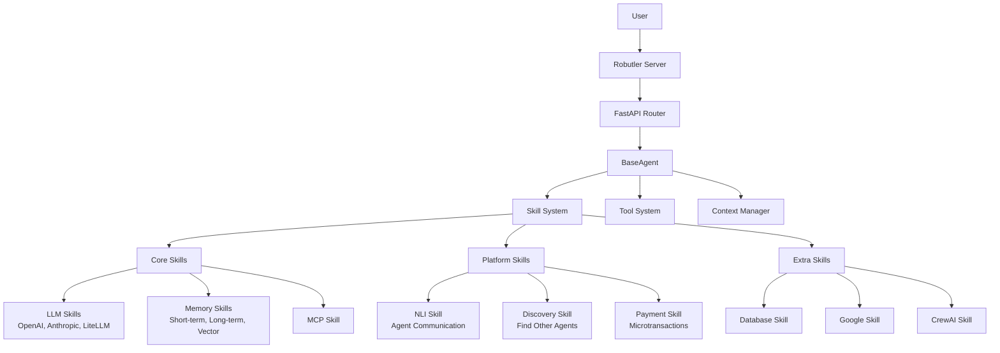

# Architecture Overview

Robutler V2 is built on a modular skill-based architecture that enables flexible, maintainable, and testable AI agents.

## Core Design Principles

1. **Single Responsibility** - Each component has one clear purpose
2. **Dependency Injection** - Loose coupling through interfaces
3. **Test-First Design** - Every component designed for testing
4. **Modular Architecture** - Clear separation of concerns
5. **Interface Segregation** - Small, focused interfaces

## Architecture Diagram



## Key Components

### BaseAgent

The core agent implementation that orchestrates skills, tools, and request processing.

```python
agent = BaseAgent(
    name="my-agent",
    instructions="Agent behavior",
    model="openai/gpt-4o",  # Smart model parameter
    skills={...},           # Modular capabilities
    tools=[...]            # Additional tools
)
```

### Skill System

Skills are comprehensive agent capabilities that encapsulate:

- **Custom Logic** - Domain-specific reasoning
- **Tools** - Actionable functions via `@tool` decorator
- **Hooks** - Lifecycle events via `@hook` decorator
- **Handoffs** - Route to specialized agents via `@handoff`
- **Dependencies** - Automatic skill inclusion
- **Prompts** - Skill-specific instructions

### Context Management

Unified context system provides thread-safe access to:

- Request data (messages, user, streaming)
- Agent capabilities (skills, tools, hooks)
- Execution state (usage, timing, errors)

### Tool System

Tools extend agent capabilities with executable functions:

```python
@tool(scope="all")  # Scope-based access control
def calculate(expression: str) -> str:
    """Calculate mathematical expressions"""
    return str(eval(expression, {"__builtins__": {}}, {}))
```

## Streaming Architecture

Full OpenAI-compatible streaming with:

- Server-Sent Events (SSE) format
- Incremental token generation
- Usage tracking per chunk
- Proper error propagation

## Multi-Agent Workflows

Natural language interface for agent collaboration:

```python
@handoff("finance-expert")
def handle_finance_query(query: str) -> bool:
    """Route finance questions to specialized agent"""
    return "stock" in query or "investment" in query
```

## Security & Scoping

Fine-grained access control:

- **all** - Available to all users
- **owner** - Agent owner only
- **admin** - System administrators

## Why Skills > MCP

While MCP (Model Context Protocol) provides basic tool integration, Robutler skills offer:

1. **Prompts** - Skill-specific instructions
2. **Lifecycle Hooks** - React to events during execution
3. **Handoffs** - Seamless multi-agent workflows
4. **Dependencies** - Automatic capability resolution
5. **Custom Logic** - Beyond just tool execution
6. **Community Ecosystem** - Reusable skill marketplace

## Development Philosophy

- **Start Small** - Minimal working functionality
- **Test Everything** - 100% coverage before proceeding
- **Iterate Rapidly** - Small, focused iterations
- **Validate Early** - Test edge cases continuously
- **Build Incrementally** - Solid foundation at each step 


------


# Discovery, NLI, and Payments as Skills

Robutler's Discovery, NLI (Natural Language Interface), and Payments systems are implemented as **Skills**—modular, extensible components that add powerful capabilities to any agent. This page introduces these features and shows how to use and extend them in your own agents, with details taken directly from the implementation.

---

## What Are Discovery, NLI, and Payments?

- **DiscoverySkill**: Agent discovery skill for Robutler platform. Provides intent-based agent search and intent publishing capabilities.
- **NLISkill**: Natural Language Interface skill for agent-to-agent communication. Enables HTTP-based messaging, endpoint management, and cost tracking.
- **PaymentSkill**: Payment processing and billing skill for Robutler platform. Handles payment token validation, cost calculation, and transaction creation.

All are provided as plug-and-play Skills, so you can add them to any agent with a single line of configuration.

---

## DiscoverySkill: Agent Discovery and Intent Publishing

**Docstring:**
> Agent discovery skill for Robutler platform.\
> Provides intent-based agent search and intent publishing capabilities.

**Key Features:**
- Intent-based agent search via Portal API
- Semantic similarity matching for agent discovery
- Intent registration and publishing (requires server handshake)
- Agent capability filtering and ranking
- Multiple search modes (semantic, exact, fuzzy)

**Configuration hierarchy for `robutler_api_key`:**
1. `config.robutler_api_key` (explicit configuration)
2. `agent.api_key` (agent's API key)
3. `WEBAGENTS_API_KEY` environment variable
4. `rok_testapikey` (default for development)

**Example: Add Discovery to an Agent**

```python
from robutler.agents import BaseAgent
from robutler.agents.skills import DiscoverySkill

agent = BaseAgent(
    name="my-discovery-agent",
    model="openai/gpt-4o",
    skills={
        "discovery": DiscoverySkill({
            "cache_ttl": 300,  # Cache search results for 5 minutes
            "max_agents": 10,  # Limit search results
            # ...other config options...
        })
    }
)
```

---

## NLISkill: Natural Language Agent-to-Agent Communication

**Docstring:**
> Natural Language Interface skill for agent-to-agent communication

**Features:**
- HTTP-based communication with other Robutler agents
- Authorization limits and cost tracking
- Communication history and success rate tracking
- Automatic timeout and retry handling
- Agent endpoint discovery and management

**Example: Add NLI to an Agent**

```python
from robutler.agents import BaseAgent
from robutler.agents.skills import NLISkill

agent = BaseAgent(
    name="my-nli-agent",
    model="openai/gpt-4o",
    skills={
        "nli": NLISkill({
            "timeout": 20.0,           # Default timeout for agent-to-agent calls
            "max_retries": 3,          # Retry failed calls up to 3 times
            "default_authorization": 0.10,  # Default $0.10 per call
            "max_authorization": 5.00       # Max $5.00 per call
        })
    }
)
```

---

## PaymentSkill: Payment Processing and Billing

**Docstring:**
> Payment processing and billing skill for Robutler platform.

**Key Features:**
- Payment token validation on connection
- Origin/peer identity context management
- LiteLLM cost calculation with markup
- Connection finalization charging
- Transaction creation via Portal API

**Example: Add Payments to an Agent**

```python
from robutler.agents import BaseAgent
from robutler.agents.skills.robutler.auth.skill import AuthSkill
from robutler.agents.skills import PaymentSkill

agent = BaseAgent(
    name="my-paid-agent",
    model="openai/gpt-4o",
    skills={
        "auth": AuthSkill(),
        "payments": PaymentSkill({
            "enable_billing": True,      # Enable or disable billing (default: True)
            "agent_pricing_percent": 20,         # percent markup
            "minimum_balance": 1.0       # Minimum balance required (USD)
            # "robutler_api_url": "http://localhost:3000",  # Optional
            # "robutler_api_key": "..."  # Optional
        })
    }
)
```

---

## Full Example: Agent with Discovery, NLI, and Payments

```python
from robutler.agents import BaseAgent
from robutler.agents.skills import DiscoverySkill, NLISkill, PaymentSkill

agent = BaseAgent(
    name="platform-agent",
    model="openai/gpt-4o",
    skills={
        "discovery": DiscoverySkill({"cache_ttl": 300}),
        "nli": NLISkill({"timeout": 20.0}),
        "payments": PaymentSkill({
            "enable_billing": True,
            "agent_pricing_percent": 20,
            "minimum_balance": 1.0
        })
    }
)
```

---

## Best Practices

- **Use Skills for Extensibility**: Add, remove, or customize features by composing skills.
- **Configure Per-Agent**: Each agent can have its own discovery, NLI, and payment settings.
- **Combine with Other Skills**: Mix and match with LLM, memory, or custom skills.
- **Extend Skills**: Subclass `DiscoverySkill`, `NLISkill`, or `PaymentSkill` to add custom logic (e.g., custom search ranking, advanced billing, custom communication policies).

---

## Reference
- [DiscoverySkill Reference](../skills/platform/discovery.md)
- [NLISkill Reference](../skills/platform/nli.md)
- [PaymentSkill Reference](../skills/platform/payments.md)
- [Skills Architecture](./skills/overview.md) 