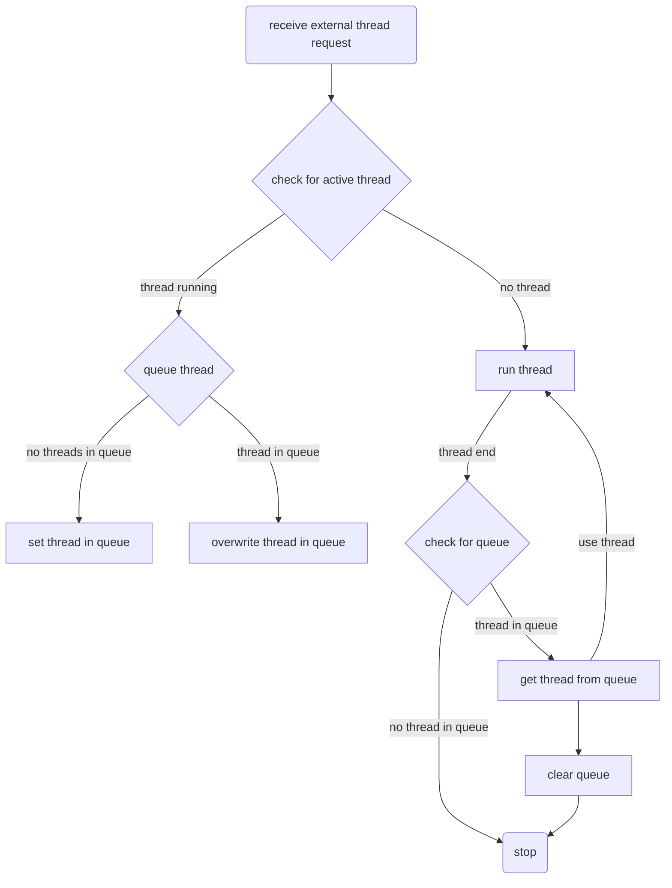
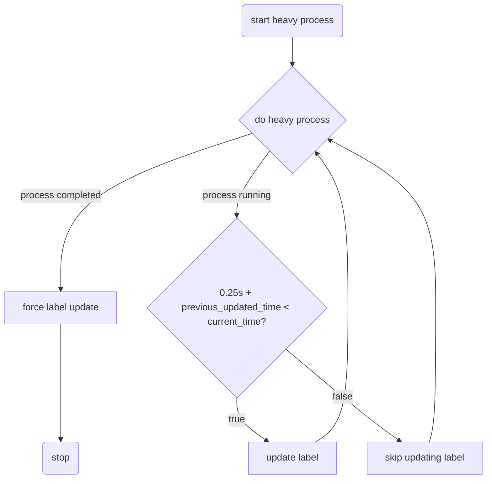

`rovr` uses textual, which uses python, which is known for how terrible a performance it gives.
 hence, `rovr` makes use of a couple optimisations to make it perform reasonably well

### queue of length 1

used in `MetadataContainer` and `PreviewContainer`

this diagram roughly shows how the mechanism works, with the main thing being an intentional debouncer.

- having a normal queue means that it would take a while for each item in the queue to be run, hence a very noticeable lag.
- however, by having a queue of length 1, and overwriting the queue, it means that the latest added item is considered, and anything in between is ignored, greatly improving performance

### debounced updates

used in `MetadataContainer` and `ProcessBarContainer`

this diagram shows how it works

- when doing heavy tasks, like calculating folder size, or deleting folders, the appropriate widgets' labels are update spammed.
- by using a 'debouncer', more time is spent on actually doing the process, than to update the progress of the process

I am certainly not the first person to have discovered this, but it is such a nice mechanism to have
