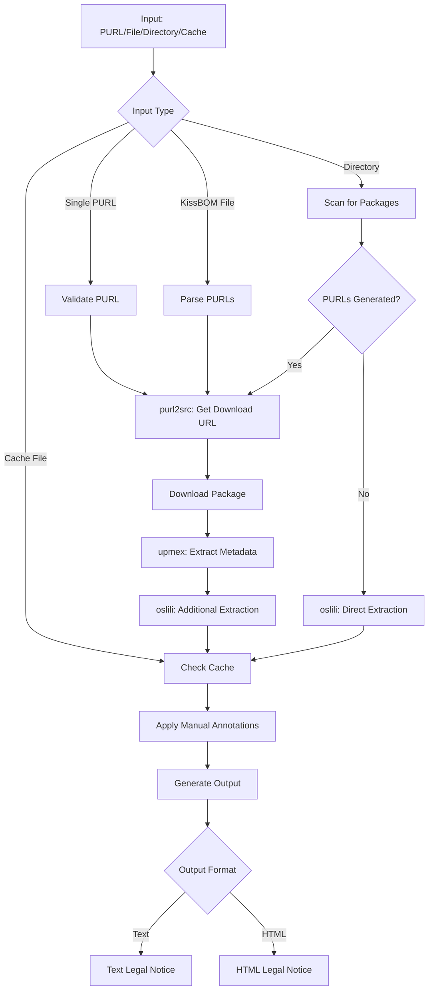

# purl2notices - Tool Specification Document

## Executive Summary
`purl2notices` is a Python library and CLI tool designed to generate legal notices (attribution to authors and copyrights) for software packages. It processes Package URLs (PURLs), extracts license and copyright information, and produces formatted legal notices suitable for inclusion in product documentation.

## Project Information
- **Full Name**: Semantic-copycat-purl2notices
- **CLI Command**: `purl2notices`
- **PyPI Package Name**: Published under `oscarvalenzuelab`
- **Author**: Oscar Valenzuela B
- **Contact**: oscar.valenzuela.b@gmail.com
- **License**: [To be determined]
- **Version**: 0.1.0 (initial release)

## Core Functionality

### Purpose
The tool addresses the need for automated generation of legal notices for software products, ensuring proper attribution to original authors and copyright holders. This is essential for:
- Legal compliance with open source licenses
- Proper attribution in commercial products
- Automated SBOM (Software Bill of Materials) generation
- License compliance auditing

### Key Features
1. **Multiple Input Modes**: Single PURL, batch processing, directory scanning
2. **Automated License Detection**: Using multiple detection libraries
3. **Copyright Extraction**: Intelligent parsing and normalization
4. **Flexible Output**: Customizable templates for different formats
5. **Manual Override**: Cache-based annotation system
6. **Batch Processing**: Efficient parallel processing for large projects

## Technical Architecture

### Core Dependencies
1. **semantic-copycat-purl2src** ([PyPI](https://pypi.org/project/semantic-copycat-purl2src/))
   - Resolves Package URLs to downloadable artifacts
   - Handles various package registries (npm, PyPI, Maven, etc.)

2. **semantic-copycat-upmex** ([PyPI](https://pypi.org/project/semantic-copycat-upmex/))
   - Extracts metadata from downloaded packages
   - Identifies license and copyright information

3. **semantic-copycat-oslili** ([PyPI](https://pypi.org/project/semantic-copycat-oslili/))
   - Advanced license and copyright detection
   - Fallback mechanism for complex cases

### Processing Pipeline



## Operation Modes

### Default Behavior
If no input is specified but a cache file exists (either specified via `--cache` or the default `.purl2notices.cache.json`), the tool automatically runs in cache mode to regenerate notices from the cached data. This allows users to:
1. Generate cache from any input mode
2. Manually edit the cache file
3. Simply run `purl2notices` to regenerate notices

### Mode A: Single Package URL
**Use Case**: Generating notice for a single package
**Input**: A valid Package URL (PURL)
**Process**:
1. Validate PURL against specification
2. Resolve to download URL
3. Extract license/copyright
4. Generate formatted notice

**Example**:
```bash
purl2notices --mode single --input "pkg:npm/express@4.18.0"
```

### Mode B: Batch Processing (KissBOM)
**Use Case**: Processing multiple packages from a project
**Input**: File with PURLs (one per line)
**Process**:
1. Validate file format
2. Process each PURL independently
3. Aggregate and deduplicate results
4. Generate consolidated notice

**Example**:
```bash
purl2notices --mode kissbom --input packages.txt --output NOTICE.txt
```

### Mode C: Directory Scanning
**Use Case**: Analyzing existing codebase
**Input**: Directory path
**Process**:
1. Recursively scan for packages
2. Identify via archives and metadata files
3. Generate PURLs for found packages
4. Process as batch

**Example**:
```bash
purl2notices --mode scan --input ./project --recursive --max-depth 5
```

### Mode D: Cache-Based Annotation
**Use Case**: Manual review and correction
**Input**: Cache file (CycloneDX JSON)
**Process**:
1. Generate initial cache from any other mode
2. User manually edits cache
3. Use cache as input to regenerate notices

**Example**:
```bash
# First pass - generate cache from scan
purl2notices --mode scan --input ./project --cache project.cdx.json

# Manual edit of project.cdx.json

# Second pass - use cache file as input
purl2notices --input project.cdx.json --output NOTICE.html

# Or use default cache implicitly
purl2notices --output NOTICE.html  # Uses .purl2notices.cache.json if exists

# Or explicitly specify cache mode
purl2notices --mode cache --input project.cdx.json --output NOTICE.html
```

## Output Specifications

### Standard Output Format

#### Single License Package
```
Package: express@4.18.0 (MIT)
Copyright: Copyright (c) 2009-2024 TJ Holowaychuk
           Copyright (c) 2013-2024 Roman Shtylman
           Copyright (c) 2014-2024 Douglas Wilson
License Text:
[Full MIT license text]
```

#### Multiple Packages, Same License
```
Packages:
- lodash@4.17.21 (MIT)
- underscore@1.13.6 (MIT)
- async@3.2.4 (MIT)

Copyright: Copyright (c) JS Foundation and contributors
           Copyright (c) 2009-2024 Jeremy Ashkenas
           Copyright (c) 2010-2024 Caolan McMahon

License Text:
[Full MIT license text]
```

#### Package with Multiple Licenses
```
Package: dual-license-pkg@1.0.0 (Apache-2.0, MIT)
Copyright: Copyright (c) 2024 Multiple Contributors
License Texts:
--- Apache-2.0 ---
[Full Apache 2.0 text]
--- MIT ---
[Full MIT text]
```

### Template System
- Uses Jinja2 templating engine
- Supports custom templates
- Variables available in templates:
  - `packages`: List of package objects
  - `licenses`: Deduplicated license texts
  - `copyrights`: Normalized copyright statements
  - `metadata`: Additional metadata

### Cache File Format (Intermediate Storage)
The cache file uses **CycloneDX JSON SBOM format** as intermediate storage, NOT as final output.

**Purpose**: Store extracted package data for manual review/editing before generating legal notices

**Structure**: CycloneDX JSON with extensions for:
- Manual copyright annotations
- License overrides
- Package exclusions
- Additional attribution notes

**Important**: The cache is NOT the final output. It's an editable intermediate format that stores all extracted data. The final output is always formatted legal notices (text or HTML).

## Error Handling Strategy

### Validation Errors
- **Invalid PURL**: Log error, skip if batch mode, exit if single mode
- **Invalid KissBOM**: Exit with detailed error message
- **Invalid directory**: Exit with path error

### Network Errors
- **Download failure**: Retry 3x with exponential backoff
- **Timeout**: Skip package, mark as unavailable
- **Registry unavailable**: Cache negative result, continue

### Extraction Errors
- **No license found**: Mark as "NOASSERTION"
- **Corrupt package**: Log error, skip package
- **Unsupported format**: Attempt generic extraction

## CLI Interface

### Basic Usage
```bash
purl2notices [OPTIONS] [COMMAND] [ARGS]

# Input types auto-detected
purl2notices --input pkg:npm/express@4.0.0       # Single PURL
purl2notices --input packages.txt                # KissBOM file
purl2notices --input ./src                       # Directory scan
purl2notices --input project.cdx.json            # Cache file

# If cache exists and no input provided, uses cache automatically
purl2notices --output NOTICE.txt  # Uses .purl2notices.cache.json if exists

# Typical workflow with cache
purl2notices --input packages.txt --cache        # Generate cache
# ... manually edit .purl2notices.cache.json ...
purl2notices --input .purl2notices.cache.json    # Regenerate from edited cache
```

### Global Options
```
--verbose, -v      Increase verbosity (0-3)
--quiet, -q        Suppress non-error output
--config           Config file path
--cache, -c        Cache file location (enables caching, default: .purl2notices.cache.json)
--no-cache         Disable caching
--parallel, -p     Number of parallel workers
--timeout          HTTP timeout in seconds
```

### Commands

#### `single` - Process single PURL
```bash
purl2notices single PURL [OPTIONS]
  --output, -o      Output file (default: stdout)
  --format, -f      Output format (text|html) - for legal notices
  --template, -t    Custom template file
  --cache, -c       Save intermediate data to cache file (CycloneDX JSON)
```

#### `batch` - Process multiple PURLs
```bash
purl2notices batch INPUT_FILE [OPTIONS]
  --output, -o      Output file (legal notices)
  --format, -f      Output format (text|html)
  --cache, -c       Save intermediate data to cache file (CycloneDX JSON)
  --continue        Continue on errors
```

#### `scan` - Scan directory
```bash
purl2notices scan DIRECTORY [OPTIONS]
  --recursive, -r   Recursive scan (default: true)
  --max-depth, -d   Maximum depth
  --exclude, -e     Exclude patterns (multiple)
  --include, -i     Include patterns (multiple)
```

#### `cache` - Work with cache
```bash
# Generate legal notices from cache (CycloneDX JSON SBOM)
purl2notices cache [OPTIONS]
  --cache, -c       Cache file path (CycloneDX JSON)
  --output, -o      Output file (legal notices)
  --format, -f      Output format (text|html)
  
# Subcommands for cache management  
purl2notices cache edit      # Open cache in editor
purl2notices cache validate  # Validate cache structure
purl2notices cache merge     # Merge multiple cache files
```

## Configuration File

### Format: YAML or TOML
```yaml
# purl2notices.yaml
general:
  verbose: 2
  parallel_workers: 4
  timeout: 30
  
scanning:
  recursive: true
  max_depth: 10
  exclude_patterns:
    - "*/node_modules/*"
    - "*/venv/*"
    - "*/.git/*"
  archive_extensions:
    - .jar
    - .tar.gz
    - .whl
    
output:
  format: html  # Legal notices output format (text|html)
  template: custom_template.j2
  group_by_license: true
  
cache:
  enabled: true
  location: ".purl2notices.cache.json"  # CycloneDX JSON SBOM (intermediate storage)
  auto_mode: true  # Auto-detect cache mode when no input provided
  ttl: 86400  # 24 hours
```

## Implementation Roadmap

### Phase 1: Core Functionality (v0.1.0)
- [ ] PURL validation
- [ ] Single PURL processing
- [ ] Basic text output
- [ ] Integration with dependencies

### Phase 2: Batch Processing (v0.2.0)
- [ ] KissBOM support
- [ ] Parallel processing
- [ ] Progress indicators
- [ ] Error recovery

### Phase 3: Directory Scanning (v0.3.0)
- [ ] Archive detection
- [ ] Metadata parsing
- [ ] PURL generation
- [ ] Recursive scanning

### Phase 4: Advanced Features (v0.4.0)
- [ ] Cache system
- [ ] Manual annotations
- [ ] Template engine
- [ ] HTML output

### Phase 5: Polish (v1.0.0)
- [ ] Performance optimization
- [ ] Comprehensive testing
- [ ] Documentation
- [ ] CI/CD pipeline

## Testing Strategy

### Unit Tests
- PURL validation logic
- Copyright normalization
- License detection
- Template rendering

### Integration Tests
- End-to-end processing
- Dependency integration
- Cache operations
- File I/O

### Performance Tests
- Large directory scanning
- Batch processing speed
- Memory usage
- Cache efficiency

### Test Data
- Sample PURLs for each ecosystem
- Test packages with various licenses
- Edge cases (no license, multiple licenses)
- Corrupted/invalid packages

## Security Considerations

1. **Input Validation**: Strict PURL validation to prevent injection
2. **File System**: Path traversal prevention in directory scanning
3. **Network**: TLS verification for package downloads
4. **Cache**: Secure storage of sensitive data
5. **Templates**: Safe template rendering (no code execution)

## Performance Requirements

- Single PURL: < 5 seconds
- Batch (100 PURLs): < 2 minutes
- Directory scan (1000 files): < 5 minutes
- Memory usage: < 500MB for typical operations
- Cache size: < 100MB for 1000 packages

## Compliance and Legal

### License Compliance
- Tool itself under [TBD] license
- Respects all source licenses
- Preserves attribution requirements
- No license text modification

### Privacy
- No telemetry or usage tracking
- Local processing only
- Optional cache can be disabled
- No external API calls except package registries

## Future Enhancements

1. **Web Interface**: Browser-based UI for non-technical users
2. **CI/CD Integration**: GitHub Actions, GitLab CI plugins
3. **License Compatibility**: Check for license conflicts
4. **SBOM Formats**: Support for SPDX, additional CycloneDX features
5. **Container Scanning**: Direct Docker/OCI image analysis
6. **Policy Engine**: Configurable license policies
7. **Reporting**: PDF reports, compliance dashboards
8. **API Service**: REST API for integration

## References

- [Package URL Specification](https://github.com/package-url/purl-spec)
- [KissBOM Specification](https://github.com/kissbom/kissbom-spec)
- [SPDX License List](https://spdx.org/licenses/)
- [CycloneDX Specification](https://cyclonedx.org/)
- [Semantic Copycat Suite](https://github.com/semantic-copycat)

## Support and Contribution

- **Issue Tracker**: [GitHub Issues]
- **Documentation**: [Read the Docs]
- **Contributing**: See CONTRIBUTING.md
- **Code of Conduct**: See CODE_OF_CONDUCT.md
- **Security**: Report to oscar.valenzuela.b@gmail.com

---

*This specification represents the initial design of purl2notices. It will evolve based on user feedback and implementation experience.*