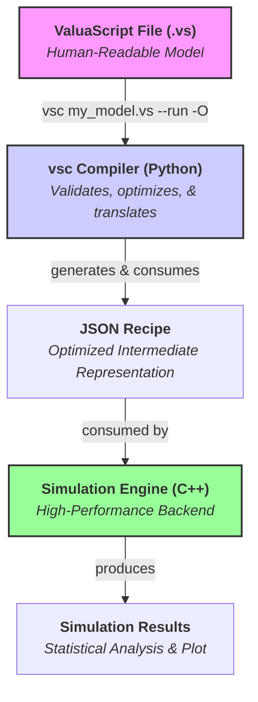
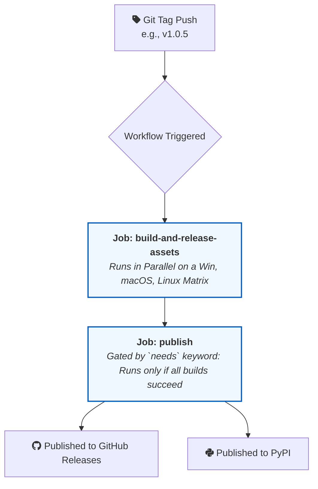

# ValuaScript & The Quantitative Simulation Engine

[](https://github.com/Alessio2704/monte-carlo-simulator/actions)
[](https://opensource.org/licenses/MIT)
[](https://isocpp.org/std/the-standard)
[](https://www.python.org/downloads/)

**A high-performance, multithreaded C++ engine for quantitative financial modeling, driven by ValuaScript—a simple, dedicated scripting language with a smart, optimizing compiler.**

## 📖 About The Project

This project was born from the need to bridge the gap between the intuitive but slow nature of spreadsheet-based financial modeling and the powerful but often verbose nature of general-purpose programming languages. The goal is to provide a platform that offers the **usability** of a dedicated modeling language with the **raw performance** of compiled, multithreaded C++.

It is designed to execute complex, multi-year, stochastic financial models, running hundreds of thousands of Monte Carlo simulations in seconds—a task that would take minutes or hours in traditional tools.

### Key Features

- **✨ Simple & Intuitive Language:** Models are defined in **ValuaScript (`.vs`)**, a clean, declarative language with a **familiar, spreadsheet-like formula syntax** using standard mathematical operators (`+`, `-`, `*`, `/`, `^`).
  - **Ergonomic Syntax:** Includes intuitive bracket syntax (`variable[index]`) for element access, slice-like syntax (`variable[:-1]`) for deleting elements, and numeric separators (`1_000_000`) for enhanced readability.
- **🚀 High-Performance Backend:** A core engine written in modern C++17, fully multithreaded to leverage all available CPU cores for maximum simulation speed.
  - **Robust Error Handling:** Features comprehensive static type inference in the compiler and detailed runtime checks in the engine, providing clear and precise error messages for common issues like incorrect function arguments or vector dimension mismatches.
- **🐍 Intelligent Optimizing Compiler:** A robust compiler, `vsc`, transpiles ValuaScript into a JSON recipe. It performs advanced optimizations like **Loop-Invariant Code Motion** (moving deterministic calculations out of the main simulation loop) and **Dead Code Elimination** (removing unused code) to generate a highly efficient execution plan.
  - It provides **intelligent, user-friendly warnings**, performs **static type inference** to catch logical errors before execution, and offers **verbose feedback** on its optimization process.
- **⚙️ Streamlined Workflow:** A `--run` flag allows for a seamless, one-step compile-and-execute experience.
- **📊 Instant Visualization:** A `--plot` flag automatically generates a histogram of the simulation output, providing immediate visual analysis.
- **📈 Data Export:** Natively supports exporting full simulation trial data to CSV files for further analysis with the `@output_file` directive.
- **🎲 Integrated Monte Carlo Simulation:** Natively supports a rich library of statistical distributions (`Normal`, `Pert`, `Lognormal`, etc.) with fully validated parameters.
- **🛡️ Robust & Tested:** Comprehensive unit test suite for both the C++ engine (GoogleTest) and the Python compiler (Pytest), ensuring correctness and stability. The entire toolchain is validated by a comprehensive test suite on every release.
- **🛠️ Professional VS Code Extension:** A full-featured extension providing:
  - Dynamic, maintainable syntax highlighting.
  - A comprehensive set of code snippets.
  - A Python-based Language Server for real-time, as-you-type error diagnostics and **hover-for-help** with function signatures and descriptions.
  - A **custom file icon** (a stylized distribution curve) for `.vs` files, ensuring a polished editor experience.

## 🏛️ Architecture

The project is cleanly separated into two main components: a Python **compiler** and a C++ **engine**. This modular structure separates the user-facing language tools from the high-performance computation core.

The compilation process generates a structured JSON recipe with distinct, optimized execution phases, making the engine's job clear and scalable.



**Example JSON Recipe Structure:**
The optimizing compiler transforms a `.vs` script into a JSON recipe that the C++ engine can execute. This recipe explicitly separates one-time calculations (`pre_trial_steps`) from the core per-trial simulation loop.

```json
{
  "simulation_config": {
    "num_trials": 10000,
    "output_file": "results.csv"
  },
  "output_variable": "final_value",
  "pre_trial_steps": [
    {
      "type": "execution_assignment",
      "result": "assumptions",
      "function": "read_csv_vector",
      "args": [
        { "type": "string_literal", "value": "data.csv" },
        { "type": "string_literal", "value": "GrowthRate" }
      ]
    }
  ],
  "per_trial_steps": [
    {
      "type": "execution_assignment",
      "result": "random_growth",
      "function": "Normal",
      "args": [0.1, 0.02]
    }
  ]
}
```

## 🚀 Quick Installation

Get started in minutes with our automated installation scripts.

#### Prerequisites

1.  **Python 3.9+ must be installed.** You can download it from [python.org](https://python.org).
    - On Windows, ensure you check the box **"Add Python to PATH"** during installation.
2.  **Administrator/sudo privileges** are required to add the tools to your system's PATH.

### macOS & Linux

Open your terminal and run the following one-line command:

```bash
/bin/bash -c "$(curl -fsSL https://raw.githubusercontent.com/Alessio2704/monte-carlo-simulator/main/scripts/install.sh)"
```

### Windows

Open a new **PowerShell terminal as Administrator** (right-click the Start Menu > "Terminal (Admin)") and run:

```powershell
Set-ExecutionPolicy Bypass -Scope Process -Force; [System.Net.ServicePointManager]::SecurityProtocol = [System.Net.ServicePointManager]::SecurityProtocol -bor 3072; iex ((New-Object System.Net.WebClient).DownloadString('https://raw.githubusercontent.com/Alessio2704/monte-carlo-simulator/main/scripts/install.ps1'))
```

After installation, **you must open a new terminal window** for the `vsc` and `vse` commands to be available.

---

## ✨ Interactive Development with the VS Code Extension

ValuaScript comes with a powerful VS Code extension that provides a rich, interactive development experience, turning the editor into a live modeling environment.

### Live Value Preview (Hover-for-Value)

The flagship feature of the extension is the live value preview. Simply hover your mouse over any variable in your script to see its calculated value instantly.

**How it Works:**
When you hover over a variable, the extension communicates with the `vsc` language server, which:

1.  Performs a rapid, in-memory compilation of your script in **"preview mode"**.
2.  Generates a temporary, optimized JSON recipe focused _only_ on the code needed to calculate that specific variable.
3.  Invokes the high-performance C++ engine (`vse`) in the background with this recipe.
4.  Receives the result from the engine and displays it directly in the hover tooltip.

This entire process is seamless and typically completes in milliseconds.

- For **deterministic** variables, it shows the exact calculated `Value`.
- For **stochastic** variables (those depending on a distribution like `Normal`), it runs a small number of trials (e.g., 100) and displays the `Mean Value`.

### Real-time Diagnostics and Hover-for-Help

The extension provides immediate feedback as you type, underlining errors and providing descriptive messages. You can also hover over any built-in function to see its full signature, a summary of what it does, and details about its parameters and return value.

---

## ⚙️ The Automation Pipeline: Professional CI/CD

This project is built and delivered using a professional Continuous Integration and Continuous Delivery (CI/CD) pipeline powered by GitHub Actions. This ensures that every release is reliable, portable, and trustworthy. Our process is transparent and fully automated.

#### The Automation Heartbeat: Git-Tag-Triggered Releases

The entire release lifecycle begins when a developer pushes a Git tag in the format `vX.Y.Z` (e.g., `v1.0.5`). This single event triggers the automated workflow, eliminating manual errors and guaranteeing a consistent process.



---

### Stage 1: Build, Test, and Verify (The Matrix Job)

The moment a tag is pushed, a matrix of parallel jobs spins up to build and test ValuaScript across all three major operating systems simultaneously.

<details>
<summary><strong>Click to see the platform-specific build strategies</strong></summary>

#### **Windows Build**

- **Native Toolchain:** The C++ engine is compiled using the native Microsoft Visual C++ compiler (MSVC) by specifying the `"Visual Studio 17 2022"` generator in CMake. This ensures optimal performance and compatibility with the Windows ecosystem.
- **Validation:** After a successful build, the `run_tests.exe` artifact is executed to run the full C++ test suite. This confirms the correctness of the build on Windows.

#### **macOS Build**

- **Native Toolchain:** The engine is built using the default Clang compiler provided by Apple's command-line tools, ensuring seamless integration with the macOS environment.
- **Validation:** The compiled `run_tests` binary is immediately executed to validate the build.

#### **Linux Build & Portability**

- **The Challenge:** Building C++ applications for Linux is complex due to variations in system libraries (like GLIBC). A binary compiled on a very new Linux distribution will fail to run on older, but widely used, stable distributions.
- **The Solution:** We solve this by decoupling our build environment from the GitHub runner. The Linux build is performed **inside a Docker container running `ubuntu:22.04`**. This links our C++ engine against an older, stable version of GLIBC, guaranteeing that the final `vse` executable is highly portable and runs flawlessly on a vast range of distributions, from Ubuntu 22.04 LTS to the latest Fedora and Debian releases.
- **Validation:** Critically, our test suite is also run _inside this same container_, ensuring we are testing the exact artifact that will be released.

#### **Python & VS Code Packaging**

- Since the Python compiler and VS Code extension are platform-agnostic, they are built and packaged just once (on the Linux runner) for efficiency. The resulting packages (`.whl`, `.tar.gz`, `.vsix`) are then uploaded as artifacts.

</details>

---

### Stage 2: Publish to the World

This stage only runs if **all build and test jobs in Stage 1 have passed**. This is our quality gate.

1.  **Consolidate Artifacts:** The publish job first downloads all the validated build artifacts (the `.zip` files from each OS, the Python packages, and the `.vsix` extension file) from the matrix jobs.
2.  **Publish to PyPI:** The Python compiler package (`valuascript-compiler`) is automatically published to the **Python Package Index (PyPI)** using a trusted publisher token. This makes it available via `pip`.
3.  **Create GitHub Release:** A new, public release is created on GitHub, tagged with the version number. All the binary artifacts and the VS Code extension are uploaded to this release, creating a permanent, public archive for every version.

### The Final Link: User-Facing Scripts

The `install.sh` and `install.ps1` scripts are the public "front door" to this automated backend. They are designed to be smart and robust:

- They automatically detect the user's Operating System and CPU architecture.
- They query the GitHub API to find the latest official release.
- They download the correct `.zip` asset for the user's specific system from the release page.
- They handle the installation of dependencies like `pipx` and the VS Code extension, providing a complete, one-command setup experience.

This end-to-end automation ensures that every user receives a professionally built, rigorously tested, and correctly packaged version of ValuaScript, every single time.

## 🗑️ Uninstalling

To completely remove ValuaScript from your system, you can use our one-line uninstallation scripts.

#### macOS & Linux

```bash
/bin/bash -c "$(curl -fsSL https://raw.githubusercontent.com/Alessio2704/monte-carlo-simulator/main/scripts/uninstall.sh)"
```

#### Windows

Open PowerShell and run:

```powershell
Set-ExecutionPolicy Bypass -Scope Process -Force; iex ((New-Object System.Net.WebClient).DownloadString('https://raw.githubusercontent.com/Alessio2704/monte-carlo-simulator/main/scripts/uninstall.ps1'))
```

## 📜 ValuaScript Language Guide

ValuaScript uses a simple, line-by-line syntax for defining variables and calculations. The compiler enforces a clean, readable style.

#### Settings

Special `@` directives configure the simulation. They can appear anywhere in the file but are typically placed at the top for clarity.

```valuascript
# Defines the number of Monte Carlo trials to run. (Required)
@iterations = 100_000

# Specifies which variable's final value should be collected. (Required)
@output = final_share_price

# Exports all trial results to a CSV for analysis and plotting. (Optional)
@output_file = "sim_results/amazon_model.csv"
```

#### The Compiler & Optimizations

The `vsc` compiler is a powerful tool with several command-line flags to control its behavior.

- **`vsc <input_file>`**: The basic command to compile a ValuaScript file into a JSON recipe.
- **`--run`**: Compiles the script and then immediately executes the simulation using the C++ engine.
- **`-O` or `--optimize`**: Enables aggressive optimizations. This performs **Dead Code Elimination**, removing any variables and calculations that do not contribute to the final `@output` variable, resulting in a faster simulation.
- **`-v` or `--verbose`**: Provides detailed feedback on the compiler's optimization process, showing you exactly which variables were moved to the pre-trial phase and which were removed by dead code elimination.

**Example Usage:**

```bash
# Compile, run a fully optimized simulation, and see verbose output
vsc my_model.vs --run -O -v
```

#### Variable Assignment (`let`)

Use the `let` keyword to define variables. The compiler executes assignments sequentially and infers the type of each variable (`scalar` or `vector`).

**1. Literals (Scalars, Strings, and Vectors)**

```valuascript
let tax_rate = 0.21              # Inferred as 'scalar'
let model_name = "Q4 Forecast"   # Inferred as 'string'
let margin_forecast = [0.25, 0.26] # Inferred as 'vector'
```

**2. Infix Expressions**
ValuaScript supports standard mathematical operators for calculations, with correct precedence (`^` before `*`/`/`, before `+`/`-`). Parentheses `()` can be used to control the order of evaluation.

```valuascript
# The compiler infers the types of the variables and the final result.
let cost_of_equity = risk_free_rate + beta * equity_risk_premium
```

**3. Function Calls**
For more complex logic, the engine provides a rich library of built-in functions. The compiler performs advanced, recursive type checking on all function calls:

- The number of arguments must be correct.
- The type of each argument (`scalar`, `vector`, or `string`) must match the function's signature. This includes the results of nested function calls.

```valuascript
# CORRECT: The result of grow_series (a vector) is a valid argument for sum_series.
let total_sales = sum_series(grow_series(100, 0.1, 5))

# INCORRECT: The result of grow_series (a vector) is not a valid argument
# for the 'mean' parameter of Normal, which expects a scalar.
# THIS WILL CAUSE A COMPILER ERROR:
# let random_value = Normal(grow_series(100, 0.1, 5), 10)
```

**4. Vector Element Access and Deletion**
ValuaScript supports intuitive Python-like syntax for working with vector elements.

```valuascript
let my_vector = [100, 200, 300]

let first_element = my_vector[0]   # Accesses the first element (returns 100)
let last_element = my_vector[-1]    # Accesses the last element (returns 300)

let vector_without_last = my_vector[:-1] # Returns a new vector [100, 200]
```

#### External Data Integration (CSV Reading)

ValuaScript can import data from external CSV files. This is a critical feature for building realistic models based on real-world data. These functions are executed **once** before the simulation begins for maximum performance.

**`read_csv_vector(file_path, column_name)`**
Reads an entire column from a CSV file and returns it as a `vector`. This is ideal for importing time-series data.

- **`file_path`** (string): The path to the CSV file. Must be a string literal (in double quotes).
- **`column_name`** (string): The name of the column to read. Must be a string literal.
- **Returns**: `vector`

**`read_csv_scalar(file_path, column_name, row_index)`**
Reads a single cell from a CSV file and returns it as a `scalar`. This is useful for importing specific parameters or assumptions.

- **`file_path`** (string): The path to the CSV file. Must be a string literal.
- **`column_name`** (string): The name of the column to read. Must be a string literal.
- **`row_index`** (scalar): The zero-based index of the row to read.
- **Returns**: `scalar`

**Example:**
Assume you have a file `assumptions.csv`:

```csv
Parameter,Value
BaseSales,5000
GrowthRate,0.08
```

You can use it in your model like this:

```valuascript
let sales = read_csv_scalar("assumptions.csv", "Value", 0)
let growth = read_csv_scalar("assumptions.csv", "Value", 1)
let sales_forecast = grow_series(sales, growth, 10)
```

## 🔬 Development & Contribution

Contributions are welcome! The project's clean separation into `engine/` and `compiler/` directories makes it highly extensible.

### Running Tests

The project includes comprehensive test suites for both components.

**1. C++ Engine Tests (GoogleTest)**

```bash
# First, build the project from the root directory (see "Installation and Setup")
# Then, run the test executable
./build/bin/run_tests
```

**2. Python Compiler Tests (Pytest)**

```bash
# Navigate to the compiler directory
cd compiler

# (Optional but Recommended) Create and activate a virtual environment
python3 -m venv venv
source venv/bin/activate # On Windows: .\venv\Scripts\activate.ps1

# Install the compiler and its optional development dependencies
pip install -e .[dev]

# Run the tests
pytest -v
```

### Extending the Engine: A Detailed Guide

Adding a new function to ValuaScript is a clean, three-stage process that touches the C++ engine, the Python compiler, and their respective test suites. This ensures that every new function is not only implemented correctly but also fully validated and type-checked by the compiler.

The compiler's architecture distinguishes between **deterministic** and **stochastic** functions. This is controlled by a simple boolean flag in the compiler's configuration, which it uses to perform its optimizations.

Let's walk through a complete example: we will add a new function `clip(value, min_val, max_val)` that constrains a value to be within a specified range.

---

#### Stage 1: Implement the Core Logic in the C++ Engine

First, we'll add the C++ class that performs the actual calculation.

**1.1. Add the `IExecutable` Class**

Open the header file where other simple operations are defined:
**File:** `engine/include/engine/functions/operations.h`

At the end of the file, add the new `ClipOperation` class. We can use `std::clamp` (available in C++17) for a clean implementation.

```cpp
// Add this to the end of engine/include/engine/functions/operations.h

class ClipOperation : public IExecutable
{
public:
    TrialValue execute(const std::vector<TrialValue> &args) const override;
};
```

And in `engine/src/engine/functions/operations.cpp`:

```cpp
// Add this to the end of engine/src/engine/functions/operations.cpp

TrialValue ClipOperation::execute(const std::vector<TrialValue> &args) const
{
    if (args.size() != 3)
    {
        throw std::runtime_error("ClipOperation requires 3 arguments: value, min_val, max_val.");
    }
    double value = std::get<double>(args[0]);
    double min_val = std::get<double>(args[1]);
    double max_val = std::get<double>(args[2]);
    return std::clamp(value, min_val, max_val);
}
```

**1.2. Register the New Function in the Factory**

Now, we need to tell the simulation engine that the string `"clip"` in a JSON recipe should map to our new `ClipOperation` class.

Open the engine's main source file:
**File:** `engine/src/engine/core/SimulationEngine.cpp`

Find the `build_executable_factory()` method and add a new entry for `"clip"`. The list is alphabetical, so let's place it there.

```cpp
// In engine/src/engine/core/SimulationEngine.cpp, inside build_executable_factory()
m_executable_factory["clip"] = []
{ return std::make_unique<ClipOperation>(); };
```

At this point, the C++ engine is now capable of executing the `clip` function.

---

#### Stage 2: Teach the Python Compiler About the New Function

Next, we must update the compiler's configuration so it can validate calls to `clip`.

**2.1. Add the Function Signature**

Open the compiler's static configuration file:
**File:** `vsc/config.py`

Find the `FUNCTION_SIGNATURES` dictionary and add an entry for `"clip"`. This entry tells the validator everything it needs to know: its arguments, their types, its return type, and crucially, whether its output is deterministic.

```python
# In vsc/config.py, inside FUNCTION_SIGNATURES

FUNCTION_SIGNATURES = {
    # ... other functions
    "Beta": {"variadic": False, "arg_types": ["scalar", "scalar"], "return_type": "scalar", "is_stochastic": True, "doc": {}},

    # Add our new signature here (alphabetically)
    "clip": {"variadic": False, "arg_types": ["scalar", "scalar", "scalar"], "return_type": "scalar", "is_stochastic": False, "doc": {"summary": "Constrains a scalar value to be within a specified range.", "params": [{"name": "value", "desc": "The scalar value to clip."}, {"name": "min_val", "desc": "The minimum allowed value."}, {"name": "max_val", "desc": "The maximum allowed value."}], "returns": "The clipped scalar value."}},

    "compound_series": {"variadic": False, "arg_types": ["scalar", "vector"], "return_type": "vector", "is_stochastic": False, "doc": {}},
    # ... other functions
}
```

- **`"is_stochastic": False`**: This is the critical flag. We mark `clip` as deterministic because its output is predictable given the same inputs. The compiler uses this information to perform **Loop-Invariant Code Motion**, automatically moving any call to this function to the `pre_trial` phase if all its inputs are also deterministic. Conversely, functions like `Normal` are marked `"is_stochastic": True`, which "taints" any variable that depends on them, ensuring they are always re-calculated in the `per_trial` simulation loop.

---

#### Stage 3: Add Comprehensive Tests

The final stage is to add tests that verify both the C++ logic and the Python validation rules.

- **C++ Unit Tests (`engine/test/engine_tests.cpp`):** Add a test case to the `DeterministicEngineTest` suite to verify that `clip` returns the correct values for inputs that are below, within, and above the specified range.
- **Python Compiler Tests (`compiler/tests/test_compiler.py`):**
  - Add a "happy path" test to `test_valid_scripts_compile_successfully` to ensure `let x = clip(100, 0, 50)` compiles.
  - Add "sad path" tests to `test_semantic_errors` to ensure the compiler rejects invalid calls, like `clip([1,2], 0, 10)` (passing a vector where a scalar is expected).

After adding these tests and confirming they all pass, your new function is fully and robustly integrated into the language.

## 🗺️ Roadmap

The project is actively developed. Our current roadmap prioritizes practical utility and user experience.

### ✅ Version 1.0 (Current)

The first official production release of ValuaScript. Features include:

- Core C++ Engine (`vse`) & Python Compiler (`vsc`).
- Compiler with full static type inference, intelligent warnings, and powerful optimizations (Loop-Invariant Code Motion & Dead Code Elimination).
- Streamlined `--run` flag for a one-step compile-and-execute workflow.
- Instant data visualization via the `--plot` flag.
- Data export to CSV via the `@output_file` directive.
- External data integration (`read_csv_scalar`, `read_csv_vector`) with a high-performance pre-trial execution phase.
- Intuitive syntax for element access (`vector[index]`) and deletion (`vector[:-1]`).
- Support for numeric separators (`1_000_000`) for enhanced readability.
- Full-featured VS Code Extension with syntax highlighting, snippets, Language Server (hover-for-help), and a custom file icon.

---

### 🔜 Tier 1: Next Immediate Feature

- [ ] **Empirical Distribution Sampler (`create_sampler_from_data`)**

  - **Why:** Models often require inputs that follow a specific, but not standard, distribution. Instead of forcing users to guess (`Normal`? `Lognormal`?), this feature would allow them to create a custom sampler directly from a real-world data series (e.g., historical oil prices, stock returns). This grounds the simulation in empirical evidence, significantly improving model realism.
  - **User-Facing Syntax (Example):**

  ```valuascript
  # 1. Read the historical data from a CSV file.
  let oil_price_history = read_csv_vector("data/oil_prices.csv", "Price")

  # 2. Create a custom sampler based on that data's distribution.
  let oil_price_sampler = create_sampler_from_data(oil_price_history)

  # 3. Use the sampler like any other distribution (e.g., Normal, Pert).
  let future_oil_price = oil_price_sampler()
  ```

### 🚀 Tier 2: Advanced Language Features

- [ ] **User-Defined Functions (`func`, `@export`) & Modularization (`@import`)**

  - **Why:** To allow users to create reusable, importable functions and organize complex models into clean, encapsulated modules. This promotes cleaner, more abstract, and more scalable models, avoiding code duplication.
  - **User-Facing Syntax (Example):**

  ```valuascript
  // In modules/my_utils.vs
  @export func calculate_npv_of_series(rate: scalar, cashflows: vector) -> scalar {
      let present_value = npv(rate, cashflows)
      return present_value
  }

  // In main_model.vs
  @import "modules/my_utils.vs"
  let discount_rate = 0.08
  let project_cashflows = [10, 12, 15]
  let final_npv = calculate_npv_of_series(discount_rate, project_cashflows)
  ```

### 🌌 V-Next: The "Blue Sky" Goal (JIT Compilation)

- [ ] **Native Code Generation (JIT Compiler)**
  - **Why:** The ultimate performance goal. A Just-In-Time (JIT) compiler would represent the final evolution of the engine. It would take the JSON recipe and, at the start of the simulation, compile it _in memory_ into highly optimized, native machine code tailored to execute that specific model. This would eliminate all interpretation overhead, pushing the execution speed to the theoretical maximum.

## 📄 License

This project is distributed under the MIT License. See the `LICENSE` file for more information.
