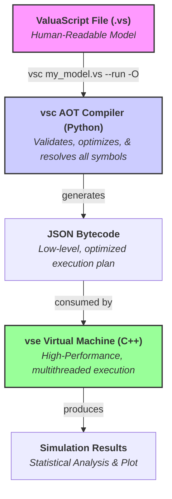

# ValuaScript & The Quantitative Simulation Engine

[](https://github.com/Alessio2704/monte-carlo-simulator/actions)
[](https://opensource.org/licenses/MIT)
[](https://isocpp.org/std/the-standard)
[](https://www.python.org/downloads/)

**A high-performance, multithreaded C++ engine for quantitative financial modeling, driven by ValuaScript—a simple, dedicated scripting language with a smart, Ahead-of-Time (AOT) optimizing compiler.**

## 📖 About The Project

This project was born from the need to bridge the gap between the intuitive but slow nature of spreadsheet-based financial modeling and the powerful but often verbose nature of general-purpose programming languages. The goal is to provide a platform that offers the **usability** of a dedicated modeling language with the **raw performance** of compiled, multithreaded C++.

It is designed to execute complex, multi-year, stochastic financial models, running hundreds of thousands of Monte Carlo simulations in seconds—a task that would take minutes or hours in traditional tools.

### Key Features

- **✨ Simple & Intuitive Language:** Models are defined in **ValuaScript (`.vs`)**, a clean, declarative language with a **familiar, spreadsheet-like formula syntax** using standard mathematical operators (`+`, `-`, `*`, `/`, `^`).
  - **Ergonomic Syntax:** Includes intuitive bracket syntax (`variable[index]`) for element access, slice-like syntax (`variable[:-1]`) for deleting elements, and numeric separators (`1_000_000`) for enhanced readability.
- **🚀 High-Performance Backend:** A core engine written in modern C++17, fully multithreaded to leverage all available CPU cores for maximum simulation speed. It acts as a lightweight, highly efficient **Virtual Machine (VM)** that executes pre-compiled bytecode.
  - **Robust Error Handling:** Features comprehensive static analysis in the compiler and detailed runtime checks in the engine, providing clear and precise error messages.
- **🐍 Intelligent AOT Compiler:** A robust **Ahead-of-Time (AOT)** compiler, `vsc`, that performs all semantic analysis and optimization _before_ execution. It compiles ValuaScript into a low-level JSON bytecode, performing advanced optimizations like **Loop-Invariant Code Motion** and **Dead Code Elimination** to generate a highly efficient execution plan.
  - **Compile-Time Safety:** Catches logical errors (type mismatches, incorrect function arguments, undefined variables) at compile time, providing instant feedback and preventing runtime failures.
- **⚙️ Streamlined Workflow:** A `--run` flag allows for a seamless, one-step compile-and-execute experience.
- **📊 Instant Visualization:** A `--plot` flag automatically generates a histogram of the simulation output, providing immediate visual analysis.
- **📈 Data Export:** Natively supports exporting full simulation trial data to CSV files with the `@output_file` directive.
- **🎲 Integrated Monte Carlo Simulation:** Natively supports a rich library of statistical distributions (`Normal`, `Pert`, `Lognormal`, etc.).
- **🛡️ Robust & Tested:** Comprehensive, modular unit test suite for both the C++ engine (GoogleTest) and the Python compiler (Pytest), ensuring correctness and stability. The entire toolchain is validated by a professional CI/CD pipeline on every release.
- **🛠️ Professional VS Code Extension:** A full-featured extension providing:
  - Dynamic, maintainable syntax highlighting.
  - A comprehensive set of code snippets.
  - A Python-based Language Server for real-time, as-you-type error diagnostics and **hover-for-help** with function signatures.
  - A **live, hover-for-value** feature that provides instant feedback on variable values by invoking the full compiler/engine toolchain in the background.
  - A **custom file icon** for `.vs` files.

## 🏛️ Architecture: AOT Compiler & Virtual Machine

The project follows a modern **Ahead-of-Time (AOT) Compiler and Virtual Machine (VM)** model. This clean separation of concerns ensures maximum performance, maintainability, and compile-time safety.

1.  **`vsc` (The AOT Compiler - Python):** Performs all the "thinking." It parses the high-level `.vs` script, performs rigorous type checking and semantic analysis, runs powerful optimizations, and resolves all variable names to integer indices. Its output is a low-level, highly optimized **JSON bytecode**.
2.  **`vse` (The Virtual Machine - C++):** A "dumb, fast" execution engine. It does no analysis or string parsing. It simply loads the pre-compiled JSON bytecode and executes the instructions at maximum speed using a multithreaded simulation loop.

This architecture eliminates runtime overhead, resulting in a **~9% performance increase** and a **7x improvement in execution stability** compared to a traditional interpreter model.



**Example JSON Bytecode Structure:**
The AOT compiler transforms a `.vs` script into a low-level bytecode where all variable names are pre-resolved to integer indices.

```json
{
  "simulation_config": { "num_trials": 10000 },
  "variable_registry": [
    "growth_rate", // index 0
    "random_growth", // index 1
    "std_dev" // index 2
  ],
  "output_variable_index": 1,
  "pre_trial_steps": [
    {
      "type": "literal_assignment",
      "result_index": 0,
      "value": 0.1
    },
    {
      "type": "literal_assignment",
      "result_index": 2,
      "value": 0.02
    }
  ],
  "per_trial_steps": [
    {
      "type": "execution_assignment",
      "result_index": 1,
      "function": "Normal",
      "args": [
        { "type": "variable_index", "value": 0 },
        { "type": "variable_index", "value": 2 }
      ]
    }
  ]
}
```

## 🚀 Quick Installation

Get started in minutes with our automated installation scripts.

#### Prerequisites

1.  **Python 3.9+ must be installed.** You can download it from [python.org](https://python.org).
    - On Windows, ensure you check the box **"Add Python to PATH"** during installation.
2.  **Administrator/sudo privileges** are required to add the tools to your system's PATH.

### macOS & Linux

Open your terminal and run the following one-line command:

```bash
/bin/bash -c "$(curl -fsSL https://raw.githubusercontent.com/Alessio2704/monte-carlo-simulator/main/scripts/install.sh)"
```

### Windows

Open a new **PowerShell terminal as Administrator** (right-click the Start Menu > "Terminal (Admin)") and run:

```powershell
Set-ExecutionPolicy Bypass -Scope Process -Force; [System.Net.ServicePointManager]::SecurityProtocol = [System.Net.ServicePointManager]::SecurityProtocol -bor 3072; iex ((New-Object System.Net.WebClient).DownloadString('https://raw.githubusercontent.com/Alessio2704/monte-carlo-simulator/main/scripts/install.ps1'))
```

After installation, **you must open a new terminal window** for the `vsc` and `vse` commands to be available.

---

## ✨ Interactive Development with the VS Code Extension

ValuaScript comes with a powerful VS Code extension that provides a rich, interactive development experience, turning the editor into a live modeling environment.

### Live Value Preview (Hover-for-Value)

The flagship feature of the extension is the live value preview. Simply hover your mouse over any variable in your script to see its calculated value instantly.

**How it Works:**
When you hover over a variable, the extension communicates with the `vsc` language server, which:

1.  Performs a rapid, in-memory **AOT compilation** of your script in "preview mode."
2.  Generates a temporary, optimized **JSON bytecode** focused _only_ on the code needed to calculate that specific variable.
3.  Invokes the high-performance C++ **VM** (`vse`) in the background with this bytecode.
4.  Receives the result from the engine and displays it directly in the hover tooltip.

This entire process is seamless and typically completes in milliseconds.

- For **deterministic** variables, it shows the exact calculated `Value`.
- For **stochastic** variables (those depending on a distribution like `Normal`), it runs a small number of trials (e.g., 100) and displays the `Mean Value`.

### Real-time Diagnostics and Hover-for-Help

The extension provides immediate feedback as you type, underlining errors and providing descriptive messages. You can also hover over any built-in or user-defined function to see its full signature, a summary of what it does, and details about its parameters and return value.

---

## ⚙️ The Automation Pipeline: Professional CI/CD

This project is built and delivered using a professional Continuous Integration and Continuous Delivery (CI/CD) pipeline powered by GitHub Actions. This ensures that every release is reliable, portable, and trustworthy. Our process is transparent and fully automated.

#### The Automation Heartbeat: Git-Tag-Triggered Releases

The entire release lifecycle begins when a developer pushes a Git tag in the format `vX.Y.Z` (e.g., `v1.0.5`). This single event triggers the automated workflow, eliminating manual errors and guaranteeing a consistent process.

````mermaid
graph TD;
    A[<i class='fa fa-tag'></i> Git Tag Push<br/>e.g., v1.0.5] --> B{Workflow Triggered};
    B --> C["<strong>Job: build-and-release-assets</strong><br/><em>Runs in Parallel on a Win, macOS, Linux Matrix</em>"];
    C --> D["<strong>Job: publish</strong><br/><em>Gated by `needs` keyword: Runs only if all builds succeed</em>"];
    D --> E[<i class='fab fa-github'></i> Published to GitHub Releases];
    D --> F[<i class='fab fa-python'></i> Published to PyPI];

    classDef job fill:#f0f8ff,stroke:#005cc5,stroke-width:2px;
    class C,D job```

---

### Stage 1: Build, Test, and Verify (The Matrix Job)

The moment a tag is pushed, a matrix of parallel jobs spins up to build and test ValuaScript across all three major operating systems simultaneously.

<details>
<summary><strong>Click to see the platform-specific build strategies</strong></summary>

#### **Windows Build**
- **Native Toolchain:** The C++ VM is compiled using the native Microsoft Visual C++ compiler (MSVC) by specifying the `"Visual Studio 17 2022"` generator in CMake. This ensures optimal performance and compatibility.
- **Validation:** After a successful build, **CTest** is run to execute the full, modular C++ test suite, confirming the correctness of the build on Windows.

#### **macOS Build**
- **Native Toolchain:** The VM is built using the default Clang compiler provided by Apple's command-line tools.
- **Validation:** **CTest** is immediately executed to validate the build.

#### **Linux Build & Portability**
- **The Challenge:** Building C++ applications for Linux is complex due to variations in system libraries (like GLIBC). A binary compiled on a very new Linux distribution will fail to run on older, but widely used, stable distributions.
- **The Solution:** We solve this by building inside a **Docker container running `ubuntu:22.04`**. This links our C++ VM against an older, stable version of GLIBC, guaranteeing that the final `vse` executable is highly portable.
- **Validation:** Critically, our **CTest** suite is also run _inside this same container_, ensuring we are testing the exact artifact that will be released.

#### **Python & VS Code Packaging**
- Since the Python compiler and VS Code extension are platform-agnostic, they are built and packaged just once (on the Linux runner) for efficiency.

</details>

---

### Stage 2: Publish to the World

This stage only runs if **all build and test jobs in Stage 1 have passed**.

1.  **Consolidate Artifacts:** The publish job downloads all the validated build artifacts (the `.zip` files from each OS, the Python packages, and the `.vsix` extension file).
2.  **Publish to PyPI:** The Python compiler package (`valuascript-compiler`) is automatically published to the **Python Package Index (PyPI)**.
3.  **Create GitHub Release:** A new public release is created on GitHub, and all binary artifacts and the VS Code extension are uploaded.

### The Final Link: User-Facing Scripts

The `install.sh` and `install.ps1` scripts are the public "front door" to this automated backend. They are designed to be smart and robust, automatically detecting the user's OS and architecture, finding the latest official release, and downloading the correct asset.

## 🗑️ Uninstalling

To completely remove ValuaScript from your system, you can use our one-line uninstallation scripts.

#### macOS & Linux
```bash
/bin/bash -c "$(curl -fsSL https://raw.githubusercontent.com/Alessio2704/monte-carlo-simulator/main/scripts/uninstall.sh)"
````

#### Windows

Open PowerShell and run:

```powershell
Set-ExecutionPolicy Bypass -Scope Process -Force; iex ((New-Object System.Net.WebClient).DownloadString('https://raw.githubusercontent.com/Alessio2704/monte-carlo-simulator/main/scripts/uninstall.ps1'))
```

## 📜 ValuaScript Language Guide

ValuaScript uses a simple, line-by-line syntax for defining variables and calculations.

#### Settings

Special `@` directives configure the simulation. They are typically placed at the top of the file.

```valuascript
# Defines the number of Monte Carlo trials to run. (Required)
@iterations = 100_000

# Specifies which variable's final value should be collected. (Required)
@output = final_share_price

# Exports all trial results to a CSV for analysis and plotting. (Optional)
@output_file = "sim_results/amazon_model.csv"
```

#### The Compiler & Optimizations

The `vsc` AOT compiler has several command-line flags to control its behavior.

- **`vsc <input_file>`**: Compiles a ValuaScript file into a JSON bytecode file.
- **`--run`**: Compiles the script and then immediately executes the simulation using the C++ VM.
- **`-O` or `--optimize`**: Enables **Dead Code Elimination**, removing any calculations that do not contribute to the final `@output` variable, resulting in faster simulations.
- **`-v` or `--verbose`**: Provides detailed feedback on the compiler's optimization process, showing exactly which variables were moved to the pre-trial phase (Loop-Invariant Code Motion) and which were removed.

**Example Usage:**

```bash
# Compile, run a fully optimized simulation, and see verbose output
vsc my_model.vs --run -O -v
```

#### Variable Assignment (`let`)

Use the `let` keyword to define variables. The AOT compiler executes assignments sequentially and validates the type of each variable (`scalar`, `vector`, or `string`).

**1. Literals**

```valuascript
let tax_rate = 0.21
let model_name = "Q4 Forecast"
let margin_forecast = [0.25, 0.26]
```

**2. Infix Expressions**
Standard mathematical operators are supported with correct precedence.

```valuascript
let cost_of_equity = risk_free_rate + beta * equity_risk_premium
```

**3. Function Calls**
The AOT compiler performs strict, recursive type and arity (argument count) checking on all function calls.

```valuascript
# CORRECT: The compiler validates that `sum_series` receives a `vector`.
let total_sales = sum_series(grow_series(100, 0.1, 5))

# INCORRECT: The compiler will raise a compile-time error because `Normal`
# expects a `scalar` for its first argument, but `grow_series` returns a `vector`.
# let random_value = Normal(grow_series(100, 0.1, 5), 10)
```

**4. Vector Element Access and Deletion**

```valuascript
let my_vector = [100, 200, 300]
let first_element = my_vector[0]   # Accesses the first element (returns 100)
let last_element = my_vector[-1]    # Accesses the last element (returns 300)
let vector_without_last = my_vector[:-1] # Returns a new vector [100, 200]
```

#### External Data Integration (CSV Reading)

ValuaScript can import data from external CSV files. These functions are identified by the compiler as deterministic and are executed **once** in the pre-trial phase for maximum performance.

**`read_csv_vector(file_path, column_name)`**
Reads an entire column from a CSV file and returns it as a `vector`.

**`read_csv_scalar(file_path, column_name, row_index)`**
Reads a single cell from a CSV file and returns it as a `scalar`.

**Example:**
Assume you have a file `assumptions.csv`:

```csv
Parameter,Value
BaseSales,5000
GrowthRate,0.08
```

You can use it in your model like this:

```valuascript
let sales = read_csv_scalar("assumptions.csv", "Value", 0)
let growth = read_csv_scalar("assumptions.csv", "Value", 1)
let sales_forecast = grow_series(sales, growth, 10)
```

## 🔬 Development & Contribution

Contributions are welcome! The project's clean separation into `engine/` and `compiler/` directories makes it highly extensible.

### Running Tests

The project includes comprehensive, modular test suites for both components.

**1. C++ Engine Tests (GoogleTest & CTest)**

```bash
# First, configure and build the project from the root directory
cmake -S . -B build
cmake --build build

# Then, run the full test suite from the build directory
cd build
ctest --verbose
```

**2. Python Compiler Tests (Pytest)**

```bash
# Navigate to the compiler directory
cd compiler

# (Optional but Recommended) Create and activate a virtual environment
python3 -m venv venv
source venv/bin/activate # On Windows: .\venv\Scripts\activate.ps1

# Install the compiler and its optional development dependencies
pip install -e .[dev]

# Run the tests
pytest -v
```

### Extending the Language: A Detailed Guide

Adding a new function to ValuaScript is a clean, three-stage process. The AOT architecture ensures that compile-time checks are cleanly separated from runtime logic.

Let's walk through adding a new function: `clip(value, min_val, max_val)`.

---

#### Stage 1: Implement Core Logic in the C++ VM

First, add the C++ class that performs the calculation.

**1.1. Add the `IExecutable` Class**
In `engine/include/engine/functions/operations.h`:

```cpp
class ClipOperation : public IExecutable
{
public:
    TrialValue execute(const std::vector<TrialValue> &args) const override;
};
```

In `engine/src/engine/functions/operations.cpp`:

```cpp
TrialValue ClipOperation::execute(const std::vector<TrialValue> &args) const
{
    // The VM only checks for basic contract violations (arg count).
    // Type correctness has already been guaranteed by the AOT compiler.
    if (args.size() != 3)
    {
        throw std::runtime_error("ClipOperation requires 3 arguments.");
    }
    double value = std::get<double>(args[0]);
    double min_val = std::get<double>(args[1]);
    double max_val = std::get<double>(args[2]);
    return std::clamp(value, min_val, max_val); // C++17
}
```

**1.2. Register in the Factory**
In `engine/src/engine/core/SimulationEngine.cpp`, find the `build_executable_factory()` method and add the new entry:

```cpp
m_executable_factory["clip"] = [] { return std::make_unique<ClipOperation>(); };
```

---

#### Stage 2: Teach the AOT Compiler About the New Function

Next, update the compiler's configuration so it can perform static analysis on calls to `clip`.

**2.1. Add the Function Signature**
In `compiler/vsc/config.py`, add the full signature to `FUNCTION_SIGNATURES`:

````python
# In vsc/config.py, inside FUNCTION_SIGNATURES
"clip": {
    "variadic": False,
    "arg_types": ["scalar", "scalar", "scalar"],
    "return_type": "scalar",
    "is_stochastic": False, # CRITICAL: This is a deterministic function
    "doc": {
        "summary": "Constrains a scalar value to be within a specified range.",
        "params": [
            {"name": "value", "desc": "The scalar value to clip."},
            {"name": "min_val", "desc": "The minimum allowed value."},
            {"name": "max_val", "desc": "The maximum allowed value."}
        ],
        "returns": "The clipped scalar value."
    }
},```
- **`"is_stochastic": False`**: This flag tells the optimizer that this function's output is predictable. This allows it to perform **Loop-Invariant Code Motion**, moving any call to this function to the `pre_trial` phase if all its inputs are also deterministic.

---

#### Stage 3: Add Comprehensive Tests

The final stage is to add tests that verify both the C++ logic and the Python validation.

-   **C++ VM Tests (`engine/test/test_operations.cpp`):** Add a test case to the `DeterministicEngineTest` suite to verify that a bytecode recipe using `clip` returns the correct values.
-   **Python Compiler Tests (`compiler/tests/test_compiler.py`):**
    -   Add a test to ensure `let x = clip(100, 0, 50)` compiles successfully.
    -   Add tests to `test_semantic_errors` to ensure the compiler raises a **compile-time error** for invalid calls, like `clip([1,2], 0, 10)` (passing a vector where a scalar is expected).

After adding these tests and confirming they all pass, your new function is fully and robustly integrated into the language.

## 🗺️ Roadmap

The project is actively developed. Our current roadmap prioritizes practical utility and user experience.

### ✅ Version 1.1 (Current - Post-Refactor)

The first release under the new AOT Compiler and VM architecture.

-   **Core Architecture:** Migrated to a high-performance AOT compiler (`vsc`) and a lightweight C++ VM (`vse`).
-   **Performance:** Achieved a ~9% end-to-end performance increase and a 7x reduction in execution time variance.
-   **Compile-Time Safety:** All type, arity, and semantic checks are now performed ahead of time, providing instant feedback and preventing a wide class of runtime errors.
-   **Modular Testing:** The C++ test suite has been refactored into a clean, modular structure powered by CTest.
-   All features from Version 1.0 are retained and now benefit from the new architecture.

---

### 🔜 Tier 1: Next Immediate Feature

- [ ] **Empirical Distribution Sampler (`create_sampler_from_data`)**
  - **Why:** Models often require inputs that follow a specific, but not standard, distribution. This feature would allow users to create a custom sampler directly from a real-world data series (e.g., historical stock returns), significantly improving model realism.
  - **User-Facing Syntax (Example):**
  ```valuascript
  # 1. Read the historical data from a CSV file.
  let price_history = read_csv_vector("data/prices.csv", "Price")

  # 2. Create a custom sampler based on that data.
  let price_sampler = create_sampler_from_data(price_history)

  # 3. Use the sampler like any other distribution (e.g., Normal, Pert).
  let future_price = price_sampler()
````

### 🚀 Tier 2: Advanced Language Features

- [ ] **User-Defined Functions (`func`) & Modularization (`@import`)**

  - **Why:** To allow users to create reusable, importable functions and organize complex models into clean, encapsulated modules. This promotes cleaner, more abstract, and more scalable models.
  - **User-Facing Syntax (Example):**

  ```valuascript
  // In modules/my_utils.vs
  func calculate_npv(rate: scalar, cashflows: vector) -> scalar {
      let present_value = npv(rate, cashflows)
      return present_value
  }

  // In main_model.vs
  @import "modules/my_utils.vs"
  let discount_rate = 0.08
  let project_cashflows = [10, 12, 15]
  let final_npv = calculate_npv(discount_rate, project_cashflows)
  ```

### 🌌 V-Next: The "Blue Sky" Goal (JIT Compilation)

- [ ] **Native Code Generation (JIT Compiler)**
  - **Why:** The ultimate performance goal. A Just-In-Time (JIT) compiler would represent the final evolution of the engine. It would take the JSON bytecode and, at the start of the simulation, compile it _in memory_ into highly optimized, native machine code tailored to execute that specific model. This would eliminate all interpretation overhead, pushing the execution speed to the theoretical maximum.

## 📄 License

This project is distributed under the MIT License. See the `LICENSE` file for more information.
