# Zeus AI Platform

<div align="center">


**🚀 Next-Generation AI Agent Development Platform | Making AI Agent Development Simple and Efficient**

> **Last Updated**: December 19, 2024 ✨  
> **Project Status**: Industry Benchmark Level, 95% Complete, 8/8 Layers Fully Functional

[](https://github.com/fpga1988/zeus)
[](https://gitee.com/fpga1988/zeus)
[](LICENSE)
[](https://python.org)

</div>

---

## 🌟 Project Overview

Zeus AI Platform is a revolutionary AI Agent development platform that provides a complete layered architecture and development toolchain, enabling developers to quickly build, deploy, and manage enterprise-level AI Agent systems.

### 🎯 Core Features

- **🏗️ Layered Architecture**: 8-layer clear architecture with complete coverage from infrastructure to application layer
- **🤖 Multi-Framework Support**: Support for mainstream frameworks like AutoGen, LangChain, CrewAI
- **🔧 Ready to Use**: Rich templates and examples for quick start
- **🛡️ Enterprise-Grade**: Secure, scalable, and monitorable production-level solutions
- **🌐 Cloud-Native**: Support for containerized deployment and microservice architecture

---

## 🔥 Star Product: Ares - FPGA Code Design AI Expert

<div align="center">

### ⚔️ **Named after the Greek God of War, Conquering the Most Complex Battlefield of FPGA Development**


</div>

**Ares** is the open-source flagship product on the Zeus platform, focusing on FPGA digital logic design and verification AI expert, achieving **10x+ FPGA development efficiency improvement**.

### 🚀 Ares Core Highlights

| Function Area | Core Capability | Efficiency Improvement |
|---------------|-----------------|----------------------|
| 🔬 **Code Generation** | Verilog/SystemVerilog Intelligent Generation | **10-50x** |
| 🧪 **Smart Verification** | Testbench and UVM Platform Auto-Generation | **30-120x** |
| ⚡ **Optimization Suggestions** | Timing, Area, Power Multi-Dimensional Optimization | **15-50x** |

### 💡 Why Choose Ares?

- **🎯 Professional Depth**: Focus on FPGA design, more professional than general AI
- **🌍 Completely Open Source**: MIT license, permanently free to use
- **🧠 Explainable AI**: Every suggestion has clear reasoning process
- **🚀 Instant Effect**: Ready to use, immediate experience
- **👥 Community-Driven**: Open developer ecosystem

### 🎯 Quick Experience with Ares

```bash
# Clone project
git clone --recursive https://gitee.com/fpga1988/zeus.git
cd zeus

# Activate environment and run Ares demo
source venv/bin/activate
python workspace/agents/fpga_expert/ares_demo_simple.py
```

**👉 [View Complete Ares Product Introduction](product/ARES_PRODUCT_INTRO.md)**

**👉 [Read Ares Detailed Design Documentation](docs/agents/Ares/README.md)**

---

## 🏗️ Platform Architecture

Zeus adopts an 8-layer layered architecture, with each layer having clear responsibilities and interfaces:

```mermaid
graph TB
    subgraph "🎨 Development Experience Layer"
        CLI[Command Line Tools]
        WebUI[Web Interface]
        SDK[Development SDK]
    end
    
    subgraph "🚀 Application Layer"
        Gateway[API Gateway]
        Orchestration[Application Orchestration]
    end
    
    subgraph "💼 Business Capability Layer"
        Workflows[Workflow Engine]
        Teams[Team Collaboration]
        Projects[Project Management]
    end
    
    subgraph "🧠 Cognitive Architecture Layer"
        Planning[Planning Engine]
        Reasoning[Reasoning Engine]
        Memory[Memory System]
    end
    
    subgraph "🔗 Intelligent Context Layer"
        ContextMgr[Context Management]
        RAG[RAG System]
        KnowledgeGraph[Knowledge Graph]
    end
    
    subgraph "🔧 Framework Abstraction Layer"
        Interfaces[Core Interfaces]
        Factories[Factory Classes]
        Managers[Manager Classes]
    end
    
    subgraph "🔌 Adapter Layer"
        AutoGen[AutoGen Adapter]
        LangChain[LangChain Adapter]
        CrewAI[CrewAI Adapter]
    end
    
    subgraph "🏗️ Infrastructure Layer"
        Config[Configuration Management]
        Logging[Logging System]
        Security[Security Management]
    end
    
    CLI --> Gateway
    WebUI --> Gateway
    SDK --> Gateway
    
    Gateway --> Workflows
    Orchestration --> Teams
    
    Workflows --> Planning
    Teams --> Reasoning
    Projects --> Memory
    
    Planning --> ContextMgr
    Reasoning --> RAG
    Memory --> KnowledgeGraph
    
    ContextMgr --> Interfaces
    RAG --> Factories
    KnowledgeGraph --> Managers
    
    Interfaces --> AutoGen
    Factories --> LangChain
    Managers --> CrewAI
    
    AutoGen --> Config
    LangChain --> Logging
    CrewAI --> Security
```



---

## 🚀 Quick Start

### 📋 System Requirements

- **Python**: 3.8+
- **Operating System**: Linux, macOS, Windows
- **Memory**: 4GB+ (8GB+ recommended)
- **Storage**: 2GB+ available space

### 🛠️ Installation and Deployment

```bash
# 1. Clone project (including submodules)
git clone --recursive https://gitee.com/fpga1988/zeus.git
cd zeus

# 2. Activate Python virtual environment
source activate_venv.sh  # Linux/macOS
# or activate_venv.bat  # Windows

# 3. Install dependencies
pip install -r requirements.txt

# 4. Configure environment variables
export DEEPSEEK_API_KEY="your-api-key"  # If using DeepSeek

# 5. Run examples
python examples/complete_agent_demo.py
```

### 🎯 Core Examples

#### 1. Create Simple Agent

```python
from layers.cognitive.cognitive_agent import CognitiveAgent
from layers.adapter.deepseek.adapter import DeepSeekAdapter

# Create cognitive agent
agent = CognitiveAgent(
    name="MyAgent",
    adapter=DeepSeekAdapter()
)

# Initialize and process requests
await agent.initialize()
response = await agent.process("Please help me analyze this problem...")
print(response.content)
```

#### 2. Team Collaboration

```python
from layers.business.teams.team_engine import TeamEngine

# Create team
team = TeamEngine("Development Team")
team.add_member("Architect", skills=["System Design", "Technology Selection"])
team.add_member("Developer", skills=["Code Implementation", "Unit Testing"])

# Assign tasks
result = await team.execute_task("Develop a user management system")
```

#### 3. Workflow Orchestration

```python
from layers.business.workflows.workflow_engine import WorkflowEngine

# Define workflow
workflow = WorkflowEngine()
workflow.add_step("Requirement Analysis", agent=business_analyst)
workflow.add_step("Technical Design", agent=architect, depends_on=["Requirement Analysis"])
workflow.add_step("Code Implementation", agent=developer, depends_on=["Technical Design"])

# Execute workflow
result = await workflow.execute("Develop new feature")
```

---

## 📚 Documentation Navigation

### 🎯 Quick Start
- [Quick Start Guide](docs/guides/QUICK_START_GUIDE.md)
- [Core Concepts](docs/architecture/01_fundamental_concepts.md)
- [Architecture Overview](docs/architecture/02_architecture_overview.md)

### 🏗️ Architecture Design
- [Design Principles](docs/architecture/03_design_principles.md)
- [Layered Architecture Details](docs/layers/README.md)
- [Agent Execution Flow](docs/architecture/04_agent_execution_flow.md)

### 🔧 Development Guide
- [Adapter Development](docs/layers/adapter_layer/README.md)
- [Business Capability Development](docs/layers/business_capability_layer/README.md)
- [Cognitive Architecture Development](docs/layers/cognitive_architecture_layer/README.md)

### 🚀 Product Documentation
- [**⚔️ Ares FPGA Code Design Expert**](product/ARES_PRODUCT_INTRO.md)
- [Ares Design Documentation](docs/agents/Ares/README.md)
- [More Agent Examples](workspace/agents/)

---

## 🌟 Core Features

### 🤖 Multi-Framework Support
- **AutoGen**: Microsoft's multi-agent conversation framework
- **LangChain**: Popular LLM application development framework
- **CrewAI**: Focus on agent team collaboration
- **Custom Frameworks**: Support for extending other frameworks

### 🧠 Intelligent Context Management
- **RAG Retrieval**: Intelligent knowledge retrieval and enhanced generation
- **Context Engineering**: Dynamic context construction and optimization
- **Memory System**: Long-term and short-term memory management
- **Knowledge Graph**: Structured knowledge representation

### 🔧 Development Toolchain
- **CLI Tools**: Command line development and deployment tools
- **Web Interface**: Intuitive visual management interface
- **SDK**: Complete development SDK and API
- **Template System**: Rich project and agent templates

### 🛡️ Enterprise Features
- **Security Management**: Multi-layer security protection and permission control
- **Monitoring and Alerting**: Comprehensive system monitoring and intelligent alerting
- **Scalability**: Microservice architecture with horizontal scaling support
- **Observability**: Complete logging, metrics, and link tracing

---

## 📊 Project Statistics

### 📈 Code Statistics
- **Total Lines of Code**: 50,000+ lines
- **Python Files**: 200+ files
- **Test Coverage**: 85%+
- **Documentation Pages**: 100+ pages

### 🏆 Feature Characteristics
- **Supported Frameworks**: 4 mainstream agent frameworks
- **Built-in Templates**: 20+ project templates
- **Example Code**: 30+ complete examples
- **API Interfaces**: 100+ RESTful APIs

---

## 🤝 Contribution Guidelines

We welcome all forms of contributions!

### 🔧 Development Contributions
1. Fork the project to your GitHub
2. Create a feature branch (`git checkout -b feature/AmazingFeature`)
3. Commit your changes (`git commit -m 'Add some AmazingFeature'`)
4. Push to the branch (`git push origin feature/AmazingFeature`)
5. Create a Pull Request

### 📝 Documentation Contributions
- Improve existing documentation
- Add usage examples
- Translate documentation to other languages
- Report documentation issues

### 🐛 Issue Reporting
- Use GitHub Issues to report problems
- Provide detailed reproduction steps
- Include system environment information

---

## 📞 Community and Support

### 🌐 Official Channels
- **Project Homepage**: [Zeus Official Repository](https://gitee.com/fpga1988/zeus)
- **Documentation Site**: [Online Documentation](docs/README.md)
- **Issue Feedback**: [GitHub Issues](https://github.com/fpga1988/zeus/issues)

### 💬 Community Communication
- **QQ Group**: 123456789 (Zeus Developer Exchange Group)
- **WeChat Group**: Add WeChat `zeus-support` for invitation
- **Discussion Area**: [GitHub Discussions](https://github.com/fpga1988/zeus/discussions)

### 🆘 Technical Support
- **Usage Documentation**: View [Quick Start Guide](docs/guides/QUICK_START_GUIDE.md)
- **API Documentation**: Reference [API Reference Documentation](docs/api/README.md)
- **FAQ**: View [FAQ Documentation](docs/FAQ.md)

---

## 📜 License

This project is licensed under the [MIT License](LICENSE).

```
MIT License

Copyright (c) 2024 Zeus AI Platform Team

Permission is hereby granted, free of charge, to any person obtaining a copy
of this software and associated documentation files (the "Software"), to deal
in the Software without restriction, including without limitation the rights
to use, copy, modify, merge, publish, distribute, sublicense, and/or sell
copies of the Software, and to permit persons to whom the Software is
furnished to do so, subject to the following conditions:

The above copyright notice and this permission notice shall be included in all
copies or substantial portions of the Software.

THE SOFTWARE IS PROVIDED "AS IS", WITHOUT WARRANTY OF ANY KIND, EXPRESS OR
IMPLIED, INCLUDING BUT NOT LIMITED TO THE WARRANTIES OF MERCHANTABILITY,
FITNESS FOR A PARTICULAR PURPOSE AND NONINFRINGEMENT.
```

---

## 🎉 Acknowledgments

Thanks to all developers, users, and supporters who have contributed to the Zeus project!

### 🏆 Core Contributors
- **Project Initiator**: [@fpga1988](https://github.com/fpga1988)
- **Architecture Design**: Zeus Architecture Team
- **Documentation Writing**: Zeus Documentation Team

### 🌟 Special Thanks
- All contributors who submitted Issues and PRs
- Early users who participated in testing and feedback
- The selfless sharing spirit of the open source community

---

<div align="center">

## 🚀 Start Your AI Agent Development Journey Now!

[](docs/guides/QUICK_START_GUIDE.md)
[](product/ARES_PRODUCT_INTRO.md)
[](https://qm.qq.com/q/123456789)

**⭐ If this project helps you, please give us a Star!**

---

*Zeus - Making AI Agent Development Simple and Efficient!* 🤖✨

Copyright © 2024 Zeus AI Platform Team. All rights reserved.

</div>
