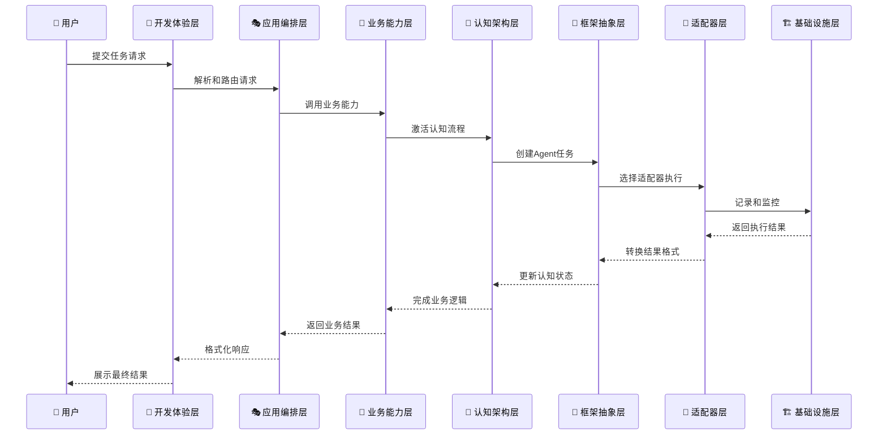

# 01. 架构概览

> **Agent Development Center 整体架构设计理念和分层结构**

## 🎯 架构愿景

### 战略定位
Agent Development Center 不仅仅是现有AI Agent框架的包装器，而是一个**下一代AI Agent开发框架**，具有以下战略定位：

1. **🧠 认知导向**: 基于认知科学理论的Agent智能架构
2. **🔌 能力中心**: 以能力为核心的动态组装系统
3. **🏢 企业就绪**: 从设计之初就考虑企业级需求
4. **🚀 技术前瞻**: 为未来AI技术发展预留充分扩展空间

### 核心价值主张
- **统一抽象**: 提供框架无关的通用Agent抽象
- **智能认知**: 完整的Agent认知架构实现
- **动态能力**: 基于能力的动态发现和组装机制
- **企业级**: 安全、可扩展、可观测的企业级特性
- **优秀体验**: 极致的开发者体验和学习曲线

---

## 🏛️ 分层架构设计

### 架构图

```
┌─────────────────────────────────────────────────────────────┐
│                 🎨 开发体验层 (DevX Layer)                    │
│                                                             │
│  ┌─────────────┐ ┌─────────────┐ ┌─────────────┐ ┌─────────┐ │
│  │ Visual      │ │    CLI      │ │ Web Studio  │ │ API     │ │
│  │ Studio      │ │   Tools     │ │             │ │ Docs    │ │
│  └─────────────┘ └─────────────┘ └─────────────┘ └─────────┘ │
└─────────────────────────────────────────────────────────────┘
                              │
┌─────────────────────────────────────────────────────────────┐
│                🎭 应用编排层 (Application Layer)               │
│                                                             │
│  ┌─────────────┐ ┌─────────────┐ ┌─────────────┐ ┌─────────┐ │
│  │ Project     │ │ Team        │ │ Workflow    │ │ System  │ │
│  │ Management  │ │ Collab      │ │ Designer    │ │ Integr. │ │
│  └─────────────┘ └─────────────┘ └─────────────┘ └─────────┘ │
└─────────────────────────────────────────────────────────────┘
                              │
┌─────────────────────────────────────────────────────────────┐
│              🏢 业务能力层 (Business Capability Layer)         │
│                                                             │
│  ┌────────┐ ┌──────────┐ ┌─────────┐ ┌──────────┐ ┌────────┐ │
│  │ Core   │ │ Team     │ │Workflow │ │ Tool     │ │Advanced│ │
│  │Abilities│ │ Collab   │ │ Engine  │ │Integration│ │Patterns│ │
│  └────────┘ └──────────┘ └─────────┘ └──────────┘ └────────┘ │
└─────────────────────────────────────────────────────────────┘
                              │
┌─────────────────────────────────────────────────────────────┐
│                🧠 认知架构层 (Cognitive Architecture)          │
│                                                             │
│  ┌─────────┐ ┌─────────┐ ┌─────────┐ ┌─────────┐ ┌─────────┐ │
│  │Perception│ │Reasoning│ │ Memory  │ │Learning │ │Commun.  │ │
│  │  Engine  │ │ Engine  │ │ System  │ │ Module  │ │Manager  │ │
│  └─────────┘ └─────────┘ └─────────┘ └─────────┘ └─────────┘ │
└─────────────────────────────────────────────────────────────┘
                              │
┌─────────────────────────────────────────────────────────────┐
│               🔧 框架抽象层 (Framework Abstraction)           │
│                                                             │
│  ┌──────────┐ ┌─────┐ ┌─────────┐ ┌──────┐ ┌──────────────┐ │
│  │Universal │ │Task │ │Context  │ │Result│ │ Capability   │ │
│  │  Agent   │ │     │ │         │ │      │ │  Management  │ │
│  └──────────┘ └─────┘ └─────────┘ └──────┘ └──────────────┘ │
└─────────────────────────────────────────────────────────────┘
                              │
┌─────────────────────────────────────────────────────────────┐
│                 🔌 适配器层 (Adapter Layer)                   │
│                                                             │
│  ┌────────┐ ┌────────┐ ┌─────────┐ ┌────────┐ ┌──────────┐  │
│  │AutoGen │ │ OpenAI │ │LangGraph│ │ CrewAI │ │ Custom   │  │
│  │Adapter │ │Adapter │ │ Adapter │ │Adapter │ │ Adapters │  │
│  └────────┘ └────────┘ └─────────┘ └────────┘ └──────────┘  │
└─────────────────────────────────────────────────────────────┘
                              │
┌─────────────────────────────────────────────────────────────┐
│                🏗️ 基础设施层 (Infrastructure Layer)           │
│                                                             │
│  ┌──────────┐ ┌────────┐ ┌──────────┐ ┌──────────┐ ┌─────┐  │
│  │Observ-   │ │Security│ │Scalability│ │Reliability│ │Perf │  │
│  │ability   │ │        │ │          │ │          │ │Opt  │  │
│  └──────────┘ └────────┘ └──────────┘ └──────────┘ └─────┘  │
└─────────────────────────────────────────────────────────────┘
```

### 🎯 分层职责详解

#### 7️⃣ 开发体验层 (DevX Layer)
**职责**: 提供优秀的开发者体验和工具链支持

**核心组件**:
- **Visual Studio Extensions**: IDE集成插件
- **CLI Tools**: 命令行工具集
- **Web Studio**: 可视化开发环境
- **API Documentation**: 完整的API文档和示例

**设计目标**:
- 零配置启动，开箱即用
- 渐进式复杂度披露
- 智能代码提示和错误诊断
- 丰富的模板和示例库

#### 6️⃣ 应用编排层 (Application Layer)
**职责**: 将业务能力组装为完整的应用程序

**核心组件**:
- **Project Management**: 项目生命周期管理
- **Team Collaboration**: 团队协作和权限管理
- **Workflow Designer**: 可视化工作流设计器
- **System Integration**: 外部系统集成

**设计目标**:
- 拖拽式应用构建
- 版本控制和发布管理
- 多环境部署支持
- 实时协作编辑

#### 5️⃣ 业务能力层 (Business Capability Layer)
**职责**: 提供可复用的高级业务功能模块

**核心组件**:
- **Core Abilities**: 基础业务能力（文档处理、数据分析等）
- **Team Collaboration**: 多Agent协作模式
- **Workflow Engine**: 业务流程引擎
- **Tool Integration**: 第三方工具集成
- **Advanced Patterns**: 高级业务模式（专家会诊、决策树等）

**设计目标**:
- 领域专用语言(DSL)支持
- 模式库和最佳实践
- 业务规则引擎
- 性能监控和优化

#### 4️⃣ 认知架构层 (Cognitive Architecture)
**职责**: 实现Agent的智能认知能力

**核心组件**:
- **Perception Engine**: 多模态感知处理
- **Reasoning Engine**: 推理和决策引擎
- **Memory System**: 记忆管理系统
- **Learning Module**: 学习和适应机制
- **Communication Manager**: Agent间通信协调

**设计目标**:
- 认知科学理论指导
- 可插拔的认知模块
- 自主学习和进化
- 认知状态可观测

#### 3️⃣ 框架抽象层 (Framework Abstraction)
**职责**: 定义框架无关的通用抽象接口

**核心组件**:
- **Universal Agent**: 通用Agent抽象
- **Task**: 任务定义和管理
- **Context**: 上下文和状态管理
- **Result**: 结果和反馈机制
- **Capability Management**: 能力注册和发现

**设计目标**:
- 最小化抽象接口
- 强类型定义
- 扩展性预留
- 向后兼容保证

#### 2️⃣ 适配器层 (Adapter Layer)
**职责**: 适配不同的底层AI框架

**核心组件**:
- **AutoGen Adapter**: AutoGen框架适配
- **OpenAI Adapter**: OpenAI API适配
- **LangGraph Adapter**: LangGraph框架适配
- **CrewAI Adapter**: CrewAI框架适配
- **Custom Adapters**: 自定义适配器框架

**设计目标**:
- 透明的框架切换
- 能力映射和转换
- 性能优化
- 错误处理和恢复

#### 1️⃣ 基础设施层 (Infrastructure Layer)
**职责**: 提供系统运行的基础能力

**核心组件**:
- **Observability**: 监控、日志、追踪
- **Security**: 安全、权限、审计
- **Scalability**: 扩展性、负载均衡
- **Reliability**: 可靠性、容错、恢复
- **Performance**: 性能优化、缓存

**设计目标**:
- 企业级可靠性
- 水平扩展能力
- 全链路监控
- 安全合规保障

---

## 🔄 数据流和交互模式

### 典型执行流程



### 关键交互原则

1. **单向依赖**: 上层依赖下层，下层不依赖上层
2. **接口隔离**: 通过标准接口进行层间通信
3. **事件驱动**: 关键状态变更通过事件通知
4. **异步优先**: 支持异步和流式处理
5. **错误隔离**: 单层错误不影响整体系统

---

## 🎨 架构特色

### 🧠 认知优先设计
- 基于认知科学的Agent智能架构
- 感知-推理-行动的完整认知循环
- 多层次记忆系统和学习机制
- 元认知能力和自我反思

### 🔌 能力导向架构
- 以能力为核心的设计理念
- 动态能力发现和组装
- 能力依赖关系管理
- 优雅降级和替代机制

### 🏗️ 分层解耦设计
- 清晰的职责边界和接口定义
- 每层独立演进和替换
- 标准化的层间通信协议
- 插件化的扩展机制

### 🚀 演进友好设计
- 向后兼容的接口设计
- 渐进式迁移支持
- 版本化的API管理
- 扩展点和钩子机制

---

*架构概览文档 v1.0*  
*最后更新: 2024年12月19日*  
*文档编号: ADC-ARCH-01* 