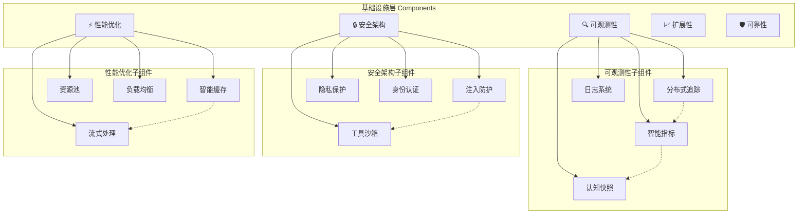

# 05. 基础设施层 (Infrastructure Layer)

> **Agent系统运行的基石 - 可观测性、安全性、扩展性、可靠性、性能优化**

## 📋 文档目录

- [🎯 层级概述](#-层级概述)
- [📚 相关理论基础](#-相关理论基础)
- [🧠 核心概念](#-核心概念)
- [🏗️ 设计原理](#️-设计原理)
- [⚙️ 核心组件](#️-核心组件)
- [💡 实际案例](#-实际案例)
- [🔄 实现细节](#-实现细节)
- [📊 性能与优化](#-性能与优化)
- [🔮 未来发展](#-未来发展)

---

## 🎯 层级概述

基础设施层是整个Agent Development Center的**技术基石**，为所有上层建筑提供稳定、高效、安全的运行环境。它不直接参与业务逻辑，但为整个系统提供关键的**非功能性需求**支持。

### 在7层架构中的位置
```
认知架构层 (Cognitive Layer)
框架抽象层 (Framework Layer)
适配器层 (Adapter Layer)
            ↕ 基础服务支撑
🏗️ 基础设施层 (Infrastructure Layer) ← 当前层 (最底层)
```

### 核心职责
1. **🔍 可观测性**: 全链路监控、日志、追踪、指标收集
2. **🔒 安全性**: 身份认证、授权、审计、数据保护
3. **📈 扩展性**: 水平扩展、负载均衡、资源调度
4. **🛡️ 可靠性**: 容错、恢复、健康检查、灾备
5. **⚡ 性能优化**: 缓存、优化、资源管理

---

## 📚 相关理论基础

### 1. 系统可观测性理论 (Observability Theory)

#### 控制论中的可观测性
**定义**: 一个系统是可观测的，当且仅当可以通过观察系统的输出来推断系统的内部状态。

```python
# 可观测性的数学定义
# 系统状态方程: x(t+1) = Ax(t) + Bu(t)
# 输出方程: y(t) = Cx(t) + Du(t)
# 可观测性矩阵: O = [C; CA; CA²; ...; CA^(n-1)]
# 系统可观测 ⟺ rank(O) = n

class ObservabilityMatrix:
    """可观测性理论在AI Agent系统中的应用"""
    
    def __init__(self):
        # Agent系统的状态变量
        self.system_states = [
            "agent_performance",      # Agent性能状态
            "resource_utilization",   # 资源利用状态
            "user_satisfaction",      # 用户满意度状态
            "system_health"          # 系统健康状态
        ]
        
        # 可观测的输出变量
        self.observable_outputs = [
            "response_time",         # 响应时间
            "error_rate",           # 错误率
            "throughput",           # 吞吐量
            "cpu_usage",            # CPU使用率
            "memory_usage",         # 内存使用率
            "user_feedback"         # 用户反馈
        ]
```

#### 现代可观测性三大支柱
```python
class ModernObservability:
    """现代可观测性的三大支柱"""
    
    def __init__(self):
        # 1. Metrics - 数值指标
        self.metrics = MetricsCollector()
        
        # 2. Logs - 日志记录
        self.logs = StructuredLogger()
        
        # 3. Traces - 分布式追踪
        self.traces = DistributedTracer()
    
    def observe_agent_system(self, agent_request):
        """全方位观测Agent系统"""
        # 指标：量化性能数据
        self.metrics.record("agent_request_count", 1)
        self.metrics.record("agent_response_time", response_time)
        
        # 日志：详细的执行记录
        self.logs.info("Agent处理请求", {
            "request_id": agent_request.id,
            "agent_type": agent_request.agent_type,
            "user_id": agent_request.user_id
        })
        
        # 追踪：完整的执行路径
        with self.traces.start_span("agent_execution") as span:
            span.set_attributes({
                "agent.type": agent_request.agent_type,
                "request.complexity": agent_request.complexity
            })
```

### 2. 信息安全理论 (Information Security Theory)

#### CIA三元组模型
```python
class CIATriad:
    """信息安全的CIA三元组模型"""
    
    def __init__(self):
        # Confidentiality - 机密性
        self.confidentiality = ConfidentialityManager()
        
        # Integrity - 完整性
        self.integrity = IntegrityManager()
        
        # Availability - 可用性
        self.availability = AvailabilityManager()
    
    def secure_agent_data(self, agent_data):
        """保护Agent数据的CIA属性"""
        # 机密性：确保数据不被未授权访问
        encrypted_data = self.confidentiality.encrypt(agent_data)
        
        # 完整性：确保数据不被篡改
        signed_data = self.integrity.sign(encrypted_data)
        
        # 可用性：确保授权用户可以访问数据
        available_data = self.availability.ensure_access(signed_data)
        
        return available_data
```

#### 零信任安全模型 (Zero Trust Model)
```python
class ZeroTrustSecurity:
    """零信任安全模型"""
    
    def __init__(self):
        self.identity_verifier = IdentityVerifier()
        self.device_authenticator = DeviceAuthenticator()
        self.context_analyzer = ContextAnalyzer()
        self.policy_engine = PolicyEngine()
    
    def authorize_agent_request(self, request):
        """基于零信任模型的请求授权"""
        # 永远不信任，始终验证
        identity_verified = self.identity_verifier.verify(request.user)
        device_trusted = self.device_authenticator.authenticate(request.device)
        context_safe = self.context_analyzer.analyze(request.context)
        
        # 基于策略引擎做决策
        authorization = self.policy_engine.evaluate({
            "identity": identity_verified,
            "device": device_trusted,
            "context": context_safe,
            "resource": request.resource
        })
        
        return authorization
```

### 3. 分布式系统理论 (Distributed Systems Theory)

#### CAP定理
```python
class CAPTheorem:
    """CAP定理在Agent系统中的应用"""
    
    def __init__(self):
        # Consistency - 一致性
        self.consistency_level = "eventual"
        
        # Availability - 可用性
        self.availability_target = 0.999  # 99.9%
        
        # Partition Tolerance - 分区容错性
        self.partition_handling = "graceful_degradation"
    
    def design_agent_storage(self, requirements):
        """基于CAP定理设计Agent存储系统"""
        if requirements.consistency == "strong":
            # 强一致性 + 分区容错 → 牺牲可用性
            return self.design_cp_system()
        elif requirements.availability == "high":
            # 高可用性 + 分区容错 → 最终一致性
            return self.design_ap_system()
        else:
            # CA系统（在网络分区时不可用）
            return self.design_ca_system()
```

#### 拜占庭容错 (Byzantine Fault Tolerance)
```python
class ByzantineFaultTolerance:
    """拜占庭容错在多Agent协作中的应用"""
    
    def __init__(self, num_agents):
        self.num_agents = num_agents
        # 拜占庭容错要求：n ≥ 3f + 1，其中f是恶意节点数
        self.max_faulty_agents = (num_agents - 1) // 3
    
    def consensus_among_agents(self, agents, proposal):
        """Agent间的拜占庭容错共识"""
        votes = []
        for agent in agents:
            vote = agent.vote_on_proposal(proposal)
            votes.append(vote)
        
        # 需要至少2f+1个一致投票才能达成共识
        required_votes = 2 * self.max_faulty_agents + 1
        
        if self.count_consistent_votes(votes) >= required_votes:
            return ConsensusResult.AGREED
        else:
            return ConsensusResult.NO_CONSENSUS
```

---

## 🧠 核心概念

### 可观测性核心概念

#### 1. 黄金信号 (Golden Signals)
```python
class GoldenSignals:
    """Google SRE的四个黄金信号"""
    
    def __init__(self):
        # 1. Latency - 延迟
        self.latency_metrics = LatencyMetrics()
        
        # 2. Traffic - 流量
        self.traffic_metrics = TrafficMetrics()
        
        # 3. Errors - 错误
        self.error_metrics = ErrorMetrics()
        
        # 4. Saturation - 饱和度
        self.saturation_metrics = SaturationMetrics()
    
    def monitor_agent_system(self):
        """监控Agent系统的黄金信号"""
        return {
            "latency": self.latency_metrics.get_p99_latency(),
            "traffic": self.traffic_metrics.get_requests_per_second(),
            "errors": self.error_metrics.get_error_rate(),
            "saturation": self.saturation_metrics.get_resource_utilization()
        }
```

#### 2. SLI/SLO/SLA概念
```python
class ServiceLevelManagement:
    """服务等级管理"""
    
    def __init__(self):
        # SLI - Service Level Indicator (服务等级指标)
        self.sli = ServiceLevelIndicator()
        
        # SLO - Service Level Objective (服务等级目标)
        self.slo = ServiceLevelObjective()
        
        # SLA - Service Level Agreement (服务等级协议)
        self.sla = ServiceLevelAgreement()
    
    def define_agent_service_levels(self):
        """定义Agent服务的等级"""
        return {
            "sli": {
                "availability": "uptime / total_time",
                "latency": "p99_response_time",
                "accuracy": "correct_responses / total_responses"
            },
            "slo": {
                "availability": ">= 99.9%",
                "latency": "<= 2s",
                "accuracy": ">= 95%"
            },
            "sla": {
                "availability": ">= 99.5%",  # 通常比SLO宽松
                "penalty": "service_credit_if_breached"
            }
        }
```

### 安全性核心概念

#### 1. 身份与访问管理 (IAM)
```python
class IdentityAccessManagement:
    """身份与访问管理"""
    
    def __init__(self):
        # Authentication - 身份认证
        self.authentication = AuthenticationService()
        
        # Authorization - 访问授权
        self.authorization = AuthorizationService()
        
        # Accounting - 审计记录
        self.accounting = AuditService()
    
    def secure_agent_access(self, user, resource, action):
        """安全的Agent访问控制"""
        # 1. 认证：你是谁？
        identity = self.authentication.authenticate(user)
        
        # 2. 授权：你能做什么？
        permission = self.authorization.authorize(identity, resource, action)
        
        # 3. 审计：记录你做了什么
        self.accounting.log_access(identity, resource, action, permission)
        
        return permission
```

### 可扩展性核心概念

#### 1. 水平扩展 vs 垂直扩展
```python
class ScalabilityStrategy:
    """扩展性策略"""
    
    def scale_horizontally(self, current_instances, target_load):
        """水平扩展：增加更多实例"""
        required_instances = self.calculate_required_instances(target_load)
        if required_instances > current_instances:
            return self.add_instances(required_instances - current_instances)
    
    def scale_vertically(self, current_resources, target_performance):
        """垂直扩展：增加单个实例的资源"""
        required_resources = self.calculate_required_resources(target_performance)
        if required_resources > current_resources:
            return self.upgrade_instance_resources(required_resources)
```

---

## 🏗️ 设计原理

### 基础设施层的设计哲学

#### 1. 🎯 **非侵入性原则 (Non-Intrusive Principle)**
基础设施服务应该对上层业务逻辑透明，不影响业务代码的实现。

```python
# ❌ 侵入性设计：业务代码需要关心基础设施细节
class BadBusinessLogic:
    def process_request(self, request):
        # 业务代码被迫处理监控逻辑
        start_time = time.time()
        logger.info("开始处理请求", {"request_id": request.id})
        
        try:
            result = self.actual_business_logic(request)
            metrics.increment("success_count")
            return result
        except Exception as e:
            metrics.increment("error_count")
            logger.error("处理失败", {"error": str(e)})
            raise
        finally:
            duration = time.time() - start_time
            metrics.record("processing_time", duration)

# ✅ 非侵入性设计：通过装饰器或AOP实现
@monitor_performance
@log_execution
@collect_metrics
class GoodBusinessLogic:
    def process_request(self, request):
        # 业务代码专注于业务逻辑
        return self.actual_business_logic(request)
```

#### 2. 🔄 **可插拔架构 (Pluggable Architecture)**
支持不同基础设施组件的热插拔，便于升级和替换。

```python
class InfrastructureRegistry:
    """基础设施组件注册表"""
    
    def __init__(self):
        self.components = {}
    
    def register(self, component_type: str, implementation: Any):
        """注册基础设施组件"""
        self.components[component_type] = implementation
    
    def get(self, component_type: str) -> Any:
        """获取基础设施组件"""
        return self.components.get(component_type)

# 可以轻松切换不同的实现
registry = InfrastructureRegistry()
registry.register("logger", JSONLogger())  # 或者 ELKLogger()
registry.register("metrics", PrometheusMetrics())  # 或者 DatadogMetrics()
registry.register("cache", RedisCache())  # 或者 MemcachedCache()
```

#### 3. 🛡️ **故障隔离原则 (Failure Isolation)**
基础设施服务的故障不应该影响核心业务功能。

```python
class ResilientInfrastructure:
    """具有故障隔离能力的基础设施"""
    
    def __init__(self):
        self.circuit_breaker = CircuitBreaker()
        self.fallback_handler = FallbackHandler()
    
    async def safe_call(self, service_call, fallback=None):
        """安全调用基础设施服务"""
        try:
            with self.circuit_breaker:
                return await service_call()
        except Exception as e:
            # 基础设施故障不影响主流程
            self.fallback_handler.handle(e)
            if fallback:
                return fallback()
            return None  # 优雅降级
```

---

## 🧠 核心概念

### 可观测性核心概念

> **Agent系统的"眼睛" - 让复杂的AI系统变得透明可见**

### 概念和作用

可观测性是现代分布式系统的核心要求，对于AI Agent系统尤其重要，因为：
- Agent的决策过程复杂且难以预测
- 多Agent协作的交互链路复杂
- LLM调用的成本和延迟需要精确监控
- 用户体验依赖于系统的透明度

### 核心组件

#### 📊 分布式追踪 (Distributed Tracing)

**概念**: 追踪一个请求在整个Agent系统中的完整执行路径

**作用**:
- 识别性能瓶颈和延迟来源
- 理解复杂的Agent协作流程
- 快速定位故障和异常
- 优化系统架构和调用链路

**实现示例**:
```python
class AgentTracer:
    """Agent系统分布式追踪器"""
    
    def __init__(self):
        # 集成OpenTelemetry标准
        self.tracer = trace.get_tracer(__name__)
        self.span_processor = BatchSpanProcessor()
        
    async def trace_agent_execution(self, agent_id: str, task: UniversalTask):
        """追踪Agent执行的完整链路"""
        with self.tracer.start_as_current_span("agent_execution") as span:
            span.set_attributes({
                "agent.id": agent_id,
                "agent.type": task.agent_type,
                "task.type": task.task_type.value,
                "task.priority": task.priority.value,
                "task.complexity": self.estimate_complexity(task)
            })
            
            # 追踪认知流程的每个步骤
            with self.tracer.start_as_current_span("perception") as perception_span:
                perception_result = await self.perceive(task)
                perception_span.set_attributes({
                    "perception.input_tokens": len(task.content.split()),
                    "perception.modalities": perception_result.modalities,
                    "perception.confidence": perception_result.confidence
                })
            
            with self.tracer.start_as_current_span("reasoning") as reasoning_span:
                reasoning_result = await self.reason(perception_result)
                reasoning_span.set_attributes({
                    "reasoning.type": reasoning_result.reasoning_type,
                    "reasoning.steps": len(reasoning_result.chain),
                    "reasoning.confidence": reasoning_result.confidence
                })
            
            # 追踪工具调用链
            with self.tracer.start_as_current_span("tool_calls") as tools_span:
                for tool_call in reasoning_result.get("tool_calls", []):
                    with self.tracer.start_as_current_span(f"tool.{tool_call.name}") as tool_span:
                        tool_span.set_attributes({
                            "tool.name": tool_call.name,
                            "tool.parameters": str(tool_call.parameters),
                            "tool.timeout": tool_call.timeout
                        })
                        result = await self.execute_tool(tool_call)
                        tool_span.set_attributes({
                            "tool.success": result.success,
                            "tool.execution_time": result.execution_time,
                            "tool.output_size": len(str(result.output))
                        })
```

#### 📈 智能指标收集 (Intelligent Metrics)

**概念**: 收集和分析Agent系统的关键性能和业务指标

**作用**:
- 监控系统健康状态
- 分析成本和资源使用
- 评估Agent性能和质量
- 支持自动化运维决策

**核心指标体系**:
```python
class AgentMetrics:
    """Agent系统关键指标收集器"""
    
    # 🔧 性能指标
    token_consumption = Counter(
        'agent_token_consumption_total',
        'Total tokens consumed by agents',
        ['agent_id', 'model', 'task_type']
    )
    
    request_latency = Histogram(
        'agent_request_latency_seconds',
        'Request latency in seconds',
        ['agent_id', 'task_type', 'complexity']
    )
    
    tool_success_rate = Gauge(
        'agent_tool_success_rate',
        'Tool call success rate',
        ['tool_name', 'agent_type']
    )
    
    cache_hit_rate = Gauge(
        'agent_cache_hit_rate',
        'Cache hit rate percentage',
        ['cache_type', 'agent_id']
    )
    
    # 🧠 智能指标
    reasoning_quality = Gauge(
        'agent_reasoning_quality_score',
        'Reasoning quality score (0-1)',
        ['agent_id', 'reasoning_type']
    )
    
    memory_efficiency = Gauge(
        'agent_memory_efficiency',
        'Memory usage efficiency',
        ['agent_id', 'memory_type']
    )
    
    learning_progress = Gauge(
        'agent_learning_progress',
        'Learning progress indicator',
        ['agent_id', 'skill_domain']
    )
    
    collaboration_effectiveness = Gauge(
        'agent_collaboration_effectiveness',
        'Multi-agent collaboration effectiveness',
        ['team_id', 'collaboration_pattern']
    )
    
    # 📊 业务指标
    user_satisfaction = Gauge(
        'agent_user_satisfaction_score',
        'User satisfaction score',
        ['agent_id', 'task_category']
    )
    
    task_completion_rate = Gauge(
        'agent_task_completion_rate',
        'Task completion rate percentage',
        ['agent_type', 'task_complexity']
    )
    
    error_recovery_time = Histogram(
        'agent_error_recovery_time_seconds',
        'Time to recover from errors',
        ['error_type', 'recovery_strategy']
    )
```

#### 🔍 认知状态快照 (Cognitive Snapshots)

**概念**: 在关键决策点记录Agent的内部认知状态

**作用**:
- 事后分析Agent的决策过程
- 调试复杂的推理链路
- 优化Agent的认知架构
- 支持Agent行为的可解释性

**实现示例**:
```python
class CognitiveSnapshot:
    """认知状态快照系统"""
    
    def __init__(self):
        self.snapshot_storage = TimeSeriesDB()
        self.analysis_engine = SnapshotAnalyzer()
    
    def capture_decision_point(self, agent: CognitiveAgent, context: Dict[str, Any]):
        """在关键决策点记录Agent内部状态"""
        snapshot = {
            "timestamp": datetime.now(),
            "agent_id": agent.identity.agent_id,
            "agent_type": agent.identity.agent_type,
            "cognitive_state": agent.cognitive_state.value,
            
            # 记忆状态
            "working_memory": {
                "active_items": agent.memory_system.working_memory.get_active_items(),
                "capacity_usage": agent.memory_system.working_memory.get_usage_ratio(),
                "attention_focus": agent.memory_system.working_memory.get_attention_items()
            },
            
            "episodic_memory": {
                "recent_episodes": agent.memory_system.episodic_memory.get_recent(limit=5),
                "memory_count": agent.memory_system.episodic_memory.count(),
                "retrieval_patterns": agent.memory_system.episodic_memory.get_access_patterns()
            },
            
            # 推理状态
            "reasoning_chain": context.get("reasoning_steps", []),
            "confidence_scores": context.get("confidence_scores", {}),
            "reasoning_type": context.get("reasoning_type", "unknown"),
            
            # 能力状态
            "available_tools": [tool.name for tool in agent.available_tools],
            "active_capabilities": [cap.value for cap in agent.get_capabilities()],
            "capability_confidence": agent.get_capability_confidence(),
            
            # 决策上下文
            "decision_factors": context.get("decision_factors", {}),
            "alternatives_considered": context.get("alternatives", []),
            "decision_criteria": context.get("criteria", {}),
            
            # 环境状态
            "task_context": context.get("task", {}),
            "collaboration_context": context.get("team", {}),
            "system_load": self.get_system_metrics()
        }
        
        # 存储到时序数据库
        self.snapshot_storage.store(
            measurement="cognitive_snapshots",
            tags={
                "agent_id": agent.identity.agent_id,
                "agent_type": agent.identity.agent_type,
                "decision_type": context.get("decision_type", "unknown")
            },
            fields=snapshot,
            timestamp=snapshot["timestamp"]
        )
        
        # 触发实时分析
        self.analysis_engine.analyze_snapshot_async(snapshot)
    
    async def analyze_decision_patterns(self, agent_id: str, time_range: TimeRange) -> DecisionAnalysis:
        """分析Agent的决策模式"""
        snapshots = await self.snapshot_storage.query(
            agent_id=agent_id,
            time_range=time_range
        )
        
        return DecisionAnalysis(
            decision_frequency=len(snapshots) / time_range.duration_hours,
            common_patterns=self.extract_patterns(snapshots),
            confidence_trends=self.analyze_confidence_trends(snapshots),
            performance_correlation=self.correlate_with_outcomes(snapshots),
            improvement_suggestions=self.generate_suggestions(snapshots)
        )
```

---

## 🔒 安全架构 (Security Architecture)

> **Agent系统的"盾牌" - 全方位安全防护**

### 概念和作用

AI Agent系统面临独特的安全挑战：
- **提示词注入攻击**: 恶意用户通过精心构造的输入操控Agent行为
- **工具调用风险**: Agent可能执行危险的系统操作
- **数据泄露风险**: Agent处理敏感信息时的隐私保护
- **权限滥用**: Agent权限过大导致的安全风险

### 核心组件

#### 🛡️ 工具调用沙箱 (Tool Execution Sandbox)

**概念**: 在隔离环境中安全执行Agent的工具调用

**作用**:
- 防止恶意代码执行
- 限制资源使用
- 隔离系统环境
- 监控执行过程

**实现示例**:
```python
class ToolSandbox:
    """安全的工具执行环境"""
    
    def __init__(self, security_policy: SecurityPolicy):
        self.docker_client = docker.from_env()
        self.security_policy = security_policy
        self.resource_monitor = ResourceMonitor()
        
    async def execute_tool_safely(self, tool: Tool, parameters: Dict[str, Any]) -> ToolResult:
        """在沙箱中安全执行工具"""
        
        # 预执行安全检查
        security_check = await self.pre_execution_check(tool, parameters)
        if not security_check.is_safe:
            raise SecurityViolation(f"Tool execution blocked: {security_check.reason}")
        
        # 创建隔离容器
        container_config = self.create_container_config(tool, parameters)
        container = self.docker_client.containers.run(**container_config)
        
        try:
            # 实时监控执行
            execution_monitor = ExecutionMonitor(container, tool.max_execution_time)
            
            # 等待执行完成或超时
            result = await asyncio.wait_for(
                execution_monitor.monitor_execution(),
                timeout=tool.max_execution_time
            )
            
            # 后执行安全检查
            validated_result = await self.post_execution_validation(result, tool)
            
            return validated_result
            
        except asyncio.TimeoutError:
            container.kill()
            raise ToolExecutionTimeout(f"Tool {tool.name} execution timeout")
        except Exception as e:
            container.kill()
            raise ToolExecutionError(f"Tool {tool.name} execution failed: {str(e)}")
        finally:
            # 清理资源
            try:
                container.remove()
            except:
                pass
    
    def create_container_config(self, tool: Tool, parameters: Dict[str, Any]) -> Dict[str, Any]:
        """创建安全的容器配置"""
        return {
            "image": f"agent-sandbox:{tool.sandbox_version}",
            "command": f"python -m tools.{tool.name}",
            "environment": {
                "TOOL_PARAMS": json.dumps(parameters),
                "SECURITY_LEVEL": tool.security_level.value,
                "MAX_MEMORY": tool.max_memory,
                "MAX_CPU": tool.max_cpu
            },
            # 网络限制
            "network_disabled": not tool.requires_network,
            "network_mode": "none" if not tool.requires_network else "restricted",
            
            # 资源限制
            "mem_limit": tool.max_memory or "512m",
            "cpu_quota": tool.max_cpu or 50000,  # 50% CPU
            "cpu_shares": 512,  # 低优先级
            
            # 安全配置
            "read_only": True,
            "security_opt": ["no-new-privileges:true"],
            "cap_drop": ["ALL"],
            "cap_add": tool.required_capabilities or [],
            
            # 文件系统限制
            "tmpfs": {"/tmp": "size=100m,noexec"},
            "volumes": self.get_safe_volumes(tool),
            
            # 运行时配置
            "detach": True,
            "remove": False,  # 手动清理以便分析
            "user": "sandbox:sandbox",  # 非root用户
            "working_dir": "/sandbox"
        }
```

#### 🚫 提示词注入防护 (Prompt Injection Protection)

**概念**: 检测和防护针对AI Agent的提示词注入攻击

**作用**:
- 识别恶意输入模式
- 防止Agent行为被操控
- 保护系统指令不被覆盖
- 维护Agent的预期行为

**实现示例**:
```python
class PromptInjectionGuard:
    """提示词注入检测与防护系统"""
    
    def __init__(self):
        self.injection_patterns = self.load_injection_patterns()
        self.llm_guard = LLMGuard()  # 专门的安全检测模型
        self.semantic_analyzer = SemanticAnalyzer()
        self.behavior_monitor = BehaviorMonitor()
        
    async def scan_input(self, user_input: str, context: SecurityContext) -> SecurityScanResult:
        """多层次扫描用户输入"""
        
        scan_results = []
        
        # 1. 规则基础检测
        rule_result = await self.rule_based_detection(user_input)
        scan_results.append(rule_result)
        
        # 2. LLM基础检测
        llm_result = await self.llm_guard.detect_injection(
            input_text=user_input,
            context=context.to_dict()
        )
        scan_results.append(llm_result)
        
        # 3. 语义分析检测
        semantic_result = await self.semantic_analyzer.analyze_intent(user_input)
        scan_results.append(semantic_result)
        
        # 4. 行为模式检测
        behavior_result = await self.behavior_monitor.check_anomaly(
            user_input, context.user_id, context.session_id
        )
        scan_results.append(behavior_result)
        
        # 综合风险评估
        risk_score = self.calculate_composite_risk(scan_results)
        
        return SecurityScanResult(
            risk_score=risk_score,
            is_safe=risk_score < context.risk_threshold,
            detected_patterns=self.extract_patterns(scan_results),
            mitigation_suggestions=self.generate_mitigations(scan_results),
            confidence=self.calculate_confidence(scan_results),
            scan_details=scan_results
        )
    
    async def rule_based_detection(self, text: str) -> RuleBasedResult:
        """基于规则的快速检测"""
        detected_patterns = []
        
        for pattern_name, pattern_config in self.injection_patterns.items():
            if pattern_config["enabled"]:
                matches = re.findall(pattern_config["regex"], text, re.IGNORECASE)
                if matches:
                    detected_patterns.append({
                        "pattern": pattern_name,
                        "matches": matches,
                        "severity": pattern_config["severity"],
                        "description": pattern_config["description"]
                    })
        
        return RuleBasedResult(
            patterns_found=detected_patterns,
            risk_score=self.calculate_rule_risk(detected_patterns)
        )
    
    def load_injection_patterns(self) -> Dict[str, Dict]:
        """加载注入攻击模式库"""
        return {
            "direct_instruction_override": {
                "regex": r"(ignore|forget|disregard).*(previous|above|earlier).*(instruction|prompt|rule)",
                "severity": "high",
                "enabled": True,
                "description": "Direct instruction override attempt"
            },
            "role_manipulation": {
                "regex": r"(you are now|act as|pretend to be|roleplay as).*(admin|developer|system|root)",
                "severity": "high", 
                "enabled": True,
                "description": "Role manipulation attempt"
            },
            "system_prompt_extraction": {
                "regex": r"(show|display|print|reveal).*(system prompt|instructions|rules|guidelines)",
                "severity": "medium",
                "enabled": True,
                "description": "System prompt extraction attempt"
            },
            "delimiter_confusion": {
                "regex": r"(```|---|===|\*\*\*).*(end|stop|finish).*(```|---|===|\*\*\*)",
                "severity": "medium",
                "enabled": True,
                "description": "Delimiter confusion attack"
            }
        }
```

#### 🔐 隐私与数据脱敏 (Privacy & Data Anonymization)

**概念**: 自动识别和保护用户隐私信息

**作用**:
- 防止敏感信息泄露
- 符合隐私法规要求
- 保护用户隐私权益
- 降低数据泄露风险

**实现示例**:
```python
class PrivacyProtector:
    """隐私保护与数据脱敏系统"""
    
    def __init__(self):
        self.pii_detector = PIIDetector()
        self.anonymizer = DataAnonymizer()
        self.encryption_service = EncryptionService()
        self.audit_logger = AuditLogger()
        
    async def protect_sensitive_data(self, content: str, protection_level: ProtectionLevel) -> ProtectedContent:
        """自动识别并保护敏感信息"""
        
        # 检测PII（个人身份信息）
        pii_entities = await self.pii_detector.detect_comprehensive(content)
        
        # 根据保护级别选择策略
        protection_strategy = self.select_protection_strategy(protection_level)
        
        # 生成保护后的内容
        protected_content = content
        entity_mapping = {}
        
        for entity in pii_entities:
            if entity.confidence > protection_strategy.confidence_threshold:
                # 生成替换占位符
                placeholder = self.generate_placeholder(entity, protection_strategy)
                
                # 执行替换
                protected_content = protected_content.replace(entity.text, placeholder)
                
                # 记录映射关系（加密存储）
                encrypted_original = await self.encryption_service.encrypt(entity.text)
                entity_mapping[placeholder] = {
                    "original_encrypted": encrypted_original,
                    "entity_type": entity.type,
                    "confidence": entity.confidence,
                    "protection_method": protection_strategy.method
                }
        
        # 审计日志
        await self.audit_logger.log_protection_event(
            content_hash=hashlib.sha256(content.encode()).hexdigest(),
            entities_protected=len(entity_mapping),
            protection_level=protection_level.value
        )
        
        return ProtectedContent(
            original_content=content,
            protected_content=protected_content,
            entity_mapping=entity_mapping,
            sensitivity_level=self.calculate_sensitivity_level(pii_entities),
            protection_metadata={
                "protection_level": protection_level.value,
                "entities_found": len(pii_entities),
                "entities_protected": len(entity_mapping),
                "protection_timestamp": datetime.now().isoformat()
            }
        )
    
    def generate_placeholder(self, entity: PIIEntity, strategy: ProtectionStrategy) -> str:
        """生成安全的占位符"""
        if strategy.method == ProtectionMethod.HASH_BASED:
            entity_hash = hashlib.md5(entity.text.encode()).hexdigest()[:8]
            return f"{entity.type}_{entity_hash}"
        elif strategy.method == ProtectionMethod.SEQUENTIAL:
            sequence_id = self.get_next_sequence_id(entity.type)
            return f"{entity.type}_{sequence_id:03d}"
        elif strategy.method == ProtectionMethod.SYNTHETIC:
            return self.generate_synthetic_replacement(entity)
        else:
            return f"[{entity.type}]"
```

---

## ⚡ 性能优化 (Performance Optimization)

> **Agent系统的"加速器" - 智能缓存和性能优化**

### 概念和作用

AI Agent系统的性能优化面临独特挑战：
- **LLM调用延迟**: API调用的网络延迟和处理时间
- **Token成本**: 大量的Token消耗导致高昂成本
- **计算资源**: 复杂推理和工具调用的资源消耗
- **并发处理**: 多Agent协作的并发性能

### 核心组件

#### 🧠 智能缓存系统 (Intelligent Caching)

**概念**: 多层次、多策略的智能缓存系统

**作用**:
- 减少重复的LLM调用
- 降低Token消耗成本
- 提高响应速度
- 优化资源利用

**实现示例**:
```python
class AgentCacheManager:
    """Agent系统多层智能缓存管理器"""
    
    def __init__(self):
        # 多级缓存策略
        self.llm_cache = LRUCache(maxsize=10000)  # LLM响应缓存
        self.tool_cache = TTLCache(maxsize=5000, ttl=3600)  # 工具调用缓存  
        self.reasoning_cache = LFUCache(maxsize=2000)  # 推理结果缓存
        self.semantic_cache = SemanticCache(similarity_threshold=0.9)  # 语义缓存
        
        # 缓存策略配置
        self.cache_policies = self.load_cache_policies()
        self.metrics_collector = CacheMetricsCollector()
        
    async def get_cached_llm_response(self, 
                                    prompt: str, 
                                    model: str, 
                                    parameters: Dict[str, Any]) -> Optional[CachedResponse]:
        """智能获取缓存的LLM响应"""
        
        # 生成缓存键
        cache_key = self.generate_cache_key(prompt, model, parameters)
        
        # 1. 精确匹配缓存
        exact_match = self.llm_cache.get(cache_key)
        if exact_match and self.is_cache_valid(exact_match):
            self.metrics_collector.record_hit("exact_match")
            return exact_match
        
        # 2. 语义相似性缓存
        similar_entry = await self.semantic_cache.find_similar(
            prompt=prompt,
            threshold=self.cache_policies.semantic_similarity_threshold
        )
        if similar_entry:
            # 验证模型和参数兼容性
            if self.is_compatible(similar_entry, model, parameters):
                self.metrics_collector.record_hit("semantic_similarity")
                return similar_entry.response
        
        # 3. 模板匹配缓存
        template_match = await self.find_template_match(prompt, model)
        if template_match:
            self.metrics_collector.record_hit("template_match")
            return template_match
        
        # 缓存未命中
        self.metrics_collector.record_miss(cache_key)
        return None
    
    async def cache_llm_response(self, 
                               prompt: str, 
                               model: str, 
                               parameters: Dict[str, Any], 
                               response: str,
                               metadata: Dict[str, Any]):
        """智能缓存LLM响应"""
        
        cache_key = self.generate_cache_key(prompt, model, parameters)
        
        cached_response = CachedResponse(
            prompt=prompt,
            model=model,
            parameters=parameters,
            response=response,
            metadata=metadata,
            timestamp=datetime.now(),
            access_count=0,
            cache_score=self.calculate_cache_score(prompt, response, metadata)
        )
        
        # 根据缓存策略决定是否缓存
        cache_policy = self.get_cache_policy(model, parameters)
        
        if cache_policy.should_cache(cached_response):
            # 存储到精确匹配缓存
            self.llm_cache[cache_key] = cached_response
            
            # 存储到语义缓存
            if cache_policy.enable_semantic_cache:
                await self.semantic_cache.store(
                    prompt=prompt,
                    response=cached_response,
                    embedding=await self.generate_embedding(prompt)
                )
            
            # 更新缓存统计
            self.metrics_collector.record_store(cache_key, cached_response)
    
    async def cache_tool_result(self, 
                              tool: Tool, 
                              parameters: Dict[str, Any], 
                              result: ToolResult):
        """缓存工具调用结果"""
        
        # 只缓存幂等工具的结果
        if not tool.is_idempotent:
            return
        
        cache_key = self.generate_tool_cache_key(tool.name, parameters)
        
        cached_result = CachedToolResult(
            tool_name=tool.name,
            parameters=parameters,
            result=result,
            timestamp=datetime.now(),
            ttl=tool.cache_ttl or 3600,
            confidence=getattr(result, 'confidence', 1.0)
        )
        
        # 根据结果质量决定缓存时长
        if cached_result.confidence > 0.8:
            ttl_multiplier = 1.5
        elif cached_result.confidence > 0.6:
            ttl_multiplier = 1.0
        else:
            ttl_multiplier = 0.5
        
        final_ttl = int(cached_result.ttl * ttl_multiplier)
        
        self.tool_cache.set(cache_key, cached_result, ttl=final_ttl)
        self.metrics_collector.record_tool_cache(tool.name, cached_result)
```

#### 🌊 流式处理系统 (Streaming System)

**概念**: 支持实时流式输出和处理的系统

**作用**:
- 提升用户体验
- 减少感知延迟
- 支持长时间任务
- 实时反馈和交互

**实现示例**:
```python
class StreamingManager:
    """流式处理管理器"""
    
    def __init__(self):
        self.stream_registry = StreamRegistry()
        self.buffer_manager = StreamBufferManager()
        self.flow_controller = FlowController()
        
    async def stream_agent_response(self, 
                                  agent: CognitiveAgent, 
                                  task: UniversalTask,
                                  client_id: str) -> AsyncGenerator[StreamingChunk, None]:
        """流式输出Agent响应"""
        
        stream_id = self.generate_stream_id(agent.identity.agent_id, task.task_id)
        
        try:
            # 注册流
            stream_context = await self.stream_registry.register_stream(
                stream_id=stream_id,
                agent_id=agent.identity.agent_id,
                client_id=client_id,
                task=task
            )
            
            # 流式感知阶段
            yield StreamingChunk(
                stream_id=stream_id,
                chunk_type="phase_start",
                phase="perception",
                content="开始感知处理...",
                timestamp=datetime.now()
            )
            
            async for perception_chunk in agent.perception_engine.stream_perceive(task.content):
                chunk = StreamingChunk(
                    stream_id=stream_id,
                    chunk_type="perception_data",
                    phase="perception",
                    content=perception_chunk.content,
                    metadata=perception_chunk.metadata,
                    timestamp=datetime.now()
                )
                
                # 流量控制
                await self.flow_controller.throttle_if_needed(stream_id, chunk)
                yield chunk
            
            yield StreamingChunk(
                stream_id=stream_id,
                chunk_type="phase_complete",
                phase="perception",
                content="感知处理完成",
                timestamp=datetime.now()
            )
            
            # 流式推理阶段
            yield StreamingChunk(
                stream_id=stream_id,
                chunk_type="phase_start", 
                phase="reasoning",
                content="开始推理分析...",
                timestamp=datetime.now()
            )
            
            async for reasoning_chunk in agent.reasoning_engine.stream_reason():
                chunk = StreamingChunk(
                    stream_id=stream_id,
                    chunk_type="reasoning_step",
                    phase="reasoning",
                    content=reasoning_chunk.thought,
                    metadata={
                        "step_type": reasoning_chunk.step_type,
                        "confidence": reasoning_chunk.confidence,
                        "reasoning_path": reasoning_chunk.path
                    },
                    timestamp=datetime.now()
                )
                
                await self.flow_controller.throttle_if_needed(stream_id, chunk)
                yield chunk
            
            # 流式执行阶段
            yield StreamingChunk(
                stream_id=stream_id,
                chunk_type="phase_start",
                phase="execution", 
                content="开始执行操作...",
                timestamp=datetime.now()
            )
            
            async for execution_chunk in self.stream_execution(agent, task):
                await self.flow_controller.throttle_if_needed(stream_id, execution_chunk)
                yield execution_chunk
            
            # 完成
            yield StreamingChunk(
                stream_id=stream_id,
                chunk_type="stream_complete",
                phase="complete",
                content="任务执行完成",
                timestamp=datetime.now()
            )
            
        except Exception as e:
            yield StreamingChunk(
                stream_id=stream_id,
                chunk_type="error",
                phase="error",
                content=f"执行出错: {str(e)}",
                timestamp=datetime.now()
            )
        finally:
            # 清理流资源
            await self.stream_registry.unregister_stream(stream_id)
```

---

## 📊 组件关系和数据流

### 组件交互图



### 数据流向

1. **监控数据流**: 追踪 → 指标 → 快照 → 分析 → 告警
2. **安全数据流**: 输入 → 检测 → 过滤 → 执行 → 审计
3. **缓存数据流**: 请求 → 查找 → 命中/未命中 → 存储 → 清理
4. **流式数据流**: 输入 → 缓冲 → 处理 → 分块 → 输出

---

## 🎯 最佳实践和配置建议

### 监控配置
- **追踪采样率**: 生产环境建议10-20%
- **指标收集频率**: 关键指标1分钟，详细指标5分钟
- **快照触发**: 关键决策点和异常情况

### 安全配置
- **沙箱资源限制**: 内存512MB，CPU 50%，网络隔离
- **注入检测阈值**: 风险分数 > 0.3 拒绝执行
- **隐私保护级别**: 根据数据敏感性分级处理

### 性能配置
- **缓存策略**: LRU + TTL + 语义相似性
- **流式缓冲**: 1KB块大小，100ms刷新间隔
- **并发限制**: 单Agent最大10个并发任务

---

*基础设施层文档 v1.0*  
*最后更新: 2024年12月19日*  
*文档编号: ADC-ARCH-03* 