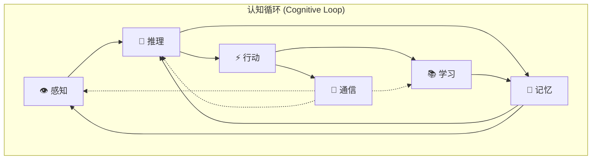

# 06. 认知架构层 (Cognitive Architecture Layer)

> **Agent智能的核心 - 感知、推理、记忆、学习、通信的完整认知模型**

## 🎯 层级概述

认知架构层是Agent Development Center的**智能核心**，基于认知科学理论构建完整的Agent认知模型。它不仅仅是简单的LLM调用封装，而是一个具有**感知-推理-行动**完整循环的智能系统。

### 核心职责
1. **👁️ 感知 (Perception)**: 多模态信息处理和理解
2. **🧠 推理 (Reasoning)**: 逻辑推理、决策制定、计划生成
3. **💾 记忆 (Memory)**: 多层次记忆管理和知识存储
4. **📚 学习 (Learning)**: 自适应学习和技能获取
5. **💬 通信 (Communication)**: Agent间协作和信息交换

### 设计理念
- **认知科学指导**: 基于人类认知理论的架构设计
- **模块化组装**: 可插拔的认知模块，支持灵活组合
- **自主进化**: 具备自主学习和适应能力
- **可观测性**: 认知过程透明可见，支持调试分析

---

## 👁️ 感知引擎 (Perception Engine)

> **Agent的"感官系统" - 将多模态信息转化为可理解的内部表征**

### 概念和作用

感知引擎负责处理和理解来自外部世界的各种信息，将原始输入转化为Agent可以处理的内部表征。它是Agent与外界交互的第一道关口。

**核心作用**:
- **多模态处理**: 统一处理文本、图像、音频、视频等不同类型的输入
- **语义理解**: 提取输入内容的深层语义和意图
- **上下文分析**: 结合历史信息和当前环境进行综合分析
- **意图识别**: 准确识别用户意图和任务要求

### 核心组件

#### 📝 文本处理器 (Text Processor)

**概念**: 处理和理解文本类型的输入信息

**作用**:
- 文本预处理和清理
- 语言检测和编码处理
- 语法分析和句法解析
- 情感和语调分析

**实现示例**:
```python
class TextProcessor:
    """文本感知处理器"""
    
    def __init__(self):
        self.language_detector = LanguageDetector()
        self.syntax_parser = SyntaxParser()
        self.sentiment_analyzer = SentimentAnalyzer()
        self.intent_classifier = IntentClassifier()
        
    async def process(self, text: str, context: ProcessingContext) -> TextPerceptionResult:
        """处理文本输入"""
        
        # 预处理
        cleaned_text = await self.preprocess_text(text)
        
        # 语言检测
        language_info = await self.language_detector.detect(cleaned_text)
        
        # 语法分析
        syntax_tree = await self.syntax_parser.parse(
            text=cleaned_text,
            language=language_info.language
        )
        
        # 语义分析
        semantic_info = await self.extract_semantic_info(cleaned_text, syntax_tree)
        
        # 情感分析
        sentiment = await self.sentiment_analyzer.analyze(cleaned_text)
        
        # 意图分类
        intent = await self.intent_classifier.classify(
            text=cleaned_text,
            context=context,
            semantic_info=semantic_info
        )
        
        return TextPerceptionResult(
            original_text=text,
            cleaned_text=cleaned_text,
            language_info=language_info,
            syntax_tree=syntax_tree,
            semantic_info=semantic_info,
            sentiment=sentiment,
            intent=intent,
            confidence=self.calculate_confidence([
                language_info.confidence,
                semantic_info.confidence,
                intent.confidence
            ])
        )
    
    async def extract_semantic_info(self, text: str, syntax_tree: SyntaxTree) -> SemanticInfo:
        """提取语义信息"""
        return SemanticInfo(
            entities=await self.extract_entities(text),
            relations=await self.extract_relations(text, syntax_tree),
            concepts=await self.extract_concepts(text),
            topics=await self.extract_topics(text),
            key_phrases=await self.extract_key_phrases(text),
            semantic_embedding=await self.generate_embedding(text)
        )
```

#### 👁️ 视觉处理器 (Vision Processor)

**概念**: 处理和理解图像、视频等视觉信息

**作用**:
- 图像内容识别和分析
- 场景理解和对象检测
- 文字识别(OCR)和信息提取
- 视觉-语言联合理解

**实现示例**:
```python
class VisionProcessor:
    """视觉感知处理器"""
    
    def __init__(self):
        self.object_detector = ObjectDetector()
        self.scene_analyzer = SceneAnalyzer()
        self.ocr_engine = OCREngine()
        self.vision_language_model = VisionLanguageModel()
        
    async def process(self, image_data: bytes, context: ProcessingContext) -> VisionPerceptionResult:
        """处理视觉输入"""
        
        # 图像预处理
        processed_image = await self.preprocess_image(image_data)
        
        # 对象检测
        objects = await self.object_detector.detect(processed_image)
        
        # 场景分析
        scene_info = await self.scene_analyzer.analyze(processed_image)
        
        # OCR文字识别
        text_regions = await self.ocr_engine.extract_text(processed_image)
        
        # 视觉-语言理解
        vl_description = await self.vision_language_model.describe(
            image=processed_image,
            context=context.text_context
        )
        
        # 综合分析
        visual_analysis = await self.comprehensive_analysis(
            objects, scene_info, text_regions, vl_description
        )
        
        return VisionPerceptionResult(
            image_metadata=self.extract_metadata(image_data),
            detected_objects=objects,
            scene_analysis=scene_info,
            extracted_text=text_regions,
            description=vl_description,
            visual_analysis=visual_analysis,
            confidence=self.calculate_vision_confidence([
                objects.confidence,
                scene_info.confidence,
                vl_description.confidence
            ])
        )
```

#### 🎵 音频处理器 (Audio Processor)

**概念**: 处理和理解音频信息

**作用**:
- 语音识别和转录
- 音频内容分析
- 说话人识别
- 情感和语调检测

**实现示例**:
```python
class AudioProcessor:
    """音频感知处理器"""
    
    def __init__(self):
        self.speech_recognizer = SpeechRecognizer()
        self.speaker_identifier = SpeakerIdentifier()
        self.audio_analyzer = AudioAnalyzer()
        self.emotion_detector = AudioEmotionDetector()
        
    async def process(self, audio_data: bytes, context: ProcessingContext) -> AudioPerceptionResult:
        """处理音频输入"""
        
        # 音频预处理
        processed_audio = await self.preprocess_audio(audio_data)
        
        # 语音识别
        transcription = await self.speech_recognizer.transcribe(
            audio=processed_audio,
            language=context.expected_language
        )
        
        # 说话人识别
        speaker_info = await self.speaker_identifier.identify(processed_audio)
        
        # 音频特征分析
        audio_features = await self.audio_analyzer.analyze_features(processed_audio)
        
        # 情感检测
        emotion = await self.emotion_detector.detect_emotion(
            audio=processed_audio,
            transcription=transcription.text
        )
        
        return AudioPerceptionResult(
            audio_metadata=self.extract_audio_metadata(audio_data),
            transcription=transcription,
            speaker_info=speaker_info,
            audio_features=audio_features,
            detected_emotion=emotion,
            confidence=self.calculate_audio_confidence([
                transcription.confidence,
                speaker_info.confidence,
                emotion.confidence
            ])
        )
```

#### 🔍 上下文分析器 (Context Analyzer)

**概念**: 分析和理解当前的上下文环境

**作用**:
- 历史信息整合
- 环境状态分析
- 任务上下文理解
- 多模态信息融合

**实现示例**:
```python
class ContextAnalyzer:
    """上下文分析器"""
    
    def __init__(self):
        self.history_analyzer = HistoryAnalyzer()
        self.environment_monitor = EnvironmentMonitor()
        self.multimodal_fusion = MultimodalFusion()
        self.temporal_analyzer = TemporalAnalyzer()
        
    async def analyze_context(self, 
                            current_input: PerceptionInput,
                            history: List[ContextEntry],
                            environment: EnvironmentState) -> ContextAnalysisResult:
        """综合分析当前上下文"""
        
        # 历史信息分析
        history_analysis = await self.history_analyzer.analyze(
            history=history,
            current_input=current_input
        )
        
        # 环境状态分析
        env_analysis = await self.environment_monitor.analyze(environment)
        
        # 多模态信息融合
        fused_info = await self.multimodal_fusion.fuse(
            text_info=current_input.text_perception,
            vision_info=current_input.vision_perception,
            audio_info=current_input.audio_perception
        )
        
        # 时序分析
        temporal_patterns = await self.temporal_analyzer.analyze_patterns(
            history=history,
            current_time=datetime.now()
        )
        
        # 综合上下文理解
        context_understanding = await self.synthesize_understanding(
            history_analysis, env_analysis, fused_info, temporal_patterns
        )
        
        return ContextAnalysisResult(
            history_analysis=history_analysis,
            environment_analysis=env_analysis,
            multimodal_fusion=fused_info,
            temporal_patterns=temporal_patterns,
            context_understanding=context_understanding,
            confidence=self.calculate_context_confidence([
                history_analysis.confidence,
                env_analysis.confidence,
                fused_info.confidence
            ])
        )
```

---

## 🧠 推理引擎 (Reasoning Engine)

> **Agent的"大脑" - 逻辑推理、决策制定、计划生成**

### 概念和作用

推理引擎是Agent认知架构的核心，负责基于感知到的信息进行逻辑推理、决策制定和行动计划。它集成了多种推理方法，能够处理复杂的推理任务。

**核心作用**:
- **逻辑推理**: 基于已知信息进行逻辑推导
- **决策制定**: 在多个选项中做出最优决策
- **计划生成**: 制定达成目标的行动计划
- **问题求解**: 分解复杂问题并寻找解决方案

### 核心组件

#### 🔍 逻辑推理器 (Logical Reasoner)

**概念**: 执行各种形式的逻辑推理

**作用**:
- 演绎推理: 从一般到特殊
- 归纳推理: 从特殊到一般
- 溯因推理: 寻找最佳解释
- 类比推理: 基于相似性推理

**实现示例**:
```python
class LogicalReasoner:
    """逻辑推理器"""
    
    def __init__(self):
        self.deductive_engine = DeductiveEngine()
        self.inductive_engine = InductiveEngine()
        self.abductive_engine = AbductiveEngine()
        self.analogical_engine = AnalogicalEngine()
        self.knowledge_base = KnowledgeBase()
        
    async def reason(self, 
                   premises: List[Premise], 
                   reasoning_type: ReasoningType,
                   context: ReasoningContext) -> ReasoningResult:
        """执行逻辑推理"""
        
        if reasoning_type == ReasoningType.DEDUCTIVE:
            return await self.deductive_reasoning(premises, context)
        elif reasoning_type == ReasoningType.INDUCTIVE:
            return await self.inductive_reasoning(premises, context)
        elif reasoning_type == ReasoningType.ABDUCTIVE:
            return await self.abductive_reasoning(premises, context)
        elif reasoning_type == ReasoningType.ANALOGICAL:
            return await self.analogical_reasoning(premises, context)
        else:
            return await self.hybrid_reasoning(premises, context)
    
    async def deductive_reasoning(self, premises: List[Premise], context: ReasoningContext) -> ReasoningResult:
        """演绎推理: 从一般规律推导具体结论"""
        
        # 构建推理链
        reasoning_chain = []
        current_premises = premises.copy()
        
        while True:
            # 查找适用的推理规则
            applicable_rules = await self.knowledge_base.find_applicable_rules(current_premises)
            
            if not applicable_rules:
                break
            
            # 选择最佳规则
            best_rule = self.select_best_rule(applicable_rules, context)
            
            # 应用推理规则
            new_conclusion = await best_rule.apply(current_premises)
            
            reasoning_chain.append(ReasoningStep(
                rule=best_rule,
                premises=current_premises.copy(),
                conclusion=new_conclusion,
                confidence=new_conclusion.confidence
            ))
            
            # 更新前提集合
            current_premises.append(new_conclusion)
            
            # 检查是否达到目标
            if self.is_goal_reached(new_conclusion, context.goal):
                break
        
        return ReasoningResult(
            reasoning_type=ReasoningType.DEDUCTIVE,
            reasoning_chain=reasoning_chain,
            final_conclusion=reasoning_chain[-1].conclusion if reasoning_chain else None,
            confidence=self.calculate_chain_confidence(reasoning_chain),
            metadata={
                "steps_count": len(reasoning_chain),
                "rules_applied": [step.rule.name for step in reasoning_chain]
            }
        )
```

#### 🎯 决策制定器 (Decision Maker)

**概念**: 在多个选项中做出最优决策

**作用**:
- 选项评估和比较
- 多准则决策分析
- 风险评估和管理
- 决策优化和选择

**实现示例**:
```python
class DecisionMaker:
    """决策制定器"""
    
    def __init__(self):
        self.option_evaluator = OptionEvaluator()
        self.criteria_analyzer = CriteriaAnalyzer()
        self.risk_assessor = RiskAssessor()
        self.optimization_engine = OptimizationEngine()
        
    async def make_decision(self,
                          options: List[DecisionOption],
                          criteria: List[DecisionCriteria],
                          context: DecisionContext) -> DecisionResult:
        """制定决策"""
        
        # 评估每个选项
        option_evaluations = []
        for option in options:
            evaluation = await self.evaluate_option(option, criteria, context)
            option_evaluations.append(evaluation)
        
        # 多准则决策分析
        mcdm_result = await self.multi_criteria_analysis(
            option_evaluations, criteria, context
        )
        
        # 风险评估
        risk_analysis = await self.assess_risks(option_evaluations, context)
        
        # 决策优化
        optimal_choice = await self.optimization_engine.optimize(
            options=option_evaluations,
            criteria=criteria,
            risk_profile=risk_analysis,
            context=context
        )
        
        return DecisionResult(
            recommended_option=optimal_choice.option,
            confidence=optimal_choice.confidence,
            reasoning=optimal_choice.reasoning,
            option_evaluations=option_evaluations,
            risk_analysis=risk_analysis,
            decision_metadata={
                "criteria_weights": criteria.get_weights(),
                "decision_method": optimal_choice.method,
                "alternatives_considered": len(options)
            }
        )
    
    async def evaluate_option(self,
                            option: DecisionOption,
                            criteria: List[DecisionCriteria],
                            context: DecisionContext) -> OptionEvaluation:
        """评估单个选项"""
        
        criterion_scores = {}
        
        for criterion in criteria:
            # 计算该准则下的得分
            score = await self.calculate_criterion_score(option, criterion, context)
            criterion_scores[criterion.name] = score
        
        # 计算加权总分
        weighted_score = sum(
            score * criterion.weight 
            for criterion, score in zip(criteria, criterion_scores.values())
        )
        
        # 评估优势和劣势
        strengths = self.identify_strengths(option, criterion_scores)
        weaknesses = self.identify_weaknesses(option, criterion_scores)
        
        return OptionEvaluation(
            option=option,
            criterion_scores=criterion_scores,
            weighted_score=weighted_score,
            strengths=strengths,
            weaknesses=weaknesses,
            overall_assessment=self.generate_assessment(option, criterion_scores)
        )
```

#### 📋 计划引擎 (Planning Engine)

**概念**: 制定达成目标的行动计划

**作用**:
- 目标分解和任务规划
- 资源分配和调度
- 计划优化和调整
- 执行监控和反馈

**实现示例**:
```python
class PlanningEngine:
    """计划生成引擎"""
    
    def __init__(self):
        self.goal_decomposer = GoalDecomposer()
        self.task_scheduler = TaskScheduler()
        self.resource_allocator = ResourceAllocator()
        self.plan_optimizer = PlanOptimizer()
        
    async def generate_plan(self,
                          goal: Goal,
                          constraints: List[Constraint],
                          resources: ResourcePool,
                          context: PlanningContext) -> ExecutionPlan:
        """生成执行计划"""
        
        # 目标分解
        subgoals = await self.goal_decomposer.decompose(goal, context)
        
        # 任务识别和依赖分析
        tasks = []
        for subgoal in subgoals:
            task_set = await self.identify_tasks_for_goal(subgoal, context)
            tasks.extend(task_set)
        
        # 依赖关系分析
        dependencies = await self.analyze_dependencies(tasks)
        
        # 资源需求分析
        resource_requirements = await self.analyze_resource_requirements(tasks)
        
        # 任务调度
        schedule = await self.task_scheduler.schedule(
            tasks=tasks,
            dependencies=dependencies,
            constraints=constraints,
            resources=resources
        )
        
        # 资源分配
        resource_allocation = await self.resource_allocator.allocate(
            tasks=tasks,
            requirements=resource_requirements,
            available_resources=resources,
            schedule=schedule
        )
        
        # 计划优化
        optimized_plan = await self.plan_optimizer.optimize(
            tasks=tasks,
            schedule=schedule,
            resource_allocation=resource_allocation,
            constraints=constraints,
            optimization_criteria=context.optimization_criteria
        )
        
        return ExecutionPlan(
            goal=goal,
            subgoals=subgoals,
            tasks=tasks,
            dependencies=dependencies,
            schedule=optimized_plan.schedule,
            resource_allocation=optimized_plan.resource_allocation,
            execution_order=optimized_plan.execution_order,
            contingency_plans=await self.generate_contingency_plans(optimized_plan),
            plan_metadata={
                "total_tasks": len(tasks),
                "estimated_duration": optimized_plan.estimated_duration,
                "resource_utilization": optimized_plan.resource_utilization,
                "risk_level": optimized_plan.risk_assessment.level
            }
        )
```

#### 🌳 思维树推理器 (Tree of Thought Reasoner)

**概念**: 探索多种推理路径的高级推理方法

**作用**:
- 并行探索多个思维路径
- 评估和选择最优路径
- 处理复杂的推理问题
- 提高推理的准确性

**实现示例**:
```python
class TreeOfThoughtReasoner:
    """思维树推理器 - 探索多种推理路径"""
    
    def __init__(self):
        self.thought_generator = ThoughtGenerator()
        self.thought_evaluator = ThoughtEvaluator()
        self.path_selector = PathSelector()
        self.tree_builder = ThoughtTreeBuilder()
        
    async def reason_with_tree_search(self, 
                                    problem: str, 
                                    depth: int = 3,
                                    breadth: int = 3) -> ReasoningResult:
        """使用思维树进行深度推理"""
        
        # 创建根节点
        root = ThoughtNode(
            content=problem,
            depth=0,
            path_id="root",
            confidence=1.0
        )
        
        thought_tree = ThoughtTree(root)
        
        # 广度优先搜索生成思维树
        for current_depth in range(depth):
            current_level_nodes = thought_tree.get_nodes_at_depth(current_depth)
            
            for node in current_level_nodes:
                # 为每个节点生成多个思维分支
                thoughts = await self.thought_generator.generate_thoughts(
                    parent_thought=node.content,
                    num_thoughts=breadth,
                    context={
                        "depth": current_depth,
                        "path": node.get_path(),
                        "problem": problem
                    }
                )
                
                # 评估每个思维的质量
                for i, thought in enumerate(thoughts):
                    # 评估思维质量
                    evaluation = await self.thought_evaluator.evaluate(
                        thought=thought,
                        parent=node,
                        problem_context=problem
                    )
                    
                    # 创建子节点
                    child_node = ThoughtNode(
                        content=thought,
                        depth=current_depth + 1,
                        parent=node,
                        path_id=f"{node.path_id}_{i}",
                        confidence=evaluation.confidence,
                        quality_score=evaluation.quality_score,
                        reasoning_type=evaluation.reasoning_type
                    )
                    
                    # 添加到树中
                    thought_tree.add_node(child_node)
                    node.add_child(child_node)
        
        # 使用启发式搜索找到最优路径
        best_paths = await self.find_best_reasoning_paths(
            thought_tree, 
            top_k=3
        )
        
        # 选择最终答案
        final_answer = await self.synthesize_final_answer(best_paths)
        
        return ReasoningResult(
            conclusion=final_answer.content,
            confidence=final_answer.confidence,
            reasoning_chain=self.extract_reasoning_chain(best_paths[0]),
            reasoning_type=ReasoningType.TREE_OF_THOUGHT,
            metadata={
                "tree_depth": depth,
                "tree_breadth": breadth,
                "total_nodes": thought_tree.node_count(),
                "paths_explored": len(thought_tree.get_all_paths()),
                "best_paths": len(best_paths)
            },
            thought_tree=thought_tree  # 保存完整的思维树用于分析
        )
    
    async def find_best_reasoning_paths(self, 
                                      thought_tree: ThoughtTree, 
                                      top_k: int = 3) -> List[ThoughtPath]:
        """找到最佳推理路径"""
        
        all_paths = thought_tree.get_all_leaf_paths()
        path_evaluations = []
        
        for path in all_paths:
            # 评估整条路径的质量
            path_score = await self.evaluate_path_quality(path)
            
            path_evaluations.append(PathEvaluation(
                path=path,
                overall_score=path_score.overall_score,
                coherence_score=path_score.coherence_score,
                logic_score=path_score.logic_score,
                completeness_score=path_score.completeness_score,
                confidence=path_score.confidence
            ))
        
        # 按综合得分排序
        path_evaluations.sort(key=lambda x: x.overall_score, reverse=True)
        
        return [eval.path for eval in path_evaluations[:top_k]]
```

---

## 💾 记忆系统 (Memory System)

> **Agent的"记忆宫殿" - 多层次记忆管理和知识存储**

### 概念和作用

记忆系统为Agent提供多层次的信息存储和检索能力，模拟人类的记忆机制，支持短期记忆、长期记忆和不同类型的知识存储。

**核心作用**:
- **信息持久化**: 保存重要的经验和知识
- **知识检索**: 快速找到相关的历史信息
- **学习支持**: 为学习过程提供记忆基础
- **上下文维护**: 维护对话和任务的连续性

### 核心组件

#### 🔄 工作记忆 (Working Memory)

**概念**: 临时存储和处理当前任务相关信息，基于Miller's 7±2规律设计

**作用**:
- 维护当前任务的上下文
- 临时存储中间计算结果
- 支持注意力机制
- 管理认知负载
- 实现短期状态管理
- 提供实时信息缓存

**实现示例**:
```python
class WorkingMemory:
    """工作记忆系统"""
    
    def __init__(self, capacity: int = 7):  # 基于Miller's 7±2 规律
        self.capacity = capacity
        self.active_items: List[MemoryItem] = []
        self.attention_weights: Dict[str, float] = {}
        self.decay_factor = 0.95  # 记忆衰减因子
        
    async def store_item(self, item: MemoryItem, attention_weight: float = 1.0):
        """存储记忆项"""
        
        # 检查容量限制
        if len(self.active_items) >= self.capacity:
            # 移除注意力权重最低的项
            await self.evict_least_attended_item()
        
        # 添加新项
        item.activation_level = attention_weight
        item.timestamp = datetime.now()
        self.active_items.append(item)
        self.attention_weights[item.id] = attention_weight
        
        # 更新其他项的激活水平
        await self.update_activation_levels()
    
    async def retrieve_relevant_items(self, query: str, top_k: int = 3) -> List[MemoryItem]:
        """检索相关记忆项"""
        
        relevance_scores = []
        
        for item in self.active_items:
            # 计算相关性得分
            semantic_similarity = await self.calculate_semantic_similarity(query, item.content)
            attention_weight = self.attention_weights.get(item.id, 0.0)
            temporal_factor = self.calculate_temporal_factor(item.timestamp)
            
            # 综合得分
            relevance_score = (
                semantic_similarity * 0.5 +
                attention_weight * 0.3 +
                temporal_factor * 0.2
            )
            
            relevance_scores.append((item, relevance_score))
        
        # 排序并返回top-k
        relevance_scores.sort(key=lambda x: x[1], reverse=True)
        return [item for item, score in relevance_scores[:top_k]]
    
    async def update_attention(self, item_id: str, new_weight: float):
        """更新注意力权重"""
        if item_id in self.attention_weights:
            self.attention_weights[item_id] = new_weight
            
            # 更新对应项的激活水平
            for item in self.active_items:
                if item.id == item_id:
                    item.activation_level = new_weight
                    break
```

#### 📚 情景记忆 (Episodic Memory)

**概念**: 存储具体的事件和经历，支持跨会话的持久化记忆

**作用**:
- 记录特定的交互历史
- 支持经验回顾和学习
- 提供上下文参考
- 支持因果关系分析
- 存储对话历史记录
- 维护任务执行轨迹
- 支持经验事件存储

**实现示例**:
```python
class EpisodicMemory:
    """情节记忆系统"""
    
    def __init__(self):
        self.episodes: List[Episode] = []
        self.episode_index = EpisodeIndex()
        self.retrieval_engine = EpisodeRetrievalEngine()
        
    async def store_episode(self, episode: Episode):
        """存储情节记忆"""
        
        # 增强情节信息
        enhanced_episode = await self.enhance_episode(episode)
        
        # 存储到记忆库
        self.episodes.append(enhanced_episode)
        
        # 更新索引
        await self.episode_index.add_episode(enhanced_episode)
        
        # 触发记忆整合
        await self.trigger_memory_consolidation(enhanced_episode)
    
    async def retrieve_similar_episodes(self, 
                                      query_episode: Episode, 
                                      similarity_threshold: float = 0.7,
                                      max_results: int = 5) -> List[EpisodeMatch]:
        """检索相似情节"""
        
        matches = []
        
        for stored_episode in self.episodes:
            # 计算情节相似性
            similarity = await self.calculate_episode_similarity(
                query_episode, stored_episode
            )
            
            if similarity >= similarity_threshold:
                matches.append(EpisodeMatch(
                    episode=stored_episode,
                    similarity_score=similarity,
                    matching_aspects=self.identify_matching_aspects(
                        query_episode, stored_episode
                    )
                ))
        
        # 按相似性排序
        matches.sort(key=lambda x: x.similarity_score, reverse=True)
        return matches[:max_results]
    
    async def enhance_episode(self, episode: Episode) -> Episode:
        """增强情节信息"""
        
        # 提取关键信息
        key_entities = await self.extract_entities(episode.description)
        
        # 识别情感色彩
        emotional_tone = await self.analyze_emotional_tone(episode)
        
        # 分析因果关系
        causal_relations = await self.identify_causal_relations(episode)
        
        # 计算重要性评分
        importance_score = await self.calculate_importance(episode)
        
        # 生成摘要
        summary = await self.generate_episode_summary(episode)
        
        return Episode(
            id=episode.id,
            timestamp=episode.timestamp,
            description=episode.description,
            participants=episode.participants,
            context=episode.context,
            outcome=episode.outcome,
            # 增强信息
            key_entities=key_entities,
            emotional_tone=emotional_tone,
            causal_relations=causal_relations,
            importance_score=importance_score,
            summary=summary,
            embedding=await self.generate_episode_embedding(episode)
        )
```

#### 🧠 语义记忆 (Semantic Memory)

**概念**: 存储一般性知识和概念

**作用**:
- 存储事实性知识
- 维护概念关系网络
- 支持推理和理解
- 提供知识检索服务

**实现示例**:
```python
class SemanticMemory:
    """语义记忆系统"""
    
    def __init__(self):
        self.knowledge_graph = KnowledgeGraph()
        self.concept_embeddings = ConceptEmbeddingSpace()
        self.fact_database = FactDatabase()
        self.relation_extractor = RelationExtractor()
        
    async def store_knowledge(self, knowledge: Knowledge):
        """存储语义知识"""
        
        if isinstance(knowledge, Fact):
            await self.store_fact(knowledge)
        elif isinstance(knowledge, Concept):
            await self.store_concept(knowledge)
        elif isinstance(knowledge, Relation):
            await self.store_relation(knowledge)
        else:
            await self.store_complex_knowledge(knowledge)
    
    async def store_concept(self, concept: Concept):
        """存储概念知识"""
        
        # 生成概念嵌入
        embedding = await self.concept_embeddings.generate_embedding(concept)
        
        # 添加到知识图谱
        await self.knowledge_graph.add_concept_node(
            concept_id=concept.id,
            name=concept.name,
            definition=concept.definition,
            attributes=concept.attributes,
            embedding=embedding
        )
        
        # 识别与现有概念的关系
        related_concepts = await self.find_related_concepts(concept)
        
        for related_concept, relation_type in related_concepts:
            await self.knowledge_graph.add_relation(
                source=concept.id,
                target=related_concept.id,
                relation_type=relation_type,
                confidence=self.calculate_relation_confidence(concept, related_concept)
            )
    
    async def query_knowledge(self, query: KnowledgeQuery) -> KnowledgeQueryResult:
        """查询语义知识"""
        
        if query.query_type == QueryType.FACTUAL:
            return await self.query_facts(query)
        elif query.query_type == QueryType.CONCEPTUAL:
            return await self.query_concepts(query)
        elif query.query_type == QueryType.RELATIONAL:
            return await self.query_relations(query)
        else:
            return await self.complex_query(query)
    
    async def query_concepts(self, query: KnowledgeQuery) -> KnowledgeQueryResult:
        """查询概念知识"""
        
        # 解析查询意图
        query_intent = await self.parse_query_intent(query.text)
        
        # 查找相关概念
        if query_intent.type == "definition":
            # 查找概念定义
            concepts = await self.knowledge_graph.find_concepts_by_name(
                query_intent.target_concept
            )
            
            results = []
            for concept in concepts:
                results.append(KnowledgeItem(
                    type="concept_definition",
                    content=concept.definition,
                    confidence=concept.confidence,
                    source=concept.source
                ))
        
        elif query_intent.type == "relation":
            # 查找概念关系
            relations = await self.knowledge_graph.find_relations(
                source=query_intent.source_concept,
                target=query_intent.target_concept,
                relation_type=query_intent.relation_type
            )
            
            results = []
            for relation in relations:
                results.append(KnowledgeItem(
                    type="concept_relation",
                    content=f"{relation.source} {relation.type} {relation.target}",
                    confidence=relation.confidence,
                    metadata=relation.metadata
                ))
        
        return KnowledgeQueryResult(
            query=query,
            results=results,
            total_results=len(results),
            processing_time=self.calculate_processing_time()
        )
```

#### ⚙️ 程序记忆 (Procedural Memory)

**概念**: 存储技能、流程和操作模式，支持自动化执行

**作用**:
- 存储技能和流程
- 维护工具使用模式
- 支持决策策略库
- 实现自动化操作
- 优化执行效率

**实现示例**:
```python
class ProceduralMemory:
    """程序记忆系统"""
    
    def __init__(self):
        self.skill_registry = SkillRegistry()
        self.workflow_templates = WorkflowTemplateManager()
        self.decision_patterns = DecisionPatternLibrary()
        self.tool_usage_patterns = ToolUsagePatternManager()
        
    async def store_skill(self, skill: Skill):
        """存储技能"""
        
        # 技能验证
        validated_skill = await self.validate_skill(skill)
        
        # 生成技能嵌入
        skill_embedding = await self.generate_skill_embedding(validated_skill)
        
        # 存储到技能注册表
        await self.skill_registry.register_skill(
            skill_id=validated_skill.id,
            name=validated_skill.name,
            description=validated_skill.description,
            parameters=validated_skill.parameters,
            implementation=validated_skill.implementation,
            embedding=skill_embedding,
            performance_metrics=validated_skill.performance_metrics
        )
        
        # 更新相关技能关系
        await self.update_skill_relationships(validated_skill)
    
    async def retrieve_relevant_skills(self, task: UniversalTask, top_k: int = 5) -> List[SkillMatch]:
        """检索相关技能"""
        
        # 分析任务需求
        task_requirements = await self.analyze_task_requirements(task)
        
        # 技能匹配
        skill_matches = []
        for skill in await self.skill_registry.get_all_skills():
            match_score = await self.calculate_skill_match_score(
                task_requirements, skill
            )
            
            if match_score > 0.5:  # 匹配阈值
                skill_matches.append(SkillMatch(
                    skill=skill,
                    match_score=match_score,
                    applicability_score=await self.calculate_applicability(skill, task)
                ))
        
        # 排序并返回top-k
        skill_matches.sort(key=lambda x: x.match_score, reverse=True)
        return skill_matches[:top_k]
    
    async def store_workflow_template(self, template: WorkflowTemplate):
        """存储工作流模板"""
        
        # 模板优化
        optimized_template = await self.optimize_workflow_template(template)
        
        # 存储模板
        await self.workflow_templates.store_template(optimized_template)
        
        # 更新使用统计
        await self.update_template_usage_stats(optimized_template)
```

#### 🧠 元记忆 (Meta Memory)

**概念**: 管理记忆系统本身，实现记忆的自我优化

**作用**:
- 记忆管理策略
- 记忆检索优化
- 记忆质量评估
- 记忆系统自我改进
- 记忆策略学习

**实现示例**:
```python
class MetaMemory:
    """元记忆系统"""
    
    def __init__(self):
        self.memory_policies = MemoryPolicyManager()
        self.retrieval_optimizer = RetrievalOptimizer()
        self.quality_assessor = MemoryQualityAssessor()
        self.learning_engine = MemoryLearningEngine()
        
    async def optimize_memory_retrieval(self, query: MemoryQuery) -> OptimizedRetrievalStrategy:
        """优化记忆检索策略"""
        
        # 分析查询特征
        query_features = await self.analyze_query_features(query)
        
        # 选择最佳检索策略
        retrieval_strategy = await self.select_optimal_strategy(query_features)
        
        # 优化检索参数
        optimized_params = await self.optimize_retrieval_parameters(
            strategy=retrieval_strategy,
            query_features=query_features
        )
        
        return OptimizedRetrievalStrategy(
            strategy=retrieval_strategy,
            parameters=optimized_params,
            expected_performance=await self.predict_retrieval_performance(
                strategy=retrieval_strategy,
                parameters=optimized_params
            )
        )
    
    async def assess_memory_quality(self, memory_item: MemoryItem) -> MemoryQualityReport:
        """评估记忆质量"""
        
        # 计算质量指标
        relevance_score = await self.calculate_relevance_score(memory_item)
        accuracy_score = await self.calculate_accuracy_score(memory_item)
        completeness_score = await self.calculate_completeness_score(memory_item)
        consistency_score = await self.calculate_consistency_score(memory_item)
        
        # 综合质量评分
        overall_quality = self.calculate_overall_quality([
            relevance_score,
            accuracy_score,
            completeness_score,
            consistency_score
        ])
        
        return MemoryQualityReport(
            memory_id=memory_item.id,
            relevance_score=relevance_score,
            accuracy_score=accuracy_score,
            completeness_score=completeness_score,
            consistency_score=consistency_score,
            overall_quality=overall_quality,
            improvement_suggestions=await self.generate_improvement_suggestions(memory_item)
        )
    
    async def learn_memory_patterns(self, memory_usage_data: List[MemoryUsageRecord]):
        """学习记忆使用模式"""
        
        # 分析使用模式
        usage_patterns = await self.analyze_usage_patterns(memory_usage_data)
        
        # 识别优化机会
        optimization_opportunities = await self.identify_optimization_opportunities(usage_patterns)
        
        # 更新记忆策略
        await self.update_memory_policies(optimization_opportunities)
        
        # 优化检索算法
        await self.optimize_retrieval_algorithms(usage_patterns)
```

---

## 📚 学习模块 (Learning Module)

> **Agent的"成长引擎" - 自适应学习和技能获取**

### 概念和作用

学习模块使Agent具备持续学习和自我改进的能力，通过不同的学习方式获取新知识、改进性能、适应环境变化。

**核心作用**:
- **技能获取**: 学习新的技能和能力
- **性能优化**: 通过经验改进执行效果
- **知识更新**: 持续更新和完善知识库
- **适应性调整**: 根据环境变化调整行为

### 核心组件

#### 🎯 监督学习 (Supervised Learning)

**概念**: 基于标注数据进行学习

**作用**:
- 从用户反馈中学习
- 改进任务执行质量
- 学习新的分类和预测任务
- 优化决策策略

**实现示例**:
```python
class SupervisedLearning:
    """监督学习模块"""
    
    def __init__(self):
        self.training_data_collector = TrainingDataCollector()
        self.model_trainer = ModelTrainer()
        self.performance_evaluator = PerformanceEvaluator()
        self.model_registry = ModelRegistry()
        
    async def learn_from_feedback(self, 
                                task: UniversalTask,
                                agent_response: UniversalResult,
                                user_feedback: UserFeedback):
        """从用户反馈中学习"""
        
        # 收集训练数据
        training_example = await self.training_data_collector.create_example(
            input_data=task,
            agent_output=agent_response,
            ground_truth=user_feedback.corrected_response,
            feedback_score=user_feedback.satisfaction_score
        )
        
        # 添加到训练集
        await self.training_data_collector.add_example(training_example)
        
        # 检查是否需要重新训练
        if await self.should_retrain():
            await self.retrain_model(task.task_type)
    
    async def retrain_model(self, task_type: TaskType):
        """重新训练模型"""
        
        # 获取训练数据
        training_data = await self.training_data_collector.get_training_data(task_type)
        
        # 数据预处理
        processed_data = await self.preprocess_training_data(training_data)
        
        # 模型训练
        trained_model = await self.model_trainer.train(
            data=processed_data,
            model_type=self.select_model_type(task_type),
            hyperparameters=self.get_hyperparameters(task_type)
        )
        
        # 模型评估
        evaluation_result = await self.performance_evaluator.evaluate(
            model=trained_model,
            test_data=processed_data.test_set
        )
        
        # 如果性能提升，则更新模型
        if evaluation_result.performance > self.get_current_performance(task_type):
            await self.model_registry.update_model(task_type, trained_model)
            
            # 记录学习成果
            await self.record_learning_achievement(
                task_type=task_type,
                old_performance=self.get_current_performance(task_type),
                new_performance=evaluation_result.performance,
                improvement=evaluation_result.performance - self.get_current_performance(task_type)
            )
```

#### 🔄 强化学习 (Reinforcement Learning)

**概念**: 通过试错和奖励信号进行学习

**作用**:
- 优化决策策略
- 学习最优行动序列
- 适应动态环境
- 最大化长期奖励

**实现示例**:
```python
class ReinforcementLearning:
    """强化学习模块"""
    
    def __init__(self):
        self.policy_network = PolicyNetwork()
        self.value_network = ValueNetwork()
        self.experience_buffer = ExperienceBuffer()
        self.reward_calculator = RewardCalculator()
        
    async def learn_from_experience(self, 
                                  state: AgentState,
                                  action: AgentAction,
                                  next_state: AgentState,
                                  reward: float,
                                  done: bool):
        """从经验中学习"""
        
        # 存储经验
        experience = Experience(
            state=state,
            action=action,
            reward=reward,
            next_state=next_state,
            done=done,
            timestamp=datetime.now()
        )
        
        await self.experience_buffer.store(experience)
        
        # 如果缓冲区足够大，开始训练
        if len(self.experience_buffer) >= self.min_buffer_size:
            await self.train_policy()
    
    async def train_policy(self):
        """训练策略网络"""
        
        # 采样经验批次
        batch = await self.experience_buffer.sample_batch(self.batch_size)
        
        # 计算目标值
        targets = await self.calculate_targets(batch)
        
        # 更新价值网络
        value_loss = await self.value_network.update(
            states=[exp.state for exp in batch],
            targets=targets
        )
        
        # 计算策略梯度
        advantages = await self.calculate_advantages(batch, targets)
        
        # 更新策略网络
        policy_loss = await self.policy_network.update(
            states=[exp.state for exp in batch],
            actions=[exp.action for exp in batch],
            advantages=advantages
        )
        
        # 记录训练指标
        await self.record_training_metrics(
            value_loss=value_loss,
            policy_loss=policy_loss,
            average_reward=np.mean([exp.reward for exp in batch])
        )
    
    async def select_action(self, state: AgentState, exploration_rate: float = 0.1) -> AgentAction:
        """选择行动（带探索）"""
        
        # ε-贪婪策略
        if random.random() < exploration_rate:
            # 随机探索
            return await self.sample_random_action(state)
        else:
            # 利用当前策略
            action_probabilities = await self.policy_network.predict(state)
            return self.sample_action_from_probabilities(action_probabilities)
```

#### 🧠 元学习 (Meta Learning)

**概念**: 学习如何学习的能力

**作用**:
- 快速适应新任务
- 优化学习策略
- 迁移学习经验
- 提高学习效率

**实现示例**:
```python
class MetaLearning:
    """元学习模块"""
    
    def __init__(self):
        self.meta_learner = MetaLearner()
        self.task_similarity_analyzer = TaskSimilarityAnalyzer()
        self.learning_strategy_selector = LearningStrategySelector()
        self.transfer_learning_engine = TransferLearningEngine()
        
    async def adapt_to_new_task(self, 
                              new_task: UniversalTask,
                              few_shot_examples: List[TaskExample]) -> AdaptationResult:
        """快速适应新任务"""
        
        # 分析任务特征
        task_features = await self.analyze_task_features(new_task)
        
        # 查找相似的历史任务
        similar_tasks = await self.task_similarity_analyzer.find_similar_tasks(
            task_features, similarity_threshold=0.7
        )
        
        # 选择最佳学习策略
        learning_strategy = await self.learning_strategy_selector.select_strategy(
            new_task=new_task,
            similar_tasks=similar_tasks,
            available_examples=few_shot_examples
        )
        
        # 执行快速适应
        adaptation_result = await self.execute_adaptation(
            task=new_task,
            strategy=learning_strategy,
            examples=few_shot_examples,
            similar_tasks=similar_tasks
        )
        
        return adaptation_result
    
    async def execute_adaptation(self,
                               task: UniversalTask,
                               strategy: LearningStrategy,
                               examples: List[TaskExample],
                               similar_tasks: List[Task]) -> AdaptationResult:
        """执行快速适应"""
        
        if strategy.type == StrategyType.FEW_SHOT_LEARNING:
            return await self.few_shot_adaptation(task, examples)
        
        elif strategy.type == StrategyType.TRANSFER_LEARNING:
            return await self.transfer_learning_adaptation(task, similar_tasks)
        
        elif strategy.type == StrategyType.GRADIENT_BASED_META_LEARNING:
            return await self.gradient_based_adaptation(task, examples)
        
        else:
            return await self.hybrid_adaptation(task, examples, similar_tasks, strategy)
    
    async def few_shot_adaptation(self, 
                                task: UniversalTask, 
                                examples: List[TaskExample]) -> AdaptationResult:
        """少样本学习适应"""
        
        # 构建提示模板
        prompt_template = await self.build_few_shot_prompt(task, examples)
        
        # 快速微调
        adapted_model = await self.meta_learner.quick_adapt(
            base_model=self.get_base_model(task.task_type),
            examples=examples,
            adaptation_steps=strategy.adaptation_steps
        )
        
        # 验证适应效果
        validation_result = await self.validate_adaptation(adapted_model, task)
        
        return AdaptationResult(
            adapted_model=adapted_model,
            prompt_template=prompt_template,
            validation_score=validation_result.score,
            adaptation_time=validation_result.adaptation_time,
            confidence=validation_result.confidence
        )
```

---

## 💬 通信管理器 (Communication Manager)

> **Agent的"神经网络" - 实现Agent间的协作和信息交换**

### 概念和作用

通信管理器负责Agent之间的信息交换和协作协调，支持不同的通信模式和协议，确保多Agent系统的有效协作。

**核心作用**:
- **信息传递**: 在Agent之间传递消息和数据
- **协作协调**: 协调多Agent的协作行为
- **协议管理**: 管理不同的通信协议和规范
- **冲突解决**: 处理Agent间的冲突和竞争

### 核心组件

#### 📨 消息总线 (Message Bus)

**概念**: 中央化的消息传递系统

**作用**:
- 异步消息传递
- 消息路由和分发
- 消息持久化存储
- 消息优先级管理

**实现示例**:
```python
class MessageBus:
    """消息总线系统"""
    
    def __init__(self):
        self.message_queue = MessageQueue()
        self.routing_engine = MessageRoutingEngine()
        self.subscription_manager = SubscriptionManager()
        self.message_persistence = MessagePersistence()
        
    async def publish_message(self, 
                            sender_id: str,
                            message: Message,
                            routing_key: str = None) -> MessagePublishResult:
        """发布消息"""
        
        # 消息验证和增强
        enhanced_message = await self.enhance_message(message, sender_id)
        
        # 确定路由策略
        routing_strategy = await self.routing_engine.determine_routing(
            message=enhanced_message,
            routing_key=routing_key
        )
        
        # 查找订阅者
        subscribers = await self.subscription_manager.find_subscribers(
            message_type=enhanced_message.type,
            routing_key=routing_key,
            sender_id=sender_id
        )
        
        # 消息分发
        delivery_results = []
        for subscriber in subscribers:
            delivery_result = await self.deliver_message(
                message=enhanced_message,
                subscriber=subscriber,
                delivery_strategy=routing_strategy.delivery_strategy
            )
            delivery_results.append(delivery_result)
        
        # 消息持久化
        if enhanced_message.persistent:
            await self.message_persistence.store_message(enhanced_message)
        
        return MessagePublishResult(
            message_id=enhanced_message.id,
            delivery_results=delivery_results,
            total_subscribers=len(subscribers),
            successful_deliveries=len([r for r in delivery_results if r.success])
        )
    
    async def subscribe(self, 
                      subscriber_id: str,
                      message_types: List[MessageType],
                      filters: List[MessageFilter] = None) -> SubscriptionResult:
        """订阅消息"""
        
        subscription = Subscription(
            subscriber_id=subscriber_id,
            message_types=message_types,
            filters=filters or [],
            created_at=datetime.now(),
            active=True
        )
        
        # 注册订阅
        await self.subscription_manager.add_subscription(subscription)
        
        return SubscriptionResult(
            subscription_id=subscription.id,
            subscriber_id=subscriber_id,
            subscribed_types=message_types
        )
```

#### 🤝 团队协议 (Team Protocol)

**概念**: 定义多Agent协作的规范和协议

**作用**:
- 协作模式定义
- 角色分工管理
- 协调机制实现
- 冲突解决策略

**实现示例**:
```python
class TeamProtocol:
    """团队协作协议"""
    
    def __init__(self):
        self.collaboration_patterns = CollaborationPatternRegistry()
        self.role_manager = RoleManager()
        self.coordination_engine = CoordinationEngine()
        self.conflict_resolver = ConflictResolver()
        
    async def initiate_collaboration(self,
                                   agents: List[AgentIdentity],
                                   collaboration_goal: Goal,
                                   pattern: CollaborationPattern) -> CollaborationSession:
        """启动协作会话"""
        
        # 创建协作会话
        session = CollaborationSession(
            session_id=self.generate_session_id(),
            participants=agents,
            goal=collaboration_goal,
            pattern=pattern,
            status=CollaborationStatus.INITIALIZING
        )
        
        # 分配角色
        role_assignments = await self.role_manager.assign_roles(
            agents=agents,
            pattern=pattern,
            goal=collaboration_goal
        )
        
        # 初始化协调机制
        coordination_context = await self.coordination_engine.initialize(
            session=session,
            role_assignments=role_assignments
        )
        
        # 建立通信通道
        communication_channels = await self.setup_communication_channels(
            session=session,
            pattern=pattern
        )
        
        # 启动协作
        session.status = CollaborationStatus.ACTIVE
        session.role_assignments = role_assignments
        session.coordination_context = coordination_context
        session.communication_channels = communication_channels
        
        return session
    
    async def coordinate_agents(self, 
                              session: CollaborationSession,
                              current_state: CollaborationState) -> CoordinationResult:
        """协调Agent行为"""
        
        # 分析当前状态
        state_analysis = await self.analyze_collaboration_state(current_state)
        
        # 检测潜在冲突
        conflicts = await self.conflict_resolver.detect_conflicts(
            session=session,
            current_state=current_state
        )
        
        # 生成协调指令
        coordination_instructions = []
        
        for agent_id in session.participants:
            agent_instruction = await self.generate_agent_instruction(
                agent_id=agent_id,
                session=session,
                state_analysis=state_analysis,
                conflicts=conflicts
            )
            coordination_instructions.append(agent_instruction)
        
        # 处理冲突
        if conflicts:
            conflict_resolution = await self.conflict_resolver.resolve_conflicts(
                conflicts=conflicts,
                session=session
            )
            
            # 更新协调指令
            coordination_instructions = await self.update_instructions_with_resolution(
                instructions=coordination_instructions,
                resolution=conflict_resolution
            )
        
        return CoordinationResult(
            instructions=coordination_instructions,
            conflicts_resolved=len(conflicts) if conflicts else 0,
            coordination_quality=state_analysis.coordination_quality,
            next_coordination_time=self.calculate_next_coordination_time(state_analysis)
        )
```

---

## 🔄 认知循环和集成

### 认知循环流程



### 集成架构

```python
class CognitiveAgent:
    """认知Agent - 集成所有认知模块"""
    
    def __init__(self, identity: AgentIdentity):
        self.identity = identity
        
        # 认知模块
        self.perception_engine = PerceptionEngine()
        self.reasoning_engine = ReasoningEngine()
        self.memory_system = MemorySystem()
        self.learning_module = LearningModule()
        self.communication_manager = CommunicationManager()
        
        # 认知状态
        self.cognitive_state = CognitiveState.IDLE
        self.current_context = UniversalContext()
        
    async def execute(self, task: UniversalTask, context: UniversalContext) -> UniversalResult:
        """执行完整的认知循环"""
        
        self.cognitive_state = CognitiveState.PROCESSING
        
        try:
            # 1. 感知阶段
            perception_result = await self.perception_engine.perceive(
                input_data=task.content,
                context=context
            )
            
            # 2. 记忆检索
            relevant_memories = await self.memory_system.retrieve_relevant_memories(
                query=task.content,
                context=perception_result
            )
            
            # 3. 推理阶段
            reasoning_result = await self.reasoning_engine.reason(
                perception_input=perception_result,
                memories=relevant_memories,
                task_goal=task.goal
            )
            
            # 4. 行动执行
            action_result = await self.execute_actions(reasoning_result.actions)
            
            # 5. 记忆存储
            await self.memory_system.store_episode(
                task=task,
                perception=perception_result,
                reasoning=reasoning_result,
                actions=action_result
            )
            
            # 6. 学习更新
            await self.learning_module.learn_from_experience(
                task=task,
                result=action_result,
                success=action_result.success
            )
            
            self.cognitive_state = CognitiveState.IDLE
            
            return UniversalResult(
                content=action_result.output,
                status=ResultStatus.SUCCESS if action_result.success else ResultStatus.FAILURE,
                metadata={
                    "perception_confidence": perception_result.confidence,
                    "reasoning_type": reasoning_result.reasoning_type,
                    "memories_used": len(relevant_memories),
                    "actions_executed": len(reasoning_result.actions)
                }
            )
            
        except Exception as e:
            self.cognitive_state = CognitiveState.ERROR
            return UniversalResult(
                content=f"Cognitive processing error: {str(e)}",
                status=ResultStatus.FAILURE
            )
```

---

*认知架构层文档 v2.0 - 分层记忆增强版本*  
*最后更新: 2024年12月20日*  
*文档编号: ADC-ARCH-06* 