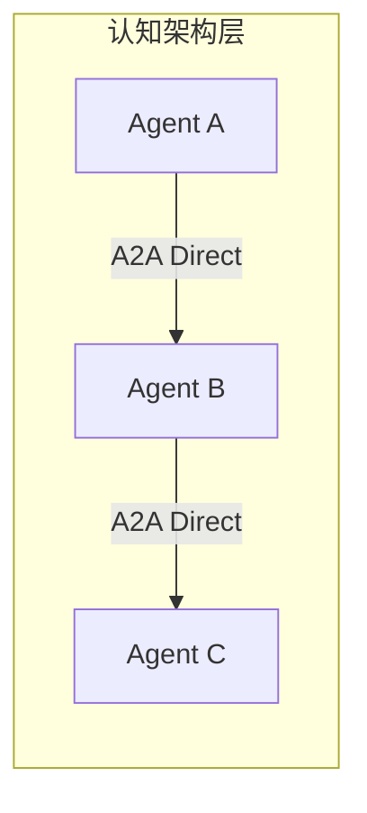
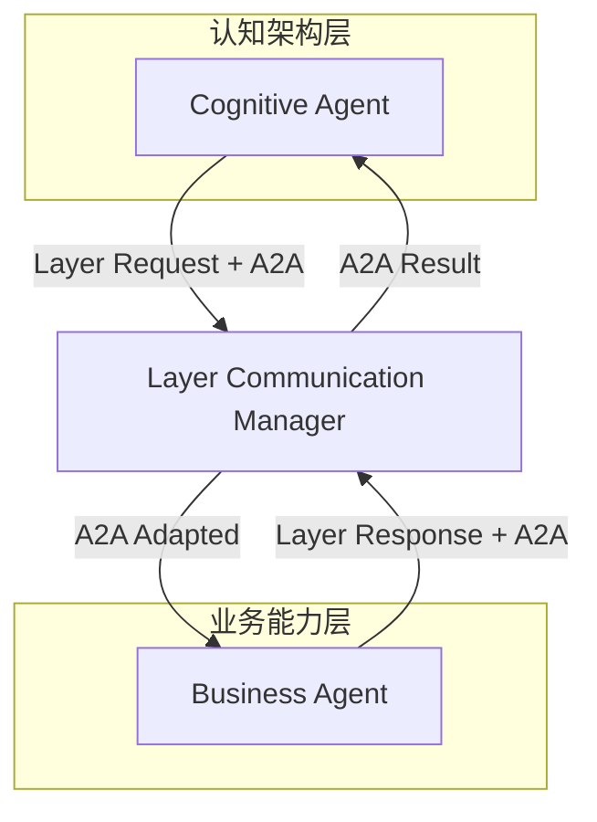
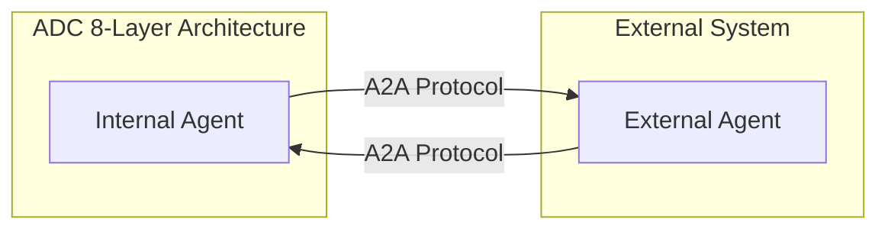
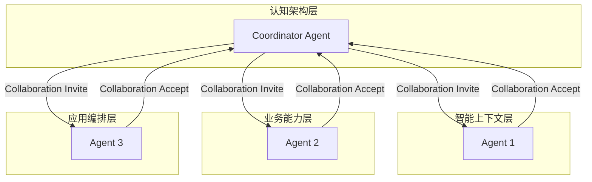

# A2A协议与8层架构集成设计

> **Agent-to-Agent (A2A) 协议在8层架构中的完整集成方案**

## 📋 概述

A2A (Agent-to-Agent) 协议是我们8层架构中的重要创新，提供了标准化、可扩展的Agent间通信机制。本文档详细说明A2A协议如何与每个架构层集成，以及如何实现跨层Agent通信。

## 🏗️ A2A协议架构

### 协议栈结构

```
┌─────────────────────────────────────────────────────────────┐
│                   A2A Protocol Stack                        │
├─────────────────────────────────────────────────────────────┤
│ 应用层 (Application)                                        │
│ • 协作管理 • 任务委派 • 工作流编排 • 结果聚合                 │
├─────────────────────────────────────────────────────────────┤
│ 消息层 (Message)                                           │
│ • 握手协议 • 能力交换 • 任务管理 • 状态同步 • 错误处理       │
├─────────────────────────────────────────────────────────────┤
│ 传输层 (Transport)                                         │
│ • HTTP/REST • WebSocket • Message Queue • gRPC             │
├─────────────────────────────────────────────────────────────┤
│ 集成层 (Integration)                                       │
│ • 8层架构适配器 • 层间通信桥接 • 协议转换 • 路由管理          │
└─────────────────────────────────────────────────────────────┘
```

### 核心组件

#### 1. A2A协议处理器 (`A2AProtocolHandler`)
- **职责**: 处理A2A协议消息的核心组件
- **功能**: 握手、能力交换、任务处理、协作管理
- **位置**: 各层中注册的Agent实例

#### 2. 层间集成适配器 (`A2ALayerIntegrationAdapter`)
- **职责**: 将A2A协议集成到8层架构的层间通信系统
- **功能**: 协议转换、跨层路由、消息适配
- **位置**: 每个层的通信管理器中

#### 3. 传输层实现
- **HTTP传输** (`A2AHTTPTransport`): 基于HTTP/REST的通信
- **WebSocket传输** (`A2AWebSocketTransport`): 实时双向通信
- **扩展性**: 支持自定义传输协议

## 🔄 通信模式

### 1. 层内通信 (Intra-Layer Communication)



**特点**:
- Agent在同一层内直接通信
- 使用标准A2A协议消息
- 低延迟，高效率

**使用场景**:
- 同层Agent协作
- 任务分解和分配
- 结果聚合

### 2. 跨层通信 (Cross-Layer Communication)



**特点**:
- 通过层间通信管理器路由
- A2A消息封装在层间消息中
- 支持复杂的跨层协作

**使用场景**:
- 跨层任务委派
- 多层协作项目
- 分层处理流程

### 3. 外部通信 (External Communication)



**特点**:
- 使用标准A2A协议
- 支持与外部系统Agent通信
- 协议兼容性保证

**使用场景**:
- 与第三方Agent系统集成
- 分布式Agent网络
- 跨组织Agent协作

### 4. 多层协作 (Multi-Layer Collaboration)



**特点**:
- 涉及多个层的Agent协作
- 复杂的协作编排和管理
- 统一的协作生命周期

**使用场景**:
- 大型项目协作
- 复杂问题求解
- 多专业领域整合

## 📨 A2A消息类型

### 基础消息类型

#### 1. 握手消息 (`HANDSHAKE`)
```json
{
  "message_type": "handshake",
  "payload": {
    "agent_profile": {
      "agent_id": "agent_001",
      "agent_name": "Cognitive Assistant",
      "capabilities": [...],
      "endpoint": "http://localhost:8000/agents/agent_001"
    },
    "supported_features": [
      "capability_exchange",
      "task_collaboration",
      "progress_tracking"
    ]
  }
}
```

#### 2. 能力交换 (`CAPABILITY_EXCHANGE`)
```json
{
  "message_type": "capability_exchange",
  "payload": {
    "capabilities": [
      {
        "type": "text_processing",
        "version": "2.0",
        "description": "Advanced text processing and analysis",
        "input_formats": ["text", "json"],
        "output_formats": ["text", "json", "html"]
      }
    ],
    "agent_metadata": {
      "specialization": "NLP",
      "performance_metrics": {...}
    }
  }
}
```

#### 3. 任务请求 (`TASK_REQUEST`)
```json
{
  "message_type": "task_request",
  "payload": {
    "task_description": "Analyze sentiment of customer reviews",
    "task_data": {
      "reviews": [...],
      "output_format": "json"
    },
    "expected_output_format": "json",
    "deadline": "2025-01-15T10:00:00Z",
    "priority": 5
  }
}
```

#### 4. 协作邀请 (`COLLABORATION_INVITE`)
```json
{
  "message_type": "collaboration_invite",
  "payload": {
    "collaboration_id": "collab_001",
    "collaboration_type": "document_analysis_project",
    "participants": ["agent_001", "agent_002", "agent_003"],
    "role_requirements": {
      "agent_002": "text_processor",
      "agent_003": "quality_reviewer"
    },
    "expected_duration": "2h"
  }
}
```

### 层间扩展消息

#### 5. 跨层任务 (`CROSS_LAYER_TASK`)
```json
{
  "message_type": "a2a_task_request",
  "layer_context": {
    "source_layer": "cognitive",
    "target_layer": "business",
    "execution_context": {...}
  },
  "payload": {
    "task_description": "Execute business workflow",
    "cross_layer_data": {...}
  }
}
```

## 🔧 层级集成详解

### 1. 基础设施层 (Infrastructure Layer)

**A2A支持**:
- **传输基础设施**: HTTP服务器、WebSocket服务器
- **消息队列**: 异步消息处理
- **监控和日志**: A2A通信的可观测性
- **安全机制**: Agent身份验证和授权

**集成方式**:
```python
# 基础设施层的A2A支持
class InfrastructureA2ASupport:
    def __init__(self):
        self.http_server = A2AHTTPServer()
        self.websocket_server = A2AWebSocketServer()
        self.message_queue = A2AMessageQueue()
        self.security_manager = A2ASecurityManager()
```

### 2. 适配器层 (Adapter Layer)

**A2A支持**:
- **框架适配**: 将不同框架的Agent接入A2A协议
- **协议转换**: 框架特定协议与A2A协议的转换
- **Agent包装**: 为现有Agent添加A2A能力

**集成方式**:
```python
# OpenAI适配器的A2A集成
class OpenAIA2AAdapter:
    def __init__(self, openai_agent):
        self.openai_agent = openai_agent
        self.a2a_profile = self._create_a2a_profile()
        self.a2a_handler = A2AProtocolHandler(self.a2a_profile)
    
    def _create_a2a_profile(self):
        return A2AAgentProfile(
            agent_id=f"openai_{self.openai_agent.id}",
            capabilities=[
                create_a2a_capability(A2ACapabilityType.TEXT_PROCESSING),
                create_a2a_capability(A2ACapabilityType.CODE_GENERATION)
            ]
        )
```

### 3. 框架抽象层 (Framework Abstraction Layer)

**A2A支持**:
- **统一Agent接口**: `UniversalAgent`内置A2A支持
- **A2A集成适配器**: 核心A2A集成组件
- **跨层通信桥接**: A2A消息与层间消息的转换

**集成方式**:
```python
# 框架抽象层的A2A集成
class UniversalAgent:
    def __init__(self, agent_profile: A2AAgentProfile):
        self.a2a_profile = agent_profile
        self.a2a_handler = A2AProtocolHandler(agent_profile)
        self.layer_adapter = A2ALayerIntegrationAdapter(LayerName.FRAMEWORK)
        
        # 注册到层适配器
        self.layer_adapter.register_agent(agent_profile)
```

### 4. 智能上下文层 (Intelligent Context Layer)

**A2A支持**:
- **上下文协商**: Agent间上下文信息的协商和整合
- **知识共享**: Agent间知识图谱的协作构建
- **RAG协作**: 多Agent检索增强生成协作

**集成方式**:
```python
# 智能上下文层的A2A集成
class IntelligentContextA2ASupport:
    def __init__(self):
        self.context_negotiator = A2AContextNegotiator()
        self.knowledge_sharing = A2AKnowledgeSharing()
        self.rag_collaborator = A2ARAGCollaborator()
    
    async def negotiate_context(self, agents: List[str], task_context: Dict):
        # Agent间上下文协商
        return await self.context_negotiator.negotiate(agents, task_context)
```

### 5. 认知架构层 (Cognitive Architecture Layer)

**A2A支持**:
- **认知通信**: 认知Agent间的推理和决策协作
- **记忆共享**: Agent间记忆和经验的共享
- **联合学习**: 多Agent的协作学习

**集成方式**:
```python
# 认知架构层的A2A集成
class CognitiveAgent:
    def __init__(self):
        self.a2a_profile = self._create_cognitive_profile()
        self.a2a_handler = A2AProtocolHandler(self.a2a_profile)
        self.cognitive_communicator = A2ACognitiveCommunicator()
    
    async def collaborate_reasoning(self, peer_agents: List[str], problem: Dict):
        # 多Agent协作推理
        return await self.cognitive_communicator.collaborate_reasoning(
            peer_agents, problem
        )
```

### 6. 业务能力层 (Business Capability Layer)

**A2A支持**:
- **业务协作**: 业务Agent间的工作流协作
- **任务编排**: 跨Agent的业务任务编排
- **结果聚合**: 多Agent业务结果的整合

**集成方式**:
```python
# 业务能力层的A2A集成
class BusinessCollaborationManager:
    def __init__(self):
        self.a2a_adapter = A2ALayerIntegrationAdapter(LayerName.BUSINESS)
        self.workflow_orchestrator = A2AWorkflowOrchestrator()
    
    async def orchestrate_business_workflow(self, workflow_def: Dict):
        # 编排涉及多Agent的业务工作流
        return await self.workflow_orchestrator.execute(workflow_def)
```

### 7. 应用编排层 (Application Layer)

**A2A支持**:
- **应用级协作**: 应用层面的Agent协作管理
- **项目管理**: 多Agent项目的协调和管理
- **集成管理**: 与外部系统Agent的集成

**集成方式**:
```python
# 应用编排层的A2A集成
class ApplicationA2AOrchestrator:
    def __init__(self):
        self.project_manager = A2AProjectManager()
        self.integration_manager = A2AIntegrationManager()
    
    async def manage_multi_agent_project(self, project_config: Dict):
        # 管理涉及多个层和多个Agent的项目
        return await self.project_manager.execute_project(project_config)
```

### 8. 开发体验层 (DevX Layer)

**A2A支持**:
- **A2A调试工具**: Agent通信的可视化和调试
- **协作监控**: 多Agent协作的实时监控
- **性能分析**: A2A通信性能的分析和优化

**集成方式**:
```python
# 开发体验层的A2A集成
class A2ADevTools:
    def __init__(self):
        self.communication_visualizer = A2ACommunicationVisualizer()
        self.collaboration_monitor = A2ACollaborationMonitor()
        self.performance_analyzer = A2APerformanceAnalyzer()
    
    def visualize_agent_network(self):
        # 可视化Agent通信网络
        return self.communication_visualizer.generate_network_graph()
```

## 🚀 使用示例

### 1. 基本Agent注册和通信

```python
# 在认知架构层注册Agent
cognitive_agent_profile = create_a2a_agent_profile(
    agent_id="cognitive_001",
    agent_name="Reasoning Agent",
    capabilities=[
        create_a2a_capability(A2ACapabilityType.REASONING),
        create_a2a_capability(A2ACapabilityType.PLANNING)
    ]
)

# 创建层适配器并注册Agent
cognitive_adapter = create_a2a_layer_adapter(LayerName.COGNITIVE)
cognitive_handler = cognitive_adapter.register_agent(cognitive_agent_profile)

# Agent间通信
await cognitive_handler.connect_to_agent("http://localhost:8001/business_agent")
correlation_id = await cognitive_handler.send_task_request(
    "business_001",
    "http://localhost:8001/business_agent",
    "Execute customer analysis workflow",
    {"customer_data": [...]}
)
```

### 2. 跨层Agent协作

```python
# 发起跨层任务
response = await cognitive_adapter.send_cross_layer_agent_request(
    agent_id="cognitive_001",
    target_layer=LayerName.BUSINESS,
    target_agent_id="business_001",
    task_description="Analyze business metrics",
    task_data={"metrics": [...]}
)

print(f"Cross-layer task response: {response.data}")
```

### 3. 多层协作项目

```python
# 发起多层协作
collaboration_id = await cognitive_adapter.initiate_multi_layer_collaboration(
    coordinator_agent_id="cognitive_001",
    collaboration_type="document_processing_pipeline",
    participant_layers=[
        LayerName.INTELLIGENT_CONTEXT,
        LayerName.BUSINESS,
        LayerName.APPLICATION
    ],
    participant_agents={
        "intelligent_context": "context_001",
        "business": "business_001",
        "application": "app_001"
    },
    collaboration_data={
        "project_name": "Document Analysis Pipeline",
        "deliverables": ["processed_documents", "analysis_report", "dashboard"]
    }
)

print(f"Multi-layer collaboration initiated: {collaboration_id}")
```

## 📊 性能和监控

### 性能指标

1. **消息延迟**: A2A消息的端到端延迟
2. **吞吐量**: 每秒处理的A2A消息数量
3. **成功率**: A2A通信的成功率
4. **资源使用**: CPU、内存、网络资源使用情况

### 监控工具

1. **通信图谱**: 实时Agent通信拓扑
2. **消息流追踪**: A2A消息的完整生命周期追踪
3. **协作仪表板**: 多Agent协作项目的状态监控
4. **性能分析**: A2A通信性能的详细分析

## 🔒 安全和可靠性

### 安全机制

1. **Agent身份验证**: 基于证书的Agent身份验证
2. **消息加密**: A2A消息的端到端加密
3. **访问控制**: 细粒度的Agent访问控制
4. **审计日志**: 完整的A2A通信审计日志

### 可靠性保障

1. **消息持久化**: 重要A2A消息的持久化存储
2. **故障恢复**: Agent故障时的自动恢复机制
3. **负载均衡**: A2A通信的负载均衡
4. **熔断机制**: 防止级联故障的熔断保护

## 🛣️ 发展路线图

### Phase 1: 基础实现 ✅
- [x] A2A协议核心实现
- [x] 基础传输层支持
- [x] 层间集成适配器
- [x] 基本消息类型支持

### Phase 2: 增强功能 🔄
- [ ] 高级协作模式
- [ ] 性能优化
- [ ] 安全增强
- [ ] 监控和调试工具

### Phase 3: 生态完善 📋
- [ ] 第三方Agent集成
- [ ] 分布式部署支持
- [ ] 企业级功能
- [ ] 社区生态建设

---

**🎉 A2A协议 - 构建下一代Agent通信标准，实现真正的多Agent智能协作！** 