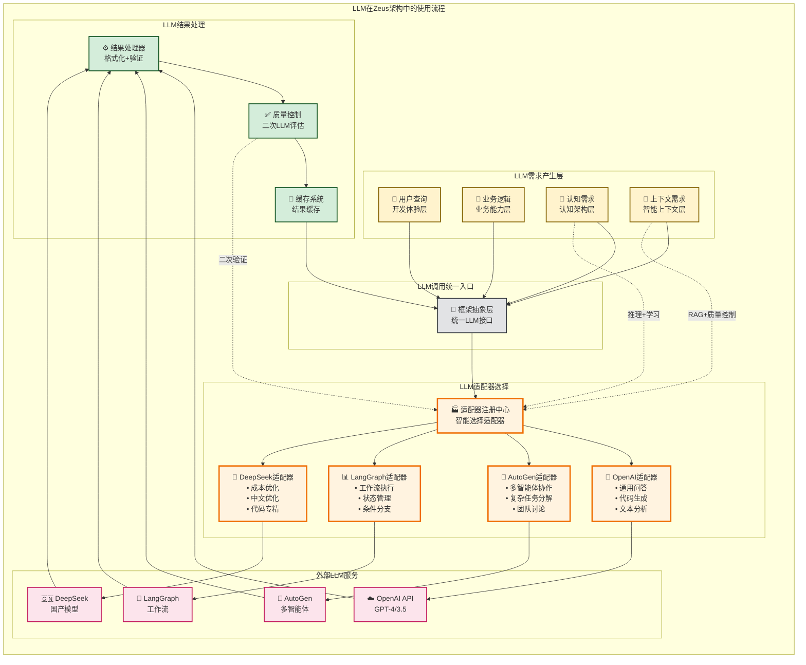
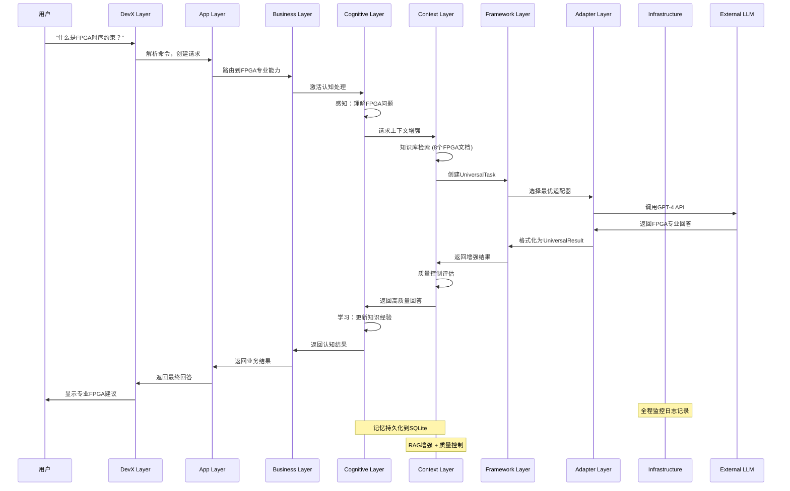
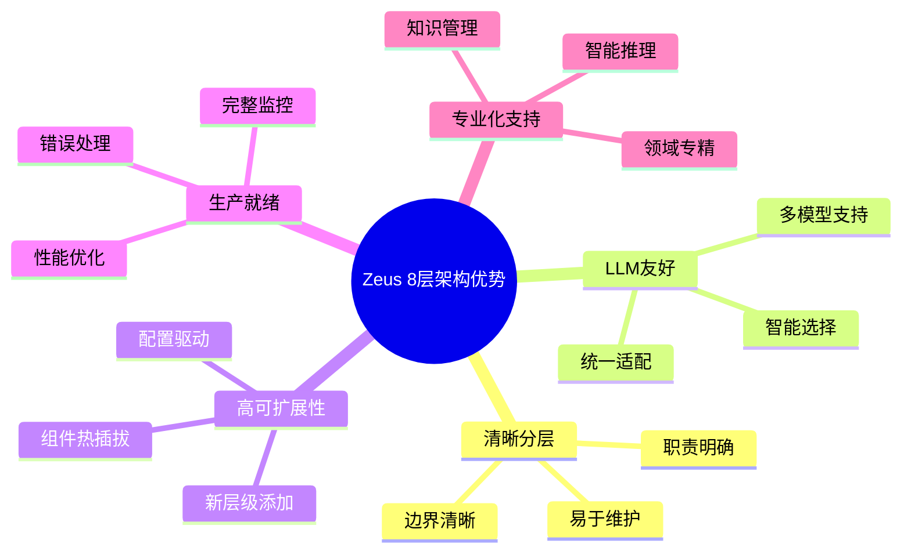

# Zeus AI Platform 架构可视化图表

## 📊 完整8层架构交互图

```mermaid
graph TB
    subgraph "Zeus AI Platform 8层架构 - 完整交互关系"
        
        subgraph "Layer 1: 开发体验层 (DevX Layer) 🟡70%"
            CLI["🖥️ CLI Tools<br/>命令行工具"]
            WebStudio["🌐 Web Studio<br/>可视化开发"]
            APIDoc["📖 API Docs<br/>API文档生成器"]
            InteractiveShell["💬 Interactive Shell<br/>交互式命令行"]
        end
        
        subgraph "Layer 2: 应用编排层 (Application Layer) ✨100%"
            ProjectMgmt["📋 Project Management<br/>项目管理器"]
            AppOrchestrator["🎭 Application Orchestrator<br/>应用编排器"]
            ServiceRegistry["📇 Service Registry<br/>服务注册表"]
            LoadBalancer["⚖️ Load Balancer<br/>负载均衡器"]
        end
        
        subgraph "Layer 3: 业务能力层 (Business Capability) ✨95%"
            TeamCollab["🤝 Team Collaboration<br/>团队协作管理"]
            WorkflowEngine["⚙️ Workflow Engine<br/>工作流引擎"]
            ToolIntegration["🔧 Tool Integration<br/>工具集成"]
            AdvancedFeatures["⭐ Advanced Features<br/>高级业务功能"]
        end
        
        subgraph "Layer 4: 认知架构层 (Cognitive Architecture) ✨85%"
            Perception["👁️ Perception Engine<br/>感知引擎"]
            Reasoning["🧠 Reasoning Engine<br/>推理引擎<br/>🔥LLM使用点"]
            Memory["💾 Memory System<br/>记忆系统"]
            Learning["📚 Learning Module<br/>学习模块<br/>🔥LLM使用点"]
            CognitiveComm["📡 Cognitive Communication<br/>认知通信"]
        end
        
        subgraph "Layer 5: 智能上下文层 (Intelligent Context) ✨80%"
            ContextEng["🔍 Context Engineering<br/>上下文工程"]
            RAGSystem["📖 RAG System<br/>检索增强生成<br/>🔥主要LLM使用点"]
            KnowledgeMgmt["🗃️ Knowledge Management<br/>知识管理"]
            QualityControl["✅ Quality Control<br/>质量控制<br/>🔥LLM使用点"]
        end
        
        subgraph "Layer 6: 框架抽象层 (Framework Abstraction) ✨98%"
            UniversalAgent["🤖 Universal Agent<br/>统一智能体抽象"]
            UniversalTask["📝 Universal Task<br/>统一任务抽象"]
            UniversalContext["🌐 Universal Context<br/>统一上下文抽象"]
            A2AProtocol["🔗 A2A Protocol<br/>智能体间通信协议"]
        end
        
        subgraph "Layer 7: 适配器层 (Adapter Layer) ✨85%"
            OpenAIAdapter["🔮 OpenAI Adapter<br/>🔥主要LLM适配器"]
            AutoGenAdapter["🤝 AutoGen Adapter<br/>🔥多智能体LLM"]
            LangGraphAdapter["📊 LangGraph Adapter<br/>🔥工作流LLM"]
            DeepSeekAdapter["🚀 DeepSeek Adapter<br/>🔥国产LLM"]
            AdapterRegistry["🏭 Adapter Registry<br/>适配器注册中心"]
        end
        
        subgraph "Layer 8: 基础设施层 (Infrastructure) 🟡75%"
            ConfigMgmt["⚙️ Configuration Management<br/>配置管理"]
            LoggingSystem["📋 Logging System<br/>日志系统"]
            SecurityMgmt["🔒 Security Management<br/>安全管理"]
            PerformanceMonitor["📊 Performance Monitor<br/>性能监控"]
        end
        
        subgraph "外部服务 (External Services)"
            OpenAIAPI["☁️ OpenAI API<br/>GPT-4/3.5"]
            AutoGenFramework["🤖 AutoGen Framework<br/>多智能体系统"]
            LangGraphFramework["🔗 LangGraph<br/>状态机工作流"]
            DeepSeekAPI["🇨🇳 DeepSeek API<br/>国产大模型"]
        end
    end
    
    %% 垂直层级调用关系
    CLI --> ProjectMgmt
    WebStudio --> AppOrchestrator
    APIDoc --> ServiceRegistry
    InteractiveShell --> LoadBalancer
    
    ProjectMgmt --> TeamCollab
    AppOrchestrator --> WorkflowEngine
    ServiceRegistry --> ToolIntegration
    LoadBalancer --> AdvancedFeatures
    
    TeamCollab --> Perception
    WorkflowEngine --> Reasoning
    ToolIntegration --> Memory
    AdvancedFeatures --> Learning
    
    Perception --> ContextEng
    Reasoning --> RAGSystem
    Memory --> KnowledgeMgmt
    Learning --> QualityControl
    CognitiveComm --> ContextEng
    
    ContextEng --> UniversalAgent
    RAGSystem --> UniversalTask
    KnowledgeMgmt --> UniversalContext
    QualityControl --> A2AProtocol
    
    UniversalAgent --> AdapterRegistry
    UniversalTask --> OpenAIAdapter
    UniversalContext --> AutoGenAdapter
    A2AProtocol --> LangGraphAdapter
    
    AdapterRegistry --> ConfigMgmt
    OpenAIAdapter --> LoggingSystem
    AutoGenAdapter --> SecurityMgmt
    LangGraphAdapter --> PerformanceMonitor
    DeepSeekAdapter --> ConfigMgmt
    
    %% LLM调用关系 - 关键连接
    RAGSystem -.->|LLM调用| AdapterRegistry
    QualityControl -.->|LLM评估| AdapterRegistry
    Reasoning -.->|LLM推理| AdapterRegistry
    Learning -.->|LLM学习| AdapterRegistry
    
    %% 适配器到外部服务
    OpenAIAdapter --> OpenAIAPI
    AutoGenAdapter --> AutoGenFramework
    LangGraphAdapter --> LangGraphFramework
    DeepSeekAdapter --> DeepSeekAPI
    
    %% 横向协作关系
    TeamCollab <-.->|协作| WorkflowEngine
    Memory <-.->|记忆共享| KnowledgeMgmt
    ContextEng <-.->|上下文共享| RAGSystem
    
    %% 配置和监控的全局支撑
    ConfigMgmt -.->|配置支撑| UniversalAgent
    ConfigMgmt -.->|配置支撑| RAGSystem
    ConfigMgmt -.->|配置支撑| AdapterRegistry
    LoggingSystem -.->|日志收集| Reasoning
    LoggingSystem -.->|日志收集| RAGSystem
    PerformanceMonitor -.->|性能监控| OpenAIAdapter
    PerformanceMonitor -.->|性能监控| AutoGenAdapter
    
    %% 样式定义
    classDef devxLayer fill:#fff3cd,stroke:#856404,stroke-width:2px
    classDef appLayer fill:#d4edda,stroke:#155724,stroke-width:2px
    classDef businessLayer fill:#cce5ff,stroke:#004085,stroke-width:2px
    classDef cognitiveLayer fill:#f8d7da,stroke:#721c24,stroke-width:2px
    classDef contextLayer fill:#d1ecf1,stroke:#0c5460,stroke-width:2px
    classDef frameworkLayer fill:#e2e3e5,stroke:#383d41,stroke-width:2px
    classDef adapterLayer fill:#fff3e0,stroke:#ef6c00,stroke-width:3px
    classDef infraLayer fill:#e7f3ff,stroke:#0066cc,stroke-width:2px
    classDef externalLayer fill:#fce4ec,stroke:#c2185b,stroke-width:2px
    
    class CLI,WebStudio,APIDoc,InteractiveShell devxLayer
    class ProjectMgmt,AppOrchestrator,ServiceRegistry,LoadBalancer appLayer
    class TeamCollab,WorkflowEngine,ToolIntegration,AdvancedFeatures businessLayer
    class Perception,Reasoning,Memory,Learning,CognitiveComm cognitiveLayer
    class ContextEng,RAGSystem,KnowledgeMgmt,QualityControl contextLayer
    class UniversalAgent,UniversalTask,UniversalContext,A2AProtocol frameworkLayer
    class OpenAIAdapter,AutoGenAdapter,LangGraphAdapter,DeepSeekAdapter,AdapterRegistry adapterLayer
    class ConfigMgmt,LoggingSystem,SecurityMgmt,PerformanceMonitor infraLayer
    class OpenAIAPI,AutoGenFramework,LangGraphFramework,DeepSeekAPI externalLayer
```

## 🔥 LLM使用流程图

## 🎯 Ares Agent 在架构中的位置

```mermaid
graph TB
    subgraph "Ares Agent 在 Zeus 8层架构中的映射"
        
        subgraph "Layer 1: DevX - Ares用户接口"
            AresDemo["🖥️ ares_agent_v2.py<br/>演示脚本和CLI交互"]
        end
        
        subgraph "Layer 2: Application - Ares应用编排"
            AresOrchestrator["🎭 AresAgent.initialize()<br/>组件协调和生命周期管理"]
        end
        
        subgraph "Layer 3: Business - FPGA专业能力"
            FPGACapabilities["⭐ FPGA专业能力<br/>• 问答 • 时序分析<br/>• 综合优化 • 验证指导"]
        end
        
        subgraph "Layer 4: Cognitive - 认知智能"
            AresCognitive["🧠 CognitiveAgent<br/>Ares的智能大脑"]
        end
        
        subgraph "Layer 5: Context - FPGA知识管理"
            AresContext["📖 IntelligentContextLayer<br/>FPGA知识库 + RAG系统"]
            FPGAKnowledge["📚 8个FPGA专业文档<br/>设计指南 + 代码示例"]
        end
        
        subgraph "Layer 6: Framework - 统一接口"
            AresAbstractions["🔄 Universal接口<br/>Task + Context + Result"]
        end
        
        subgraph "Layer 7: Adapter - LLM集成"
            AresLLM["🔮 OpenAI Adapter<br/>当前: GPT-4o-mini<br/>未来: 多模型支持"]
        end
        
        subgraph "Layer 8: Infrastructure - 基础支撑"
            AresInfra["⚙️ 配置+日志+监控<br/>config/ares.yaml<br/>SQLite记忆持久化"]
        end
    end
    
    %% Ares组件间的调用关系
    AresDemo --> AresOrchestrator
    AresOrchestrator --> FPGACapabilities
    FPGACapabilities --> AresCognitive
    AresCognitive --> AresContext
    AresContext --> FPGAKnowledge
    AresContext --> AresAbstractions
    AresAbstractions --> AresLLM
    AresLLM --> AresInfra
    
    %% 样式
    classDef aresLayer fill:#e8f5e8,stroke:#2e7d32,stroke-width:3px
    
    class AresDemo,AresOrchestrator,FPGACapabilities,AresCognitive,AresContext,FPGAKnowledge,AresAbstractions,AresLLM,AresInfra aresLayer
```

## 🔄 典型用户请求的数据流向

## 📊 架构优势可视化

## 🎯 总结

通过这些可视化图表，我们可以清晰地看到：

1. **Zeus 8层架构**提供了完整、清晰的分层结构
2. **LLM使用**集中在适配器层管理，上层通过统一接口调用
3. **Ares Agent**是架构的完美应用实例，展示了专业智能体的构建方式
4. **数据流向**清晰，每一层都有明确的输入输出
5. **架构优势**在可扩展性、可维护性、专业化方面都得到了充分体现

这种架构设计使得我们能够：
- ✅ 快速构建专业领域智能体
- ✅ 灵活切换和组合不同的AI服务
- ✅ 保持代码的清晰性和可维护性
- ✅ 支持复杂的多智能体协作场景
- ✅ 提供生产级的可靠性和性能 