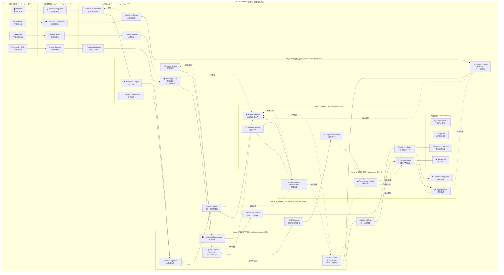
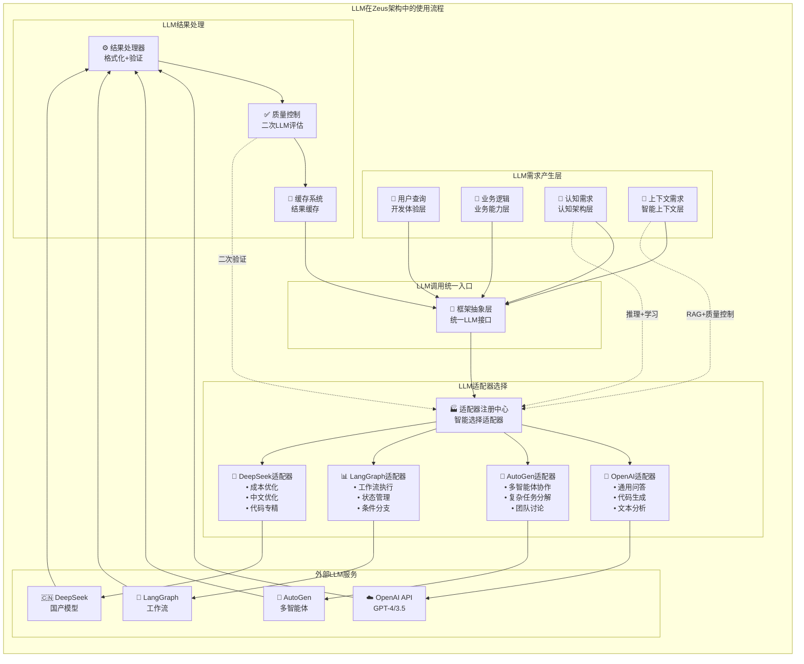

# Zeus AI Platform 8层架构交互关系分析

## 📋 概述

本文档详细分析 **Zeus AI Platform 的8层架构** 各层之间的交互关系、数据流向、LLM使用位置，以及各层的具体职责和实现。

## 🏗️ 8层架构完整交互图



## 🔄 各层详细交互关系

### 1️⃣ 开发体验层 (DevX Layer)
**实现位置**: `layers/application/cli/`, `layers/application/web/`
**主要职责**: 
- 提供用户友好的交互界面
- 命令解析和参数验证
- 可视化开发环境
- API文档自动生成

**向下调用**:
```python
# CLI工具调用应用编排层
from layers.application.orchestration import ApplicationOrchestrator

orchestrator = ApplicationOrchestrator()
result = await orchestrator.execute_command(parsed_command)
```

**数据流向**: 用户输入 → 命令解析 → 应用编排层

### 2️⃣ 应用编排层 (Application Layer)
**实现位置**: `layers/application/orchestration/`
**主要职责**:
- 应用生命周期管理
- 服务注册与发现
- 负载均衡和容错
- 组件协调编排

**关键交互**:
```python
# 应用编排器协调各个组件
class ApplicationOrchestrator:
    async def orchestrate_request(self, request):
        # 1. 服务发现
        service = await self.service_registry.find_service(request.type)
        
        # 2. 负载均衡
        instance = await self.load_balancer.select_instance(service)
        
        # 3. 调用业务层
        return await instance.process(request)
```

### 3️⃣ 业务能力层 (Business Capability)
**实现位置**: `layers/business/`
**主要职责**:
- 团队协作管理
- 工作流引擎执行
- 工具集成和调用
- 高级业务逻辑

**横向协作**:
```python
# 团队协作与工作流引擎的协作
class TeamCollaboration:
    def __init__(self, workflow_engine):
        self.workflow_engine = workflow_engine
    
    async def collaborate_on_task(self, task, team_members):
        # 创建协作工作流
        workflow = await self.workflow_engine.create_workflow(
            task=task, 
            participants=team_members
        )
        return await workflow.execute()
```

### 4️⃣ 认知架构层 (Cognitive Architecture)
**实现位置**: `layers/cognitive/`
**主要职责**:
- 感知和理解输入
- 逻辑推理和决策 🔥**LLM使用**
- 记忆存储和检索
- 经验学习和优化 🔥**LLM使用**

**LLM使用场景**:
```python
# 推理引擎中的LLM调用
class ReasoningEngine:
    async def complex_reasoning(self, premises, context):
        # 通过适配器层调用LLM进行推理
        llm_task = UniversalTask(
            content=f"基于前提 {premises} 进行逻辑推理",
            task_type=TaskType.REASONING
        )
        
        adapter = await self.get_optimal_adapter("reasoning")
        return await adapter.execute_task(llm_task, context)

# 学习模块中的LLM调用
class LearningModule:
    async def learn_from_experience(self, experiences):
        # 使用LLM分析经验并提取模式
        learning_prompt = f"分析以下经验并提取学习要点: {experiences}"
        return await self.llm_adapter.analyze_patterns(learning_prompt)
```

### 5️⃣ 智能上下文层 (Intelligent Context)
**实现位置**: `layers/intelligent_context/`
**主要职责**:
- 上下文理解和工程化
- RAG检索增强生成 🔥**主要LLM使用点**
- 知识图谱管理
- 内容质量控制 🔥**LLM使用**

**LLM密集使用**:
```python
# RAG系统中的LLM调用
class RAGSystem:
    async def retrieve_and_generate(self, query, knowledge_base):
        # 1. 知识检索
        relevant_docs = await self.retrieve(query, knowledge_base)
        
        # 2. LLM生成增强回答
        enhanced_prompt = self.build_rag_prompt(query, relevant_docs)
        llm_response = await self.llm_adapter.generate(enhanced_prompt)
        
        # 3. 质量控制（也使用LLM）
        quality_score = await self.quality_control.evaluate(llm_response)
        
        return llm_response, quality_score

# 质量控制中的LLM调用
class QualityControl:
    async def evaluate_quality(self, content, criteria):
        evaluation_prompt = f"评估以下内容的质量: {content}\n评估标准: {criteria}"
        return await self.llm_adapter.evaluate(evaluation_prompt)
```

### 6️⃣ 框架抽象层 (Framework Abstraction)
**实现位置**: `layers/framework/abstractions/`
**主要职责**:
- 提供统一的抽象接口
- 框架无关的数据结构
- A2A通信协议定义
- 跨框架兼容性

**统一接口设计**:
```python
# 统一任务抽象
class UniversalTask:
    def __init__(self, content, task_type, context=None):
        self.content = content
        self.task_type = task_type
        self.context = context or {}

# 统一上下文抽象
class UniversalContext:
    def __init__(self, data=None):
        self.data = data or {}
    
    def get_all(self):
        return self.data.copy()
    
    def set(self, key, value):
        self.data[key] = value
```

### 7️⃣ 适配器层 (Adapter Layer)
**实现位置**: `layers/adapter/`
**主要职责**:
- LLM服务适配 🔥**LLM集中管理点**
- 框架特定实现转换
- 统一接口到具体实现的映射
- 错误处理和重试逻辑

**LLM适配器实现**:
```python
# OpenAI适配器
class OpenAIAdapter(BaseAdapter):
    async def execute_task(self, task: UniversalTask, context: UniversalContext):
        # 转换为OpenAI API调用格式
        messages = self.convert_to_openai_format(task, context)
        
        # 调用OpenAI API
        response = await self.openai_client.chat.completions.create(
            model=self.model,
            messages=messages,
            temperature=self.temperature
        )
        
        # 转换回通用格式
        return self.convert_from_openai_format(response)

# 适配器注册中心
class AdapterRegistry:
    def __init__(self):
        self.adapters = {}
    
    async def select_optimal_adapter(self, task_type, requirements):
        # 根据任务类型和需求选择最优适配器
        if task_type == "multi_agent":
            return self.adapters["autogen"]
        elif task_type == "workflow":
            return self.adapters["langgraph"]
        else:
            return self.adapters["openai"]
```

### 8️⃣ 基础设施层 (Infrastructure)
**实现位置**: `layers/infrastructure/`
**主要职责**:
- 配置管理和环境变量
- 日志记录和监控
- 安全认证和授权
- 性能监控和优化

**全局支撑功能**:
```python
# 配置管理
class ConfigurationManager:
    def get_llm_config(self, adapter_type):
        return self.config[f"adapters.{adapter_type}"]
    
    def get_security_config(self):
        return self.config["security"]

# 性能监控
class PerformanceMonitor:
    async def track_llm_call(self, adapter, latency, tokens):
        await self.metrics.record({
            "adapter": adapter,
            "latency_ms": latency,
            "tokens_used": tokens,
            "timestamp": datetime.now()
        })
```

## 🔥 LLM使用流程分析

### LLM调用的完整流程


### LLM使用的具体位置和场景

| 层级 | 组件 | LLM使用场景 | 实现方式 |
|------|------|-------------|----------|
| **认知架构层** | 推理引擎 | 复杂逻辑推理、因果分析、决策支持 | `await reasoning_engine.reason(premises, context)` |
| **认知架构层** | 学习模块 | 经验分析、模式识别、知识提取 | `await learning_module.learn_from_experience(data)` |
| **智能上下文层** | RAG系统 | 知识检索、内容生成、问答回复 | `await rag_system.retrieve_and_generate(query)` |
| **智能上下文层** | 质量控制 | 内容质量评估、一致性检查 | `await quality_control.evaluate_quality(content)` |
| **业务能力层** | 工作流引擎 | 动态决策、条件判断、任务分解 | `await workflow.make_decision(context)` |
| **适配器层** | 所有适配器 | 统一LLM接口、格式转换、错误处理 | `await adapter.execute_task(task, context)` |

## 🔄 数据流向分析

### 典型用户请求的完整数据流
```
1. 用户输入 (Layer 1: DevX)
   ↓ [Command/Request Object]
   
2. 应用编排 (Layer 2: Application)
   ↓ [Orchestrated Request]
   
3. 业务处理 (Layer 3: Business)
   ↓ [Business Task]
   
4. 认知处理 (Layer 4: Cognitive)
   ├─ 感知: 理解任务意图
   ├─ 推理: 制定处理策略 🔥LLM
   ├─ 记忆: 检索相关经验
   └─ 学习: 更新知识库 🔥LLM
   ↓ [Cognitive Analysis]
   
5. 上下文增强 (Layer 5: Context)
   ├─ 上下文工程: 构建完整上下文
   ├─ RAG系统: 知识检索+生成 🔥LLM
   ├─ 知识管理: 相关知识整合
   └─ 质量控制: 结果质量评估 🔥LLM
   ↓ [Enhanced Context + Generated Content]
   
6. 抽象接口 (Layer 6: Framework)
   ├─ UniversalTask: 任务标准化
   ├─ UniversalContext: 上下文标准化
   └─ UniversalResult: 结果标准化
   ↓ [Standardized Objects]
   
7. 适配器调用 (Layer 7: Adapter)
   ├─ 适配器选择: 根据任务选择最优LLM
   ├─ 格式转换: 转换为特定API格式
   ├─ LLM调用: 实际的AI模型调用 🔥LLM
   └─ 结果转换: 转换回标准格式
   ↓ [LLM Response]
   
8. 基础设施支撑 (Layer 8: Infrastructure)
   ├─ 配置管理: 提供运行参数
   ├─ 日志记录: 记录完整调用链
   ├─ 性能监控: 监控响应时间和资源使用
   └─ 安全管理: 确保API密钥安全
   ↓ [Monitored & Logged Result]
   
9. 结果返回 (逆向流程)
   Layer 8 → Layer 7 → ... → Layer 1
   ↓ [Final User Response]
```

## 🎯 架构优势分析

### 1. **清晰的职责分离**
- 每层有明确的职责边界
- 避免跨层直接调用
- 便于维护和扩展

### 2. **LLM使用的集中管理**
- 适配器层统一管理所有LLM调用
- 便于切换不同的AI服务
- 统一的错误处理和重试机制

### 3. **强大的扩展性**
- 新增适配器不影响上层逻辑
- 业务层可以独立演进
- 基础设施层提供统一支撑

### 4. **生产级的可靠性**
- 完整的日志和监控
- 多层次的错误处理
- 配置驱动的灵活性

## 📊 总结

Zeus AI Platform 的8层架构通过清晰的分层设计，实现了：

- ✅ **职责明确**: 每层专注自己的核心功能
- ✅ **松耦合**: 层间通过标准接口交互
- ✅ **高内聚**: 同层组件紧密协作
- ✅ **易扩展**: 新功能可在合适层级添加
- ✅ **LLM友好**: 专门的适配器层管理所有AI服务
- ✅ **生产就绪**: 完整的监控、日志、安全机制

这种架构设计使得 **Ares Agent** 这样的专业智能体可以充分利用平台的所有能力，同时保持代码的清晰性和可维护性。 